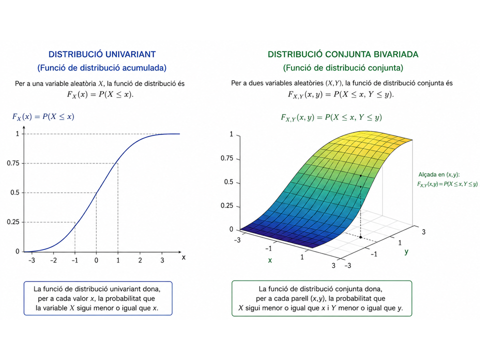
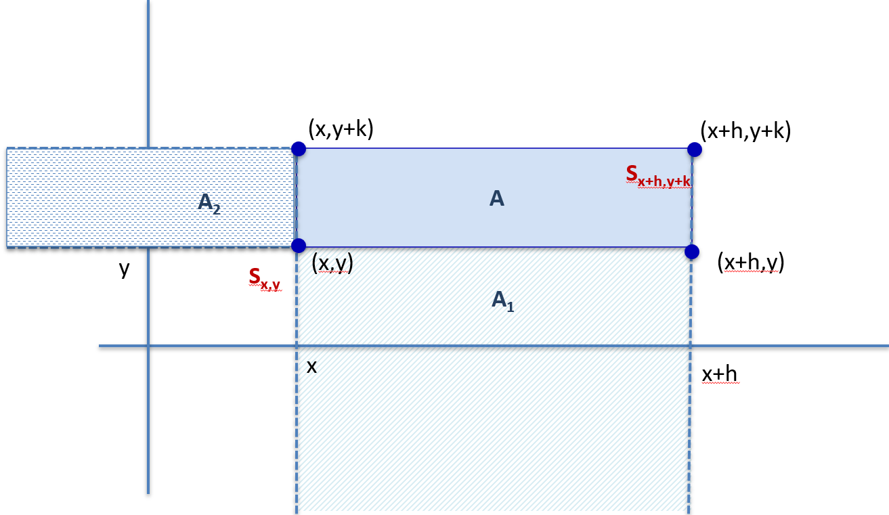
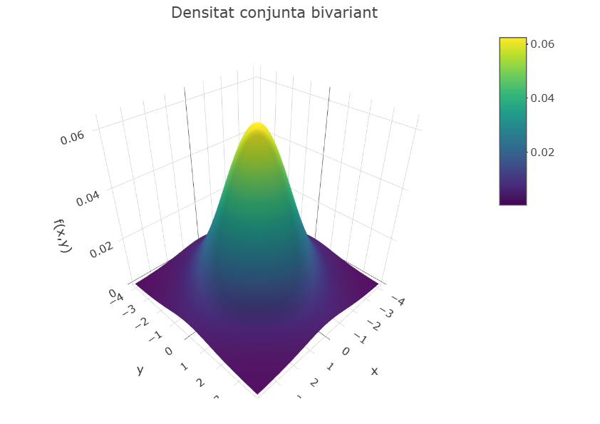
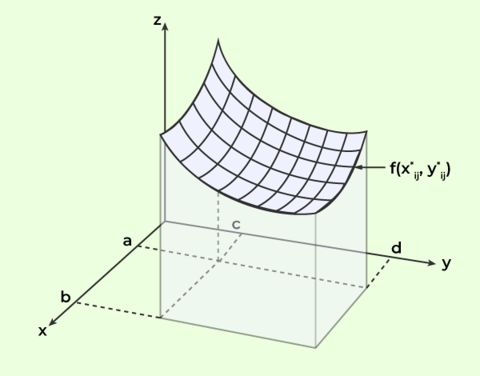
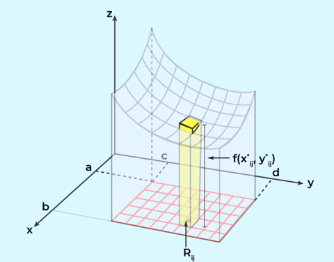
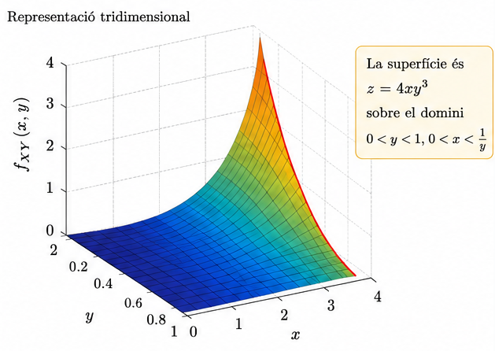
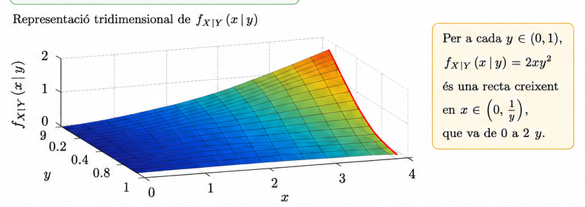

# Variables aleatòries multivariants


## Definició i conceptes bàsics: vectors aleatoris, espais de probabilitat

### Introducció

A qualsevol que se li pregunti quin temps es triga en recórrer  els 280 kiòmetres de distància entre Barcelona i Castelló, si es circula a una velocitat constant de 120km/h,  ens indicaria que en 2 hores i 20 minuts arribaríem a la destinació. Ara be, si se li pregunta quin serà el resultat de  llançar un dau  no tindria una resposta clara.
  
  * El primer resultat prové d'un fenomen o **experiència determinista.** Es prou en extreure de l'equació  $e=v·t$  el valor del temps
  * El segon pertany a la categoria dels fenòmens o **experiències aleatòries.** Es coneixen tots els resultats possibles, un número del 1 al 6 en el cas del dau, però no quin resultat es produirà, ja que de repetició en repetició sortiran resultats diferents.

### Conceptes bàsics: Experiment aleatori, mesura de probabilitat


:::{.definition}


Un **experiment** és una seqüència d’accions que, en repetir-se sota les mateixes condicions, produeix resultats observables.  Direm que l'experiment es **aleatori** si, executat sota les mateixes condicions, pot donar lloc a un resultat $w$ d'entre un conjunt de posibles resultats.

:::


:::{.definition}

L’**espai mostral** d’un experiment, denotat per $\Omega$, és el conjunt de tots els resultats possibles.
:::


:::{.definition}
Un **esdeveniment**  es una col·lecció  de possibles resultats d'un experiment, es a dir un subconjunt de $A \subseteq \Omega$.  Quan el resultat de l'experiment pertany al esdeveniment ($w \in A$), direm que a ocorregut l'esdeveniment. 
:::


---

:::{.example} 
Així si l'experiment és llançar un dau, l'espai mostral és 

$$\Omega = \{1,2,3,4,5,6\}$$ i un esdeveniment pot ser $A=\text{Treure un número senar}$ . Si al llançar el dau surt un 3, l'experiment A ha ocorregut.
:::

---

:::{.definition}

Una col·lecció $\mathcal{A}\subseteq \mathcal{P}(\Omega)$ és una **σ-àlgebra** si:

1. $\Omega\in\mathcal{A}$  
2. Si $A\in\mathcal{A}$, aleshores $A^c\in\mathcal{A}$  
3. Si $A_1,A_2,\ldots\in\mathcal{A}$, aleshores $\bigcup_{n}A_n\in\mathcal{A}$
:::

La $\sigma~-àlgebra$ representa “tot allò al que volem i podem assignar probabilitat”.

---

:::{.example} 
Si suposem un experiment és triar a l'atzar  un número en l'interval [0,1], l'interès es centra en conèixer si l'elecció pertany a qualsevol dels subconjunts de [0,1]. La $\sigma-àlgebra$ $\beta_{[0,1]}$ de'esdeveniments generada a partir de tots els posibles subintervals de [0,1], és  coneguda com $\sigma-àlgebra$ de Borel estrictament menor que $\mathcal{P}(\Omega)$.

**Posar exemples de sigma algebra de $\mathbb{R}$ i $\mathbb{N}$,**
:::

---

En resum, L'espai mostral ve acompanyat de la $\sigma-álgebra$ mes convenient a l'experiment. La combinació ($\Omega,\mathcal{A}$) reb el nom d'**espai mesurable** 


:::{.definition}
 **Mesura de Probabilitat**
 
 Donat un espai mostral  $\Omega$ i una $\sigma-àlgebra$  $\mathcal{A}$ definim la mesura de probabilitat com una aplicació. 
 
$$
\begin{aligned}
P : \mathcal{A} &\rightarrow \mathbb{R} \\
A &\mapsto Pr(A)
\end{aligned}
$$

on P cumpleix els axiomes de Kolmogorov 

1. $P(A) \ge 0$, per tot $A \in \mathcal{A}$.

2. $P(\Omega) = 1$.

3. *Axioma d’additivitat numerable:*  
Si $A_1, A_2, \ldots, A_n\in \mathcal{A}$ es una succeció d'esdeveniments  disjunts dos a dos, llavors

$$
P\left(\bigcup_{i=1}^{n} A_i \right)
=
\sum_{i=1}^{n} P(A_i)
$$

Dels axiomes anteriors es segueixen totes les propietats de qualsevol mesura
de probabilitat. En particular que la probabilitat de un esdeveniment ha de ser un número entre 0 i 1.

$$
0 \le P(A) \le 1 \quad \text{per a tot } A \in \mathcal{A}.
$$
:::


:::{.definition}
 **Espai de probabilitat**
 
A la *terna $(\Omega,\mathcal{A},Pr)$*  l'anomenarem  ESPAI DE PROBABILITAT. 
 
:::


---

:::{.example} 

**Espai de probabilitat discret uniforme**

Suposem un espai mostral $\Omega$, numerable i com a $\sigma~àlgebra$  la formada per tots els subconjunts de $\Omega$. Definim un funció no negativa sobre tots els subconjunts de $\Omega$ on es verifica que $\sum_{w\in \Omega}p(w)=1$. Si es defineix  $P(A)=\sum_{w\in A}p(w)$, es pot comprobar que P es una probabilitat.
Un cas particular son els espais de probabilitat discrets uniformes.  Si $\Omega={w_1,w_2,....,w_n}$ i $p(w_i)=\frac{1}{n}, \forall w_i \in \Omega$.

Si $A={w_1,w_2,....,w_m}$ tenim qué $P(A)=\frac {m}{n}$ (Fórmula de Laplace). Es diu uniforme per que la massa de probabilitat està repartida al ser constant en cada punt.

Per exemple imaginem que llancem dos daus. L'espai mostral serà $\Omega={(1,1),(1,2),(1,3),....(6,5),(6,6)}$ format per les 36 parelles de resultats possibles. Si els daus no estan trucats, cada parella te la mateixa probabilitat 1/36. Si es considera A={amb dues cares son senars}  el número de possibilitats son 9  i per tant la probabilitat de A es P(A)=9/36=1/4. 

:::

---


El resultat d'un experiment aleatori no es tant l'espai de probabilitat resultant, sino les caracterìstiques numèriques associades. Això implica passar de $\Omega$ a  $\mathbb{R}$ o  $\mathbb{R}^k$ on es més fàcil treballar.  Com hem comentat en  $\mathbb{R}$ podem parlar de la $\sigma-álgebra$ de Borel $\beta$ que és la menor que conté els intervals i que permet parlar del espai de probabilitat $(\mathbb{R},\beta)$


### Conceptes bàsics: Variable aleatòria, funcions de distribució i probabilitat.

:::{.definition}
 **Variable aleatòria**

 Si considerem dos espais probabilitzables   $(\Omega, \mathcal{A})$ i $(\mathbb{R},\beta)$, una **variable aleatòria** es una aplicació  $X:\Omega \rightarrow \mathbb{R}$  que verifica que $X^{-1}(B) \in \mathcal{A}$ $\forall B \in \beta$

:::


---

:::{.example}

Quan llencem una moneda, habitualment identifiquem les dues cares amb els valors \(0\) i \(1\). Aquesta identificació és, de fet, una variable aleatòria:


\[
X:\Omega \longrightarrow \mathbb{R}
\]

\[
\begin{array}{ccc}
\text{Cara} & \longmapsto & 0 \\[0.4cm]
\text{Creu} & \longmapsto & 1
\end{array}
\]


Si la moneda no esta trucada la probabilitat de que sorti cara o creu al llançar la moneda es 0.5 respectivament, Així al fer la transferència entre espais de probabilitat $P(X=0)=0.5$ es el mateix que $P(X^{-1}(0)=P(cara)=0.5$  i el mateix per X=1   $P(X=1)=0.5=P(X^{-1}(1)=P(cara)$.

Per expressar aquesta probabilitat podríem haver  utilitzat un altra  variable aleatòria que codificarà la cara com a 1 i la creu com a 2.


:::

---

:::{.definition}
**Distribució de probabilitat induida**
Quan es fa intervenir una variable aleatòria és per que s'està en la presència d'un espai de probabilitat. La variable aleatòria trasllada la informació d'aquesta probabilitat de $\Omega$  a $\mathbb{R}$   mitjançant la probabilitat induïda coneguda com llei de probabilitat o distribució de probabilitat.

 Així, la variable aleatòria X indueix sobre $(\mathbb{R},\beta)$  la probabilitat $P_X$ de la següent forma

 $$
       P_X(A)= P(X^{-1}(A)) \quad \forall A \in \beta
 $$
$P_X$ hereta les característiques de P a través de X. Sí X canvia  a distribució de probabilitat pot canviar . Veíem-lo en un exemple.
:::

---

:::{.example}

Si tornem a l'exemple de llençar dos daus podem definir dues variables aleatòries. *X* que sigui la suma dels resultats dels dos daus i *Y* que sigui la diferència dels resultats. Encara que les dues variables estàn definides en el mateix espai de probabilitat, $P_X$ y $P_Y$ son diferents per que estan induïdes per variables diferents.

En cap cas la suma de les dues cares de un dau son 0, però ens 6 situacions les dues cares poden ser iguals. Si calculem amb els dues distribucions la probabilitat de que la variable aleatòria sigui 0, dona resultats diferents.


$P_X(0)=P(X^{-1}(0))=P(\varnothing)=0$

$P_Y(0)=P(Y^{-1}(0))=P(\{1,1\},\{2,2\},\{3,3\},\{4,4\},\{5,5\},\{6,6\})=\frac{6}{36}=\frac{1}{6}$


:::

---

Les distribucions de probabilitat com la $P_X$, encara que ens presenta la informació necessària per obtenir les probabilitats, son objectes matemàtics complexes d'utilitzar i es recorre a dos tipus de funcions associades, la  Funció de distribució de probabilitat o la funció de probabilitat o densitat de probabilitat, depenen de la natura de la variable.

:::{.definition}
**Funció de distribució de probabilitat**

A partir de la probabilitat induida podem definir sobre  $\mathbb{R}$ la següent funció

$$
F_X(x)= P_X((-\infty,x])=P(X^{-1}\{(-\infty,x]\})=P/X\leq x) \quad \forall x \in \mathbb{R}
$$
:::


La funció de distribució te les següents propietats

1. És una funció no negativa per la propia definció
2. És una funció monòtona  ja que $F_X(x_1) \leq F_X(x_2) \quad$ si $\quad x_1 \leq x_2$
3. És una funció continua per la dreta . Es a dir si es considera una succesió de números reals $x_n \rightarrow x$  llavors $\lim_{n \rightarrow \infty}F_X(x_n)=F_X (x)$
4. $\lim_{x \rightarrow \infty} F_X(x)=1$  y  $\lim_{x \rightarrow -\infty} F_X(x)=0$

Del punt 3 es dedueix que si $(- \infty,x] =\{ x \} \cup \lim_{n \rightarrow  \infty} (- \infty, x-\frac{1}{n} )$  la funció de distribució en X es

$$
F_X(x)= P(X=X)+ \lim_{n \rightarrow \infty} F_X(x-\frac{1}{n})=P(X=x) +F(x^-)
$$
y $F_X(x)$ es continua si P(X=x)=0


Directament es pot calcular la probabilitat d'un interval obert per l'esquerra com

$$
P(a< X \leq b)=F_X(b)- F_X(a)
$$

---

:::{.example}

Suposem que a un pacient se le indica que trie un nombre real entre 0 i 10 per indicar el seu nivell de dolor (Escala analógica Visual (EVA)) i que tots els valors tenen la mateixa probabilitat de ser triats.

Definim la variable aleatòria X com el nivell de dolor i es vol obtenir la funció de distribució que reflexa la probabilitat de que el nombre escollit sigui menor o igual que 3.
$$
F_X(x)=P_X(X \leq x)
$$
Si tots els valors son equiprobables la probabilitat seria la longitud de casos favorables partit per 10.

És a dir, si $x \in [0,10]$  $F(x)=\frac {x}{10}$

La funció completa és

$$
F_X(x)=
\begin{cases}
0, & \text{si } x <0 \\
\frac {x}{10}, &  0 \leq x \leq 10 \\
0, & x>10
\end{cases}
$$
:::

---

:::{.definition}
**Funció de probabilitat d'una variable aleatòria discreta**

X és una variable aleatòria discreta si  $X(\Omega)$ es  finit o numerable, és a dir es pot definir un conjunt suport  $D_X=\{x_1,x_2,....,x_n \}$ tal que $P_X(D_X))= P(X \in D_X)=1)$ i   $P(X=x)>0 \quad, \forall x \in D_X$. Per tant es pot deduir que $P(X=x)=0 \quad, \forall x \in D_X^c$

Així la funció de distribució de la variable aleatòria és:
$$
 F_x(x)=\sum_{x \leq x_i} P(X=x_i)
$$
Que serà una funció continua en els intervals $[x_i,x_{i+j}[$ si els valors $x_i$ estan endreçats de menor a major i que tindrà una discontinuïtat de salt finit en cada punt $x_i$  de Valor $F_X(x_i)- F_X(x_{i-1})=P(X=x_i)$

Així a la variable X li podem associar la funció de probabilitat següent

$$
f_X(x)=
\begin{cases}
P(X=x), & \text{si } x \in D_X \\
0, & \text{en la resta}
\end{cases}
$$

:::

---

:::{.example}

Alguns exemples de variables aleatòries discretes que venen definides per les seves funcions de probabilitat son les  que tenen una distribució Poisson, Binomial, Hipergeomètrica ó binomial negativa. La seva definició es pot trobar en l'annex del tema.

:::

---


:::{.definition}
**Funció de densitat o  probabilitat de una variable aleatòria continua**

Una variable aleatòria X és continua si la seva funció de distribució F_X , es absolutament continua.  A efectes pràctics disposem  la funció de densitat f_X(x), coneguda de manera que

$$
F_X(x)= \int_{-\infty}^{b}  f(t) dt
$$
Així la probabilitat de qualsevol interval ]a,b] ès

$$
P(X \in ]a,b]= P(a<X \leq b) \int_{a}^{b}  f(x) dx
$$


La funció de densitat $f_X(x)$ es no negativa i $P(X \in  \mathbb{R} =1 )$


Per altra banda per una propietat de la integral de Riemann , la funció de densitat es la derivada de la Funció de distribució $f_X(x)=F'_X(x)$

:::


---

:::{.example}
Alguns exemples de variables aleatòries continues que venen definides per les seves funcions de  densitat probabilitat son les  que tenen una distribució  uniforme, Normal, Exponencial, Gamma  entre altres. La seva definició es pot trobar en l'annex del tema.
:::

---


### Variable aleatòria k-dimensional o vector aleatori


Molts experiments aleatoris produeixen més d'una única quantitat rellevant, és a dir, més d'una variable aleatòria. Veíem alguns exemples

---

::: {.example #quali1}
-  Imaginem una situació on primer es llança una moneda  amb resultats cara i creu, i després es llança un dau amb 6 resultats.  Així tenim una variable aleatòria $X_1$ per a la moneda i una variable aleatòria $X_2$ per al dau.  El vector en $\mathbb{R}^2$ $(X_1,X_2)$ serà una variable aletatòria bidimensional   composat per dues variables aleatòries unidimensionals
:::

:::{.example}
- En economia podem estar interessants en conèixer la distribució d' ingressos d'una persona i per altra costat el % dels ingressos dedicats al pagament de la vivenda (lloger o hipoteca). Cada individu estarà representat per un vector composat per dues variables uniDImensionals
:::

:::{.example}
- En salut podem estar interessats en el resultat d'un experiment on es mesuren diferents paràmetres biomètrics com pes, alçada, índex cintura-maluc,  índex de massa corporal, índex cintura-alçada, perímetre braquial, perímetre abdominal, superfície corporal, etc.  Es tracta d'un vector multimensional definit per k variables unidimensionals en $\mathbb{R}^k$.
:::

---


:::{.definition}
**Vector aleatori**

Un vector aleatori $\mathbf{X}=(X_1,X_2,.......,X_k)$,  es una aplicació del espai mostral  $\Omega$ en  $\mathbb{R}^k$ tal que

$$
\mathbf{X}^{-1}(B) \in\mathcal{A}, \quad \forall B \in \beta^K
$$
On $\beta^K$ es una $sigma-àlgebra$ de Borel en   $\mathbb{R}^k$
:::

$\mathbf{X}$ indueix sobre $(\mathbb{R}^k,\beta^K)$ una probabilitat $P_X$ de la següent manera

$$
P_X(B)=P(\mathbf{X}^{-1}(B)), \quad \forall B \in \beta^K
$$
És senzill comprobar que $P_X$ verifica els tres axiomes de probabilitat, pel que $(\mathbb{R}^k,\beta^K, P_X)$ permet indueix un espai de probabilitat amb les característiques de $(\Omega,\mathcal{A},P)$ heretats mitjançant X.


:::{.definition}
**Variable aleatoria bidimensional o bivariant**


Sigui $(\Omega, \mathcal{A},P)$ un espai de probabilitat . Podem definir la variable aleatòria bivariant com


$$
\begin{aligned}
(X,Y): \Omega &\rightarrow \mathbb{R}^2 \\
w & \rightarrow (X,Y)(w) =(X(w),Y(w))
\end{aligned}
$$
on

$(X,Y)^{-1}(( -\infty, x]  \times (-\infty, y]))=\{w \in \Omega: X(w) \leq x \quad i \quad  Y(w) \leq y \} \in \mathcal{A} \quad \forall x \in \mathbb{R} \quad i \quad \forall y \in \mathbb{R}$


:::


Com passa en el cas univariant es prou que $(X,Y)^{-1}(( -\infty, x]  \times (-\infty, y])) \in \mathcal{A} \quad \forall (x.y)\in \mathbb{R}^2$ per a garantir que $(X,Y)^{-1}(B) \in  \mathcal{A} \quad \forall B \in \beta (\mathbb{R}^2)$


Per tant, qualsevol variable aleatòria bivariant (X,Y) indueix una mesura de probabilitat en $\mathbb{R}^2$  que permet assignar probabilitats a qualsevol subconjunt Borelià B de $\mathbb{R}^2$:

$$
P_{(X,Y)}(B)=P((X,Y)^{-1}(B))=P(\{w \in \Omega:(X(w),Y(w)) \in B\})
$$
Aquesta mesura de probabilitat induïda s'anomena *distribució de probabilitat conjunta de (X,Y)*


---

:::{.example}

Tornem a l'exemple on llançàvem una moneda (X) i un dau (Y)

L'espai mostral es $\Omega=(\{cara,1\},\{creu,1\},\{cara,2\},.....,,\{creu,6\})$
i la Variable aleatoria (X,Y)  pren  el valor X= 0 si és cara i X=1  si és creu en la primera component X i el número  que ha sortit al dau en la segona component Y.

Podem definir

$$
P_{XY}(x,y)=
\begin{cases}
1/2 \times 1/6=1/12, & \text{si } \quad  x \in \{ 0,1\}  \quad i \quad y \in \{ 1,2,3,4,5,6\} \\
0, & \text{en la resta}
\end{cases}
$$
:::

---


Es pot demostrar que $P_{XY}$ es una mesura de probabilitat ja que compleix els axiomes de Kolmogorov.


:::{.definition}
**Variable aleatoria  k- dimensional o multivariant**

Si enlloc de 2 variables aleatòries unidimensionals generalitzem a n variables aleatèries, estarem parlant de una Variable aleatòria n-dimensional o multivariant.

Sigui $(\Omega, \mathcal{A},P)$ un espai de probabilitat . Podem definir la variable aleatòria multivariant $\overrightarrow{\bf{X}}=(X_1,X_2,...,X_{k-1},X_k)$


$$
\begin{aligned}
(\overrightarrow{\bf{X}}): \Omega &\rightarrow \mathbb{R}^k \\
w & \rightarrow (X_1,X_2,...,X_{k-1},X_k)(w) =(X_1(w),X_2(w),...,X_{k-1}(w),X_k(w))
\end{aligned}
$$

on

$$
(\overrightarrow{\bf{X}})^{-1}(( -\infty, x_1] \times...  \times (-\infty, x_k]))=\{w \in \Omega: X_1(w) \leq x_1 \quad i \quad ... \quad i \quad  X_k(w) \leq x_k \} \in \mathcal{A} \quad \forall x_i \in \mathbb{R}
$$
:::

Per tant qualsevol variable aleatòria multivariant $(\overrightarrow{\bf{X}})$ indueix una mesura de probabilitat en $\mathbb{R}^k$  que permet assignar probabilitats a qualsevol subconjunt Borelià B de $\mathbb{R}^k$:

$$
P_{(\overrightarrow{\bf{X}})}(B)=P((\overrightarrow{\bf{X}})^{-1}(B))=P(\{w \in \Omega:(X_1(w),...,X_k(w)) \in B\})
$$
El que hem de fer a partir d'ara es caracteritzar aquesta probabilitat conjunta a partir de les característiques de les variables aleatories unidimensionals que la composen. Ja que si $(\overrightarrow{\bf{X}})$ es mesurable també o es cadascuna de les seves components i viceversa. Per simplificar la nomenclatura definirem $P_X$ a la probabilitat conjunta de la variable multidimensional $\overrightarrow{\bf{X}}$ i per facilitar la comprensió utilitzarem la dimensió 2 i el vector aleatori $\overrightarrow{\bf{X}}=(X,Y)$


## Funcions de densitat i de distribució conjuntes.

### Funció de distribució conjunta


En els apartats anteriors hem definit la probabilitat conjunta associada a una variable multidimensional. Com en el cas unidimensional, podem caracteritzar  aquesta probabilitat conjunta a partir de funcions conjuntes de distribució o de  densitat o de probabilitat segon siguin les variables.


:::{.definition}
**Funció de distribució conjunta**


Definim la  funció de distribució associada a $P_X$ a donat un punt de  $\mathbb{R}^k$  $\mathbf{x}=(x_1,...,x_k)$ com


$$
F_X( \mathbf{x} )=F_X(x_1,...,x_k) =P_X(S_x)=P(X \in S_x)= P(\bigcap_{i=1}^{k} \{ X_i\leq x_i \})
$$
:::


En la figura \@ref(fig:img-distbiv) es pot observar la diferència entre una distribució univariat que es una corba en dimensió 2 y o la funció de distribució conjunta bivariada  $F(x,y)= P(X \leq x, Y \leq y)$ que es tracta de una superfície en dimensió 3.

```{r img-distbiv, fig.cap="Distribució continua bivariada", echo=FALSE,fig.align='center',out.width="80%"}

```


De la definició de funció de distribució conjunta es deriven les següents propietats:

<ol>

<li> <b> No negativitat </b> </li>

Com a conseqüència que  la funció de distribució conjunta es una probabilitat, pren valors entre 0 y 1 i per tant sempre seran valors no negatius.

<li> <b> Monotonia de cada component </b> </li>

Si $\mathbf{x} \leq\ \mathbf{y}$ es a dir $x_i \leq y_i, \quad i=1,....k,\quad  S_x \subset S_y \quad  y\quad F_X(x) \leq F_Y(y)$

<li> <b> Continuïtat conjunta per la dreta </b> </li>

Si $\mathbf{x}{(n)} \rightarrow \mathbf{x}$ entonces  $F_X(\mathbf{x}^{(n)}) \rightarrow F_X(\mathbf{x})$


<li> <b> Valores límit </b> </li>

Al tendir a $\pm \infty$ les components del vector aleatori s'obté

$$
 \lim_{\forall x_i  \rightarrow + \infty} F_X(x_1,...,x_k)=1
$$
ó

$$
 \lim_{\exists x_i  \rightarrow - \infty} F_X(x_1,...,x_k)=0
$$
</ol>


Aquestes propietats ja son conegudes per al cas unidimensional.  Cal una cinquena propietat sense la que no es pot recórrer el camí invers d'obtenir $P_X$ a partir de $F_X$ i poder establir la desitjada equivalència entre tots dos conceptes que il·lustrarem en dimensió 2.


:::{.proposition}

<b> Regla del rectangle </b>


En aquesta regla calculem la probabilitat d'un rectangle a partir de les funcions de distribució conjunta en cada punt del rectangle que es pot veure en la figura   \@ref(fig:img-rectangle)

$$
\left.
\begin{array}{l}
\forall (x,y)\in\mathbb{R}^2\\
\forall h>0\\
\forall k>0
\end{array}
\right\}
\quad F_{X,Y}(x+h,y+k)-F_{X,Y}(x,y)-F_{X,Y}(x+h,y)-F_{X,Y}(x,y+k)=P_{X,Y}(A)=P_{X,Y}(]x,x+h] \times ]y,y+k])>0
$$
:::

<b>

:::{.proof}
</b>
```{r img-rectangle, fig.cap="Càlcul de la probabilitat d'un rectangle", echo=FALSE,out.width="60%",fig.align='center'}

```

$S_{x+h, y+k}=S_{x, y} +A_1+A_2+A$

on cadascú del conjunts de la part dreta son disjunts i per tant

$P_{X,Y}(S_{x+h, y+k})=P_{X,Y}(S_{x, y})+ P_{X,Y}(A_1)+P_{X,Y}+P(A_2)+P_{X,Y}(A)$

si substituim  per la funció de distribució

$$
{\small
\begin{array}{l}
F_{X,Y}(x+h, y+k)=F_{X,Y}(x, y)+ P_{X,Y}(A_1)+P_{X,Y}+P(A_2)+P_{X,Y}(A)  \\
A_1 = S_{x+h, y} -S_{x,y}  \\
\text{i per tant } P_{X,Y}(A_1)=F_{X,Y} (x+h.y)- F_{X,Y}(x,y)  \\
\text{donat que } S_{X,Y}(x,y) \subset S_{X,Y}(x+h,y)  \\
A_2 = S_{x, y+k} -S_{x,y}  \\ 
\text{i per tant } P_{X,Y}(A_2)=F_{X,Y} (x,y+k)- F_{X,Y}(x,y)  \\
\text{donat que }S_{X,Y}(x,y) \subset S_{X,Y}(x,y+k)
\end{array}
}
$$

 Així, si substituim


$$
{\small 
\begin{array}{l}
P_{X,Y}(A) =F_{X,Y}(x+h, y+k)-F_{X,Y}(x, y)- P_{X,Y}(A_1)-P_{X,Y}(A_2)=  \\
F_{X,Y}(x+h, y+k)-F_{X,Y}(x, y)-(F_{X,Y}(x+h,y)-F_{X,Y}(x,y))-(F_{X,Y} (x,y+k)- F_{X,Y}(x,y))=\\
F_{X,Y}(x+h, y+k)+F_{X,Y}(x, y)-(F_{X,Y}(x+h,y)+F_{X,Y}(x,y))-(F_{X,Y}(x,y+k)- F_{X,Y}(x,y)) >0 
\end{array}
}
$$


Quedant demostrada la  proposició
:::


### Variables aleatòries multivariants discretas


:::{.definition} 
**Funció de probabilitat conjunta.** 

Sigui el vector aleatori $\overrightarrow{\bf{X}}=(X_1,X_2,...,X_{k-1},X_k)$, direm que es un vector aleatori discret si en el suport $D_X=(D_{X_1},...,D_{X_1})$ cadascuna de les seves components $D_{X_i}$ es una component numerable  discreta. Aixi, es pot definir la funció de probabilitat conjunta associada i el seu valor per a cada punt de $\mathbb{R}^k$ ve donat per: 


$$
f_X(x_1,...,x_k)=
\begin{cases}
P(X_i=x_i ), & \text{si } x=(x_11,...,x_k) \in D_X \\
0, & \text{en la resta}
\end{cases}
$$
:::


Com que es una probabilitat $f_X(x) \geq 0, \forall x \in \mathbb{R}^k$

---

:::{.example #taula-discreta}

Si tornem a l'exemple del llençament de la moneda i el dau de l'exemple \@ref(exm:quali1) podem definir la funció de probabilitat continua com el  producte de la probabilitat d'obtenir el resultat al llençar la moneda ( 1/2) per la probabilitat de obtenir un resultat del dau, es a dir (1/6). Així $P_XY(x_i,y_i)=1/2 \times 1/6= 1/12$

En la següent taula es mostra la funció de quantia o probabilitat. Per qualsevol valor no recolit en la taula $f_XY(x,y=0)$

|**Y\\X** | Cara (0)  | Creu (1) |  **$f_Y(y)$** |
|------|-----------|----------|-------------|
| **1**    |   1/12    |   1/12   | **1/6**         |
| **2**    |   1/12    |   1/12   | **1/6**         |
| **3**    |   1/12    |   1/12   | **1/6**        |
| **4**    |   1/12    |   1/12   | **1/6**         |
| **5**    |   1/12    |   1/12   | **1/6**         |
| **6**    |   1/12    |   1/12   | **1/6**         |
| **$f_X(x)$** | **1/2** | **1/2** |    | **1**     |


:::{.Note }
_Nota: en els marges de la taula es poden veure les funcions de probabilitat marginals que seran definidas en la propera secció._ 

:::

:::


--- 


:::{.proposition}

**Algunes propietats de la funció de  probabilitat**


Sigui f(x,y) una funció de probabilitat de la variable bivariada (X,Y) tal que $(X,Y)(\Omega)=\{ (x_i,y_i) \quad i \in I \subset \mathbb{N} \quad  i \quad  j \in J \subset \mathbb{N} \}$


<ol>
<li>  $\sum_{(X,Y) \in \mathbb{R}^2} f(x,y)= \sum_{ i \in I, j \in J}f(x_i, y_j)=1$ </li>
<li> $\forall B \in \mathcal{B}^2 \quad  P(B)=\sum_{(X,Y) \in B} f(x,y)=\sum_{(i,j) \ (xi;yj)\in B} f(x_i,y_j)$ </li>
<li> $\forall (x_0,y_0) \in \mathcal{B}^2  \quad  F(x,y)= \sum_{ x \leq x_0, y \leq y_0} f(x,y)=\sum_{(i,j) \ (xi;yj) \leq (x_0,y_0)} f(x_i,y_j)$ </li>
</ol> 
:::


### Variables aleatories multivariants continues  


:::{.definition}
**Funció de densitat conjunta  de probabilitat d'una variable aleatoria multivariat absolutament continua** 


Sigui $\overrightarrow{\bf{X}}=(X_1,X_2,...,X_{k-1},X_k)$ un vector aleatori on $X_i$ es una variable aleatoria continua. Diguem que **X** és continu si i només si existeis una funció $f_X:   \mathbb{R}^k \rightarrow[0,+\infty[$ tal que 

$P(X \in (a,b])=P(a_i<X_i<b_i, i=1,...,k)= \int_{a_k}^{b_k}...\int_{a_1}^{b_1} f_X(x_1,...,x_k)dx_1,....,dx_k$
:::


Com passava en el cas unidimensional aquesta funció té algunes propietats que cal remarcar. 

<ol>
<li>  f_X(x) es no negativa </li>
<li> donat que $P(X \in   \mathbb{R}^k)= 1$ , llavors
$\int_{-\infty}^{+\infty}...\int_{-\infty}^{+\infty} f_X(x_1,...,x_k)dx_1,....,dx_k=1$ </li>
</ol>


Com a conseqüència de la definició hi ha una relació entre la funció de distribució conjunta de probabilitat $F_X$ i la funció de densitat  conjunta de probabilitat $f_X$.

$F_X(x_1,....,x_K)=P_X(S_X)=\int_{-\infty}^{x_k}...\int_{-\infty}^{x_1} f_X(t_1,...,t_k)dt_1...dt_k$

y si $x \in \mathbb{R}^k$ es un punt de continuitat de $f_X$,

$f(x_1,...,x_k)=\frac{\partial^k F_X(x_1,...,x_k)}{\partial x_1...\partial x_k}$


---

:::{.example}


En la figura \@ref(fig:img-densconjunta) es pot observar la representació de la funció de densitat $f_{XY}(x,y)$ d'una variable aleatòria continua bivariada. La superfície de la gràfica es el valor de la funció y la probabilitat ve determinada pel volum. Aquest volum ve calculat pel que s'anomena integral doble que te algunes especificitats que mostrarem en el següent apartat.  

```{r img-densconjunta, fig.cap="Funció de densitat conjunta bivariada", echo=FALSE,fig.align='center',out.width="80%"}

```

:::

--- 

<!-- Calculadora de Integral Doble 
<a href="https://MiniWebtool.com/es/calculadora-de-integral-doble/">
MiniWebtool Calculadora de Integral Doble</a> -->

#### Integral doble

Aquest apartat es pot considerar com un apèndix del contingut del temari. Introduirem  els conceptes d'integral doble, o més general d'integral de Lebesgue i com s'interpreta i com es calcula, ja que és necessari per obtenir la probabilitat en el cas de vectors aleatoris continus. 


:::{.definition} 


Sigui una funció $f:   \mathbb{R}^2 \rightarrow\mathbb{R}$ una funció no negativa i D un subconjunt de $\mathbb{R}^2$. El volum sota el gràfic de la superfície que genera funció f restringida a aquest conjunt D( veure Figura \@ref(fig:img-doubleintegral1) ) es pot obtenir calculant 

$$
\int \int_D f(x,y) dx dy=\int \int_D f(x,y) dy dx
$$

que s'anomena Integral doble de $f$ sobre $D$. El càlcul de les integrals dobles es un càlcul iteractiu on es fan dues integrals simples, una darrera de l'altra . En la primera s'integra per una de les dues variables  mantenint com constants els valors de la segona variable i després es fa una segona integració per la segona integració mantenint com a constant la primera variable. L'ordre de les variables es intercanviable obtenint els mateixos resultats. 
  
  
```{r img-doubleintegral1, fig.cap="Double integral", echo=FALSE,fig.align='center',out.width="80%"}

```

:::


---

:::{.example #densitat1}

Calculem el volum que la funció f(x,y)=x+y deixa sota el rectangle sobre el rectangle [1,2] x[3,4] , es a  dir $1 \leq x \leq 2$  i   $3 \leq y \leq 4$.


$V= \int_{1}^{2}\int_{3}^{4} (x+y)dydx=\int_{3}^{4}\int_{1}^{2}(x+y)dxdy$


Si integren primer en funció de y la integral interior és, tenint en compte que x es constant : 

$V= \int_{1}^{2}\int_{3}^{4} (x+y)dydx$

$\int (x+y)dy= xy+\frac{y^2}{2}$ 

que avaluat en y=3 i y=4 dona 

$(4x+\frac{16}{2}) - (3x+\frac{9}{2})=4x+-3x-9/2=x+7/2$

Ara integrem respecte a x 

$\int (x+\frac{7}{2})dx=\frac {x^2}{2}+\frac{7}{2}x$

que avaluat en x=1 i x=2 dona

$V=(\frac {2^2}{2}+\frac {7}{2}2)-(\frac {1^2}{2}+\frac {7}{2}1)=(2+7)-(\frac {1}{2}+\frac {7}{2})=9-4=5$


Si canviem l'ordre d'integració i integrem primer en funció de x i despres en funció de y

$V=\int_{3}^{4}\int_{1}^{2}(x+y)dxdy$


$\int (x+y)dy= \frac{x^2}{2}+xy$

que avaluat en x=1 y i x=2 dona

$\frac{2^2}{2}+2y -\frac{1}{2}+y=2+2y-\frac{1}{2}-y=\frac{3}{2}+y$


Ara integrem respecte a y 

$\int (\frac{3}{2}+y) dy= \frac {y^2}{2} +\frac {3}{2}y$

que avaluat en y=3 i y=4 dona


$V=(\frac {4^2}{2} +\frac {3}{2}4)-(\frac {3^2}{2} +\frac {3}{2}3)=(8+4)-(\frac {9}{2} +\frac {9}{2})=14-9=5$


En conclusió de les dues maneres el valor del volumen sota la funció es de 5. 


$$
V= \int_{1}^{2}\int_{3}^{4} (x+y)dydx=\int_{3}^{4}\int_{1}^{2}(x+y)dxdy=5
$$
:::

---


---

:::{.example}

Considerem un cas on el recinte d'integració no és un rectangle i utilitzem la funció de l'exemple \@ref(exm:densitat1) f(x,y)=x+y 


Sigui el triangle $A=\{ (x,y) \in  \mathbb{R}^2: 2 \leq x \leq 4, 2 \leq y \leq x \}$ que és mostra en la figura \@ref(fig:graf-triangle) 


```{r graf-triangle, echo=FALSE, message=FALSE, warning=FALSE, fig.cap="Dues maneres d'obtenir la densitat conjunta  d'un triangle"}
source("Rcode/grafic_density.r")
```


La integral doble en el recinte de la funció es pot calcular de dues maneres començant primer per $x$ o per $y$

$$
\int \int_A x+y \quad dydx= \int_2^4 \int_2^x x+y  \quad dydx= \int_2^4 \left( \int_2^x x+y  \quad dy \right ) dx 
$$
Cal observar que la integral interna té el límit superior en funció de $x$ on juga un paper de constant. si resolem primer la integral interna en funció de $y$ obtenim  

$$
 \int_2^4 \left( \int_2^x x+y  \quad dy \right ) dx =  \int_2^4 \left[ (xy+\frac{y^2}{2})  \right ]_2^x dx= 
 \int_2^4  [(xx+\frac{x^2}{2})-(2x+\frac{2^2}{2})] dx =  \int_2^4  (\frac{3x^2}{2}-2x-2)dx
$$

Si ara resolem la segona integral em funció de $x$ 

$$
 \int_2^4  (\frac{3x^2}{2}-2x-2)dx = \left[ \frac{3}{2} \frac {x^3}{3}-x^2-2x    \right]_2^4 =(\frac {4^3}{2}-4^2-2(4))-(\frac {2^3}{2}-2^2-2(2))=8-(-4)=12
$$

obtenim que  el valor de la integral en el triangle es 12. En aquest cas hem fixat $x$ i hem trobat el rang de variació de $y$ dins del recinte d'integració A en funció de $x$ com es pot veure en la figura  \@ref(fig:graf-triangle) esquerra.

Si integrem primer en funció de $x$  i després de  $y$  hem de fixar $y$ i despeés trovar la variació de y en funció de $x$ es a dir 
$A=\{ (x,y) \in  \mathbb{R}^2: 2 \leq y \leq 4, y \leq x \leq 4 \}$


$$
 \int_2^4 \left( \int_y^4 x+y  \quad dx \right ) dy =  \int_2^4 \left[ (\frac{x^2}{2}+xy)  \right ]_y^4 dy= 
 \int_2^4  [(\frac {4^2}{2}+ 4y)-(\frac {y^2}{2}+ y(y))] dy =  \int_2^4  (8+4y-\frac{3y^2}{2})dy
$$

Si ara resolem en funció de $y$

$$
  \int_2^4  (8+4y-\frac{3y^2}{2})dy = \left [ 8y + 4 \frac{y^2}{2} -\frac {3}{2} \frac {y^3}{3} \right ]_2^4= \left [ 8y + 2y^2-  \frac {y^3}{2}  \right]_2^4 = 8(4)+2(4)^2- \frac {4^3}{2} - (8(2)+2(2)^2- \frac {2^3}{2})=32-20=12
$$
Començant primer per fixar la $y$ , hem de avaluar el rang de variació de $x$ i obtenim el mateix resultat al efectuar l'integració( Figura \@ref(fig:graf-triangle) dreta) Per lo que done igual per on començar  a l'hora de fer l'integral doble. S'obtenen els mateixos resultats. 

:::

---


En la Figura \@ref(fig:img-doubleintegral2) es pot veure el que significa el càlcul de la probabilitat, Es pot  generar una quadrícula amb costats  $[x,x+dx] \times [y,y+dy]$ en l'àrea de suport. El volum del prisma sobre aquest rectangle es la seva àrea per l'alçada de la funció de densitat en el limit. .


 Aixi  
 $$
 \int_{x}^{x+dx}\int_{y}^{y+dy4} f(u,v) dx dy \approx f(x,y)dx dy 
 $$
donat que per la continuïtat  de la función $f$, aquesta es pràcticament constant al llarg de la superfície.

```{r img-doubleintegral2, fig.cap="Double integral", echo=FALSE,fig.align='center',out.width="80%"}

```

Com a consegüència a partir de la notació diferencial

$$
P \{ x \leq X \leq x+dx, x \leq y \leq y+dy \}=P \{(X,Y) \in (x,x+dx] \times (y,y+dy]= \\
 \int_{x}^{x+dx}\int_{y}^{y+dy4} f(u,v) dx dy \approx f(x,y)dx dty 
$$
Aleshores,  es pot deduir que la unitat de mesura de la densitat de probabilitat és la probabilitat per unitat  d'àrea.

$$
f(x,y) \approx \frac {P \{ x \leq X \leq x+dx, x \leq y \leq y+dy \}} {dxdy}
$$

 Així, qualsevol punt o successió infinita de punts té probabilitat 0, perquè al tenir àrea cero no es pot obtenir damunt un volum positiu. 
 
 Per altra banda qualsevol corba unidimensional té probabilitat 0. En particular la probabilitat d'una recta $P \{ Y=a+bX \}=0$  o una cercle $P \{ X^2+Y^2=r^2 \} =0$ es 0.  

---

:::{.example}

Per a que la funció que hem calculat la integral doble en l'exemple \@ref(exm:densitat1) hem de garantir que la integral en tot $\mathbb{R}^2$ sigui 1.

Per aixó definim la funció de densitat  en funció d'una constant que hem de calcular 
$$
f(x,y)= 
\begin{cases}
k(x+y) & \text{ si } x \in [1,2], y \in [3,4]  \\
0, &  \text {en altre cas}
\end{cases}
$$

Aquesta funció també es pot escriure com 
 
 $$
 f(x,y)= k(x+y) I_{[1,2] \times  I_[3,4]}(x,y) =  k(x+y) I_{[1,2]} (x) I_{[3,4]}(y)
 $$
On utilitzem la funció indicadora d'un conjunt que
Sigui 
$$
\forall A \subseteq \Omega \text{ per a } \omega \in \Omega, \quad  I_A(\omega)= \begin{cases} 1 & \text{ si } \omega \in A  \\ 0, &\text { si } \omega \notin A  \end{cases}
$$
donat que la funció $f(x,y) \leq 0$ per a tot $(x,y) \in \mathbb{R}^2$ será de densitat si i només si


$$
1= \int_{\mathbb{R}}\int_{\mathbb{R}} f(x,y)dydx=\int_{\mathbb{R}}\int_{\mathbb{R}} k(x+y)I_{[1,2]} (x) I_{[3,4]}(y)dydx= k \int_{1}^{2}\int_{3}^{4} (x+y)dydx=k5
$$
El valor de k és per tant 1/5 per a que f(x,y) sigui una funció de densitat.


 En la figura \@ref(fig:density2) es mostra la funció de densitat que val (x+y)/5 per als punts (x,y) en el rectangle A definit i 0 en la resta. 


```{r density2, echo=FALSE, message=FALSE, warning=FALSE, fig.cap="Funció de densitat f(x,y)"}
source("Rcode/gdensity2.r")
```
:::

---

## Funcions de densitat i de distribució marginals  i condicionades.

### Distribucions marginals.

Les distribucions marginals son les distribucions unidimensionals que ens informa de la distribució dels valors d'una variable prescindint dels valors de les altres. 


:::{.definition} 
**Funció de distribució marginal**

Si $X=(X_1,...., X_k)$ es un vector aleatori amb funció de distribució $F_X$ la funció de distribució marginal es defineix com la funció de distribució de probabilitat de cadascuna de les components del vector aleatori.

Cal tenir en compte que per una component 

$$
\lim_{x_j \xrightarrow{j \neq i} +\infty} \bigcap_{j=1}^k \{X_j \leq x_j\}=\{X_i \leq x_i\}
$$

$$
\forall i=1,...,k \quad F_{X_i}
(x_i)=\lim_{x_j \xrightarrow{j \neq i} +\infty} F_X(x_1,...x_k)= F_X(+\infty,...,+\infty,x_i,+\infty,....+\infty) \quad \forall x_i \in \mathbb{R}
$$

El concepte de marginalitat pot aplicar-se a qualsevol subvector del vector original . Així per al subector $X^l=(X_{i_1},...,X_{i_l})$ on $l \leq k$  podem parlar de la distribució conjunta marginal de $X^l$ a la expressió on es fixan les components del subvector i es fan tendir a l'infinit a la resta 

$$
F_{X^l}(X_{i_1},...,X_{i_l})=\lim_{x_j \xrightarrow {j \neq i_1,...,i_l} +\infty} F_X(x_1,...x_k)
$$

:::


---

:::{.example}


Generem un triangle  T amb vèrtexs en les coordenades (0,0), (1,0) y (0,2),  como es veu en la figura \@ref(fig:graf-triangle2). Repartim la masa de probabilitat uniformment en el triangle donat que l'elegim a l'atzar un punt del triangle.  Per a un àrea qualsevol  la probabilitat de aquella àrea es

$$
P((X,Y) \in A)= \frac {\parallel A \cap T\parallel}{\parallel T\parallel}
$$

on $\parallel A \parallel$ és l'àrea de B.  

```{r graf-triangle2, echo=FALSE, message=FALSE, warning=FALSE, fig.cap="Dues maneres d'obtenir la densitat conjunta  d'un triangle"}
source("Rcode/grafic_triangle_marginal.R")
```

Així, la funció de distribució conjunta donat que l'àrea del triangle és 1 

$$
F_{X,Y}(x,y)=P((x,y) \in S_{xy}={\parallel S_{xy} \cap T \parallel}
$$
on $S_{xy}= (-\infty,x] \times (-\infty,y]$.

Así podem obtenir la funció conjunta simplement aplicant una mica de geometria segons l'ubicació del punt (x,y) en el pla y aplicant la definició de la funció de distribució conjunta con la intersecció amb el triangle y que l'equació de la hipotenusa es 2x+y=2 


$$
F_{XY}(x,y)=
\begin{cases}
0,              & \text{si } x <0 \quad ó \quad   y<0 \\
xy ,            & \text{si } (x,y) \in T  \text{ (tipo 1)} \\
xy-(x+y/2-1)^2, & \text{si } (x,y) \notin T \quad \& \quad 0< x \leq 1,0<y \leq 2 \text{ (tipo 2)} \\
2x-x^2          & \text{si } (x,y)  \notin T \quad \& \quad 0< x \leq 1, 2<y \text{ (tipo 3)} \\
y-y^2/4 ,       & \text{si } (x,y)  \notin T \quad \& \quad 1< x1,0<y \leq 2 \text{ (tipo 4)} \\
1 ,             & \text{si } x \geq 1 \quad ó \quad   y \geq 2 \\  
\end{cases}
$$

Cal observar que les expressions de F_{XY}(x,y)  depenen només de $x$ i de $y$. Si recordem com calculem les marginals  tenim que 

$F_{X}(x)= F_X(x,y)$ 

- Si $x\leq 0$ per qualesvol y  $F_x(x,y)=0$ i per tant el limit quan $\lim_{y \rightarrow +\infty}$ es 0                                                                                                                                                                                                          - Si  $O<x<1$  al fer que  y $y \rightarrow+\infty$ el punt es situa en la zona tipo 3 y per tant la funció val $2x-x^2$
 
- Si $z /geq 1$   al fer que  y $y \rightarrow+\infty$ l punt es situa sobre el triangle y la probabilitat aculuada es 1


$$
F_{X}(x)=
\begin{cases}
0,              & \text{si } x \leq 0  \\
2x-x^2,         & \text{si }  0< x < 1 \\
1,              & \text{si }  0 \geq 1 \\
\end{cases}
$$

Analogament podem obtenir la  funció de distribució de $Y$  on la diferència es que  entre 0 i 2 quan $x \rightarrow+\infty$ estarem en punts tipus 4 y la funció valdrà $y-\frac {y^2}{4}$


$$
F_{Y}(y)=
\begin{cases}
0,              & \text{si } y \leq 0  \\
y-\frac {y^2}{4},         & \text{si }  0< y < 2 \\
1,              & \text{si }  0 \geq 2 \\
\end{cases}
$$
:::

---

#### Distribucions marginals. Cas discret
               
Sigui $D_{X_i}$  el suport numerable de la component $X_i$ d'un vector aleatori $X$ discret, es verifica que 

$$
  \{ X_i=x_i  \}= \bigcup_{x_j \in D_j, j \neq  i } \left(\bigcap_{j=1}^k \{ X_j=x_j \}\right)
$$
com que els elements son disjunts podem obtenir la funció de probabilitat marginal com 

$$
 f_{X_i}(x_i)= \sum_{x_j \in D_j, j \neq i} f_X(x_1,...,x_k)
$$

---

:::{.example #marginal}


Si  revisem la taula del exemple  \@ref(exm:taula-discreta), on en primer lloc es llança una moneda y després un dau. Observem que la darrera fila conté les probabilitats marginals d'observar cara o creu, obteneint un valor de 1/2 per cada columna. La darrera columna conté les marginals d'obtenir un resultat de les cares del dau , és a dir 1/6 per cada fila.


|**Y\\X** | Cara (0)  | Creu (1) |  **$f_Y(y)$** |
|------|-----------|----------|-------------|
| **1**    |   1/12    |   1/12   | **1/6**         |
| **2**    |   1/12    |   1/12   | **1/6**         |
| **3**    |   1/12    |   1/12   | **1/6**        |
| **4**    |   1/12    |   1/12   | **1/6**         |
| **5**    |   1/12    |   1/12   | **1/6**         |
| **6**    |   1/12    |   1/12   | **1/6**         |
| **$f_X(x)$** | **1/2** | **1/2** |    | **1**     |

:::

---

#### Distribucions marginals. Cas continu

Si les dues variables $X$ i $Y$ son continues, com hem vist abans, per definició la distribució marginal de cadascuna de elles la podem escriure com:

$$
F_{X}(x)=\lim_{x \rightarrow +\infty} F_XY(x,y)= \int_{- \infty}^{x}\int_{- \infty}^{+ \infty} f(s
,y)dyds
$$
$$
F_{Y}(y)=\lim_{y \rightarrow +\infty} F_XY(x,y)= \int_{- \infty}^{y}\int_{- \infty}^{+ \infty} f(t
,x)dxdt
$$

Es pot demostrar que tant $F_X(x)$ com $F_Y(y)$ son funcions de distribució  . En el següent exemple 


---

:::{.example}


 En la figura \@ref(fig:marginal) es mostra una representació de la distribució marginal. El diagrama de dispersió representa les coordenades $(x,y)$ de les observacions. Si es projecten en l'eix $Y$ totes les dades sense tenir en compte la component $X$, s'obté la función de distribució marginal de $Y$.


```{r marginal, echo=FALSE, message=FALSE, warning=FALSE, fig.cap="Funció de distribució marginal de Y mostral"}
source("Rcode/projecciomarginal.R")
```

:::


---


### Distribucions condicionals 

Sigui  (X,Y) un vector aleatori bidimensional definit sobre $(\Omega,\mathcal{A},P)$ i $F_{XY}(x,y)$ la seva  funció de distribució conjunta.   Sabent que ha ocorregut l'esdeveniment $Y \in B$, ens interessa calcular  la probabilitat condicionada que $X \in A$


$$
P \{\omega  \in \Omega \quad tq \quad X(\omega) \in A \quad sabiendo  \quad  y\in B\} 
$$
$$
P \{ X \in A / Y \in B \}= \frac {  P \{ X \in A \cap Y \in B \}}  { P \{ Y  \in B \}} =\frac {  P \{ X \in A ,  Y \in B \}}  { P \{ Y  \in B \}} \quad si  \quad P\{ Y \in B=>0\}
$$

 Si $A=] - \infty, x]$  i $B=]- \infty ,y]$  i $F_Y(Y)>0$


$$
P(X \leq x | Y \leq y)= \frac {P(X \leq x, Y\leq y)}{ P(Y \leq y)} =\frac {F_{XY}(x,y)}{F_Y(y)}=
\frac {F_{XY}(x,y)}{\lim_{u \rightarrow +\infty } F_{XY}(u,y)} 
$$


#### Distribucions condicionals. Cas discret 


Considerem un vector aleatori bidimensional (X,Y), amb suports discrets per cadascuna de les seves components $D_x=(x_1, ...,k)$ i $D_y=(y_1,....,y_h)$ i una funció de probabilitat conjunta $f_XY(x,y)$ 

:::{.definition}
**Funció de probabilitat condicionada**

Es defineix la funció de probabilitat condicionada de $X$ donat $(Y=y_j),  y \in D_y$, on $P(Y=y_j)>0$ com  


$$
f_{X|Y} (x_i| y_j)=f_{X|Y}(x_i|y_j)=P(X=x_i | Y=y_j)=\frac {P(X=x_i, Y=y_j)}{P(Y=yj)}=\frac {f_{XY}(x_i,y_j)}{f_Y(yj)}
$$

:::

:::{.definition}
***Funció de distribució condicionada***

A partir de la definició anterior,  podem definir la funció de distribució condicionada de X donat que $(Y=y_j). y \in D_y$ com:


$$
F_{X|Y}= P(X \leq x| Y=y_j) =\frac{ \sum_{x_i \leq x } f_{XY}(x_i,y_j)}  {f_Y(y_j)}=\sum_{x_i \leq x } f_{X|Y}(x_i|y_j) 
$$

:::

$f_{X|Y}(x|y)$ es efectivamkente una función de probabilitat per qué complexis les dues propietats

- Es una funció no negativa la tractar-se d'una función no neegativa
- y la suma sobre la funció de soport $D_Y$ es l'a unitat 

$$
\sum_{x_i \in D_X} f_{X|Y}(x_i|y_j)= \frac{ \sum_{x_i \in D_X } f_{XY}(x_i,y_j)}  {f_Y(y_j)}=\frac  {f_Y(y_j)} {f_Y(y_j)}=1
$$
---

::: {.example }

Tornem a  l'exemple de la moneda  i el dau  i la taula de probabiliatats que es mostra en l'exemple \@ref(exm:marginal) on Y es el valor del dau y X es el resultat de la moneda. 

Calculem la probabilitat de treure una cara donat que el dau ha resultat el valor 4. 

Seguint la definci

$$
P(x=cara | Y=4)= \frac { P(X=cara , Y=4)}{ P(Y=4)}= \frac {1/12} {1/6}=1/2
$$
En aquest cas la funció de probabilitat condicionada coincideix en la distribució marginal. 

Si ho fessim a l'inreves es a dir  la probabilitat d'obtenir un valor del dau si ha sortit cara o ha sortitu creu arribariem a que $P(Y=y|x=cara)=1/6$ que també coincideix amb la marginal. 

Això serà rellevant més endavant quan parlem del concepte d'independència 
:::  

---

#### Distribucions condicionals. Cas continu 

:::{.definition}
**Funció de densitat condicional**

Siguin X e Y dues variables aleatòries continues on $f_{XY}$ es la funció de densitat conjunta , i $f_X$ i $f_Y$ son les funcions de densitat marginal.  Definim la densitat condicional de X donat que $Y=y$ a la funció 


$$
f_{X|Y=y}(x)= \frac {f_{XY}(x,y)}{f_Y(y)}, \text{ per a} - \infty \leq x \leq + \infty
$$
- Cal notar que $f_{X|Y=y}$ no més està definida per valors de $y$ on  $f_Y(y)>0$

- Sembla per la definició que estem condicionat per la probabilitat de que $Y=y$, però al tractar-se d'una variable continua aquesta probabilitat es 0. La funció de densitat condicional és el límit d'una probabilitat condicional a mesura que el radi de la regió circular de (x,y) tendeix a 0.


Análogament es pot definir la funció de densitat condicional de Y donat que $X=x$  a la funció 


$$
f_{Y|X=x}(y)= \frac {f_{XY}(x,y)}{f_X(x)}, \text{ per a} - \infty \leq y \leq + \infty
$$
::: 

La funció $f_{X|Y=y}$ es una densitat ja que per definició es positiva i si la integrem dona 1.


$$
\int_{-\infty}^{+\infty}f_{X|Y=y}(x)dx=\int_{-\infty}^{+\infty} \frac {f_{XY}(x,y)} {f_Y(y)}dx=\frac {1}{f_Y(y)} \int_{-\infty}^{+\infty} f_{XY}(x,y)\frac {1} {f_Y(y)} {f_Y(y)}=1
$$

---

::: {.example }


 En la figura \@ref(fig:condicionada) es mostra una representació de la distribució condicionada de $Y$ en funció de $X$ l. El diagrama de dispersió representa les coordenades $(x,y)$ de les observacions. Si es projecten en l'eix $Y$  els valors de la variable de Y per a les coordenades $x$ incloses en l'interval $[a,a+\epsilon]$ e, S'obté la función de distribució condicionada $Y|X=a$.


```{r condicionada, echo=FALSE, message=FALSE, warning=FALSE, fig.cap="Funció de distribució condicionada de Y en funció de X mostral"}
source("Rcode/projecciocondicional.R")
```


:::

---


---

::: {.example }


Sigui la següent funció de densitat conjunta  provinent de treure a l'atzar un punt sota una parabòla . 


$$
f_{XY}(x,y)=
\begin{cases}
4x y^3,              & \text{si } y \in (0,1), xy \in (0,1)   \Leftrightarrow   0<y<1, 0<x<\frac {1}{y}  \\
0,              & \text{en la resta }  \\
\end{cases}
$$
El la gràfica \@ref(fig:img-condicionada2) es pot veure la representació de la funció de densitat conjunta. 


```{r img-condicionada2, fig.cap="Exemple de distribució conjunta", echo=FALSE,fig.align='center'}

```


Si calculem la funció de densitat marginal de $Y$ obtenim una funció que es diferent de 0 si $y \in 1$


$$
f_Y(y)= \int_{- \infty}^{+ \infty} f_{XY}(x,y) dx = 
\begin{cases}
 4 y^3 \int_0^{1/y} xdx= y^3 \left [\frac {x^2}{2}\right]_0^{1/y} =2y ,    & \text{si } y \in (0,1) \\
0,              & \text{en la resta }  \\
\end{cases}
$$


 De la mateixa manera podem obtenir la funció de densitat marginal de $X$  com 
 
 
 

$$
f_X(x)= \int_{- \infty}^{+ \infty} f_{XY}(x,y) dy = 
\begin{cases}
 4x \int_0^{1} y^3dy= 4x \left [\frac {y^4}{4}\right]_0^{1}=x ,    & \text{si } x \in (0,1) \\
 4x \int_0^{1/x} y^3dy= 4x \left [\frac {y^4}{4}\right]_0^{1/x}=\frac{1}{x^3} ,    & \text{si } x >1) \\
 0,              & \text{en la resta }  \\
\end{cases}
$$

Per obtenir la funció de densitat condicionada $f_{X|Y}$ només caldra dividir la funció de densitat conjunta  $f_{XY}$ respecta a la marginal  $f_{Y}$}


$$
f_{X|Y}(x)= \frac {f_{X,Y} (x,y)} {f_Y(y)} = 
\begin{cases}
\frac {4xy^3}{2y}= 2xy^2  ,              & \text{si } y \in (0,1) \quad y \quad xy \in (0,1) \\
0,              & \text{en la resta }  \\
\end{cases}
$$
El la gràfica \@ref(fig:img-condicionada3) es pot veure la representació de la funció de densitat condicional $X|Y$ per a cada valor de $y$ . 


```{r img-condicionada3, fig.cap="Exemple de distribució condicionada X|Y", echo=FALSE,fig.align='center'}

```


De forma análoga es pot  obtenir la fusnió de densitat condicionada $f_{X|Y}$  dividint la funció de densitat conjunta  $f_{XY}$ respecta a la marginal  $f_{X}$}


$$
f_{Y|X}(y)= \frac {f_{X,Y} (x,y)} {f_X(x)} = 
\begin{cases}
\frac {4xy^3}{x}= 4y^3  ,              & \text{si } y \in (0,1) \quad y \quad xy \in (0,1) \\
\frac {4xy^3}{1/x^3}= 4x^4y^3  ,              & \text{si } y \in (0,1) \quad y \quad xy \in (0,1) \quad y \quad x>1 \\
0,              & \text{en la resta }  \\
\end{cases}
$$


:::
  
---


## Moments multivariants: vector d'esperances, matriu de variància-covariància

### Moments univariants: Esperanza i Variància

En el cas univariant  podem parlar de certes característiques numèriques o constants lligades a les variables que ens permet caracteritzar-les. Son els moments , dels cuals l'esperanza i la variància son casos particulars. 

:::{.Definition}
**Esperanza d'una variable aleatòria discreta**
 
 Sigui $X$ una variable aleatòria discreta on  $f_X$  es la seva funció de probabilitat i $D_x$ el seu suport numerable. Si g es una funció mesurable definida de $(\mathbb{R},\beta)$ en  $(\mathbb{R},\beta)$, tal que $\sum_{x_i \in D_x} |g(x_i)f_X(x_i)|< + \infty$ definim l'esperança de $g(X)$ a
 
 $$
 E[g(X)]=\sum_{x_i \in D_x} g(x_i)f_X(x_i)
 $$
En particular, si $g(X)= X$
$$
E[X]=\sum_{x_i \in D_x} x_if_X(x_i)
$$
que sería la mitjana poblacional de la distribució de la variabla $X$

:::


:::{.Definition}
**Esperanza d'una variable aleatòria continua**
 
 Sigui $X$ una variable aleatòria continua on  $f_X$  es la seva funció de densitat . Si g es una funció mesurable definida de $(\mathbb{R},\beta)$ en  $(\mathbb{R},\beta)$, tal que $\int_{\mathbb{R}} |g(x)f_X(x)dx|< + \infty$ definim l'esperança de $g(X)$ a
 
 $$
 E[g(X)]=\int_{-\infty}^{+\infty}  g(x)f_X(x)dx
 $$
En particular, si $g(X)= X$
$$
 E[X]=\int_{-\infty}^{+\infty}  xf_X(x)dx
$$
que sería la mitjana poblacional de la distribució de la variabla $X$
:::

Formes particulars de g(X)  donen lloc a diferents moments de X en la següent taula es mostren els més utilitzats
$$
\begin{array}{|l|c|c|}
\hline
 & \text{d'ordre } k & \text{absolut d'ordre } k \\
\hline
\text{Respecte del origen} & X^k & |X|^k \\
\hline
\text{Respecte de } a & (X-a)^k & |X-a|^k \\
\hline
\text{Factorials} & X(X-1)\cdots(X-k+1) &
|X(X-1)\cdots(X-k+1)| \\
\hline
\end{array}
$$


   Així el moment d'ordre 1 es  la **$E[X]=\mu$ mitjana** de la distribució  i el moment central d'ordre 2 es la **variància $Var[X]=\sigma_X^2=E[(X-\mu)^2]= E[X^2]-(E[X])^2$.** 


### Moments multivariants: Esperanza i Variància

:::{.Definition}

**Esperanza d'un vector aleatori discret**
 
 Sigui $X=(X_1,...,X_k)$ un vector aleatori discret, $D_X$ el suport del vector i $f_X$  es la seva funció de probabilitat conjunta. Si g es una funció mesurable definida de $\mathbb{R^k}$ en  $\mathbb{R}$  
 
 $$
 E[g(X)]=\sum_{(x_1,...,x_k)  \in D_x} g(x_1,...,x_k)f_X(x_1,...,x_k)
 $$
:::

:::{.Definition}

**Esperanza d'un vector aleatori continu**
 
 Sigui $X=(X_1,...,X_k)$ un vector aleatori continu $f_X$  es la seva funció de densitat conjunta. Si g es una funció mesurable definida de $\mathbb{R^k}$ en  $\mathbb{R}$  
 
 $$
 E[g(X)]=\int_{-\infty}^{+\infty}...\int_{-\infty}^{+\infty}  g(x_1,...,x_k)f_X(x_1,...,x_k)dx_1,...,dx_k
 $$
:::
En ambdos casos l'esperança esta supeditada a que |g(x)f(x)| sigui absolutament sumable o integrable.


---

::: {.example}

Una  

Una barra d’un metre es trenca aleatòriament en dos punts, generant tres peces. Quina és la llargada mitjana de la peça del mig?

Per estudiar el problema considerem dues variables aleatòries  que segueixen una distribució uniforme  $(U_1,U_2)\sim U([0,1]x[0,1])$

Es a dir, la distribució conjunta ve definida per la densitat constant 


$$
f_{U_1, U_2}(u_1,u_2)=  
\begin{cases}
1,          & \text{si} (u_1,u_2) \in [0,1] \times [0,1] \\
0,          & \text{en la resta }  \\
\end{cases}
$$

La longitud de la peça central ve donada per la variable aleatòria $X=g(U_1,U_2)=|U_2-U_1|$

LLavors seguint la definició d'esperança de la variable X obtenim el valor de la longitud de la peça central

$$
E[|U_1-U_2|]=\int_{-\infty}^{+\infty}...\int_{-\infty}^{+\infty}  g(u_1,u_2)f(u_1,u_2)du_1du_2=\int_{0}^{1}\int_{0}^{1} |u_1-u_2|du_1du_2  \\
=\int_0^1\int_0^1 1_{(u_1 \geq u_2)} (u_1-u_2) du_1du_2 +\int_0^1\int_0^1 1_{(u_1 \leq u_2)} (u_2-u_1) du_1du_2  \\
=\int_0^1\int_0^{u_1}(u1_u2) du_2du_1 + \int_{0}^{1}\int_{0}^{u_2}(u2_u1) du_1du_2=  \\
= \int_0^1 \left [u_1u_2 - \frac {u_2^2}{2}  \right]_0^{u_1}du_1+\int_0^1 \left [u_2u_1 - \frac {u_1^2}{2}  \right]_0^{u_2}du_2=\int_0^1 ( u_1^2 - \frac {u_1^2}{2})  du_1+\int_0^1 ( u_2^2 - \frac {u_2^2}{2})  du_2 \\
=\int_0^1 ( \frac {u_1^2}{2})  du_1+\int_0^1 (  \frac {u_2^2}{2})  du_2= \left [ \frac {u_1^2}{2 \times 3} \right]_0^1+\left [ \frac {u_2^2}{2 \times 3} \right]_0^1= \frac {1}{2 \times 3}+\frac {1}{2 \times 3}=\frac {1}{3} 
$$
que és un terç de la longitut de la barra. 

::: 

---


:::{.Definition}
**Moments d'un vector aleatori**
En el cas de les variables aleatòries univariantes hem vist com  determinades formes de la fucnió g donen lloc als anomenats moments que podem extendre al cas dels vectors aleatoris.

 El moment d'odre $(n_1,...,n_k)$ s'obté sempre que existix l'esperança 
 $$
g(X_1,...,X_k)=X_1^{n_1} .....X_k^{n_k}, n_i \geq 0
$$ 
que dona lloc a $E[X_1^{n_1} .....X_k^{n_k}]$ respece al origen de cada component. 
:::

Un cas particulasr si $n_i=m$ i $n_j=0, j \neq i$  dona que $E[X_1^{n_1} .....X_k^{n_k}]=E[X_i^m]$


El moment conjunt central d'ordre k respecte de l'origen de cada component es un cas particular , que es pot obtenir sempre que l'esperança existixca

$$
g(X_1,...,X_k)=(X_1-E[X_1])^{n_1} .....X_k-E[X_k])^{n_k}, n_i \geq 0
$$ 

La linialitat de l'esperança aplicada quan $g(X)=X_1+...+X_k$ permet escriure que l'esperança de la suma de variables es la suma de les esperances.

$$
E(X_1+...+X_k) =\sum_{i=1}^kE(X_i)
$$
Així mateix si $g(X)=\sum_{i=1}^k (a_i X_i)$ obtenim que l'esperançade de una constant per una variable es la constant per l'esperança de la variable


$$
E(a_1X_1+...+a_kX_k) =\sum_{i=1}^k a_i E(X_i)
$$


### Matriu de Variància-Covariància

:::{.Definition}
**covariància**

Un moment d'especial interès  e el moment conjunt central que s'obtè pera $n_i=1, n_j=1 i n_l=0, l\neq (i,j)$ que anomenarem covariància 


$$
cov(X_i,X_j)=E[(X_i-E[X_i])(X_j-E[X_j])]=
$$
:::

:::{.Proposition}

Siguin X i Y variables aleatories tals que $\sigma_X^2 <\infty \quad i \quad  \sigma_Y^2 <\infty$ llavors

$$
Cov(X,Y)=E[(XY)]-E[X]E[Y]  
$$

**Demostració**
$$
Cov(X, Y ) = E[(X − E[X])(Y − E[Y])] \\ 
= E[(X − E[X])Y − (X − E[X])E[Y]]  \\
= E[(X − E[X])Y ] − E[(X − E[X]))E[Y]] \\
= E[XY] − E[E[X]Y]  − E[XE[Y]] + E[X]E[Y]] \\
= E[XY] − E[X]E[Y] − E[X]E[Y] + E[X]E[Y] \\
= E[XY]) − E[X] E[Y]
$$
:::

:::{.Proposition}

Siguin (X, Y,Z) variables aleatòries amb variància finita i $ a \in \mathbb{R} $.

1. La covariancia és un operador simètric: $Cov(X, Y ) = Cov(Y,X)$
2. La variància és un cas particular de covariància: $Var(X) = Cov(X,X)$
3. La covariància amb una constant és 0: $Cov(X, a) = 0$
4. La covariància és un operador bilineal, és a dir, éss lineal en els seus dos arguments:
$Cov(aX, Y ) = Cov(X, aY ) = aCov(X, Y )$
$Cov(X + Y,Z) = Cov(X,Z) + Cov(Y,Z)$
$Cov(X, Y + Z) = Cov(X, Y ) + Cov(X,Z)$
5. $Var(X + Y ) = Var(X) + Var(Y ) + 2Cov(X, Y )$
6. $Var(X − Y ) = Var(X) + Var(Y ) − 2Cov(X, Y )$

:::

**Demostració:**

$$
Cov(aX, Y ) = E[aXY] − E[aX]E[Y]= aE[XY] − aE[X]E[Y]= a (E[XY]) − E[X]E[Y])= aCov(X,Y).
$$
$$
Cov(X + Y,Z) = E[(X + Y )Z] − E[X + Y]E[Z] \\
= E[XZ] + E[YZ] − (E[X] + E[Y])E[Z] \\
= E[XZ] + E[YZ] − E[X]E[Z] − E[Y]E[Z] \\
= E[XZ] − E[X]E[Z] + E[YZ] − E[Y]E[Z] \\
= Cov(X,Z) + Cov(Y,Z).
$$

La demostració dels dos últims apartats es dedueix directament de la anterior escrivint Var(X+Y)=Cov(X+Y,X+Y) i Var(X-Y)= Cov(X-Y, X-Y) 

Un problema de la covariància com a mesura de força de la relación linial de dues variables aleatòries, és que la covariància depèn de les unitats en que es mesuren les variables. Si canviem les unitats canvia el valor de la covariància. 


:::{.Definition}
***Matriu de Variància-Covariància***

Si $(X_1, X_2)$ es un vector de 2 variables aleatòries  definim la matriu de convarìances $\Sigma$ a la matriu 2x2 amb les variàncies a la diagonal i les covariàncies  del vector en les altres posicions

$$
\Sigma= \begin{bmatrix} Var(X_1) & Cov(X_1,X_2) \\Cov(X_1,X_2)  & Var(X_2)  \end{bmatrix} = \begin{bmatrix} \sigma_1^2 & \sigma_{1_2} \\\sigma_{1_2}  & \sigma_2^2 \end{bmatrix}
$$
En general.  Si $X=(X_1,....X_k)$ és un vector aleatori de dimensió k la matriu de variancies-covariancies és

$$
\Sigma=
\begin{bmatrix} 
Var(X_1) & Cov(X_1,X_2) & ... & Cov(X_1,X_{k-1})  & Cov(X_1,X_k) \\
Cov(X_1,X_2)  & Var(X_2) & ... & Cov(X_2,X_{k-1})  & Cov(X_2,X_k) \\  
.  & . & . & .  & . \\  
Cov(X_1,X_{k-1})  & Cov(X_2,X_{k-1}) & ... & Var(X_{k-1})  & Cov(X_{k-1},X_k) \\  
Cov(X_1,X_k)  & Cov(X_2,X_k) & ... &  Cov(X_{k-1},X_k)  & Var(X_k)\\  
\end{bmatrix}  
$$

$$
\Sigma=
\begin{bmatrix} 
\sigma_1^2 & \sigma_1 \sigma_2 & ... & \sigma_1\sigma_{k-1}  & \sigma_1\sigma_k \\
\sigma_1\sigma_2)  & \sigma_2^2 & ... & \sigma_2\sigma{k-1}  & \sigma_2\sigma_k \\  
.  & . & . & .  & . \\  
\sigma_1,\sigma_{k-1}  & \sigma_2\sigma_{k-1} & ... & \sigma_{k-1}^2  & \sigma_{k-1}\sigma_k \\  
\sigma_1\sigma_k  & \sigma_2\sigma_k & ... &  \sigma_{k-1}\sigma_k  & \sigma_k^2\\  
\end{bmatrix} 

$$


:::


## Transformacions de variables multivariants

1.6. Funci¶on de una o varias variables aleatorias apunts Paco Montes

1.6 trasnformacions va multivariants pagina 69 apunts PIPE


mas texto 15/06/2026
por la tarde
