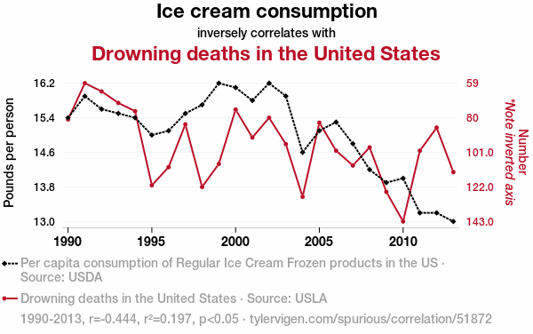

# Independència de variables aleatories


La independència entre dos esdeveniments A i B, suposa que cap d'ells aporta informació d'interés alhora de calcular la probabilitat d'ells. Es a dir $P(A)=P(A/B)$  i per tant $P(B)=P(B/A)$. En aquest tema volerm traslladar el conpte d'indepèndencia i algunes mesures relacionades als vectors aleatòris. 

## Independència i dependència entre variables aleatòries.
 
 
:::{.definition #indep}
**Variables aleatòries independents** 

Es diu que dos variables aleatòries $X$ i $Y$ son independents si, per a qualsevol conjunts A i B tal que $X \in A$ i  $Y \in B$ es té que:

$$
P(X \in A \cap  Y \in B) =P(X \in A) P(Y \in B)
$$
Com a consequència  $P(X \leq x \quad and  \quad   Y \leq y )=P(X \leq x)P(Y \leq y )$


En general es diu que les variables $X_i, i=1,...k$ son independents si les $\sigma-àlgebras$ que les indueixen s ho son

Aquesta definició  implica que al pendre $A_i \in \sigma(X_i), i=1,...,k$

$$
P(A_{j_1} \cap ...\cap A_{j_n} ) =\prod_{l=1}^n P(A_{j_l})  \quad \forall(j_1,...,j_n) \in(1,...,k) 
$$

Tenint en compte com han estat induïdes les $\sigma(X_i)$ admet una expressió alternativa en funció de les diferents variables


$$
P(A_{j_1} \cap ...\cap A_{j_n} ) =P(X_{j_l} \in B_{j_l},l=1,...,n)=  
\prod_{l=1}^n P(X_{j_l} \in  B_{j_l})  \\  \forall(j_1,...,j_n) \in(1,...,k)  
(\#eq:pxindep)
$$
on $A_{j_1}=X^{-1}B_{j_1}$

:::

Comprobar l'independència de variables aleatòries a partir de la equació   \@ref(eq:pxindep) es complicat i es mès fàcil caracterítzar l'independència a partir de les funcions de distribució  i densitat conjuntes i marginals.


 
:::{.theorem }
**Teorema de factorització** 

Sigui $X=(X_1,...,X_k)$ un vector aleatori amb  funció de distribució conjunta $F_X(x_1,...,x_k)$ i funció de densitat o probabilitat  $f_X(x_1,...,x_k)$. Si $F_j(x_j) \quad i \quad f_j(x_j)  , j=1,...,k$ con les funcions  de distribució marginals i les funcions de densitat o probabilitat marginals de cada component del vector aleatori direm que les variables $X_1,...,X_k$ son independents si i només si es verifiquen les següents condicions equivalents:


$$ 
1.\qquad F_X(x_1,...,x_k)= \prod_{l=1}^k F_j(x_j), \quad \forall (x_1,...,x_k) \in \mathbb{R}^k (\#eq:Fxindep)
$$

$$
2. \qquad f_X(x_1,...,x_k)= \prod_{l=1}^k f_j(x_j), \quad \forall (x_1,...,x_k) \in \mathbb{R}^k (\#eq:fpxindep)
$$

:::


**Demostració**

Suposem que les variables aleatòries contínues (X_1,\ldots,X_k) són independents. Per definició,

$$
\prod_{j=1}^{k}\Pr(X_j\in A_j),
\qquad
\forall,A_1,\ldots,A_k\in\mathcal{B}(\mathbb{R}).
$$

1.- Siguin els conjunts $A_j=(-\infty ,x_j] \quad j=1,...,k$

Aleshores, 


$$
\begin{aligned}
F_X(x_1,\ldots,x_k)&=P(X_1\le x_1,\ldots,X_k\le x_k) \\
&=P\left(X_1\in(-\infty,x_1],\ldots,
X_k\in(-\infty,x_k]\right) \\
&=\prod_{j=1}^{k}
P \left(X_j\in(-\infty,x_j]\right)
=\prod_{j=1}^{k}
P(X_j\le x_j) \\
&=\prod_{j=1}^{k}
F_j(x_j)
\end{aligned}
$$

2-  A partir del càlcul de la densitat conjunta i tenim en compte que cada factor $F_j(x_j)$ només depen de la vaqriable $x_j$

$$ 
\begin{aligned}
f_X(x_1,...,x_k)&= \frac{\partial^k}
{\partial x_1\cdots\partial x_k} 
F_X(x_1,\ldots,x_k) \\
&=\frac{\partial^k} {\partial x_1\cdots\partial x_k}(\prod_{j=1}^{k}
F_j(x_j)) \\
&=
\frac{\partial}{\partial x_1}F_1(x_1)
\cdot
\frac{\partial}{\partial x_2}F_2(x_2)
\cdots
\frac{\partial}{\partial x_k}F_k(x_k) \\
&=
f_1(x_1),
f_2(x_2)\cdots
f_k(x_k) \\ 
&=\prod_{j=1}^{k}f_j(x_j)
\end{aligned}
$$


:::{.observation}

Com es va veure en el tema anterior a partir de la distribució conjunta d'un vector aleatori es poden obtenir les distribucions marginals de cadascuna de les seves components.  Segons el teorema de factorització, es pot reconstruir la distribució conjunta multiplicant las distribucions marginales sempre que les variables siguin indepen                                                                                                                              dents. 

:::

:::{.example}
En l'exemple \@ref(exm:circulo)  del tema anterior varem veure que les coordenades de la distribució conjunta de un punt triat a l'atzar en el circle unitas $C_1$ tenia una densitat conjunta


 $$
 f_{XY}(x,y)=
 \begin{cases}
\dfrac{1}{\pi},          & \text{si} \quad (x,y) \in C_1 \\
0,          & \text{en la resta }  \\
\end{cases}
 $$
 
I fàcilement  i de forma simètrica, les garginals de X e Y son idèntiques i tenen la forma


 $$
 f_{X}(x)=
 \begin{cases}
\dfrac{2}{\pi}\sqrt(1-x^2),          & \text{si} \quad |x|<1 \\
0,          & \text{en la resta }  \\
\end{cases}
 $$
 
Directamente les dues variables $X$ e $Y$ no son independents donat que $f_{XY}(x,y) \neq  f_{X}(x)f_{Y}(y)$

::: 


:::{.definition}
**Mostra aleatoria**

Considerem una distribució de probabilitat que ve representada per la seva funció de probabilitat o densitat de probabilitat segons sigui discreta o continua.  Es diu que n variables aleatòries $X_1,...,X_n$ formen una mostra  aleatòria d'aquesta distribució si les  variables aleatòries son independents i la  funció de probabilitat o densitat marginal de cada variable aleatòria $X_i$ es f. Normalment a este conjunt de variables aleatòrias es diu que son independents i identicament distribuides o abreviadament i.i.d".  El nombre de variables aleatòries es la grandària o mida mostral. 

:::

D'aquesta definició es dedueix que les dades observades en una mostra de subjectes d'una població han estat generades per n variables i.i.d i que la seva funció de probabilitat conjunta es el producte de les densitats de cada individu $g(x_1,...,x_n)=f(x_1)...f(x_n)$

:::{.proposition}
**Indepèndencia i Esperança**

Si $X_1,...,X_k$ són independents, aleshores $E[X_1,...,X_k]=E[\prod_{j=1}^{k}X_i]=\prod_{j=1}^{k}E[X_i]$ (\#eq:indep)

**Demostració**

Utilitzant la definició de esperança d'un vector i  la intercanviabilitat de les intregrals i els productes de funcions pel teorema de Fubini podem demostrar 

$$
\begin{aligned}
& E[(X_1\cdots X_k)] \\
&=
\int_{-\infty}^{\infty}\cdots
\int_{-\infty}^{\infty}
x_1\cdots x_k\,
f_X(x_1,\ldots,x_k)\,
dx_1\cdots dx_k \\
&=
\int_{-\infty}^{\infty}\cdots
\int_{-\infty}^{\infty}
\left(
\prod_{i=1}^{k} x_i f_i(x_i)
\right)
dx_1\cdots dx_k \\
&=
\prod_{i=1}^{k}
\left(
\int_{-\infty}^{\infty}
x_i f_i(x_i)\,dx_i
\right) \\
&=
\prod_{i=1}^{k}
E(X_i).
\end{aligned}
$$

:::

En el cas discret es pot demostrar de manera anàloga , canviant integrals per sumes.

De manera més general , el resultat anterior es pot generalitzar a les funcions $g_i,i=1,...,k$ son mesurables, les $g_i(X_i)$ també son variables independents i es pot escriure:

$$
E[\prod_{j=1}^{k}g(X_i)]=\prod_{j=1}^{k}E[g_i(X_i)](\#eq:gindep)
$$
:::{.corollary}
Si les variables $X_1,...,X_k$ son independents, llavors $cov(X_i,X_j)=0, \quad \forall i,j$
:::

:::{.corollary}
Si les variables $X_1,...,X_k$ son independents i les seves variàncies existeixen, la variancia de $S=\sum_{i=1}^k a_i X_i$, on $a_i$ son qualsevol número real, existeix i ve donada per $V(S)= \sum_{i=1}^k a_i^2  Var(X_i)$
:::


Aquests corolaris permeten obtenir esperances i variàncies de algunes variables conegudes de manera fàcil com verurem en el tema 3.


## Esperances i variàncies condicionades.

En el tema anterior varem introduir el concepte d'esperança i variància de un vector aleatori, així com el  concepte de distribució condicional. En aquest apartat introduirem el concepte de esperança condicional i la seva relació amb el concepte d'independencia. 


:::{.definition}
**Esperança condicionada**

Sigui $(X,Y)$ un vector aleatori definti sbore l'espai de probabilitat $(\Omega,\mathcal{A}, \mathbb{R})$ i sigui $P_{Y|X=x}$ la distribució de probabilitat de Y condicionada a X=x. Si g es una funció mesurable definida de $(\mathbb{R},\beta)$ en  $(\mathbb{R},\beta)$ de manera que $E[g(Y)]$ exiteix, l'esperança condicionada de g(Y) donat X,$E[g(Y)|X]$ es una variable aleatòria que paer $X=x$ pren el valor


$$
E\!\left[g(Y)\mid X=x\right]
=
\int_{\Omega} g(y)\, dP_{Y\mid X=x}(y).  (\#eq:espcond)
$$
:::

La forma de l'equació \@ref(eq:espcond) depen de les característiques de la distribució del vector (X,Y)

- Si (X,Y) es un vector discret on $D_x=\{y;(x,y) \in D\}$, llavors

$$
E[g(Y)\mid X=x]=\sum_{y\in D_x} g(y)P(Y=y\mid X=x)=\sum_{y\in D_x}g(y)f_{Y\mid X}(y\mid x)
$$

- Si (X,Y) es un vector continu, llavors


$$
E[g(Y)| X=x] =\int_{\mathbb{R}} g(y)f_{Y | X}(y |x) dx
$$

Així si  g(Y)=y tenim 


$$
E[Y\mid X=x]=
\begin{cases}
\displaystyle
\int_{-\infty}^{\infty}
y\,f_{Y\mid X=x}(y)\,dy,
& \text{en el cas continu},\\
\displaystyle
\sum_{y}
y\,f_{Y\mid X=x}(y),
& \text{en el cas discret}.
\end{cases}
(\#eq:espcondic)
$$
Quan el valor x de X  varia, l'esperança condicionada de Y al valor de x també canvia.  Així podem definir la funció 

$$
m_y =E[Y \mid X=x]
$$
que estarà definida per a tot x tal que $f_X(x)>0$  i que la funció de probabilitit o densitat condicionada $f_{Y|X=x}(y)$ tingui esperança finita

:::{.definition} 
**Funció de esperança condicionada o regressió**

La funció $m_y =E[Y \mid X=x]$ s'anomena funció de esperança condicionada de Y donat X o també funció de regressió de Y sobre X. 


:::

---

:::{.exemple}

Si disposem de dues variables $X$ i $Y$ independents  amb distribució Bi(n,p) es pot obtenir fàcilment la distribució de la variable X+Y a partir de les definicions anteriors

$$
\begin{aligned}
f_{X+Y}(m)
&=
P\left(\bigcup_{k=0}^{m}\{X=k,Y=m-k\}\right)\\
&=
\sum_{k=0}^{m}P(X=k,Y=m-k)\\
&=
\sum_{k=0}^{m}P(X=k)P(Y=m-k)\\
&=
\sum_{k=0}^{m}
\binom{n}{k}p^k(1-p)^{n-k}
\binom{n}{m-k}p^{m-k}(1-p)^{n-(m-k)}\\
&=
p^m(1-p)^{2n-m}
\sum_{k=0}^{m}
\binom{n}{k}
\binom{n}{m-k}\\
&=
\binom{2n}{m}p^m(1-p)^{2n-m}.
\end{aligned}
$$

De donde se obtiene que:

$$
X+Y\sim B(2n,p).
$$
La distribució de condicionada de $Y|X+Y=m$  és 


$$
\begin{aligned}
P(Y=k\mid X+Y=m)
&=
\frac{P(Y=k,X+Y=m)}
{P(X+Y=m)}\\
&=
\frac{P(Y=k,X=m-k)}
{P(X+Y=m)}\\
&=
\frac{
\binom{n}{k}p^k(1-p)^{n-k}
\binom{n}{m-k}p^{m-k}(1-p)^{n-(m-k)}
}
{
\binom{2n}{m}p^m(1-p)^{2n-m}
}\\
&=
\frac{
\binom{n}{k}\binom{n}{m-k}
}
{
\binom{2n}{m}
}.
\end{aligned}
$$

És a dir,

$$
Y\mid X+Y=m \sim H(m,2n,n).
$$

L'esperança condicional val:

$$
E(Y\mid X+Y=m)=\frac{nm}{2n}=\frac{m}{2}.
$$

:::

---

Totes les operacions que es feiem en l'operador esperança es poden realitar en l'esperança condicionada


1. L'esperança condicionada es un operador linial 
$$
E[(a g_1(Y)+b g_2(Y))\mid X]=aE[g_1(Y)\mid X]+bE[g_2(Y)\mid X] (\#eq:expcondlinial) 
$$
En particular,

$$
E[(aY+b)\mid X]=aE(Y\mid X)+b. 
$$


2. 
$$
P(a \leq Y \leq b) = 1 \implies a \leq E(Y|X) \leq b (\#eq:expcondinterval)
$$
3. 
$$
P(g_1(Y) \leq g_2(Y)) = 1 \implies E[g_1(Y)|X] \leq E[g_2(Y)|X] (\#eq:expconddesigual)
$$
4.  
$E[c|X]=c$ para c constant.  (\#eq:expcondconstant)


Però hi ha algunes propietats que son específiques de de l'esperança condicional

:::{proposition}
**LLei de l'esperança total**

Si $E[g(Y)]$ existeix , llavors  $E[E[g(Y)|X]]=E[g(Y)]$

:::
**Demostració:** 


$$
\begin{aligned}
E(E[g(Y)\mid X])
&= \int_{\mathbb{R}} E[g(Y)\mid x]\,f_X(x)\,dx \\
&= \int_{\mathbb{R}}
\left(\int_{\mathbb{R}} g(y)f_{Y\mid X}(y\mid x)\,dy\right)
f_X(x)\,dx \\
&= \int_{\mathbb{R}}
\left(\int_{\mathbb{R}} g(y)f_{XY}(x,y)\,dy\right)\,dx \\
&= \int_{\mathbb{R}} g(y)
\left(\int_{\mathbb{R}} f_{XY}(x,y)\,dx\right)dy \\
&= \int_{\mathbb{R}} g(y)f_Y(y)\,dy \\
&= E[g(Y)].
\end{aligned}
$$

---

:::{.example}

Considerem el vector $(X,Y)$ amb densitat conjunta

$$
f_{XY}(x,y)=
\begin{cases}
1/x
& 0 <y \leq x \leq 1 \\
0
& \text{en la resta}.
\end{cases}
$$


Facilment obtenim que $X \sim U(0,1)$ y que $Y|X=x \sim U(0,x)$ 

apolicant el resultat antreior podem obtenir $E[Y]$

$$
E[Y]= \int_0^1 E(Y|x)f_X(x) dx= \int_0^1 \frac{1}{2} xdx=\frac{1}{4}
$$

:::

---

---


:::{.example}

Un treballador está encarregat del correcte funcionament de n màquines situades en línia recta i distantes una de l'altra l metros. El treballador ha de reparar-les quan s'espatllen, el que succeeix amb la mateixa probabilitat per totes les màquines de manera independent una de l'altra. L'operari pot seguir dues estratègies.

1. Anar a reparar la màquina que s'espatlla i romandre al costat d'ella fins que un altra s'espatlle i anar llavors a  reparar-la

2. Situar-se al punt mig de la línia de màquines i des de alli anar a la màquina espatllada i tornar al punt mig quan la màquina estigui reparada.

Si X es la distància que camina el tgreballadaor entre dues avaries consecutives, ¿Quina de les dues estratègies es la més convenient per caminar menys?

Per tant es tracta de obtenir el valor E[X] amb les dues estratègies i triar la que tinga menys valor esperat.  Designem $E_i[X]$ l'esperança que obetnim en cada estratègia $i=1,2$.


**Estratègia 1** 

Si $A_k$  es l'esdeveniment  l'operari està en la màquina k. Per obtenir $E_1[X]$ recurrim a la propietat de l'esperança total, peroò tuilitzan com a distribució condicionada la que es deriva de condicionar respecte del succès $A_k$. Tindrem E_1[X]=E[E(A_k]] 

Para obtenir $E[X\mid A_k])$, tinguem en compte que, si $i$ és la pròxima màquina avariada,  $P(A_i)=\frac{1}{n}, \qquad \forall i=1,\ldots,n,$ i la distància a recórrer serà 

$$
X\mid A_k=
\begin{cases}
(k-i)\,l, & \text{si } i\le k,\\[1ex]
(i-k)\,l, & \text{si } i>k.
\end{cases}
$$

Així doncs,

$$
\begin{aligned}
E(X\mid A_k)
&= \frac{1}{n} \left( \sum_{i=1}^{k}(k-i)\,l + \sum_{i=k+1}^{n}(i-k)\,l\right)\\
&= \frac{l}{2n} \left[ 2k^2-2(n+1)k+n(n+1) \right].
\end{aligned}
$$

Utilitzant

$$
\sum_{k=1}^{n}k^2 = \frac{n(n+1)(2n+1)}{6},
$$

obtenim

$$
\begin{aligned}
E_1(X)=
E\!\left(E(X\mid A_k)\right)=\frac{1}{n} \sum_{k=1}^{n} E(X\mid A_k)= \frac{l(n^2-1)}{3n}.
\end{aligned}
$$
**Estratègia 2**

Per facilitar els càlculs, suposem que $n$ és imparell, de manera que hi ha una màquina situada al punt mig de la línia, és a dir, la $\frac{n+1}{2}$-èsima. Si la pròxima màquina avariada és la i-èsima, la distància a recórrer serà

$$
X=
\begin{cases}
2\left(\dfrac{n+1}{2}-i\right)l, & \text{si } i\le\dfrac{n+1}{2},\\ 
2\left(i-\dfrac{n+1}{2}\right)l, & \text{si } i>\dfrac{n+1}{2},
\end{cases}
$$

on el factor 2 es justifica perquè, en aquesta segona estratègia, l'operari torna sempre al punt mig de la línia de màquines.

L'esperança ve donada per

$$
\begin{aligned}
E_2(X)=\frac{2}{n}\sum_{i=1}^{n}\left|\frac{n+1}{2}-i\right|l,=\frac{l(n-1)}{2}
\end{aligned}
$$

Com que $E_1(X)\le E_2(X) \iff \frac{n+1}{3n}\le\frac{1}{2}  \iff n\ge 2$,podem deduir que la primera estratègia és millor, excepte quan només hi ha una màquina.

:::

---

:::{.definition}
**Variància condicionada**

Definim la variància condicionada $Var(Y|X)$  a la variable definida con una funció de la variable aleatòria $X$ com la funció $v_Y(x)$  
$v_Y(x)= Var(Y|X=x)=E[Y^2|X]-(E[Y|X])^2$

:::


També és possible relacionar la variància absoluta amb la variància condicionada, encara que l'expressió no és tan directa com la que s'ha obtingut per a l'esperança.


:::{.proposition}
** Llei de la variància total** 
Si $E[Y^2]" existeix, llavors

$$
var(Y)=E(var[Y|X])+ var(E[X|Y])  (\#eq:varcond)
$$
:::
**Demostració**
$$
\begin{aligned}
\operatorname{Var}(Y)
&= E\left[(Y - E(Y))^2\right]= E\left\{E\left[(Y - E(Y))^2 \mid X\right]\right\} \\
&= E\left\{E\left[Y^2 + (E(Y))^2 - 2Y\,E(Y)\mid X\right]\right\} \\
&= E\left\{E[Y^2\mid X] + E(Y)^2 - 2E(Y)\,E[Y\mid X]\right\} \\
&= E\left\{\operatorname{Var}(Y\mid X)
+ (E[Y\mid X])^2
+ E(Y)^2
- 2E(Y)\,E[Y\mid X]\right\} \\
&= E\left\{\operatorname{Var}(Y\mid X)
+ \left(E[Y\mid X]-E(Y)\right)^2\right\} \\
&= E\{\operatorname{Var}(Y\mid X)\}
+ E\left[\left(E[Y\mid X]-E(Y)\right)^2\right] \\
&= E\left(\operatorname{Var}(Y\mid X)\right)
+ \operatorname{Var}\left(E[Y\mid X]\right)
\end{aligned}
$$
:::{.corollary}

Si $E[Y^2]$  existeix, per la propietat anterior $Var(Y) \geq Var(E[Y|X])$

:::

---


:::{.example}

Siguin $(X, Y)$ variables aleatòries contínues amb densitat conjunta

$$
f(x,y)=
\begin{cases}
e^{-y}, & 0\le x\le y,\\
0, & \text{en la resta}
\end{cases}
$$

**(a) Densitat marginal de $X$**

$$
f_X(x)=\int_x^\infty f(x,y)\,dy=\int_x^\infty e^{-y}\,dy=\left[-e^{-y}\right]_x^\infty=e^{-x}
$$

Per tant,$X\sim\operatorname{Exp}(1)$

**(b) Densitat marginal de $Y$**

$$
f_Y(y)=\int_0^y f(x,y)\,dx=\int_0^y e^{-y}\,dx=e^{-y}[x]_0^y=ye^{-y}
$$

Per tant,  $Y\sim\Gamma(\alpha=2,\beta=1)$

**(c) Densitat condicional de $(X\mid Y=y$**

$$
f_{X\mid Y=y}(x)=\frac{f(x,y)}{f_Y(y)}=\frac{e^{-y}}{ye^{-y}}=\frac1y,\qquad 0\le x\le y
$$

Per tant $(X\mid Y=y)\sim U[0,y]$

**(d) Densitat condicional de $(Y\mid X=x)$**

$$
f_{Y|X=x}(y)=\frac{f(x,y)}{f_X(x)}=\frac{e^{-y}}{e^{-x}}=e^{-(y-x)},\qquad y\ge x
$$

Per tant, $(Y\mid X=x)$ segueix una exponencial desplaçada.

**(e) Esperança i variància condicionades de $X\mid Y=y$**

$$
E(X\mid Y=y) =\int_0^y x\frac1y\,dx=\frac1y\left[\frac{x^2}{2}\right]_0^y=\frac{y}{2}
$$

Com que $(X\mid Y=y)\sim U[0,y]$, podem obtenir directament les expressions de la variància i la esperança
també tenim

$\operatorname{Var}(X\mid Y=y)=\frac{y^2}{12}$  i $E(X\mid Y)=\frac{Y}{2}$

**(f) Esperança i variància condicionades de $(Y\mid X=x)$**


$$
E(Y\mid X=x)
=
\int_x^\infty ye^{-(y-x)}\,dy
=
\left\{
\begin{array}{ll}
u=y & du=1\\
dv=e^{-(y-x)} & v=-e^{-(y-z)}
\end{array}
\right \}
$$

$$
=e^x\left[-ye^{-y}\right]_x^\infty
-\int_x^\infty e^{-y}\,dy
=e^x\left(xe^{-x}+e^{-x}\right)
=x+1.
$$

$$
E(Y^2\mid X=x)
=
\int_x^\infty y^2e^{-(y-x)}\,dy
=
\left\{
\begin{array}{ll}
z=y-x\\
dz=dy
\end{array}
\right\}
$$


$$
\begin{aligned}
E(Y^2\mid X=x)&=\int_x^\infty y^2e^{-(y-x)}\,dy =
\left\{
\begin{aligned}
z=y-x \\
dz=dy \\
\end{aligned}
\right\} \\
&= \int_{0}^{\infty}(z+x)^2e^{-z}\,dz 
= \int_{0}^{\infty}z^2e^{-z}\,dz
   + x^2\int_{0}^{\infty}e^{-z}\,dz
   + 2x\int_{0}^{\infty}ze^{-z}\,dz \\
&= \frac{\Gamma(2)}{1^2}\int_{0}^{\infty}
   \frac{1^2}{\Gamma(2)}ze^{-z}\,dz
   + x^2 + 2x \\
&= 2 + x^2 + 2x \\
&= (x+1)^2+1.
\end{aligned}
$$
 On hem  usat que si $X\sim\Gamma(\alpha,\beta)$ llavors $E[X]=\dfrac {\alpha}{\beta}$   $E[X^2]=\dfrac {\alpha(\alpha+1)}{\beta^2}$ i  $Var[X]=\dfrac {\alpha}{\beta^2}$, 


Amb aquests càlculs podem trobar la variable aleatòria Var(Y|X)  com 
$Var(Y|X=x) =1+(x+1)^2-(x+1)^2=1$

Per tant 

$E(Y|X)=X+1$ i $Var(Y|X)=1$


**(g) Variància de Y**


Directamente de la definició 
$$
\operatorname{Var}(Y) = \operatorname{Var}(\Gamma(\alpha = 2,\ \beta = 1))
= \frac{2}{1^2} = 2.
$$

Ara podem comprovar la segona part de la llei de la variància total:

$$
\begin{aligned}
\operatorname{Var}(Y)
&= E\bigl(\operatorname{Var}(Y \mid X)\bigr)
   + \operatorname{Var}\bigl(E(Y \mid X)\bigr) \\
&= E(1) + \operatorname{Var}(X + 1) \\
&= 1 + \operatorname{Var}(X) \\
&= 1 + 1 = 2.
\end{aligned}
$$

**(h) Variància de X**

$$
\begin{aligned}
1
&= \operatorname{Var}(X) \\
&= E\bigl(\operatorname{Var}(X \mid Y)\bigr)
   + \operatorname{Var}\bigl(E(X \mid Y)\bigr) \\
&= E\left(\frac{Y}{2}\right)
   + \operatorname{Var}\left(\frac{Y}{2}\right) \\
&= \frac{1}{2}E(Y)
   + \frac{1}{4}\operatorname{Var}(Y) \\
&= \frac{1}{2}\cdot 1
   + \frac{1}{4}\cdot 2 \\
&= \frac{1}{2} + \frac{1}{2} = 1.
\end{aligned}
$$

:::


---


## Conceptes de covariància, correlació i causalitat
 
 En el capítol anterior varem introduïr el càlcul de la matriu de variàncies-covariàncies. En aquest apartat  anem a discutir sobre la interpretació incloent conceptes com la correlació i la causalitat.
 
 
### Desigualtats
 
 En primer lloc anem a formular algunes desigualtats que són útils quan no coneixem la distribució de algunes variables, però si que coneixem alguns dels seus moments o els estimem a partir de les observacions. En aquest cas les desigualtats  permeten establir cotes de les probabilitats a partir dels moments i poden ajudar a demostrar alguns teoremes crucials com la llei dels grans números.
 
 
 Per a una variable $X \geq 0$ existeix la seva esperqança, sigui $\epsilon>0$ podem escriure el valor de l'esperança com
 
$$
E[X]=\int_0^{+\infty} P(X \geq x)dx=\int_0^{\epsilon} P(X \geq x)dx+\int_{\epsilon}^{+\infty} P(X \geq x)dx 
$$
Com que la segona integral es no negativa i la funció $P(X \geq \epsilon)$ es decrecient 


$$
E[X] \geq \int_0^{\epsilon} P(X \geq x)dx\geq \int_0^{\epsilon} P(X \geq \epsilon)dx= \epsilon P(X \geq \epsilon)
$$
 i d'ací
 
 $$
 P(X \geq \epsilon) \leq \dfrac{E[X]}{\epsilon} (\#eq:desigepsilon)
 $$
 
Aquest resultat dona lloc a dues conegudes desigualtats generals que proporcionen cotes superiors paer a la probabilitat de certs conjunts i que son vàlides independentment de la distribució de la variable involucrada.


**Desigualtat de Markov**

Si en la desigualtat  \@ref(eq:desigepsilon) substituim $X$ per $|X|^k$  i $\epsilon$ per $\epsilon^k$ tenim


  $$
 P(|X| \geq \epsilon)=P(|X|^k \geq \epsilon^k) \leq \dfrac{E[|X|^k]}{\epsilon^k}    (\#eq:desmarkov)
 $$
 coneguda com a desigualtat de Markov. 
 
 
 **Desigualtat de Txebixev**
 
 Un cas especial de  \@ref(eq:desmarkov),  que es coneix com la desigualtat de Txebixev, és el cas en el que k=2 i X=X-E[X] 
 

 $$
 P(|X-E[X]| \geq \epsilon) \leq \frac {1}{\epsilon^2}Var(X)     (\#eq:destxebixev)
 $$

:::{.proposition} 
 
Si $V(X)=0$ aleshores $X$ es constant amb probabilitat 1.
 
**Demostració**

Suposem $E[X]=\mu$ i considerem els conjunts $A_n={|X-\mu| \geq 1/n}$ aplicant la desigualtat de Txebixev

$$
P(A_n)= P(|X-\mu| \geq\frac{1}{n})=0 \forall n
$$
d'aci obtenim que $P(\cup_n A_n)=0$ i  $P(\cap_n A_n^c)=1$ Però 

$$
\bigcap_{n\geq1} A_n^c=\bigcap_{n\geq1} \{  |X-\mu| \geq \frac{1}{n} \}=\{X=\mu \}
$$
i per tant $P(X=\mu)=1

:::

**Desigualtat de Jensen**
 
 Si $g(X)$ es convexa  sabem que $\forall a, \exists \lambda_a$ tal que $g(x) \geq g(a)+lambda_a(x-a)$
 
 Si es substitueix $a=E[X]$ llavors
 
 $$
 g(X) \geq g(E[X])+lambda_a(X-E[X]) 
 $$
 i calculant esperances de l'expressió anterior obtenim la coneguda com desigualtat de Jensen
 
 
$$
 E[g(X)] \geq g(E[X])   (\#eq:desjensen)
 $$
:::{.Theorem #thm-cauchy}
**Desigualtad de Cauchy-Schwarz**

Si $X$ i $Y$ son variables aleatòries amb variàncies finites. Aleshores, $cov(X,Y)$ existeix i es verifica que 


$$
(E[XY])^2 \leq E[X^2]E[Y^2]  (\#eq:descauchy)
$$
verificant-se la igualtat si i només si existeis un nombre real tal que $P(\alpha X+Y=0)=1$
:::
**Demostració**
Per qualsevol nombre real $a$ i $b$ es verifica que:

$$
|ab| \leq \dfrac {a^2+b^2}{2}
$$
el que significa que si $E[XY]<\infty$, $E[X^2]<\infty$ i $E[Y^2]<\infty$ 

Per altra banda per qualsevol real $\alpha$ es te que:

$$
E[(\alpha X+Y)]^2 =\alpha^2 E[X^2] +2 \alpha E[XY]+E[X^2] \geq 0
$$
que es tracta d'una equaciò de segon grau que te almenys una arrel i el seu discriminant no serà positiu. És a dir:


$$
(E[XY])^2\leq E[X^2] E[Y^2]
$$
 Si es donés el cas de la igualtat, l'equació tindria una arrel doble $\alpha0$ i $E[(\alpha_0 X+Y)]^2=0$ de una funció no negativa que implica que $P(\alpha_0 X+Y=0)=1$

### Covariància i Correlació

Si recordem del tema 1, la covariància entre dues variables es pot expressar com 

$$
cov(X_i,X_j)=E[(X_i-E[X_i])(X_j-E[X_j])]=E[(X_iX_j)]-E[X_i]E[X_j] 
$$

La covariància ens informa sobre el grau i tipus de dependència entre dues variables a través de la seva magnitut i signe, ja que la relació pot ser positiva o negativa. Tanmateix les unitats de mesura de les variables, alteren els valors de les covariancies. Si $X$ es el pes i $Y$ es l'alçada en centimetros i    transformem l'alçada en metros multiplicant per 100 Cov(X,100Y)= 100Cov(X,Y)  segons   \@ref(eq:provcov5)


:::{.definition}
**Coeficient de correlació**

Si (X,Y) són variables aleatòries amb variances finites $Var(X)=\sigma_X^2$ I $Var(Y)=\sigma_Y^2$   la correlació $\rho(X,Y)$ entre $X$ i $Y$  es defineix com

$$
\rho(X,Y)=\dfrac{Cov(X,Y)}{Var(X)Var(Y)}= \dfrac{\sigma_{XY}}{\sigma_X \sigma_Y} = E \left[\left(\dfrac{X-E[X]}{\sigma_X}\right)\left(\dfrac{Y-E[Y]}{\sigma_Y}\right)\right]= cov(X_t,Y_t)
$$
es a dir la covariància de les variables $X$ i $Y$ tipificades 

:::


:::{.proposition}

Siguin $X$ i $Y$ dues variables aleatories amb variancia finita llavors 

$$
(Cov(X,Y))^2 \leq \sigma_X^2 \sigma_Y^2
$$
i de aqui es depren que que $\rho^2_{XY} \leq 1$ i en particular    $-1 \leq \rho_{XY} \leq 1$ . A nmés desigualtat seria igualtat si i només si hi ha una constant $\alpha_0$ tal que amb probabilitat 1, $P(\alpha_0 X+Y=0)=1$ el que implica que la correlació $\rho_{XY}^2=1$
:::

**Demostració**


Considerem les  variables centrades $X_c=X-E[]X]$ i $Y_c=Y-E[Y]$  

Per definició  de covariància 
$$
Cov(X,Y)=E[X_c, Y_c]
$$. 

A partir de la desigualtat de Cauchy-Schwartz \@ref(eq:descauchy) podem deduir que 

$$
(E[X_cY_c])^2\leq E[X_c^2] E[Y_c^2]
$$
A més sabem que $E[X_c^2]=Var(X)=\sigma_X^2$ i  $E[Y_c^2]=Var(Y)=\sigma_Y^2$

 per tant
 
$$
(Cov(X,Y))^2 =\sigma_{X,Y}^2=(E[X_cY_c])^2\leq E[X_c^2] E[Y_c^2]=\sigma_X^2 \sigma_Y^2
$$ 
 Com a consequència si $\sigma_X>0$ i  $\sigma_Y>0$  el coeficient de correlació es 
 
$$
\rho(X,Y)=\dfrac{Cov(X,Y)}{Var(X)Var(Y)}= \dfrac{\sigma_{XY}}{\sigma_X \sigma_Y}
$$ 
 i elevant al quadrat
 
 
$$
\rho_{X,Y}^2= \dfrac {\sigma_{XY}^2} {\sigma_X^2 \sigma_Y^2} \leq  \dfrac {\sigma_X^2 \sigma_Y^2} {\sigma_X^2 \sigma_Y^2}=1
$$
i per tant
$$
-1 \leq \rho_{XY} \leq 1
$$ 


En el cas de igualtat també per la desigualtat de Cauchy-Schwarz es sabe que existeix una constant $\alpha_0$ tal que  les variables centrade  $X_c$ i $Y_c$ estan relacionades linealment amb probabilitat 1.  $P(\alpha0 X_c+Y_c=0)=1$ i per tant la correlació al quadrat valdra 1. És a dir $\rho_{XY}=-1$  ó $\rho_{XY}=-$. En aquest cas es parla de relació linial perfecta. 

Si $\rho_{XY}>0$ parlarem de que les variables estàn positivament correlacionades i si $\rho_{XY}<0$ direm que estàn negativament correlacionades. 

Si  $\rho_{XY}=0$ es diu que les variables están incorrelades i a més a més la $Cov(X,Y)=0$ i hi ha absència de correlació linial. 


:::{.theorem}

Si $X_i$ i $X_j$ son independents  aleshores $Cov(X_i,X_J)=\rho{X_i,X_J}=0$
:::

**Demostració**

Si dues variables son independents l'esperanza del producte es el producte d'esperances . Aixi

$$
cov(X_i,X_j)=E[(X_iX_j)]-E[X_i]E[X_j]=E[X_i]E[X_j]-E[X_i]E[X_j]=0 
$$

L'invers del teorema anterior no es cumpleix en general, es a dir dues variables poden estar incorrelades però no ser independents. 

---

:::{.example}

Imaginem una variable aleatòria $X$ que pren només tres valors $\{-1,0,1\}$ i que cadascú d'aquests valors te la mateixa probabilitat $(1/3$. Imaginem la variable $Y=X^2$.  Les dues variables clarament no son independents per definició ja que els valors de Y estan completament determinats pels valors de Y. 

 Si calculem $E[XY]=E[X^3]=E[X]=0$ ja que la variable $X$ i $X^3$ son la mateixa que X.  A més $E[X]E[Y]=0$ ja que $E[X]=0$-
 
 Per tant
 
 $$
 Cov(X,Y)=E[X,Y] -E[X]E[Y]=0-0=0
 $$

:::

---


:::{.Definition}
***Matriu de Correlació***

Si $(X_1, X_2)$ es un vector de 2 variables aleatòries  definim la matriu de correlació $R$ a la matriu 2x2 amb les correlacions entres els dues variable i 1 en la diagonal tenint en compte que la correlació  $\rho{_12}=\rho{_21}$

$$
R= \begin{bmatrix} 1 &  \rho_{12}  \\ \rho_{21} & 1  \end{bmatrix} 
$$
En general.  Si $X=(X_1,....X_k)$ és un vector aleatori de dimensió k la matriu de correlacions és


$$
R=
\begin{bmatrix} 
1 & \rho_{12} & ... & \rho_{1(k-1)}  & \rho_{1k} \\
\rho_{21}  & 1 & ... & \rho_{2(k-1)}  & \rho_{2k} \\  
.  & . & . & .  & . \\  
\rho_{(k-1)1}  & \rho_{(k-1)2} & ... & 1  & \rho_{(k-1)k} \\  
\rho_{k1}  & \rho_{k2} & ... &  \rho_{k(k-1)}  & 1\\  
\end{bmatrix} 
$$


:::

La matriu de variàncies-covàriancies $\Sigma$  es relaciona directament amb la matriu de correlació $R$ amb la següent fòrmula:

$$
\Sigma= D·R·D
$$ 
i per tant 

$$
R= D^{-1} ·\Sigma· D^{-1}
$$ 
on D es la matriu diagonal de desviacions típiques 


$$
D=
\begin{bmatrix} 
\sigma_1 & 0 & ... & 0  & 0 \\
0  & \sigma_2 & ... & 0  & 0 \\  
.  & . & . & .  & . \\  
0  & 0 & ... & \sigma_{n-1} & 0  \\  
0  & 0 & ... &  0  & \sigma_n\\  
\end{bmatrix} 
$$
i $D^{-1}$ es una matriu diagonal amb $\dfrac {1}{\sigma_i}$ en la diagonal


### Causalitat i correlació.

Tal i com hem vist en apartata anterior diguem que dues variables estàn relacionades  si existeix correlació entre les mateixes. Aquesta correlació es una mesura estadística que descriu una direcció de relació ( positiva o negativa)  i una intensitat que va entre 0 i 1 en valors absoluts. No obstant, aquesta correlaci´no implica que el canvi en una varialbe atuomáticament es vegi reflectit en el canvi d'un altra.

La causalitat implica que el canvi en la ocurrència en una variable implica el canvi en ul altra.  Per exemple, si una variable és la quantitat de les hores treballades i l'altra es la quantitat de diners guanyats quan a un treballador se li paga per hores, està clar que un increment d'hores treballades implica un augment del diners rebuts.
 
A més de l'existència de relació entre dues variables com per exemple correlació linial son necessaries algunes altres característiques com la sequència temporarl ( la causa ha de existir abans de la consequèincia), la plausibilidad , la consistèncie, l'especificidad etc.


Per exemple, el consum de gelats te una bona correlació amb el nombre de ofegaments en  piscines, platges , rius, etc. peró està clar  que el menjar-es un gelat no fa que t'ofegues en una piscina. Simplemnet hi ha una correlació temporal. Es messos d'estiu es quan més  calor fa i es mengen més gelats i la gent es banya més amb risc d'ofegar-se. Al contrari pasa al hivern, es mengen més gelats i como la gent no es banya disminueix el risc d'ofegament. En la següent figura es poden veure dades reals en USA on la correlació es 0.44 i està clar que no hi ha relació causal.


```{r img-icecream, fig.cap="Correlació espúria entre el consum de gelats i morts per ofegament en aigua en USA", echo=FALSE,out.width="80%",fig.align='center'}

```


En la URL https://tylervigen.com/spurious-correlations es poden trobar nombrosoes correlacions espúries on estàn disponibles les dades . D'ací la famosa frase en estadística **Correlation is not causation**, la correlació no implica causalitat.
