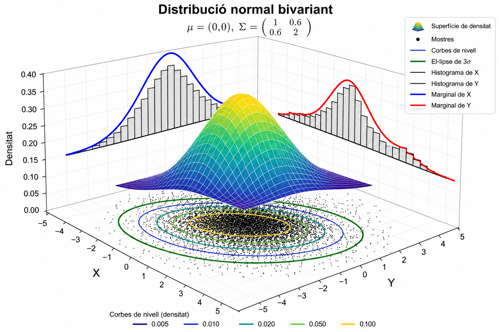

# Algunes distribucions multivariants

En els dos temes anteriors s'ha introduït el concepte de vectors aleatoris i totes les funcions asociades a les seves distribucions. En aquest tema introduirem algunes de les distribucions de probabilitat més utilitzades. Dedicarem un apartat sencer a la distribució normal multivariant, introduirem algunes de les distribucions discretes i continues més utilitzades i en la tercera part del tema  parlarem de la generació de distribucions multivariants. 

## Distribució normal multivariant: definició, propietats i aplicacions.

### Distribució normal bivariant 


:::{.definition}
**Vector aleatori normal bivariant**

El vector aleatori bidimensional $(X,Y)$ té una distribució normal bivariant de paráetres

$\mu_x \in \mathbb{R}, \mu_y \in \mathbb{R},\sigma_x>0,\sigma_y>0$ i $\rho \quad \text{tal que}  \quad |\rho|<1$  si la funció de densitat conjunta és de la forma 

$$
f_{XY}(x,y)= \dfrac{1}{ 2 \pi \sigma_x \sigma_y \sqrt{(1-\rho^2)}} e^{-\dfrac{q(x,y)}{2}} , (x,y) \in  \mathbb{R}^2 (\#eq:fxybinorm)
$$
on

$$
q(x,y)=\dfrac{1}{1-\rho^2} \left\{ \left(\dfrac{x-\mu_x}{\sigma_x}\right)^2 -2 \rho \left ( \dfrac{x-\mu_x}{\sigma_x} \right) \left(\dfrac{y-\mu_y}{\sigma_y}\right)+ \left ( \dfrac{y-\mu_y}{\sigma_y} \right)^2   \right\} (\#eq:qxybinorm)
$$
:::


En la figura  \@ref(fig:graf-binormalrho) es mostra en la part esquerra la distribució de densitat normal bivariant conjunta i en la part dreta es mostren les corbes de nivell. Es pot veure la forma el·liptica que té la figura que mostra el nivell de correlació entre les dues variables, que és molt estreta ja que la correlació és $\rho=0.8$. 


(ref:mititulo) Densitat icorbes de nivell binormal amb $\mu_x=\mu_y=0, \sigma_x=\sigma_y=1$ i $\rho=0.8$


```{r graf-binormalrho, echo=FALSE, message=FALSE, warning=FALSE, fig.cap="(ref:mititulo)"}
source("Rcode/binormalrho.r")
```

L'expressió de la densitat normal bivariant es pot enunciar d'una manera més compacta a partir de la matriu de variàncies-covariàncies 
$$
\Sigma= \begin{bmatrix} \sigma_x^2 & \sigma_{xy} \\\sigma_{xy}  & \sigma_y^2 \end{bmatrix}  (\#eq:sigmamat)
$$

$$
f(x,y)=\dfrac {|\Sigma|^{-\frac{1}{2}}}{2\pi} e^{ -\frac{1}{2} (\mathbf{x} - \boldsymbol{\mu})' \Sigma^{-1} (\mathbf{x} - \boldsymbol{\mu})} , \quad  (x,y) \in   \mathbb{R}^2  (\#eq:fxybinormmat)
$$

On $\mathbf{x}^{\prime}=(x,y)$ és el vector de variables aleatòries i  $\boldsymbol{\mu}^{\prime}=(\mu_x,\mu_y)$ és el vector de mitjanes o valors esperats i  $|\Sigma|$ es el determinant de $\Sigma$ que pren el valor

$$
|\Sigma|= \sigma_x^2 \sigma_y^2 - \sigma_{xy}^2=\sigma_x^2 \sigma_y^2(1-\rho_{xy}^2)  (\#eq:detsigma)
$$
Així en aquest cas es diu que  $\mathbf{x}^{\prime}=(x,y)$ te una distribució  normal bivariant en vector d'esperances $\boldsymbol{\mu}$ i matriu de variàncies-covariàncies $\Sigma$.

Escriurem 

$$
\begin{pmatrix} X \\ Y \end{pmatrix} \sim N \left( \boldsymbol{\mu} = \begin{pmatrix} \mu_x \\ \mu_y \end{pmatrix}, \Sigma = \begin{pmatrix} \sigma_x^2 & \rho\sigma_x\sigma_y \\ \rho\sigma_x\sigma_y & \sigma_y^2 \end{pmatrix} \right)   (\#eq:distbinorm)
$$
Queda per al lector la comprovació de l'equivalència de les expressions de les funcions de densitat.


:::{.definition}
**Distribució normal bivariant estàndardd amb marginal independents**

Sigui  $Z_1 \sim N(0,1)$ i  $Z_2 \sim N(0,1)$  amb $Z_1$ i $Z_2$ independents  i per tant $\rho=0$ 
Llavors  

$$
f_{Z_1, Z_2}(z_1,z_2)=f_{Z_1}(z_1)f_{Z_2}(z_2)=
\dfrac {1}{\sqrt{2\pi }}e^{\frac{-z_1^2}{2}} \dfrac {1}{\sqrt{2\pi }}e^{\frac{-z_2^2}{2}}= \dfrac {1}{2\pi }e^{(-\frac{1}{2})(z_1^2+z_2^2)}=-\dfrac {1}{2\pi }e^{(-\frac{1}{2})(\mathbf{z^{\prime}}\mathbf{z})}  (\#eq:fxybinormstand)
$$

amb $\mathbf{z}=(z_1,z_2)^T \in \mathbb{R}^2$

:::

En la gráfica es mostra la densitat de la binormal estàndard amb mostres independents. S'observa que la corba de nivell està formada per isocrones de densitat en forma de cercles. 

(ref:mititulo1) Densitat icorbes de nivell binormal amb $\mu_x=\mu_y=0, \sigma_x=\sigma_y=1$ i $\rho=0$


```{r graf-binormalrho0, echo=FALSE, message=FALSE, warning=FALSE, fig.cap="(ref:mititulo1)"}
source("Rcode/binormalrho0.r")
```


:::{.definition}
**Distribució normal bivariant estàndard amb marginals correlades **

Sigui  $Z_1 \sim N(0,1)$ i  $Z_2 \sim N(0,1)$  amb $Z_1$ i $Z_2$  i la correlació $\rho \in (-1,1)$ 
Llavors  
$$
f_{Z_1, Z_2}(z_1,z_2)= \dfrac {1}{2\pi\sqrt{1-\rho^2 }}e^{(-\frac{1}{2(1-\rho^2)})(z_1^2-2\rho z_1z_2 +z_2^2)}   (\#eq:fxybinormstandcorr
$$

es defineix com la funció de densitat conjunta  de la distribució normal bivariant estàndard amb marginals correlades

:::


---

:::{.example}

Per questions de conveniència formal hem introduit la distribució de les variables normals bivariants com a cmbinació de variables aleatòries normals independents. Cal remarcar que en nombroses ocasions aquesta distribució es la manera habitual com es presenten les dades. De fet Karl Pearson a partir de les dades treballade de Francis Galton a finals del segle 19, planteja el coeficient de correlació entre les alçades dels pares i els fills, on hi ha un correlació diferent de 0 entre elles. Els pares alts tendeixen a tenir els fills alts i a l'inrevès en els baixets. Aquesta seria una distribució normal bivariant.

:::

---

::: {.proposition}
**Transformación de una normal bivariante estándar en una normal bivariante general**

Sigui  $(Z_1,Z_2)$ un vector aleatori amb distribució normal bivariant estàndard:

$$
\begin{pmatrix}
Z_1\\
Z_2
\end{pmatrix}
\sim
N
\left(
\begin{pmatrix}
0\\
0
\end{pmatrix},
\begin{pmatrix}
1 & \rho\\
\rho & 1
\end{pmatrix}
\right)
$$

i siguin  $\mu_x,\mu_y\in\mathbb{R}$ y $\sigma_x,\sigma_y>0$. Definim:

$$
X=\mu_x+\sigma_x Z_1
$$

$$
Y=\mu_y+\sigma_y Z_2
$$

Llavors el vector:

$$
\begin{pmatrix}
X\\
Y
\end{pmatrix}
$$

segueix una distribució normal bivariante general:

$$
\begin{pmatrix}
X\\
Y
\end{pmatrix}
\sim
N
\left(
\begin{pmatrix}
\mu_x\\
\mu_y
\end{pmatrix},
\begin{pmatrix}
\sigma_x^2 & \rho\sigma_x\sigma_y\\
\rho\sigma_x\sigma_y & \sigma_y^2
\end{pmatrix}
\right)
$$

És a dir, qualsevol normal bivariant pot obtenir-se a partir d'una normal bivariant estàndard mitjançan una transformació linial de escala i traslació

:::

**Demostració**


La demostració es inmediata utilitzant les propietats de l'esperança, variància i covariància.

Per l'esperança:

$$
E(X)=E(\mu_x+\sigma_x Z_1) =\mu_x+\sigma_xE(Z_1) =\mu_x
$$

donat que  $E(Z_1)=0$. Analogament:

$$
E(Y)=E(\mu_y+\sigma_y Z_2)=\mu_y
$$

Per a les variàncies:

$$
Var(X)=Var(\mu_x+\sigma_x Z_1)=\sigma_x^2Var(Z_1)=\sigma_x^2
$$
i:

$$
Var(Y)=Var(\mu_y+\sigma_y Z_2)=\sigma_y^2Var(Z_2)=\sigma_y^2
$$

Finalment, per a la covariància:

$$
Cov(X,Y)=Cov(\mu_x+\sigma_x Z_1,\mu_y+\sigma_y Z_2)
$$

Com que les constants no afecten a la covariància:

$$
Cov(X,Y)=\sigma_x\sigma_y Cov(Z_1,Z_2)
$$
i , donat que: $Cov(Z_1,Z_2)=\rho$ s'obté:

$$
Cov(X,Y)=\rho\sigma_x\sigma_y
$$

Per tant, la matriu de variàncies-covariàncies del vector $(X,Y)$ és:

$$
\Sigma=
\begin{pmatrix}
\sigma_x^2 & \rho\sigma_x\sigma_y\\
\rho\sigma_x\sigma_y & \sigma_y^2
\end{pmatrix}
$$

amb el que queda desmostrat que:

$$
\begin{pmatrix}
X\\
Y
\end{pmatrix}
\sim
N
\left(
\begin{pmatrix}
\mu_x\\
\mu_y
\end{pmatrix},
\Sigma
\right)
$$


### Distribucions marginals i condicional de una normal bivariant. 

**Distribucions marginals**


Sigui $(X,Y)$ un vector aleatori que sequeix una distribución normal bivariant amb paràmetres  $\mu_x,\mu_y\in\mathbb{R}$ y $\sigma_x,\sigma_y>0$ i $\rho \in [-1,1]$. que tal com hem vist podem representar com la combinació de distribucions normals estàndard $Z_1,Z_2$. Per aixó  X e Y segueixen una una distribució normal $X \sim N(\mu_x,\sigma_x)$ i $Y \sim N(\mu_y,\sigma_y)$

En la figura \@ref(fig:img-distmargi) es mostren les distribucions marginals de la distribució normal bivariant que cp, es veu segueixen una distribució  normal. 

```{r img-distmargi, fig.cap="Marginals de la distribució continua bivariant", echo=FALSE,fig.align='center',out.width="80%"}

```

:::{.proposition}
**Independència i correlació en una distribució normal bivariant**

Siguin $X$ i $Y$ dues variables aleatories amb distrbució normal bivariant bivariant:

$$
\begin{pmatrix}
X\\
Y
\end{pmatrix}
\sim
N
\left(
\begin{pmatrix}
\mu_x\\
\mu_y
\end{pmatrix},
\begin{pmatrix}
\sigma_x^2 & \rho\sigma_x\sigma_y\\
\rho\sigma_x\sigma_y & \sigma_y^2
\end{pmatrix}
\right)
$$

LLavors $X$ i $Y$ son independents si i només si $\rho=0$. Ës a dir , en una distribució normal bivariant, la absència de correlació equival a la independència.
:::
**Demostració**


La funció de densitat d'una distribució normal bivariant és


$$
\small
f_{X,Y}(x,y)=
\frac{1}{2\pi\sigma_x\sigma_y\sqrt{1-\rho^2}}\exp\left(-\frac{1}{2(1-\rho^2)}\left[\frac{(x-\mu_x)^2}{\sigma_x^2}-2\rho\frac{(x-\mu_x)(y-\mu_y)}{\sigma_x\sigma_y}+\frac{(y-\mu_y)^2}{\sigma_y^2}\right]\right)   (\#eq:fxybinormlarge)
$$


A més, les distribucions marginals són

$$
X\sim N(\mu_x,\sigma_x^2),\qquad Y\sim N(\mu_y,\sigma_y^2),
$$
amb densitats

$$
f_X(x)=\frac{1}{\sqrt{2\pi}\sigma_x}\exp\left(-\frac{(x-\mu_x)^2}{2\sigma_x^2}\right)
$$
i

$$
f_Y(y)=\frac{1}{\sqrt{2\pi}\sigma_y}\exp\left(-\frac{(y-\mu_y)^2}{2\sigma_y^2}\right)
$$

Cal demostrar les dues implicacions.

$\Rightarrow$ Si (X) i (Y) són independents, aleshores $\rho=0$

Si (X) i (Y) són independents,$f_{X,Y}(x,y)=f_X(x)f_Y(y)$

D'altra banda,

$$
\operatorname{Cov}(X,Y)=E[(X-\mu_x)(Y-\mu_y)]=E(X-\mu_x)E(Y-\mu_y)=0
$$
ja que l'esperança del producte es factoritza per la independència.

Com que

$\operatorname{Cov}(X,Y)=\rho\sigma_x\sigma_y$ i $\sigma_x,\sigma_y>0$, s'obté $\rho=0$

$\Leftarrow$ Si $\rho=0$, aleshores $(X)$ i $(Y)$ són independents

Suposem ara que $\rho=0$. La densitat conjunta esdevé

$$
f_{X,Y}(x,y)=\frac{1}{2\pi\sigma_x\sigma_y}\exp\left[-\frac12\left(\frac{(x-\mu_x)^2}{\sigma_x^2}+\frac{(y-\mu_y)^2}{\sigma_y^2}\right)\right].
$$

Utilitzant que $e^{a+b}=e^ae^b$

$$
f_{X,Y}(x,y)=\left[\frac{1}{\sqrt{2\pi}\sigma_x}\exp\left(-\frac{(x-\mu_x)^2}{2\sigma_x^2}\right)\right]\left[\frac{1}{\sqrt{2\pi}\sigma_y}\exp\left(
-\frac{(y-\mu_y)^2}{2\sigma_y^2}\right)\right] =f_X(x)f_Y(y)
$$

La densitat conjunta factoritza com el producte de les densitats marginals. Per la caracterització de la independència mitjançant les densitats, es conclou que (X) i (Y) són independents.

Per tant,

$$
X\perp Y\quad\Longleftrightarrow\quad\rho=0
$$
Així, en una distribució normal bivariant, la incorrelació és equivalent a la independència.

:::{.theorem}
**Distribucions condicionals**

Sigui $(X,Y)$ un vector aleatori que sequeix una distribución normal bivariant amb paràmetres  $\mu_x,\mu_y\in\mathbb{R}$ y $\sigma_x,\sigma_y>0$ i $\rho \in [-1,1]$ amb la funció  de densitat definida en \@ref(eq:fxybinorm) corresponetn a una distribució normal bivariant. La distribució condicional de $y$ donat que $X=x$  es una distribució normal amb la esperança i variància següent:

$$
E(Y|X=x]= \mu_Y+\rho \sigma_Y \left (  \dfrac {X-\mu_X}{\sigma_X}\right )   (\#eq:espcondbinorm)
$$

$$
Var(Y|X=x)=(1-\rho^2) \sigma_Y^2    (\#eq:varcondbinorm)
$$
:::

**Demostració**

Utilitzant  l'expressió  $X=\mu_X+\sigma_X Z_1$ i $Y=\mu_Y+\sigma_Y\left(\rho Z_1+\sqrt{1-\rho^2}\,Z_2\right)$ on  $Z_1,Z_2\sim N(0,1)$ podem trobar $E(Y\mid X)$ com 

$$
\begin{aligned}
E[Y \mid X = x]
&= E\left[\mu_Y + \sigma_Y\left(\rho Z_1 + \sqrt{1-\rho^2}\,Z_2\right)\,\middle|\, X=x\right] \\
&= E\left[\mu_Y + \sigma_Y\left(\rho \frac{x-\mu_X}{\sigma_X}+ \sqrt{1-\rho^2}\,Z_2\right)\,\middle|\, X=x\right] \\
&= \mu_Y+ \sigma_Y\left(\rho \frac{x-\mu_X}{\sigma_X}+ \sqrt{1-\rho^2}\,E[Z_2 \mid X=x]\right) \\
&= \mu_Y+\rho \sigma_Y \left(\frac{x-\mu_X}{\sigma_X}
\right)
\end{aligned}
$$

Per simetria,

$$
E[X \mid Y = y]=\mu_X+\sigma_X \rho\left(\frac{y-\mu_Y}{\sigma_Y}\right)
$$
 Tambè podem trobar $Var(Y \mid X)$
 
 $$
\begin{aligned}
\operatorname{Var}(Y\mid X=x)&= \operatorname{Var}\left[\mu_Y+\sigma_Y\left(\rho Z_1+\sqrt{1-\rho^2}\,Z_2\right)\,\middle|\, X=x\right] \\
&= \operatorname{Var}\left[\mu_Y+\sigma_Y\left(\rho\frac{x-\mu_X}{\sigma_X}+\sqrt{1-\rho^2}\,Z_2\right)\,\middle|\, X=x\right] \\
&= \operatorname{Var}\left[\sigma_Y\sqrt{1-\rho^2}\,Z_2\,\middle|\, X=x\right] \\&= \sigma_Y^2(1-\rho^2)
\end{aligned}
$$

Per simetria 

$$
\operatorname{Var}(X\mid Y=y)=\sigma_X^2(1-\rho^2)
$$
 
 
**Observacions**

1- Observem que la variància condicional o funció de regressió es lineal

$$
 E[Y|X=x]= \mu_Y+\rho  \frac {\sigma_Y} {\sigma_X} (X-\mu_X)  =\beta_0 +\beta_1 x
$$
2- La variància condicionada no depén del valor pel que condicionem 

$$
Var(Y|X=x)=(1-\rho^2) \sigma_Y^2    
$$
3- Observem que la variable aleatòria esperança condicional $E[Y\mid X]$ segueix una idstribució normal

$$
 E[Y|X] \sim N(\mu_X,\rho^2 \sigma_Y^2)
$$
4- Per la llei de la variància iterada

$$
\text{Var}(Y) = \underbrace{\text{E}(\text{Var}(Y|X))}_{\textit{VNE}} + \underbrace{\text{Var}(\text{E}(Y|X))}_{\textit{VE}} \quad on \quad \rho^2= \frac {VE}{VNE+VE}
$$

---

:::{.exammple}

El històric anàlisi de les dades de Francis Galton que posteriorment va formalitzar Karl Pearson sobre les estatures des pares i fills mesurades en polsades. Es sap que la distribució conjunta $(X,Y)$ de les dues alçades de pares i fills segueix una llei normal bivariant. Estem interessats en predir l'alçada de un fill Y en dues situacions:

1- No tenim més informació que la distribució conjunta i per tant la predicció es $\mu_Y$ amb una variància $\sigma_Y^2$
2- Coneixem l'alçada del pare X=X, llavors la predicció será $E[Y \mid X=x]=\mu_Y+\sigma_Y \rho \dfrac{x-\mu_X}{\sigma_X}$ i variància $\sigma_Y^2 (1-\rho^2)<\sigma_Y^2$. La variància no depen de x i per tant l'error es independent de l'alçada del pare.


Asumim els valors de la distribució normal bivariada  $\mu_X=68.3, \sigma_X=10.8, \mu_Y=68.1, \sigma_Y=2.5 \quad i \quad \rho=0.5$ la distribució és:
$$
\begin{pmatrix}
X\\
Y
\end{pmatrix}
\sim
N
\left(
\begin{pmatrix}
68.3\\
68.1
\end{pmatrix},
\begin{pmatrix}
1.8^2 & 0.5 \times 1.8 \times 2.5 \\
 0.5 \times 1.8 \times 2.5 & 2.5^2
\end{pmatrix}
\right)
$$

Si resolem les qüestions pendents

1- El pes mitjà predit és $68.1$ polsades amb una variància de $2.5^2= 6.25$
2- Suposant que l'alçada del pare es de $69$ polsades,  llavors la predicció de l'alçada del fill es $y=68.1 + 2.5 · 0.5 \dfrac {69-68.1}{1.8}=68.725$  amb variància $2.5^2 · (1-0.5^2)=4.6875$

:::

---


### Distribució normal multivariant

::: {.definition}
**Distribució normal multivariant**

Sigui un vector aleatori $X=(X_1,....,X_n)$  on  $\boldsymbol{\mu}^{\prime}=(\mu_1,...,\mu_n)$ és el vector de mitjanes o valors esperats i  $|\Sigma|$ es el determinant de  la matriu de variàncies covariàncies $\Sigma$ que pren el valor 

$$
\Sigma=
\begin{bmatrix} 
\sigma_1^2 & \sigma_{12} & ... & \sigma_{1(n-1)}  & \sigma_{1n} \\
\sigma_{12}  & \sigma_2^2 & ... & \sigma_{2(n-1)}  & \sigma_{2n} \\  
.  & . & . & .  & . \\  
\sigma_{1(n-1)}  & \sigma_{2(n-1)} & ... & \sigma_{n-1}^2  & \sigma_{(n-1)n} \\  
\sigma_{1n}  & \sigma_{2n} & ... &  \sigma_{(n-1)n}  & \sigma_n^2\\  
\end{bmatrix} 
$$

Podem generalitzar la distribució de densitat normal bivariada al cas muultivariant com


$$
f(x_1,...,x_n=\dfrac {|\Sigma|^{-\frac{1}{2}}}{(2\pi)^\frac{1}{2}} e^{ -\frac{1}{2} (\mathbf{x} - \boldsymbol{\mu})' \Sigma^{-1} (\mathbf{x} - \boldsymbol{\mu})} , \quad  (x_1,...,,xn) \in   \mathbb{R}^n  (\#eq:fxybinormmulti)
$$

:::

Si les components del vector son independents, les covariàncies sontotes nul·les i $\Sigma$ es una matriu diagonal amb elements les variancies de cada component . Així $|\Sigma|^{-1}|=\dfrac{1}{\sigma_1^2\sigma_2^2...\sigma_n^2}$   A més la forma quadràtica de la equació \@ref(eq:fxybinormmulti) es simplifica i la densitat és:


$$
f(x_1, x_2, \dots, x_n) = \frac{1}{\prod_{i=1}^n (2\pi\sigma_i^2)^{\frac{1}{2}}} e^{-\frac{1}{2} \sum_{i=1}^n \left(\frac{x_i - \mu_i}{\sigma_i}\right)^2} = \prod_{i=1}^n \left[ \frac{1}{\sqrt{2\pi\sigma_i^2}} e^{-\frac{1}{2} \left(\frac{x_i - \mu_i}{\sigma_i}\right)^2} \right]
$$

quye no es més que el producte de les densitats de les normals de cadascuna de les components. Per tant en el cas multivariant també la incorrelació implica independència.

La forma quadràtica de l'exponent en una distribució normal multivariant  (coneguda com la distància de Mahalanobis) es redueix a la suma clàssica de residus al quadrat ponderats per la variància:

$$
(\mathbf{x} - \boldsymbol{\mu})^T \Sigma^{-1} (\mathbf{x} - \boldsymbol{\mu}) = \sum_{i=1}^n \left(\frac{x_i - \mu_i}{\sigma_i}\right)^2
$$

 
##  Distribucions especials:  Multinomial, t-Student multivariant,Chi-quadrat, Wishart  i Dirichlet.


### Distribució Multinomial

En nombroses ocassions observem dades discretes que tenen tres o més valors possibles. La familia de distribucions multinomial es una etensió de la familia de distribucions binomial, conduint a una distribució multivariant.

---

:::{.example #multinomial}

Es coneix que hi ha quatre tipus de sang humana, O, A, B i AB. Es selecciona una mostra de persones donants d sean  al atzar i podem estar interessats en conèixer la probabilitat de observar un número determinat de cada tipus de sang.

:::

---

En general, suponsem que la població contè k ítems diferents $(k \geq 2)$  i la proporció en la població de cata tipo $i$ es $p_i, i=1,...,k$. Assumim que $p_i>0$ i $\sum_{i=1}^k p_i=1$. Així , $\mathbf{p}=(p_1,...,p_k)$ és el vector de probabilitats

Sigui $X_i$ la variable aleatòria que quantifica el número de ítems seleccionats en n extraccions del tipo $i$.  Si los n ítems s'han  seleccionat amb repetició, la selecció serà independent una d'altra.  Si tenim $x_i$ observacions de tipus $i$  en un determinant ordre, al ser independents les extrccions,  la probabilitat de la seqüència és $p_1^{x_1}p_2^{x_2}...p_k^{x_k}$.   

El número de seqüències  diferents amb $x_1,x_2,...,x_k$ de cada tipus és 
$$
\left(\begin{array}{c} n\\ x_1,x_2,...,x_k\end{array}\right)=\dfrac{n!}{x_1! x_2!...x_k!} 
$$

:::{.definition}
**Distribució multinomial** 

Sigui $\mathbf{X}=(X_1,...,X_k)$ el vector aleatorio discreto on $\mathbf{x}=(x_1,...x_k)$ es el vector de recomptes observats de cada tipus $i,i=1,...k$ on $\mathbf{p}=(p_1,...,p_k)$ es el vector de probabilitat de cadascuna dels items.  Direm que $\mathbf{X}$ segueix una distribució multinomial amb paramètres n i $\mathbf{p}$ si la  funció de distribució conjunta és:

$$
f(\mathbf{x}|n, \mathbf{p}) = \Pr(\mathbf{X} = \mathbf{x}) = \Pr(X_1 = x_1, \dots, X_k = x_k)
$$

$$
= \begin{cases} \binom{n}{x_1, \dots, x_k} p_1^{x_1} \dots p_k^{x_k} & \text{if } x_1 + \dots + x_k = n, \\ 0 & \text{en la resta} \end{cases} (\#eq:fxymultinomial)
$$
:::

---

:::{.example}

Si recordem l'exemple  \@ref(exm:multinomial)  i es sap que $P(O)=0.479. P(A)=0.360, P(B)=0.123 i P(AB)=0.038$  i es seleccionen dues persones de la població. quina es la probabilitat de que les dues siguin del mateix tipus. A partir de la definicio de probabilitat  


$$
P(X_O=2)+P(X_A=2)+P(X_B=2)+P(X_{AB}=2)=  \binom{2}{2,0,0,0} (0.479^2+0.360^2+0.123^2+0.038^2)=0.376 
$$
:::


:::{.theorem}

Suposem el vector aleatori $\mathbf{X}=(X_1,X_2)$  que te una distribució multinomial amb $n=2$ i $\mathbf{p}=(p_1,p_2)$ llavors $X_1 \sim Bi(n,p_1)$ i $X_2 =n-X1$ 
:::

**Demostració**

De la definició de distribució binomial esta clar que $X_2 =n-X1$  i $p_2=1-p_1$. Així que el vector  $\mathbf{X}$n està actualment determinat per una variable singular $X_1$.   A partir de la distribució binomial  s'observa que $X_1$ que és la variable que representa el número de items tipus 1 seleccionats de n items on hi han 2 tipus de items.  Aixi $X_1$ es el número d'esdeveniments de n experiments Bernoulli amb probabilitat del èxit de cada experiment de $p_1$.  Així es segueix que $X_1 \sim Bi(n,p_1)$

:::{.corollary}
Si $\mathbf{X}=(X_1,...,X_k)$ es un vector aleatorio amb parametres n i $\mathbf{p}=(p_1,...,p_k)$ . La distribució marginal de cada variable $X_i,i=1,...,k)$ segueix una distribución binomial amb paramètre $n$ i $p_i$
:::

:::{.corollary}
Si $\mathbf{X}=(X_1,...,X_k)$ es un vector aleatorio amb parametres n i $\mathbf{p}=(p_1,...,p_k)$ amb $k \geq 2$ .Si $\ell<k$ i $i_1,...,i_{\ell}$ un subjconjunt de elements de $(1,...,k)$ La distribució de $Y=Y_1,...,Y_k$  segueix una distribución binomial amb paramètre $n$ i $p_i+  ....+p_{\ell}$
:::


##  Generació de mostres de distribucions multivariants.

Text aquí.