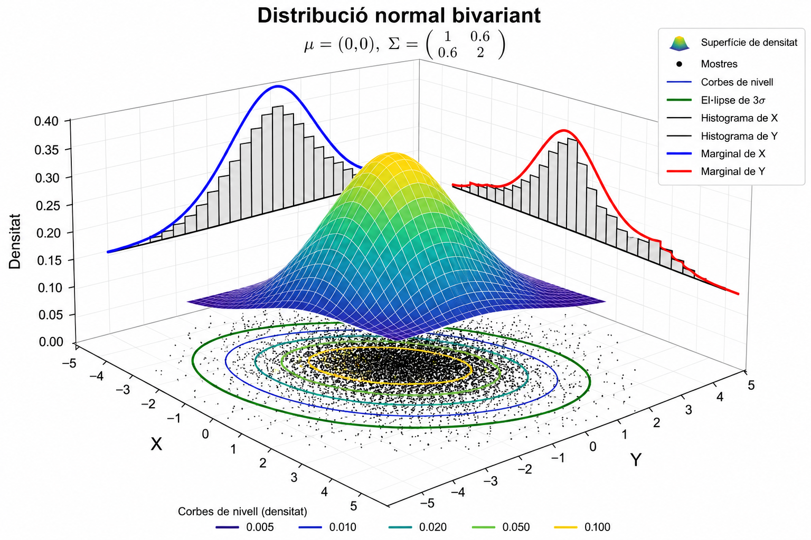

# Algunes distribucions multivariants

En els dos temes anteriors s'ha introduït el concepte de vectors aleatoris i totes les funcions associades a les seves distribucions. En aquest tema introduirem algunes de les distribucions de probabilitat més utilitzades. Dedicarem un apartat sencer a la distribució normal multivariant, introduirem algunes de les distribucions discretes i continues més utilitzades i en la tercera part del tema  parlarem de la generació de distribucions multivariants. 

## Distribució normal multivariant: definició, propietats i aplicacions.

### Distribució normal bivariant 


:::{.definition}
**Vector aleatori normal bivariant**

El vector aleatori bidimensional $(X,Y)$ té una distribució normal bivariant de paràmetres

$\mu_x \in \mathbb{R}, \mu_y \in \mathbb{R},\sigma_x>0,\sigma_y>0$ i $\rho \quad \text{tal que}  \quad |\rho|<1$  si la funció de densitat conjunta és de la forma 

$$
f_{XY}(x,y)= \dfrac{1}{ 2 \pi \sigma_x \sigma_y \sqrt{(1-\rho^2)}} e^{-\dfrac{q(x,y)}{2}} , (x,y) \in  \mathbb{R}^2 (\#eq:fxybinorm)
$$
on

$$
q(x,y)=\dfrac{1}{1-\rho^2} \left\{ \left(\dfrac{x-\mu_x}{\sigma_x}\right)^2 -2 \rho \left ( \dfrac{x-\mu_x}{\sigma_x} \right) \left(\dfrac{y-\mu_y}{\sigma_y}\right)+ \left ( \dfrac{y-\mu_y}{\sigma_y} \right)^2   \right\} (\#eq:qxybinorm)
$$
:::


En la figura  \@ref(fig:graf-binormalrho) es mostra en la part esquerra la distribució de densitat normal bivariant conjunta i en la part dreta es mostren les corbes de nivell. Es pot veure la forma el·líptica que té la figura que mostra el nivell de correlació entre les dues variables, que és molt estreta ja que la correlació és $\rho=0.8$. 


(ref:mititulo) Densitat i corbes de nivell binormal amb $\mu_x=\mu_y=0, \sigma_x=\sigma_y=1$ i $\rho=0.8$


```{r graf-binormalrho, echo=FALSE, message=FALSE, warning=FALSE, fig.cap="(ref:mititulo)"}
source("Rcode/binormalrho.r")
```

L'expressió de la densitat normal bivariant es pot enunciar d'una manera més compacta a partir de la matriu de variàncies-covariàncies 
$$
\Sigma= \begin{bmatrix} \sigma_x^2 & \sigma_{xy} \\\sigma_{xy}  & \sigma_y^2 \end{bmatrix}  (\#eq:sigmamat)
$$

$$
f(x,y)=\dfrac {|\Sigma|^{-\frac{1}{2}}}{2\pi} e^{ -\frac{1}{2} (\mathbf{x} - \boldsymbol{\mu})' \Sigma^{-1} (\mathbf{x} - \boldsymbol{\mu})} , \quad  (x,y) \in   \mathbb{R}^2  (\#eq:fxybinormmat)
$$

On $\mathbf{x}^{\prime}=(x,y)$ és el vector de variables aleatòries i  $\boldsymbol{\mu}^{\prime}=(\mu_x,\mu_y)$ és el vector de mitjanes o valors esperats i  $|\Sigma|$ es el determinant de $\Sigma$ que pren el valor

$$
|\Sigma|= \sigma_x^2 \sigma_y^2 - \sigma_{xy}^2=\sigma_x^2 \sigma_y^2(1-\rho_{xy}^2)  (\#eq:detsigma)
$$
Així en aquest cas es diu que  $\mathbf{x}^{\prime}=(x,y)$ te una distribució  normal bivariant en vector d'esperances $\boldsymbol{\mu}$ i matriu de variàncies-covariàncies $\Sigma$.

Escriurem 

$$
\begin{pmatrix} X \\ Y \end{pmatrix} \sim N \left( \boldsymbol{\mu} = \begin{pmatrix} \mu_x \\ \mu_y \end{pmatrix}, \Sigma = \begin{pmatrix} \sigma_x^2 & \rho\sigma_x\sigma_y \\ \rho\sigma_x\sigma_y & \sigma_y^2 \end{pmatrix} \right)   (\#eq:distbinorm)
$$
Queda per al lector la comprovació de l'equivalència de les expressions de les funcions de densitat.


:::{.definition}
**Distribució normal bivariant estàndard amb marginal independents**

Sigui  $Z_1 \sim N(0,1)$ i  $Z_2 \sim N(0,1)$  amb $Z_1$ i $Z_2$ independents  i per tant $\rho=0$ 
Llavors  

$$
f_{Z_1, Z_2}(z_1,z_2)=f_{Z_1}(z_1)f_{Z_2}(z_2)=
\dfrac {1}{\sqrt{2\pi }}e^{\frac{-z_1^2}{2}} \dfrac {1}{\sqrt{2\pi }}e^{\frac{-z_2^2}{2}}= \dfrac {1}{2\pi }e^{(-\frac{1}{2})(z_1^2+z_2^2)}=-\dfrac {1}{2\pi }e^{(-\frac{1}{2})(\mathbf{z^{\prime}}\mathbf{z})}  (\#eq:fxybinormstand)
$$

amb $\mathbf{z}=(z_1,z_2)^T \in \mathbb{R}^2$

:::

En la gràfica es mostra la densitat de la binormal estàndard amb mostres independents. S'observa que la corba de nivell està formada per isòcrones de densitat en forma de cercles. 

(ref:mititulo1) Densitat i corbes de nivell binormal amb $\mu_x=\mu_y=0, \sigma_x=\sigma_y=1$ i $\rho=0$


```{r graf-binormalrho0, echo=FALSE, message=FALSE, warning=FALSE, fig.cap="(ref:mititulo1)"}
source("Rcode/binormalrho0.r")
```


:::{.definition}
**Distribució normal bivariant estàndard amb marginals correlades **

Sigui  $Z_1 \sim N(0,1)$ i  $Z_2 \sim N(0,1)$  amb $Z_1$ i $Z_2$  i la correlació $\rho \in (-1,1)$ 
Llavors  
$$
f_{Z_1, Z_2}(z_1,z_2)= \dfrac {1}{2\pi\sqrt{1-\rho^2 }}e^{(-\frac{1}{2(1-\rho^2)})(z_1^2-2\rho z_1z_2 +z_2^2)}   (\#eq:fxybinormstandcorr
$$

es defineix com la funció de densitat conjunta  de la distribució normal bivariant estàndard amb marginals correlades

:::


---

:::{.example}

Per qüestions de conveniència formal hem introduït la distribució de les variables normals bivariants com a combinació de variables aleatòries normals independents. Cal remarcar que en nombroses ocasions aquesta distribució es la manera habitual com es presenten les dades. De fet Karl Pearson a partir de les dades treballades de Francis Galton a finals del segle 19, planteja el coeficient de correlació entre les alçades dels pares i els fills, on hi ha un correlació diferent de 0 entre elles. Els pares alts tendeixen a tenir els fills alts i a l'inrevés en els baixets. Aquesta seria una distribució normal bivariant.

:::

---

::: {.proposition}
**Transformació d'una normal bivariant estándar en una normal bivariant general**

Sigui  $(Z_1,Z_2)$ un vector aleatori amb distribució normal bivariant estàndard:

$$
\begin{pmatrix}
Z_1\\
Z_2
\end{pmatrix}
\sim
N
\left(
\begin{pmatrix}
0\\
0
\end{pmatrix},
\begin{pmatrix}
1 & \rho\\
\rho & 1
\end{pmatrix}
\right)
$$

i siguin  $\mu_x,\mu_y\in\mathbb{R}$ y $\sigma_x,\sigma_y>0$. Definim:

$$
X=\mu_x+\sigma_x Z_1
$$

$$
Y=\mu_y+\sigma_y Z_2
$$

Llavors el vector:

$$
\begin{pmatrix}
X\\
Y
\end{pmatrix}
$$

segueix una distribució normal bivariante general:

$$
\begin{pmatrix}
X\\
Y
\end{pmatrix}
\sim
N
\left(
\begin{pmatrix}
\mu_x\\
\mu_y
\end{pmatrix},
\begin{pmatrix}
\sigma_x^2 & \rho\sigma_x\sigma_y\\
\rho\sigma_x\sigma_y & \sigma_y^2
\end{pmatrix}
\right)
$$

És a dir, qualsevol normal bivariant pot obtenir-se a partir d'una normal bivariant estàndard mitjançant una transformació lineal de escala i translació

:::

**Demostració**


La demostració es immediata utilitzant les propietats de l'esperança, variància i covariància.

Per l'esperança:

$$
E(X)=E(\mu_x+\sigma_x Z_1) =\mu_x+\sigma_xE(Z_1) =\mu_x
$$

donat que  $E(Z_1)=0$. Analogament:

$$
E(Y)=E(\mu_y+\sigma_y Z_2)=\mu_y
$$

Per a les variàncies:

$$
Var(X)=Var(\mu_x+\sigma_x Z_1)=\sigma_x^2Var(Z_1)=\sigma_x^2
$$
i:

$$
Var(Y)=Var(\mu_y+\sigma_y Z_2)=\sigma_y^2Var(Z_2)=\sigma_y^2
$$

Finalment, per a la covariància:

$$
Cov(X,Y)=Cov(\mu_x+\sigma_x Z_1,\mu_y+\sigma_y Z_2)
$$

Com que les constants no afecten a la covariància:

$$
Cov(X,Y)=\sigma_x\sigma_y Cov(Z_1,Z_2)
$$
i, donat que: $Cov(Z_1,Z_2)=\rho$ s'obté:

$$
Cov(X,Y)=\rho\sigma_x\sigma_y
$$

Per tant, la matriu de variàncies-covariàncies del vector $(X,Y)$ és:

$$
\Sigma=
\begin{pmatrix}
\sigma_x^2 & \rho\sigma_x\sigma_y\\
\rho\sigma_x\sigma_y & \sigma_y^2
\end{pmatrix}
$$

amb el que queda demostrat que:

$$
\begin{pmatrix}
X\\
Y
\end{pmatrix}
\sim
N
\left(
\begin{pmatrix}
\mu_x\\
\mu_y
\end{pmatrix},
\Sigma
\right)
$$


### Distribucions marginals i condicional de una normal bivariant. 

**Distribucions marginals**


Sigui $(X,Y)$ un vector aleatori que segueix una distribució normal bivariant amb paràmetres  $\mu_x,\mu_y\in\mathbb{R}$ y $\sigma_x,\sigma_y>0$ i $\rho \in [-1,1]$. que tal com hem vist podem representar com la combinació de distribucions normals estàndard $Z_1,Z_2$. Per això  X e Y segueixen una una distribució normal $X \sim N(\mu_x,\sigma_x)$ i $Y \sim N(\mu_y,\sigma_y)$

En la figura \@ref(fig:img-distmargi) es mostren les distribucions marginals de la distribució normal bivariant que es veu segueixen  una distribució normal. 

```{r img-distmargi, fig.cap="Marginals de la distribució continua bivariant", echo=FALSE,fig.align='center',out.width="80%"}

```

:::{.proposition}
**Independència i correlació en una distribució normal bivariant**

Siguin $X$ i $Y$ dues variables aleatòries amb distribució normal bivariant:

$$
\begin{pmatrix}
X\\
Y
\end{pmatrix}
\sim
N
\left(
\begin{pmatrix}
\mu_x\\
\mu_y
\end{pmatrix},
\begin{pmatrix}
\sigma_x^2 & \rho\sigma_x\sigma_y\\
\rho\sigma_x\sigma_y & \sigma_y^2
\end{pmatrix}
\right)
$$

Llavors $X$ i $Y$ son independents si i només si $\rho=0$. És a dir , en una distribució normal bivariant, la absència de correlació equival a la independència.
:::
**Demostració**


La funció de densitat d'una distribució normal bivariant és


$$
\small
f_{X,Y}(x,y)=
\frac{1}{2\pi\sigma_x\sigma_y\sqrt{1-\rho^2}}\exp\left(-\frac{1}{2(1-\rho^2)}\left[\frac{(x-\mu_x)^2}{\sigma_x^2}-2\rho\frac{(x-\mu_x)(y-\mu_y)}{\sigma_x\sigma_y}+\frac{(y-\mu_y)^2}{\sigma_y^2}\right]\right)   (\#eq:fxybinormlarge)
$$


A més, les distribucions marginals són

$$
X\sim N(\mu_x,\sigma_x^2),\qquad Y\sim N(\mu_y,\sigma_y^2),
$$
amb densitats

$$
f_X(x)=\frac{1}{\sqrt{2\pi}\sigma_x}\exp\left(-\frac{(x-\mu_x)^2}{2\sigma_x^2}\right)
$$
i

$$
f_Y(y)=\frac{1}{\sqrt{2\pi}\sigma_y}\exp\left(-\frac{(y-\mu_y)^2}{2\sigma_y^2}\right)
$$

Cal demostrar les dues implicacions.

$\Rightarrow$ Si (X) i (Y) són independents, aleshores $\rho=0$

Si (X) i (Y) són independents,$f_{X,Y}(x,y)=f_X(x)f_Y(y)$

D'altra banda,

$$
\operatorname{Cov}(X,Y)=E[(X-\mu_x)(Y-\mu_y)]=E(X-\mu_x)E(Y-\mu_y)=0
$$
ja que l'esperança del producte es factoritza per la independència.

Com que

$\operatorname{Cov}(X,Y)=\rho\sigma_x\sigma_y$ i $\sigma_x,\sigma_y>0$, s'obté $\rho=0$

$\Leftarrow$ Si $\rho=0$, aleshores $(X)$ i $(Y)$ són independents

Suposem ara que $\rho=0$. La densitat conjunta esdevé

$$
f_{X,Y}(x,y)=\frac{1}{2\pi\sigma_x\sigma_y}\exp\left[-\frac12\left(\frac{(x-\mu_x)^2}{\sigma_x^2}+\frac{(y-\mu_y)^2}{\sigma_y^2}\right)\right].
$$

Utilitzant que $e^{a+b}=e^ae^b$

$$
f_{X,Y}(x,y)=\left[\frac{1}{\sqrt{2\pi}\sigma_x}\exp\left(-\frac{(x-\mu_x)^2}{2\sigma_x^2}\right)\right]\left[\frac{1}{\sqrt{2\pi}\sigma_y}\exp\left(
-\frac{(y-\mu_y)^2}{2\sigma_y^2}\right)\right] =f_X(x)f_Y(y)
$$

La densitat conjunta factoritza com el producte de les densitats marginals. Per la caracterització de la independència mitjançant les densitats, es conclou que (X) i (Y) són independents.

Per tant,

$$
X\perp Y\quad\Longleftrightarrow\quad\rho=0
$$
Així, en una distribució normal bivariant, la incorrelació és equivalent a la independència.

:::{.theorem}
**Distribucions condicionals**

Sigui $(X,Y)$ un vector aleatori que sequeix una distribució normal bivariant amb paràmetres  $\mu_x,\mu_y\in\mathbb{R}$ y $\sigma_x,\sigma_y>0$ i $\rho \in [-1,1]$ amb la funció  de densitat definida en \@ref(eq:fxybinorm) corresponent a una distribució normal bivariant. La distribució condicional de $y$ donat que $X=x$  es una distribució normal amb la esperança i variància següent:

$$
E(Y|X=x]= \mu_Y+\rho \sigma_Y \left (  \dfrac {X-\mu_X}{\sigma_X}\right )   (\#eq:espcondbinorm)
$$

$$
Var(Y|X=x)=(1-\rho^2) \sigma_Y^2    (\#eq:varcondbinorm)
$$
:::

**Demostració**

Utilitzant  l'expressió  $X=\mu_X+\sigma_X Z_1$ i $Y=\mu_Y+\sigma_Y\left(\rho Z_1+\sqrt{1-\rho^2}\,Z_2\right)$ on  $Z_1,Z_2\sim N(0,1)$ podem trobar $E(Y\mid X)$ com 

$$
\begin{aligned}
E[Y \mid X = x]
&= E\left[\mu_Y + \sigma_Y\left(\rho Z_1 + \sqrt{1-\rho^2}\,Z_2\right)\,\middle|\, X=x\right] \\
&= E\left[\mu_Y + \sigma_Y\left(\rho \frac{x-\mu_X}{\sigma_X}+ \sqrt{1-\rho^2}\,Z_2\right)\,\middle|\, X=x\right] \\
&= \mu_Y+ \sigma_Y\left(\rho \frac{x-\mu_X}{\sigma_X}+ \sqrt{1-\rho^2}\,E[Z_2 \mid X=x]\right) \\
&= \mu_Y+\rho \sigma_Y \left(\frac{x-\mu_X}{\sigma_X}
\right)
\end{aligned}
$$

Per simetria,

$$
E[X \mid Y = y]=\mu_X+\sigma_X \rho\left(\frac{y-\mu_Y}{\sigma_Y}\right)
$$
 Tambè podem trobar $Var(Y \mid X)$
 
 $$
\begin{aligned}
\operatorname{Var}(Y\mid X=x)&= \operatorname{Var}\left[\mu_Y+\sigma_Y\left(\rho Z_1+\sqrt{1-\rho^2}\,Z_2\right)\,\middle|\, X=x\right] \\
&= \operatorname{Var}\left[\mu_Y+\sigma_Y\left(\rho\frac{x-\mu_X}{\sigma_X}+\sqrt{1-\rho^2}\,Z_2\right)\,\middle|\, X=x\right] \\
&= \operatorname{Var}\left[\sigma_Y\sqrt{1-\rho^2}\,Z_2\,\middle|\, X=x\right] \\&= \sigma_Y^2(1-\rho^2)
\end{aligned}
$$

Per simetria 

$$
\operatorname{Var}(X\mid Y=y)=\sigma_X^2(1-\rho^2)
$$
 
 
**Observacions**

1- Observem que la variància condicional o funció de regressió es lineal

$$
 E[Y|X=x]= \mu_Y+\rho  \frac {\sigma_Y} {\sigma_X} (X-\mu_X)  =\beta_0 +\beta_1 x
$$

on $\beta_1= \dfrac {\sigma_{XY}}{\sigma_X^2}$ i $\beta_0=\mu_Y-\mu_X \beta_1$

2- La variància condicionada no depèn del valor pel que condicionem 

$$
Var(Y|X=x)=(1-\rho^2) \sigma_Y^2    
$$
3- Observem que la variable aleatòria esperança condicional $E[Y\mid X]$ segueix una distribució normal

$$
 E[Y|X] \sim N(\mu_X,\rho^2 \sigma_Y^2)
$$
4- Per la llei de la variància iterada

$$
\text{Var}(Y) = \underbrace{\text{E}(\text{Var}(Y|X))}_{\textit{VNE}} + \underbrace{\text{Var}(\text{E}(Y|X))}_{\textit{VE}} \quad on \quad \rho^2= \frac {VE}{VNE+VE}
$$

---

:::{.exammple}

El històric anàlisi de les dades de Francis Galton que posteriorment va formalitzar Karl Pearson sobre les estatures des pares i fills mesurades en polsades. Es sap que la distribució conjunta $(X,Y)$ de les dues alçades de pares i fills segueix una llei normal bivariant. Estem interessats en predir l'alçada de un fill Y en dues situacions:

1- No tenim més informació que la distribució conjunta i per tant la predicció es $\mu_Y$ amb una variància $\sigma_Y^2$
2- Coneixem l'alçada del pare X=X, llavors la predicció será $E[Y \mid X=x]=\mu_Y+\sigma_Y \rho \dfrac{x-\mu_X}{\sigma_X}$ i variància $\sigma_Y^2 (1-\rho^2)<\sigma_Y^2$. La variància no depen de x i per tant l'error es independent de l'alçada del pare.


Asumim els valors de la distribució normal bivariada  $\mu_X=68.3, \sigma_X=10.8, \mu_Y=68.1, \sigma_Y=2.5 \quad i \quad \rho=0.5$ la distribució és:
$$
\begin{pmatrix}
X\\
Y
\end{pmatrix}
\sim
N
\left(
\begin{pmatrix}
68.3\\
68.1
\end{pmatrix},
\begin{pmatrix}
1.8^2 & 0.5 \times 1.8 \times 2.5 \\
 0.5 \times 1.8 \times 2.5 & 2.5^2
\end{pmatrix}
\right)
$$

Si resolem les qüestions pendents

1- El pes mitjà predit és $68.1$ polsades amb una variància de $2.5^2= 6.25$
2- Suposant que l'alçada del pare es de $69$ polsades,  llavors la predicció de l'alçada del fill es $y=68.1 + 2.5 · 0.5 \dfrac {69-68.1}{1.8}=68.725$  amb variància $2.5^2 · (1-0.5^2)=4.6875$

:::

---


### Distribució normal multivariant

::: {.definition}
**Distribució normal multivariant**

Sigui un vector aleatori $X=(X_1,....,X_n)$  on  $\boldsymbol{\mu}^{\prime}=(\mu_1,...,\mu_n)$ és el vector de mitjanes o valors esperats i  $|\Sigma|$ es el determinant de  la matriu de variàncies covariàncies $\Sigma$ que pren el valor 

$$
\Sigma=
\begin{bmatrix} 
\sigma_1^2 & \sigma_{12} & ... & \sigma_{1(n-1)}  & \sigma_{1n} \\
\sigma_{12}  & \sigma_2^2 & ... & \sigma_{2(n-1)}  & \sigma_{2n} \\  
.  & . & . & .  & . \\  
\sigma_{1(n-1)}  & \sigma_{2(n-1)} & ... & \sigma_{n-1}^2  & \sigma_{(n-1)n} \\  
\sigma_{1n}  & \sigma_{2n} & ... &  \sigma_{(n-1)n}  & \sigma_n^2\\  
\end{bmatrix} 
$$

Podem generalitzar la distribució de densitat normal bivariada al cas multivariant com


$$
f(x_1,...,x_n=\dfrac {|\Sigma|^{-\frac{1}{2}}}{(2\pi)^\frac{1}{2}} e^{ -\frac{1}{2} (\mathbf{x} - \boldsymbol{\mu})' \Sigma^{-1} (\mathbf{x} - \boldsymbol{\mu})} , \quad  (x_1,...,,xn) \in   \mathbb{R}^n  (\#eq:fxybinormmulti)
$$

:::

Si les components del vector son independents, les covariàncies son totes nul·les i $\Sigma$ es una matriu diagonal amb elements les variàncies de cada component . Així $|\Sigma|^{-1}|=\dfrac{1}{\sigma_1^2\sigma_2^2...\sigma_n^2}$   A més la forma quadràtica de la equació \@ref(eq:fxybinormmulti) es simplifica i la densitat és:


$$
f(x_1, x_2, \dots, x_n) = \frac{1}{\prod_{i=1}^n (2\pi\sigma_i^2)^{\frac{1}{2}}} e^{-\frac{1}{2} \sum_{i=1}^n \left(\frac{x_i - \mu_i}{\sigma_i}\right)^2} = \prod_{i=1}^n \left[ \frac{1}{\sqrt{2\pi\sigma_i^2}} e^{-\frac{1}{2} \left(\frac{x_i - \mu_i}{\sigma_i}\right)^2} \right]
$$

que no es més que el producte de les densitats de les normals de cadascuna de les components. Per tant en el cas multivariant també la incorrelació implica independència.

La forma quadràtica de l'exponent en una distribució normal multivariant  (coneguda com la distància de Mahalanobis) es redueix a la suma clàssica de residus al quadrat ponderats per la variància:

$$
(\mathbf{x} - \boldsymbol{\mu})^T \Sigma^{-1} (\mathbf{x} - \boldsymbol{\mu}) = \sum_{i=1}^n \left(\frac{x_i - \mu_i}{\sigma_i}\right)^2
$$

 
##  Distribucions especials:  Multinomial, t-Student multivariant,Khi-quadrat, Wishart  i Dirichlet.


### Distribució Multinomial

En nombroses ocasions observem dades discretes que tenen tres o més valors possibles. La familia de distribucions multinomial es una extensió de la família de distribucions binomial, conduint a una distribució multivariant.

---

:::{.example #multinomial}

Es coneix que hi ha quatre tipus de sang humana, O, A, B i AB. Es selecciona una mostra de persones donants de sang al atzar i podem estar interessats en conèixer la probabilitat de observar un número determinat de cada tipus de sang.

:::

---

En general, suposem que la població conté k ítems diferents $(k \geq 2)$  i la proporció en la població de cata tipo $i$ es $p_i, i=1,...,k$. Assumim que $p_i>0$ i $\sum_{i=1}^k p_i=1$. Així , $\mathbf{p}=(p_1,...,p_k)$ és el vector de probabilitats

Sigui $X_i$ la variable aleatòria que quantifica el número de ítems seleccionats en n extraccions del tipo $i$.  Si los n ítems s'han  seleccionat amb repetició, la selecció serà independent una d'altra.  Si tenim $x_i$ observacions de tipus $i$  en un determinant ordre, al ser independents les extraccions,  la probabilitat de la seqüència és $p_1^{x_1}p_2^{x_2}...p_k^{x_k}$.   

El número de seqüències  diferents amb $x_1,x_2,...,x_k$ de cada tipus és 
$$
\left(\begin{array}{c} n\\ x_1,x_2,...,x_k\end{array}\right)=\dfrac{n!}{x_1! x_2!...x_k!} 
$$

:::{.definition}
**Distribució multinomial** 

Sigui $\mathbf{X}=(X_1,...,X_k)$ el vector aleatòri discret on $\mathbf{x}=(x_1,...x_k)$ es el vector de recomptes observats de cada tipus $i,i=1,...k$ on $\mathbf{p}=(p_1,...,p_k)$ es el vector de probabilitat de cadascuna dels items.  Direm que $\mathbf{X}$ segueix una distribució multinomial amb paràmetres n i $\mathbf{p}$ si la  funció de distribució conjunta és:

$$
f(\mathbf{x}|n, \mathbf{p}) = \Pr(\mathbf{X} = \mathbf{x}) = \Pr(X_1 = x_1, \dots, X_k = x_k)
$$

$$
= \begin{cases} \binom{n}{x_1, \dots, x_k} p_1^{x_1} \dots p_k^{x_k} & \text{if } x_1 + \dots + x_k = n, \\ 0 & \text{en la resta} \end{cases} (\#eq:fxymultinomial)
$$
:::

---

:::{.example}

Si recordem l'exemple  \@ref(exm:multinomial)  i es sap que $P(O)=0.479. P(A)=0.360, P(B)=0.123 i P(AB)=0.038$  i es seleccionen dues persones de la població. quina es la probabilitat de que les dues siguin del mateix tipus. A partir de la definició de probabilitat  


$$
P(X_O=2)+P(X_A=2)+P(X_B=2)+P(X_{AB}=2)=  \binom{2}{2,0,0,0} (0.479^2+0.360^2+0.123^2+0.038^2)=0.376 
$$
:::


:::{.theorem}

Suposem el vector aleatori $\mathbf{X}=(X_1,X_2)$  que te una distribució multinomial amb $n=2$ i $\mathbf{p}=(p_1,p_2)$ llavors $X_1 \sim Bi(n,p_1)$ i $X_2 =n-X1$ 
:::

**Demostració**

De la definició de distribució binomial esta clar que $X_2 =n-X1$  i $p_2=1-p_1$. Així que el vector  $\mathbf{X}$n està actualment determinat per una variable singular $X_1$.   A partir de la distribució binomial  s'observa que $X_1$ que és la variable que representa el número de items tipus 1 seleccionats de n items on hi han 2 tipus de items.  Aixi $X_1$ es el número d'esdeveniments de n experiments Bernoulli amb probabilitat del èxit de cada experiment de $p_1$.  Així es segueix que $X_1 \sim Bi(n,p_1)$

:::{.corollary #binomial}
Si $\mathbf{X}=(X_1,...,X_k)$ es un vector aleatori amb paràmetres n i $\mathbf{p}=(p_1,...,p_k)$ . La distribució marginal de cada variable $X_i,i=1,...,k)$ segueix una distribució binomial amb paràmetre $n$ i $p_i$
:::

:::{.corollary #agregacio }
Si $\mathbf{X}=(X_1,...,X_k)$ es un vector aleatori amb parametres $n$ i $\mathbf{p}=(p_1,...,p_k)$ amb $k \geq 2$ .Si $\ell<k$ i $i_1,...,i_{\ell}$ un subjconjunt de elements de $(1,...,k)$ La distribució de $Y=Y_1+...+Y_k$  segueix una distribución binomial amb paramètre $n$ i $p_{i_1}+  ....+p_{i_\ell}$
:::

:::{.theorem}
**Esperances, Variàncies i covariàncies**


Suposem el vector aleatori $\mathbf{X}=(X_1,...,X_k)$  que te una distribució multinomial amb parametres $n$ i $\mathbf{p}=(p_1,...,p_k)$ amb $k \geq 2$, llavors els valors esperats, variàncies i covariàncies son

$$
\begin{aligned}
& E[X_i]= np_i \\
& Var(X_i)=np_i (1-p_i) \\
& Cov(X_i,X_j)=-np_ip_j 
\end{aligned}
$$
:::

Segons hem vist en el corol·lari \@ref(cor:binomial) la distribució marginal de cada component es binomial i el valor de l'esperança i la variància son els de l'enunciat del teorema.

Per el corol·lari \@ref(cor:agregació) sabem que $X_i+X_j$ segueix una distribució binomial amb paràmetres $n$ i $p_i+p_j$. D'ací

$$
Var(X_i+X_j)=n(p_i+p_j)(1-p_i-p_j)
$$
Per altra banda  de la equació  \@ref(eq:provcov4) sabem que 
$$
\begin{aligned} 
Var(X_i+X_j)&=Var(X_i)+Var(X_j)+2Cov(X_i,X_j) \\
&=np_i(1-p_i)+ np_j(1-p_j)+2Cov(X_i,X_j)
\end{aligned}
$$
igualant les equacions anterior i aïllant $Cov(X_i, X_j)$  obtenim el resultat desitjat

$$
\begin{aligned}
Cov(X_i,X_j) &= \dfrac{1}{2}  n(p_i+p_j)(1-p_i-p_j)-np_i(1-p_i)- np_j(1-p_j) \\
& =\dfrac{n}{2} \left[ (p_i+p_j) - (p_i+p_j)^2-p_i+p_i^2-p_j+p_j^2 \right] \\
& =\dfrac{n}{2} \left[ (p_i+p_j - p_i^2-p_j^2- 2p_ip_j -p_i+p_i^2-p_j+p_j^2 \right] \\
&= \dfrac{n}{2}  (-2p_ip_j)  =-n p_i p_j 
\end{aligned}
$$
Cal  resenyar que la covariància de la distribució multinomial és negativa, el que és  natural donat que les $n$ observacions s'han de distribuir en $k$ tipus de items. Si augmenta el número d'observacions d'un tipus ha de disminuir el de l'altre donat que la grandària es fixa. 


### Distribució t-student multivariant

La distribució t-Student multivariant es una generalització de la distribució t-de Student unidimensional. Al igual que aquella serveix pel càlcul de intervals de confiança per a vectors però també  per l'ús com distribucions posteriors en estadístiques  bayesianes i l'anàlisi conjunt de variables biomèdiques i de finances.  


:::{.definition}
**Distribució t-student multivariant**

Sigui  $\mathbf{X}=(X_1,...,X_n)$  un vector aleatori de dimensió $n$, direm que $\mathbf{X}$ segueix una distribució t-multivariant amb mitjana el vector  $\boldsymbol{\mu}=(\mu_1,...,\mu_n)$ , amb la  matriu de variàncies-covariàncies $\Sigma$ i $\nu$ graus de llibertat 

$$
  \mathbf{X} \sim t(\mu,\Sigma,\nu)
$$
si i només si la funció de densitat de probabilitat és:

$$
t(x;\mu,\Sigma,\nu)=\sqrt{\dfrac {1}{(\nu\pi)^n |\Sigma|}} \dfrac {\Gamma((\nu+n)/2)}{\Gamma(\nu/2)} \left[ 1+\dfrac {1}{\nu} (x-\mu)^T \Sigma^{-1} (x-\mu)  \right]^{-(\nu+n)/2}   (\#eq:fxymultit)
$$
on $\Gamma ()$ es la funció Gamma $\Gamma(z)= \int_0^{\infty} x^{z-1} e^{-x}dx$
:::

:::{.proposition #marginalt}
Si el vector aleatori   $\mathbf{X} \sim t(\boldsymbol{\mu},\boldsymbol{\Sigma},\nu)$ és distribueix com una distribució t-multivariant, la distribució marginal de qualsevol subvector m-dimensional $\mathbf{X_s}$ subconjunt del vector $\mathbf{X}$ segueix una distribució t-multivariant amb vector de mitjanes $\boldsymbol{\mu_s}$  i una matriu de variàncies  $\boldsymbol{\Sigma}$  eliminant els valors de les variables no incloses en el subvector. 
:::
**Demostració**

Definim els subconjunt de dimensió $m \times n$ tal que $s_{ij}=1$ si el j-èsim element de $\mathbf{X_s}$ correspon al i-èsim element de  $\mathbf{X}$ i $0$ en altre cas. Així $\mathbf{X_s}=S\mathbf{X}$

Podem aplicar el teorema de la transformació lineal a l'expressió anterior així


$$
\mathbf{X_s} \sim t(S \boldsymbol{\mu},S \boldsymbol{\Sigma} S^T,\nu) 
$$

Si operem es pot veure que $S \boldsymbol{\mu}=\boldsymbol{\mu}_s$ i $S \boldsymbol{\Sigma} S^T=\boldsymbol{\Sigma_s}$

:::{.corollary}
Si m=1 en la proposició @marginalt  implica que la distribució marginal de una t-multivariant es una distribució t amb mitjana $\mu_i$ i variància $\sigma_i^2$

:::


:::{.definition}
Sigui $\mathbf{X}=(X_1,...,X_n)$ un vector aleatori de dimensió $n$, direm que $\mathbf{X}$ segueix una distribució t-multivariant standard amb $\nu$ graus de llibertat, si la  funció de densitat es 


$$
t(x;n)=\sqrt{\dfrac {1}{(\nu\pi)^n }} \dfrac {\Gamma((\nu+n)/2)}{\Gamma(\nu/2)} \left[ 1+\dfrac {1}{\nu} x^T  x  \right]^{-(\nu+n)/2}   (\#eq:fxymultit2)
$$
:::
 


La funció de distribució de la distribució t-multivariant estàndard es un distribució t-univariada estàndard amb $\nu$ graus de llibertat.  Es pot deduir directament que el valor esperat es el vector nul $E[\mathbf{X}]=\mathbf{0}$ i que la  matriu de variància es $Var(\mathbf{X}) = \frac {\nu}{\nu-2} I$ on I es la matriu identitat $k \times k$


### Distribució khi-quadrat

La distribució khi-quadrat ($\chi^2$) és una distribució de probabilitat molt utilitzada en la resolució de tests de bondat d’ajustament i en altres proves estadístiques. S’utilitza principalment per comparar les freqüències observades amb les freqüències esperades, analitzant les diferències entre ambdues de manera quadràtica. En aquesta secció introduirem la distribució a partir de vectors aleatoris.


:::{.definition}
**Distribució Khi-quadrat**
Sigui $\mathbf{X}=(X_1,...,X_k)$ un vector aleatori de variables aleatòries normals amb mitjana $\mu_i=0$ i variància $\sigma_i^2=1$  es a dir $X_i \sim N(0,1)$ i $\mathbf{X} \sim N_n(0,\mathbf{I})$ llavors

$$
Y=\mathbf{X}^T \mathbf{X}= \sum_{i=1}^k  X_i^2 \sim \chi^2(k) \qquad  0>Q<\infty  (\#eq:chi2)
$$


:::


:::{.theorem}
La funció de densitat de la variable definida en \@ref(eq:chi2)  ve definida per 


$$
f_Y(y) = \frac{1}{2^{k/2} \Gamma(k/2)} y^{k/2 - 1} \exp[-y/2]    (\#eq:denschi2)
$$
:::

**Demostració**

 Per fer la demostració en primer lloc  demostrarem que la distribució $\chi_1^2$ és un cas particular de una distribució Gamma con paràmetres $\alpha=\beta=1/"$
 
 
*1. Cas Base ($k=1$): Densitat de $Y = X_1^2$*

Sigui $X_1 \sim N(0,1)$  on la seva funció de densitat serà:

$$f_{X_1}(x) = \frac{1}{\sqrt{2\pi}} e^{-x^2/2}$$

Volem trobar la densitat de la transformació $Y = X_1^2$. LLavors  la funció de probabilitat acumulada serà  $y > 0$:

$$F_Y(y) = P(Y \le y) = P(X_1^2 \le y) = P(-\sqrt{y} \le X_1 \le \sqrt{y})$$

Per la simetria respecte al zero de la distribució normal estàndard, podem reescriure-ho com:

$$F_Y(y) = 2 \cdot P(0 \le X_1 \le \sqrt{y}) = 2 \int_{0}^{\sqrt{y}} \frac{1}{\sqrt{2\pi}} e^{-x^2/2} dx$$

Derivem respecte a $y$  per obtenir la seva densitat $f_Y(y)$:

$$f_Y(y) = \frac{d}{dy} F_Y(y) = 2 \cdot \left( \frac{1}{\sqrt{2\pi}} e^{-(\sqrt{y})^2/2} \right) \cdot \frac{d}{dy}(\sqrt{y})$$

$$f_Y(y) = \frac{2}{\sqrt{2\pi}} e^{-y/2} \cdot \frac{1}{2\sqrt{y}} = \frac{1}{\sqrt{2\pi}} y^{-1/2} e^{-y/2}$$

Sabent que la funció Gamma compleix que $\Gamma(1/2) = \sqrt{\pi}$ i que $\sqrt{2} = 2^{1/2}$, podem reescriure l'expressió anterior com:

$$f_Y(y) = \frac{1}{2^{1/2} \Gamma(1/2)} y^{1/2 - 1} e^{-y/2}$$

Aquesta expressió coincideix exactament amb la definició d'una distribució **Gamma** amb paràmetre de forma $\alpha = 1/2$ i paràmetre d'escala $\beta = 1/2$. Per tant:

$$Y = X_1^2 \sim \text{Gamma}\left(\alpha = \frac{1}{2}, \beta = 2\right)$$
2. Generalització per a $k$ variables (
La variable d'interès és la suma de $k$ normals estàndard al quadrat independents:

$$Y = \sum_{i=1}^{k} X_i^2$$

Atès que cada component $X_i^2 \sim \text{Gamma}\left(\frac{1}{2}, \frac{1}{2}\right)$, apliquem la propietat d'additivitat per a variables Gamma independents. Quan s'utilitza la parametrització per escala, la suma de variables amb la mateixa escala $\beta$ dona lloc a una nova variable Gamma on els paràmetres de forma $\alpha$ se sumen i els de escala $\beta$  es manté constant:

$$\alpha_{\text{total}} = \sum_{i=1}^{k} \alpha_i = \sum_{i=1}^{k} \frac{1}{2} = \frac{k}{2} \qquad \text{i} \qquad \beta = \frac{1}{2}$$

D'aquesta manera, obtenim que la suma total es distribueix com:

$$Y \sim \text{Gamma}\left(\alpha = \frac{k}{2}, \beta = \frac{1}{2}\right)$$

Substituïm finalment els paràmetres $\alpha = \frac{k}{2}$ i $\beta = \frac{1}{2}$ en la definició original $f(y|\alpha, \beta) = \frac{\beta^\alpha}{\Gamma(\alpha)} y^{\alpha-1} e^{-\beta y}$:

$$f_Y(y) = \frac{(1/2)^{k/2}}{\Gamma(k/2)} y^{k/2 - 1} e^{-\frac{1}{2}y}$$

Operant el terme constant del numerador $\left(\frac{1}{2}\right)^{k/2} = \frac{1}{2^{k/2}}$, arribem exactament a l'expressió del Teorema 

$$f_Y(y) = \frac{1}{2^{k/2} \Gamma(k/2)} y^{k/2 - 1} \exp[-y/2]$$

El valor esperat de la distribució  $Y= \sim \chi^2(k)$ és E[Y]=k i Var(Y)=2k


### Distribució de Whishart

  <!-- referencia en https://statproofbook.github.io/D/wish -->
La distribució de Whishart,  que deu el seu nom al  estadístic escocès John Whishart que la va formular en 1928,  es molt utilitzada en el anàlisis de matrius de covariància estimades i en estadística Bayesiana. La distribució de Whishart es la generalització multivariant de la distribució $\chi^2$ univariada. 

:::{.definition}
**Distribució de Whishart** 
Sigui  $\mathbf{X}$ una matriu $n \times p$  que segueix una distribució de matriu normal amb mitjana 0, independent a lo llarg de les files i covarianzia entre les columnes $\boldsymbol{\Sigma}$  es a dir 

$$
\mathbf{X} \sim \mathcal{MN}_{n \times p}(\mathbf{0}, \mathbf{I}_n, \boldsymbol{\Sigma})
$$
Definim la matriu  S com el producte de X i la seva transposada

$$
\mathbf{S} = \mathbf{X}^T \mathbf{X} = \sum_{i=1}^{n} \mathbf{x}_i^T \mathbf{x}_i
$$

Llavors la matriu S es diu que segueix la funció de distribució Wishart amb escala la matriu V i el graus de llibertat n

$$
\mathbf{S} \sim \mathcal{W}_p(\boldsymbol{\Sigma}, n)
$$

On  n>p-1 i V es una matriu simètrica definida positiva $p \times p$
:::

---

:::{.example}

Suposem que volem estudiar **3 característiques físiques** de **5 persones**:

- Alçada (cm)
- Pes (kg)
- Pressió arterial sistòlica (mmHg)

Les dades observades són:

| Persona | Alçada (cm) | Pes (kg) | Pressió (mmHg) |
|:--------:|------------:|----------:|---------------:|
| 1 | 170 | 68 | 120 |
| 2 | 165 | 62 | 118 |
| 3 | 180 | 80 | 130 |
| 4 | 175 | 75 | 125 |
| 5 | 168 | 65 | 119 |

En aquest cas:

- $n = 5$: nombre d'observacions (persones).
- $p = 3$: nombre de variables.

La matriu de dades és

$$
X=
\begin{pmatrix}
170 & 68 & 120\\
165 & 62 & 118\\
180 & 80 & 130\\
175 & 75 & 125\\
168 & 65 & 119
\end{pmatrix}.
$$

Per poder assumir que la matriu segueix una distribució normal matricial amb mitjana nul·la, primer es centren les dades restant la mitjana de cada columna.

Les mitjanes són:

- Alçada: $171.6$ cm,
- Pes: $70$ kg,
- Pressió: $122.4$ mmHg.

La matriu centrada és

$$
X_c=
\begin{pmatrix}
-1.6 & -2 & -2.4\\
-6.6 & -8 & -4.4\\
8.4 & 10 & 7.6\\
3.4 & 5 & 2.6\\
-3.6 & -5 & -3.4
\end{pmatrix}.
$$

En aquesta matriu:

- cada **fila** representa una persona;
- les **files** es consideren independents entre si;
- les **columnes** poden estar correlacionades. Per exemple, persones més altes acostumen a tenir també un pes més elevat. Aquesta dependència queda descrita per la matriu de covariàncies $\boldsymbol{\Sigma}$.

Finalment, es calcula

$$
S = X_c^{T}X_c,
$$

que és una matriu $3 \times 3$ de sumes de productes creuats. Si les files de $X_c$ segueixen una distribució normal multivariant,

$$
X_i \sim N_3(0,\boldsymbol{\Sigma})
$$

aleshores

$$
S \sim W_3(5,\boldsymbol{\Sigma})
$$

és a dir, $S$ segueix una distribució de **Wishart** amb $5$ graus de llibertat i matriu de covariàncies $\boldsymbol{\Sigma}$.

:::

---


:::{.Proposition}
Si $\mathbf{S} \sim \mathcal{W}_p(\boldsymbol{\Sigma}, n)$ llavors

$$
E[M]=n\boldsymbol{\Sigma}
$$
i si $\sigma_{ij}$ es l'element $ij-èsim$ de $\boldsymbol{\Sigma}$ i el  $ij-èsim$ element de $\mathbf{S}$ es $s_{ij}$ llavors
$$
Var(m_{ij})=n(\sigma_{ij}^2+\sigma_{ii}\sigma_{ij})
$$
La demostració surt directament de la definició de la varaible 
:::


:::{.Proposition}

 Si $\mathbf{S} \sim \mathcal{W}_p(\boldsymbol{\Sigma}, n)$  i $\mathbf{A}$ és una matriu es fixa $q \times p$ llavors
 
 $$
 \mathbf{ASA^T} \sim  \mathcal{W}_q(\mathbf{A} \boldsymbol{\Sigma} \mathbf{A}^T, n)
 $$
::: 
**Demostració**

De la definició, sea $s=\sum_{i=1}^n X_i X_i^T$ on $X_i \sim N_p(\mathbf{0},\boldsymbol{\Sigma})$ llavors 
## Propietats de la Distribució Wishart


$$\mathbf{A} \mathbf{S} \mathbf{A}^\top = \mathbf{A} \left( \sum_{i=1}^n \mathbf{x}_i \mathbf{x}_i^\top \right) \mathbf{A}^\top = \sum_{i=1}^n (\mathbf{A} \mathbf{x}_i) (\mathbf{A} \mathbf{x}_i)^\top = \sum_{i=1}^n \mathbf{y}_i \mathbf{y}_i^\top$$


on definim els nous vectors com:
$$\mathbf{y}_i = \mathbf{A} \mathbf{x}_i \sim N_q(\mathbf{0}, \mathbf{A} \mathbf{\Sigma} \mathbf{A}^\top)$$


Aplicant la definició de la distribució Wishart als vectors independents $\mathbf{y}_1, \dots, \mathbf{y}_n$, obtenim directament que:
$$\sum_{i=1}^n \mathbf{y}_i \mathbf{y}_i^\top \sim W_q(\mathbf{A} \mathbf{\Sigma} \mathbf{A}^\top, n)$$
:::{.proposition}

Si $\mathbf{M}_1 \sim W_p(\mathbf{\Sigma}, n_1)$ i $\mathbf{M}_2 \sim W_p(\mathbf{\Sigma}, n_2)$ són dues matrius aleatòries independents, aleshores:

:::
**Demostració**

$$\mathbf{M}_1 + \mathbf{M}_2 \sim W_p(\mathbf{\Sigma}, n_1 + n_2)$$


A partir de la definició de la distribució Wishart, podem representar la primera matriu $\mathbf{M}_1$ com:
$$\mathbf{M}_1 = \sum_{i=1}^{n_1} \mathbf{x}_i \mathbf{x}_i^\top$$

I la segona matriu $\mathbf{M}_2$ (que és independent) com:
$$\mathbf{M}_2 = \sum_{i=n_1+1}^{n_1+n_2} \mathbf{x}_i \mathbf{x}_i^\top$$

on tots els vectors $\mathbf{x}_i \sim N_p(\mathbf{0}, \mathbf{\Sigma})$ són independents i idènticament distribuïts per a $i = 1, \dots, n_1 + n_2$.

Si sumem ambdues matrius, obtenim:
$$\mathbf{M}_1 + \mathbf{M}_2 = \sum_{i=1}^{n_1} \mathbf{x}_i \mathbf{x}_i^\top + \sum_{i=n_1+1}^{n_1+n_2} \mathbf{x}_i \mathbf{x}_i^\top = \sum_{i=1}^{n_1+n_2} \mathbf{x}_i \mathbf{x}_i^\top$$

Atès que aquesta expressió és la suma de productes externs de $n_1 + n_2$ vectors normals multivariants independents de mitjana zero i matriu de covariàncies $\mathbf{\Sigma}$, per la definició mateixa de la distribució Wishart es compleix que:
$$\mathbf{M}_1 + \mathbf{M}_2 \sim W_p(\mathbf{\Sigma}, n_1 + n_2) \quad \blacksquare$$

### Distribució Dirichlet

La distribució de Dirichlet $Dir(\boldsymbol{\alpha})$ és una familia de probabilitat multivariant parametritzada per un vector $\boldsymbol{\alpha}$ de reals positius.  Aquesta distribució es una generalització de la distribució Beta univariant i el seu ús es molt habitual  como prior en estadística bayesiana, en lus de processament del llenguatge natural(NLP) ó en estudis de simular utilització de recursos.

:::{.definition}
**Distribució de Dirichlet**

Sigui  $\mathbf{X}=(X_1,...,X_k)$  un vector aleatori de dimensió $k$ tal que $x_i \in [0,1]  \quad  \forall i \in (1,...,k] \quad i \quad \sum_{i=1}^k x_i=1$. Aquest vector segueix una distribució de Dirichlet $\mathbf{X} \sim  Dir(\boldsymbol{\alpha})$ on $\boldsymbol{\alpha}=(\alpha_1,...,\alpha_k)$ si la funció de densitat ve donada per 

$$
f(x_1,...,x_k;\alpha_1,...,\alpha_k)= \dfrac {1}{B(\boldsymbol{\alpha})} \prod_{i=1}^k x_i^{\alpha_i-1}
$$
on 

$$
B(\boldsymbol{\alpha})= \dfrac {\prod_{i=1}^k \Gamma(\alpha_i)}{\Gamma(\sum_{i=1}^k\alpha_i)}
$$
i $\Gamma$ es la funció Gamma
:::

Els moments de la distribució de Dirichlet són els següents. Per simplificar les expressions utilitzarem  {\alpha_0\sum_{i=1}^k\alpha_i}

$$
E[X_i] = \dfrac {\alpha_i} {\sum_{i=1}^k\alpha_i}=\dfrac {\alpha_i} {\alpha_0}
$$

$$
Var[X_i] =\dfrac {\alpha_i(\sum_{i=1}^k\alpha_i -\alpha_i)}{(\sum_{i=1}^k\alpha_i)^2(\sum_{i=1}^k\alpha_i+1)}=\dfrac {\alpha_i(\alpha_0 -\alpha_i)}{\alpha_0^2(\alpha_0+1)}
$$
$$
Cov[X_i,X_j]=\dfrac {-\alpha_i \alpha_j}{(\sum_{i=1}^k\alpha_i)^2(\sum_{i=1}^k\alpha_i)+1)}=\dfrac {-\alpha_i \alpha_j}{\alpha_0^2(\alpha_0+1)}
$$


Finalment la distribució marginal de les components de la distribució de Dirichlet són distribucions Beta

$$
X_i \sim Beta(\alpha_i, \alpha_0-\alpha_i)
$$
El resultat s'obtè directament de la proposició de la propietat d'agregació de la distribució Dirichlet

:::{.proposition}
**Propietat de aggregació**
Sigui  $\mathbf{X}$  un vector aleatori de dimensió $k$ que segueix una distribució de Dirichlet $(X_1,...,X_k) \sim  Dir(\alpha_1,...,\alpha_k)$ . Si les variables $i$ i $j$ són eliminades i reemplaçades per la seva suma la variable resultant és una distribució Dirichlet també.

$$
(X_1,...,X_i+X_j,....,X_k) \sim  Dir(\alpha_1,...,\alpha_i+\alpha_j,\alpha_k)
$$
::: 

Resta provar aquest lema. Sense pèrdua de generalitat, només cal demostrar-ho per a $r=2$. Calculem directament la funció de densitat de probabilitat (FDP) de $Y = (X_1 + X_2, X_3, \dots, X_K)$:

$$f_{Y}(y_1, x_3, \dots, x_{K-1}) = \int_{0}^{y_1} f_{X}(y_1 - x_2, x_2, x_3, \dots, x_{K-1}) \, dx_2$$

Aplicant el canvi de variable $x_2 = y_1 u$ (on $dx_2 = y_1 du$), obtenim:

$$\begin{aligned}
f_{Y}(y_1, x_3, \dots, x_{K-1}) &= \frac{\Gamma(\sum_{i=1}^K \alpha_i)}{\prod_{i=1}^K \Gamma(\alpha_i)} \left( \prod_{i=3}^{K-1} x_i^{\alpha_i - 1} \right) x_K^{\alpha_K - 1} \int_{0}^{1} (y_1 - y_1 u)^{\alpha_1 - 1} (y_1 u)^{\alpha_2 - 1} y_1 \, du \\
&= \frac{\Gamma(\sum_{i=1}^K \alpha_i)}{\prod_{i=1}^K \Gamma(\alpha_i)} \left( \prod_{i=3}^{K-1} x_i^{\alpha_i - 1} \right) x_K^{\alpha_K - 1} y_1^{\alpha_1 + \alpha_2 - 1} \int_{0}^{1} u^{\alpha_2 - 1} (1 - u)^{\alpha_1 - 1} \, du \\
&= \frac{\Gamma(\sum_{i=1}^K \alpha_i)}{\Gamma(\alpha_1 + \alpha_2) \prod_{i=3}^K \Gamma(\alpha_i)} y_1^{\alpha_1 + \alpha_2 - 1} \left( \prod_{i=3}^{K-1} x_i^{\alpha_i - 1} \right) x_K^{\alpha_K - 1}
\end{aligned}$$

la qual cosa implica que $Y$ segueix la distribució $\text{Dir}(\alpha_1 + \alpha_2, \alpha_3, \dots, \alpha_K)$. $\blacksquare$

##  Generació de mostres de distribucions multivariants.

### Revisió de mètodes de generació de mostres de variables aleatòries univariants

En l'assignatura de  probabilitat I es van introduir els principals mètodes de generació de mostres de variables aleatòries univariants. En aquest apartat anem a generalitzar aquests mètodes al cas multivariant a més de introduir-ne d'algun nou. En general qualsevol algorisme de generació de dades aleòries segueix el mateix esquema.

1- Generem una o més números aleatòries provinents de distribucions uniformes i.i.d. U(0,1)

2- Transformem i relacionem els valors de la distribució uniforme depenen de la distribució a estudi

3- Retornem el valor X de la distribució desitjada


<ul>

<li>**Mètode de la inversió**</li> 

Aquest mètode es basa en generar un número aleatori $u$ entre 0 i 1 a partir de la distribució uniforme $U(0,1)$ i de la trobar $X$ tal que la funció de distribució acumulada $F_X(x)= U$, es a dir que $X= F_X^{-1}(u)$.

El principal problema d'aquest mètode es la disposició de una formulació directa de la inversa de la funció de distribució. 

Així, l'algorisme és:

1- Genera un valor $u$ de una distribució $U(0,1)$

2.- Obten el valor $x= F_X^{-1}(u)$


<li>**Mètode de la acceptació-rebuig**</li>


Aquest mètode s'utilitza quan no es pot ( o no es vol) invertir la funció de distribució $F_X$.  Sigui $f(x)$ la funció de densitat de la distribució de la que es vol generar una mostra. Suposem que tenim un altre tipus de variable aleatòria $Y$ amb una densitat $g()$ que es fàcil de simular, per exemple una distribució Normal o Uniforme.  A més es sap que existeix una constant $M$. Tal que 
$$
\dfrac {f(x)}{g(x)}\leq M \qquad \forall x , \text{ és a dir } f(x) \leq M g(x)
$$

L'algorisme segueix els següents passos

1- Genera el valor y de la v.a. Y

2- Genera un valor u de una U(0,1)

3- Si $u \leq \dfrac {f(y)}{Mg(y)}$  accepta x=y

4- En cas contrari torna al pas 1 i torna a seleccionar un valor aleatori.


<li>**Mètodes  de transformacions específics**</li>

  <ul> 
  <li>*Mètode de Box-Muller* </li>

El algorisme utilitza 2 i.I.d. $U(0,1)$ per produir 2 i.I.d. $N(0,1)$:

1-  Genera $U_1$ i $U_2$ de dos distribucions i.i.d. $U(0,1)$

2-  Calcula $X=\sqrt{-2log(U(0,1)}cos(2\pi U_2)$ i   $Y=\sqrt{-2log(U(0,1)}sin(2\pi U_2)$  on Z1 i Z2 son dues N(0,1)

  <li>*Transformació Gamma com a suma d'exponencials (convolució) *</li>
  
  
  Es sap que si $E_i \sim Exp(\lambda)$, llavors $\sum_{i=1}^k E_i \sim Gamma (k,\lambda)$
  
  
El algorisme serà el següent

1- Obtén $k$ valors de una $U(0,1)$

2- Utilitzant el mètode de la inversió obten $k$ valors $e_i$ de una $Exp(\lambda)$

3- Suma els valors $e_i$ y obtèn el valor $x=\sum_{i=1}^k e_i$ de la distribució Gamma

  </ui>
<li>**Métodos de MonteCarlo** </li>

Realment no son uns metodes de càlcul de mostra sinó que son tècniques de simulació per aproximar quantitats com probabilitats, valors esperats, integrals , variàncies a partir de mostres simulades.

La idea bàsica es que si {X_1,...,X_N} son variables i.i.d llavors 
$$
E[h(x)] \approx \dfrac {1}{N} \sum_{i=1}^{N}h(X_i)
$$
</ul>


### Generació de variables aleatòries multivariants utilitzant distribucions condicionals 

Suposem que donat un Vector aleatori $(X_1,...,X_k)$ coneguem la funció de distribució conjunta i les distribucions marginals $F_i(x_i), i=1,...,k$ i les distribucions condicionals $F_{j}(x_j|X_1,...,X{j-1})$

El algorisme es el següent utilitzant en cada pas l'algorisme d'inversió univariant

1- Genera $x_1$ (marginalment) de $F_1(x1)$

2- Genera $x_2$ (condicionalment de $F_2(x2 |x1)$

3- Genera $x_3$ (condicionalment de $F_3(x3 |x1,x2)$
...

k- Genera $x_k$ (condicionalment de $F_k(x_k |x1,x2,....,x_{k-1})$

k+1- Retorna el vector $\mathbf{x}=(x_1,....,x_k)^T$

---

:::{.example #simnormbiv}
**Normal Bivariant**

Volem generar observacions d'un vector aleatori bidimensional $(X_1, X_2)^\top \sim N_2(\boldsymbol{\mu}, \mathbf{\Sigma})$ amb:

$$
\boldsymbol{\mu} = \begin{pmatrix} 0 \\ 0 \end{pmatrix}, \quad \mathbf{\Sigma} = \begin{pmatrix} 1 & \rho \\ \rho & 1 \end{pmatrix} \quad (|\rho| < 1)
$$
Sabem que 

* Marginal de $X_1$:  $X_1 \sim N(0, 1) \implies F_1(x_1) = \Phi(x_1)$
* Condicional de $X_2 \mid X_1 = x_1$: $X_2 \mid X_1 = x_1 \sim N\left(\rho x_1, \, 1 - \rho^2\right)$


Si apliquem la generalització del algorisme d'inversió condicional 

Per generar un parell $(x_1, x_2)$:

1. **Pas 1 (Generar $x_1$):**
   * Generem $U_1 \sim U(0,1)$.
   * Apliquem la inversió: $x_1 = F_1^{-1}(U_1) = \Phi^{-1}(U_1)$.

2. **Pas 2 (Generar $x_2 \mid X_1 = x_1$):**
   * Generem $U_2 \sim U(0,1)$ independent de $U_1$.
   * Apliquem la inversió ajustant per $x_1$:
     $$x_2 = F_2^{-1}(U_2 \mid x_1) = \rho x_1 + \sqrt{1 - \rho^2} \cdot \Phi^{-1}(U_2)$$


 **Implementació en R**

```{r simulacio-bivariant}
# Funció per simular N observacions del vector (X1, X2)
simular_bivariant_condicional <- function(N, rho) {
  # 1. Generem valors uniformes independents
  U1 <- runif(N)
  U2 <- runif(N)
  
  # PAS 1: Inversió univariant per a X1 (marginal) 
  x1 <- qnorm(U1, mean = 0, sd = 1)
  
  # PAS 2: Inversió univariant per a X2 | X1 = x1 (condicional)
  mu_cond <- rho * x1
  sd_cond <- sqrt(1 - rho^2)
  x2 <- qnorm(U2, mean = mu_cond, sd = sd_cond)
  
  return(cbind(X1 = x1, X2 = x2))
}

# Exemple d'execució
set.seed(12345)
mostres <- simular_bivariant_condicional(N = 1000, rho = 0.8)

# Comprovació de la matriu de covariàncies mostral
cov(mostres)

library(ggplot2)
ggplot(mostres, aes(x = X1, y = X2)) +
  # Punts simulats amb certa transparència
  geom_point(alpha = 0.2, color = "steelblue") +
  # Línies de contorn de la densitat bivariant
  geom_density_2d(color = "#FF6B6B", linewidth = 0.8) +
  theme_minimal() +
  labs(
    title = "Simulació i Contorns d'una Normal Bivariant (rho = 0.8)",
    x = expression(X[1]),
    y = expression(X[2])
  )

```


:::


---


### Generació de vectors aleatoris de una distribució normal multivariant


Suposem que desitgem generar $\mathbf{X}=(X_1,...,X_k)$ on $X \sim MN_k(\mathbf{0},\mathbf{\Sigma})$ . Si els valors esperats no son cero no més caldria centrar cadascuna de les variables Xi per que siguin 0 els valors esperats.
Sigui $\mathbf{Z}=(Z_1,...,Z_k)^T$ on $Z_i$ són i.i.d $N(0,1)$ per $i=1,...,k$. Si $mathbbf{C}$ es una matriu $(k \times n)$ es segueix que

$$
\mathbf{C}^T \mathbf{Z} \sim MVN(\mathbf{0}, \mathbf{C}^T\mathbf{C})
$$
L'unic problema es trobar una funció $\mathbf{C}$ tal  que  $\mathbf{C}^T\mathbf{C}=\mathbf{\Sigma}$. Podem utilitzar la descomposició de Cholesky de $\mathbf{\Sigma}$ per trobar la matriu $\mathbf{C}$


**Descomposició de Cholesky de una matriu simètrica definida positiva**


Un resultat conegut de l'àlgebra que una matriu simètrica definida-positiva M, pot escriure's com $M=U^TDU$  on $U$ és una matriu triangular superior i D és una matriu diagonal amb elements diagonals positius. Com que $\mathbf{\Sigma}$ és definida positiva

$$
\mathbf{\Sigma}=U^T D U= (U^T \sqrt{D})(\sqrt{D}U) =(\sqrt{D}U)^T(\sqrt{D}U) 
$$
Així la matriu $C=\sqrt{D}U$ que satisfa $C^T C= \mathbf{\Sigma}$ que es la descomposició de Cholesky. 


Així  a l'hora de simular la distribució  el algorite funciona de la següent manera.

1- Genera el vector de normals  estàndard $Z_i \sim N(0,1) i=1,...k$

2- Calcula $C$ según la descomposició de Cholesky tal que  $\mathbf{\Sigma} = \mathbf{C} \mathbf{C}^\top$

3.- Calcula $\mathbf{X} =  \mathbf{C}^\top \mathbf{Z}$


---

:::{.exemple}
**Simulació d'una Normal Bivariant mitjançant la Descomposició de Cholesky**

 Assumim les dades del exemple  \@ref(exm:simnormbiv) on simulàvem dades d'una distribució binormal
 
 
Donada la matriu de covariàncies $\mathbf{\Sigma} = \begin{pmatrix} 1 & \rho \\ \rho & 1 \end{pmatrix}$, la seva factorització de Cholesky $\mathbf{\Sigma} = \mathbf{C} \mathbf{C}^\top$ produeix la matriu triangular inferior:

$$\mathbf{C} = \begin{pmatrix} 1 & 0 \\ \rho & \sqrt{1 - \rho^2} \end{pmatrix}$$

Multiplicant aquesta matriu per un vector $\mathbf{Z} = (Z_1, Z_2)^\top$ de normals estàndard independents ($Z_1, Z_2 \stackrel{iid}{\sim} N(0,1)$), s'obté:

$$\begin{pmatrix} X_1 \\ X_2 \end{pmatrix} = \mathbf{C} \begin{pmatrix} Z_1 \\ Z_2 \end{pmatrix} = \begin{pmatrix} Z_1 \\ \rho Z_1 + \sqrt{1 - \rho^2} Z_2 \end{pmatrix}$$

*(Observem que s'obté exactament la mateixa relació que en el mètode de les condicionals).*


**Implementació en R**

```{r simulacio-cholesky, message=FALSE, warning=FALSE}
library(ggplot2)

# Funció per simular una Normal Multivariant usant Cholesky
simular_normal_cholesky <- function(N, mu, Sigma) {
  d <- length(mu)
  
  # 1. Generem matriu d'esborrany Z de dimensions (d x N) de N(0,1)
  Z <- matrix(rnorm(d * N), nrow = d, ncol = N)
  
  # 2. Descomposició de Cholesky (en R, chol() retorna la triangular SUPERIOR,
  #    per tant fem t(chol(Sigma)) per tenir C triangular inferior)
  C <- t(chol(Sigma))
  
  # 3. Transformació lineal: X = mu + C %*% Z
  X <- t(mu + C %*% Z)
  
  colnames(X) <- paste0("X", 1:d)
  return(as.data.frame(X))
}

# Paràmetres del cas bivariant
mu <- c(0, 0)
rho <- 0.8
Sigma <- matrix(c(1, rho, 
                  rho, 1), nrow = 2, ncol = 2)

# Simulació de 2000 mostres
set.seed(12345)
mostres_cholesky <- simular_normal_cholesky(N = 2000, mu = mu, Sigma = Sigma)

# Comprovació de la matriu de covariàncies mostral
 cov(mostres_cholesky)
 
# Diagrama de dispersió de les dades i corbes de nivell

 ggplot(mostres_cholesky, aes(x = X1, y = X2)) +
   geom_point(alpha = 0.25, color = "darkgreen") +
   geom_density_2d(color = "black") +
   theme_minimal() +
   labs(
     title = "Simulació Normal Bivariant via Descomposició de Cholesky",
     subtitle = expression(paste(mu, " = (0,0), ", rho, " = 0.8")),
      x = expression(X[1]),
      y = expression(X[2])
   )
```

:::

---

