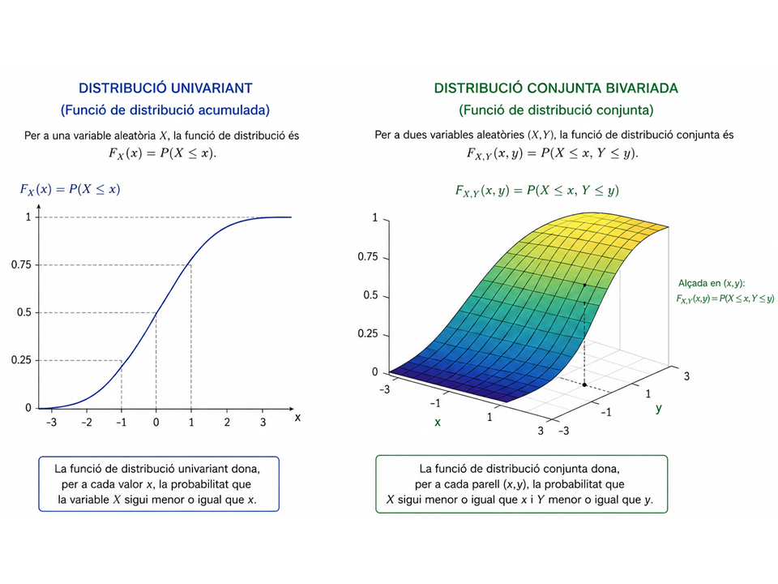
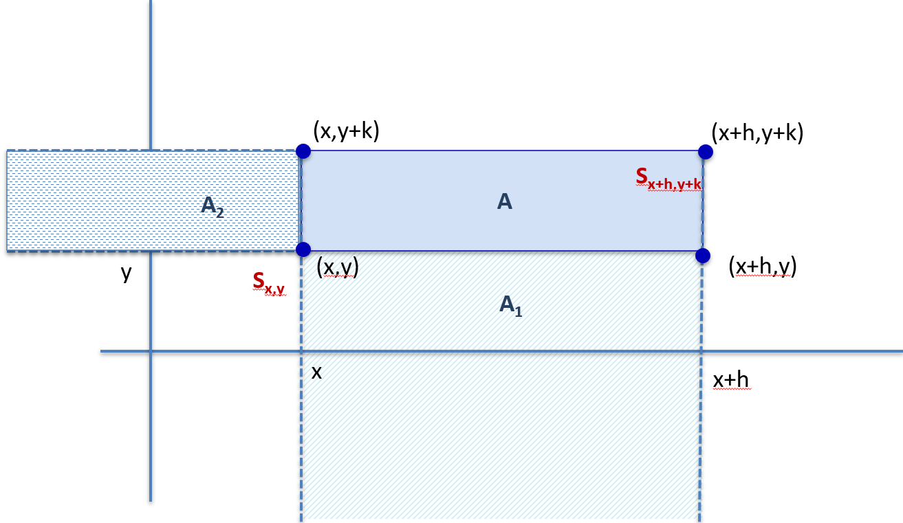
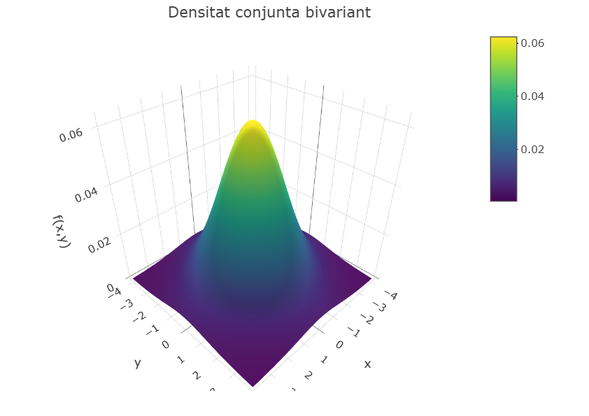
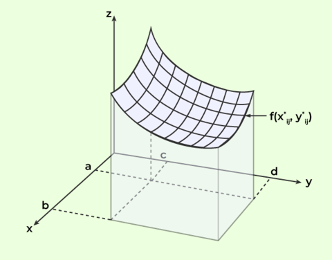
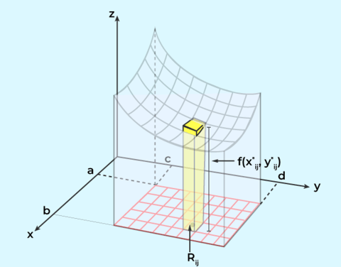
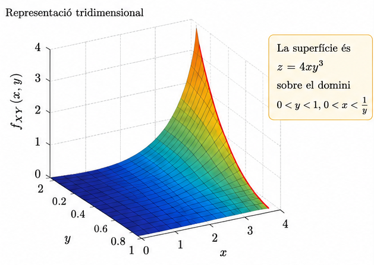
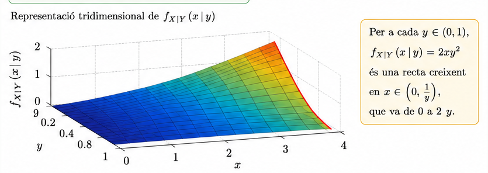
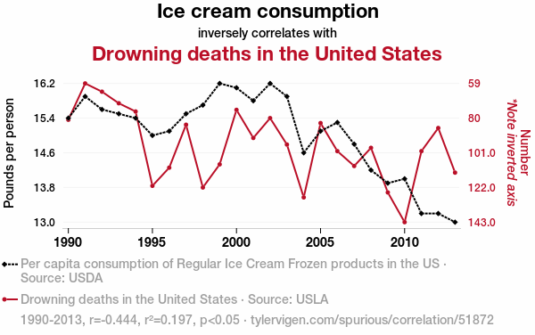

```{r setup-global, include=FALSE}
knitr::opts_chunk$set(
  fig.path = "images/",
  echo = FALSE,
  message = FALSE,
  warning = FALSE,
  knitr.graphics.auto_pdf=TRUE
)
```

<!-- HTML para logos -->


# Pla docent {-}

L’assignatura pretén proporcionar una base sòlida en l’estudi de variables aleatòries multivariants i processos estocàstics, amb èmfasi en la comprensió teòrica, les propietats fonamentals i les aplicacions pràctiques en camps com la ciència de dades, les finances, les biociències i l’enginyeria.


## Dades generals {-}

|                      |                                                    |  
|----------------------|----------------------------------------------------|
|Nom de l'assignatura  | Probabilitat II                                    |
|Codi de l'assignatura |                                                    |
|Curs Acadèmic         | 2026/2027                                          |
|Coordinació           | Santi Pérez Hoyos                                  |
|Departament           |Departament de Genètica, Microbiologia i Estadística|
|Crèdits               |6                                                   |
|Programa Únic         |S                                                   |


## Hores   {-}

|Activitats	                              |  Tipus de formació |Hores  | 
|-----------------------------------------|--------------------|:-----:|
|Activitats presencials i/o no presencials|		                 |  60	 |
|&emsp; - Teoria	                        |    Presencial	     |  30	 |
|&emsp;- Pràctiques de problemes	        |    Presencial      |	30	 |
|Treball tutelat/dirigit	               	|                    |  40	 |
|Aprenentatge autònom		                  |                    |  50	 |


 
## Competències / Resultats d'aprenentatge que es desenvolupen  {-}

**- Competències**

C05. - Aplicar los conocimientos y habilidades a situaciones prácticas

C12. Detectar situacions en què els models estadístics i d’investigació operativa poden ser útils per a la presa de decisions.

C14. Adaptar els models teòrics a les necessitats específiques de les diferents àrees d’aplicació.

**- Habilitats i destreses**

H04. Plantejar una pregunta científica en termes estadístics.

H06. Identificar les fonts de variabilitat i incertesa que afecten la presa de decisions

**- Coneixements i continguts**

K03. Reconèixer la teoria de la probabilitat com a fonament de les tècniques estadístiques.

## Objectius d'aprenentatge  {-}


| Referits a Coneixements                 |  Referits a habilitats, destreses  |
|-----------------------------------------|------------------------------------|
|- Conèixer els conceptes de variables aleatòries multivariants i les seves components |- Calcular probabilitats a partir dels models de vectors aleatoris |
|- Conèixer els conceptes de independència , covariància i correlació  |- Calcular densitats marginals i conjuntes i funcions de vectors aleatoris|
|- Conèixer les principals models multivariants i les seves propietats, i identificar els seus àmbits d'aplicació |- Calcular matrius de covariàncies, correlacions i moments de variables aleatòries multivariants |
|- Conèixer el concepte de procés estocàstic i les seves propietats bàsiques.  |- Calcular probabilitats i generar dades de les principals distribucions|
|- Conèixer  els principals tipus de processos estocàstics i identificar les situacions reals a les quals són aplicables. |- Determinar matrius de transició d'una cadena de Markov amb espai d'estats finits | 
||- Aplicació dels principals tipus de processos estocàstics|

## Blocs Temàtics i Continguts Detallats  {-}

 **1. Variables aleatòries multivariants**
 
 * Definició i conceptes bàsics: vectors aleatoris, espais de probabilitat.
 
 * Funcions de densitat i de distribució conjuntes.
 
 * Funcions de densitat i de distribució marginals i condicionades.
 
 * Moments multivariants: vector d'esperances, matriu de variància-covariància.
 
 * Transformacions de variables multivariants.
 
**2. Independència de variables aleatòries**

* Independència i dependència entre variables aleatòries.

* Esperances i variàncies condicionades.
 
* Conceptes de covariància, correlació i causalitat.
 


**3. Algunes distribucions multivariants**

* Distribució normal multivariant: definició, propietats i aplicacions.
 
* Distribucions especials: Multinomial, t-Student multivariant, Wishart, Chi-quadrat i Dirichlet.
 
* Generació de mostres de distribucions multivariants.

**4. Processos estocàstics: Introducció i conceptes bàsics**

* Definició de procés estocàstic.
 
* Processos estocàstics discrets i continus.
 
* Processos estocàstics estacionaris i no estacionaris.
 
**5. Principals tipus de Processos estocàstics.**

* Cadenes de Markov.

* Caminades aleatòries.

* Processos de Poisson.

* Moviment Brownià.


 
## Metodologia i activitats formatives  {-}

El pla docent es desglossa en els següents tipus metodològics bàsics: activitats presencials, treball dirigit (com ara el lliurament de problemes o l’estudi de casos pràctics de seguiment automatitzat) i treball autònom. Les categories desglossades són:

1. Classes de teoria. Dues sessions setmanals ( durant 15 setmanes) en que es presenten els conceptes més teòrics de l'assigunatura. Es miren amb detalls demostracions, contingut i desenvolupament amb la resolució de situacions o problemes típics amb un enfocamente pràctic

2. Classes pràctiques. Sessions de dues hores setmanals ( durant 15 setmanes) L'alumant disposa al principi de cada tema de una collecció de problemes i exercicis pràctics. A la finalització de cada tema es deixen les solucions en el Campus Virtual.  El professorat comenta les diferents formes d'abordar els problemes i resol en la pissara un classe exercicis tipus. A vegades es deixa temps a la mateixa classe perqué l'alumant pugui resodre algún problema.

Les sessions pràctiques tindràn lloc durant 15 setmanes al semestre en una sessió setmanal de 2 hores. En aquestes sessions el grup es divideix en dos subgrups que rebran la docència al mateix horari per part de dos professors. L’assignació d’alumnes als grups la fa el professorat.

A més, regularment es proposen qüestionaris en el Campus Virtual que cal fer de manera telemàtica i lliurar a través del Campus Virtual la setmana següent. En alguns dels qüestionaris es demana que es lliurin els càlculs i procediments, que cal lliurar a les classes de problemes. Aquests lliuraments, igual que la resta de qüestionaris, s’avaluen.

3. Activitats no presencials dirigides. Amb el suport d’eines informàtiques amb correcció automatitzada (qüestionaris de Moodle que es duen a terme des del Campus Virtual), es fa un seguiment del treball autònom de l’estudiant (40 hores d’activitats dirigides no presencials en total).

4. Treball autònom de l’estudiant per acabar de consolidar tots els conceptes donats (50 hores en total).

Es fa servir el Campus Virtual com a repositori del material del curs i també per concretar les activitats proposades. Alguns dels lliuraments de feines es fan directament en el Campus Virtual.

S’espera que l’alumnat assisteixi a classe sempre, ja que una assistència irregular dificulta l'assoliment de les competències que l’assignatura es marca com a objectius.

## Avaluació acreditativa dels aprenentatges  {-}

**Avaluació continuada**

Es l'opció recomanada per als estudiants que assisteixen regularment i que consta de tres parts.


1.- **Lliurament dels questionaris** proposats en el Campus Virtual (Quest)

2.- **Examen parcial** en acabar el tema 2 que no elimina materia (Parcial)

3.- **Examen final** que coincideix amb la data d'avaluació única segons la data marcada pel Consell Docent. (Final)

Els examens parcial i final tenen  la mateixa estructura, amb una pregunta teórica i entre 2 i 4 problemes. La teoria tindrá un valor entre el 20% el 30%.


La qualificació global de l’assignatura és:

**Global = 0.1 · Màx(Quest, Final) + 0.3 · Màx(Parcial, Final) + 0.6 · Final**

sempre que la nota de l’examen final sigui com a mínim de 4 (sobre 10); en cas contrari la qualificació global de l’assignatura és la nota de l’examen final. Per tant, la nota dels lliuraments i la del parcial es tenen en compte (amb pesos respectius del 10 % i del 30 % de la qualificació global) només si són superiors a la nota de l’examen final.

La nota de la reavaluació no té en compte la nota dels lliuraments setmanals ni la de l’examen parcial; per tant, és simplement la nota de l’examen de reavaluació.

**Avaluació única**

L’alumnat pot optar entre dues formes d’avaluació: avaluació continuada o avaluació única. Qui vulgui renunciar a l’avaluació continuada i acollir-se a l’avaluació única ha de fer-ho abans de la data que s’estableixi, i que es fa pública amb antelació suficient.

La prova d’avaluació única consta de dues parts: teoria (amb un pes entre el 20% i el 30 %) i problemes (amb un pes entre el 70% i el 80 %). Els continguts d’aquesta prova són semblants (en temàtica i dificultat) als explicats a les classes presencials. Aquesta prova avalua les competències de l’assignatura i es fa en la data fixada pel Consell Docent (abans del període de matriculació de l’alumnat).

<!--chapter:end:index.rmd-->

\newpage

# Variables aleatòries multivariades


## Definició i conceptes bàsics: vectors aleatoris, espais de probabilitat

### Introducció

A qualsevol que se li pregunti quin temps es triga en recórrer  els 280 quilòmetres de distància entre Barcelona i Castelló, si es circula a una velocitat constant de 120km/h,  ens indicaria que en 2 hores i 20 minuts arribaríem a la destinació. Ara be, si se li pregunta quin serà el resultat de  llançar un dau  no tindria una resposta clara.
  
  * El primer resultat prové d'un fenomen o **experiència determinista.** N'hi ha prou amb extreure de l'equació  $e=v·t$  el valor del temps
  * El segon pertany a la categoria dels fenòmens o **experiències aleatòries.** Es coneixen tots els resultats possibles, un número del 1 al 6 en el cas del dau, però no quin resultat es produirà, ja que de repetició en repetició sortiran resultats diferents.

### Conceptes bàsics: Experiment aleatori, mesura de probabilitat


:::{.definition}


Un **experiment** és una seqüència d’accions que, en repetir-se sota les mateixes condicions, produeix resultats observables.  Direm que l'experiment és **aleatori** si, executat sota les mateixes condicions, pot donar lloc a un resultat $w$ d'entre un conjunt de posibles resultats.

:::


:::{.definition}

L’**espai mostral** d’un experiment, denotat per $\Omega$, és el conjunt de tots els resultats possibles.
:::


:::{.definition}
Un **esdeveniment**  es una col·lecció  de possibles resultats d'un experiment, és a dir un subconjunt de $A \subseteq \Omega$. Quan el resultat de l'experiment pertany al esdeveniment ($w \in A$), direm que a ocorregut l'esdeveniment. 
:::


---

:::{.example} 
Així si l'experiment és llançar un dau, l'espai mostral és 

$$\Omega = \{1,2,3,4,5,6\}$$ i un esdeveniment pot ser $A=\text{Treure un número senar}$ . Si al llançar el dau surt un 3, l'experiment A ha ocorregut.
:::

---

:::{.definition}

Una col·lecció $\mathcal{A}\subseteq \mathcal{P}(\Omega)$ és una **$\sigma\text{-àlgebra}$** si:

1. $\Omega\in\mathcal{A}$  
2. Si $A\in\mathcal{A}$, aleshores $A^c\in\mathcal{A}$  
3. Si $A_1,A_2,\ldots\in\mathcal{A}$, aleshores $\bigcup_{n}A_n\in\mathcal{A}$
:::

La $\sigma\text{-àlgebra}$ representa “tot allò al que volem i podem assignar probabilitat”.

---

:::{.example} 
Si suposem un experiment és triar a l'atzar  un número en l'interval [0,1], l'interès es centra en conèixer si l'elecció pertany a qualsevol dels subconjunts de [0,1]. La $\sigma\text{-àlgebra}$ $\beta_{[0,1]}$ d'esdeveniments generada a partir de tots els possibles subintervals de [0,1], és  coneguda com $\sigma\text{-àlgebra}$ de Borel estrictament menor que $\mathcal{P}(\Omega)$.

<!-- **Posar exemples de sigma algebra de $\mathbb{R}$ i $\mathbb{N}$,** -->
:::

---

En resum, L'espai mostral ve acompanyat de la $\sigma-álgebra$ mes convenient a l'experiment. La combinació ($\Omega,\mathcal{A}$) rep el nom d'**espai mesurable** 


:::{.definition}
 **Mesura de Probabilitat**
 
 Donat un espai mostral  $\Omega$ i una $\sigma\text{-àlgebra}$ $\mathcal{A}$ definim la mesura de probabilitat com una aplicació. 
 
$$
\begin{aligned}
P : \mathcal{A} & \rightarrow \mathbb{R} \\
A &\mapsto Pr(A)
\end{aligned}
$$

on P compleix els axiomes de Kolmogorov 

1. $P(A) \ge 0$, per tot $A \in \mathcal{A}$.

2. $P(\Omega) = 1$.

3. *Axioma d’additivitat numerable:*  
Si $A_1, A_2, \ldots, A_n\in \mathcal{A}$ es una successió d'esdeveniments  disjunts dos a dos, llavors

$$
P\left(\bigcup_{i=1}^{n} A_i \right)
=
\sum_{i=1}^{n} P(A_i)
$$

Dels axiomes anteriors es segueixen totes les propietats de qualsevol mesura
de probabilitat. En particular que la probabilitat de un esdeveniment ha de ser un número entre 0 i 1.

$$
0 \le P(A) \le 1 \quad \text{per a tot } A \in \mathcal{A}.
$$
:::


:::{.definition}
 **Espai de probabilitat**
 
A la *terna $(\Omega,\mathcal{A},Pr)$*  l'anomenarem  **espai de probabilitat**. 
 
:::


---

:::{.example} 

**Espai de probabilitat discret uniforme**

Suposem un espai mostral $\Omega$, numerable i com a $\sigma\text{-àlgebra}$  la formada per tots els subconjunts de $\Omega$. Definim un funció no negativa sobre tots els subconjunts de $\Omega$ on es verifica que $\sum_{w\in \Omega}p(w)=1$. Si es defineix  $P(A)=\sum_{w\in A}p(w)$, es pot comprovar que P es una probabilitat.
Un cas particular son els espais de probabilitat discrets uniformes.  Si $\Omega={w_1,w_2,....,w_n}$ i $p(w_i)=\frac{1}{n}, \forall w_i \in \Omega$.

Si $A={w_1,w_2,....,w_m}$ tenim qué $P(A)=\frac {m}{n}$ (Fórmula de Laplace). Es diu uniforme per que la massa de probabilitat està repartida al ser constant en cada punt.

Per exemple imaginem que llancem dos daus. L'espai mostral serà $\Omega={(1,1),(1,2),(1,3),....(6,5),(6,6)}$ format per les 36 parelles de resultats possibles. Si els daus no estan trucats, cada parella te la mateixa probabilitat 1/36. Si es considera A={amb dues cares son senars}  el número de possibilitats son 9  i per tant la probabilitat de A es P(A)=9/36=1/4. 

:::

---


El resultat d'un experiment aleatori no es tant l'espai de probabilitat resultant, sino les característiques numèriques associades. Això implica passar de $\Omega$ a  $\mathbb{R}$ o  $\mathbb{R}^k$ on es més fàcil treballar.  Com hem comentat en  $\mathbb{R}$ podem parlar de la $\sigma\text{-àlgebra}$ de Borel $\beta$ que és la menor que conté els intervals i que permet parlar de l'espai de probabilitat $(\mathbb{R},\beta)$


### Conceptes bàsics: Variable aleatòria, funcions de distribució i probabilitat.

:::{.definition}
 **Variable aleatòria**

 Si considerem dos espais de probabilitat    $(\Omega, \mathcal{A})$ i $(\mathbb{R},\beta)$, una **variable aleatòria** es una aplicació  $X:\Omega \rightarrow \mathbb{R}$  que verifica que $X^{-1}(B) \in \mathcal{A}$ $\forall B \in \beta$

:::


---

:::{.example}

Quan llencem una moneda, habitualment identifiquem les dues cares amb els valors \(0\) i \(1\). Aquesta identificació és, de fet, una variable aleatòria:


\[
X:\Omega \longrightarrow \mathbb{R}
\]

\[
\begin{array}{ccc}
\text{Cara} & \longmapsto & 0 \\
\text{Creu} & \longmapsto & 1
\end{array}
\]


Si la moneda no esta trucada la probabilitat de que sorti cara o creu al llançar la moneda es 0.5 respectivament, Així al fer la transferència entre espais de probabilitat $P(X=0)=0.5$ es el mateix que $P(X^{-1}(0))=P(cara)=0.5$  i el mateix per X=1   $P(X=1)=0.5=P(X^{-1}(1)=P(creu)$.

Per expressar aquesta probabilitat podríem haver  utilitzat un altra  variable aleatòria que codificarà la cara com a 1 i la creu com a 2.


:::

---

:::{.definition}
**Distribució de probabilitat induida**
Quan es fa intervenir una variable aleatòria és per que s'està en la presència d'un espai de probabilitat. La variable aleatòria trasllada la informació d'aquesta probabilitat de $\Omega$  a $\mathbb{R}$   mitjançant la probabilitat induïda coneguda com llei de probabilitat o distribució de probabilitat.

 Així, la variable aleatòria $X$ indueix sobre $(\mathbb{R},\beta)$  la probabilitat $P_X$ de la següent forma

 $$
       P_X(A)= P(X^{-1}(A)) \quad \forall A \in \beta
 $$
$P_X$ hereta les característiques de P a través de X. Sí X canvia  a distribució de probabilitat pot canviar . Mirem-ho en un exemple.
:::

---

:::{.example}

Si tornem a l'exemple de llançar dos daus podem definir dues variables aleatòries. *X* que sigui la suma dels resultats dels dos daus i *Y* que sigui la diferència dels resultats. Encara que les dues variables estan  definides en el mateix espai de probabilitat, $P_X$ i $P_Y$ son diferents per que estan induïdes per variables diferents.

En cap cas la suma de les dues cares de un dau son 0, però ens 6 situacions les dues cares poden ser iguals. Si calculem amb els dues distribucions la probabilitat de que la variable aleatòria sigui 0, dona resultats diferents.


$P_X(0)=P(X^{-1}(0))=P(\varnothing)=0$

$P_Y(0)=P(Y^{-1}(0))=P(\{1,1\},\{2,2\},\{3,3\},\{4,4\},\{5,5\},\{6,6\})=\frac{6}{36}=\frac{1}{6}$


:::

---

Les distribucions de probabilitat com la $P_X$, encara que ens presenta la informació necessària per obtenir les probabilitats, son objectes matemàtics complexes d'utilitzar i es recorre a dos tipus de funcions associades, la  Funció de distribució de probabilitat o la funció de probabilitat o densitat de probabilitat, depenen de la natura de la variable.

:::{.definition}
**Funció de distribució de probabilitat**

A partir de la probabilitat induida podem definir sobre  $\mathbb{R}$ la següent funció

\begin{equation}
F_X(x)= P_X((-\infty,x])=P(X^{-1}\{(-\infty,x]\})=P(X\leq x) \quad \forall x \in \mathbb{R} (\#eq:Fx)
\end{equation}

:::


La funció de distribució te les següents propietats

1. És una funció no negativa per la propia definció
2. És una funció monòtona  ja que $F_X(x_1) \leq F_X(x_2) \quad$ si $\quad x_1 \leq x_2$
3. És una funció continua per la dreta . Es a dir si es considera una succesió de números reals $x_n \rightarrow x$  llavors $\lim_{n \rightarrow \infty}F_X(x_n)=F_X (x)$
4. $\lim_{x \rightarrow \infty} F_X(x)=1$  i  $\lim_{x \rightarrow -\infty} F_X(x)=0$

Del punt 3 es dedueix que si $(- \infty,x] =\{ x \} \cup \lim_{n \rightarrow  \infty} (- \infty, x-\frac{1}{n} )$  la funció de distribució en X es

$$
F_X(x)= P(X=X)+ \lim_{n \rightarrow \infty} F_X(x-\frac{1}{n})=P(X=x) +F(x^-)
$$
i $F_X(x)$ es continua si P(X=x)=0


Directament es pot calcular la probabilitat d'un interval obert per l'esquerra com

$$
P(a< X \leq b)=F_X(b)- F_X(a)
$$

---

:::{.example}

Suposem que a un pacient se li indica que triï un nombre real entre 0 i 10 per indicar el seu nivell de dolor (Escala analògica Visual (EVA)) i que tots els valors tenen la mateixa probabilitat de ser triats.

Definim la variable aleatòria $X$ com el nivell de dolor i es vol obtenir la funció de distribució que reflexa la probabilitat de que el nombre escollit sigui menor o igual que $x$.
$$
F_X(x)=P_X(X \leq x)
$$
Si tots els valors son equiprobables la probabilitat seria la longitud de casos favorables partit per 10.

És a dir, si $x \in [0,10]$  $F(x)=\frac {x}{10}$

La funció completa és

$$
F_X(x)=
\begin{cases}
0, & \text{si } x <0 \\
\frac {x}{10}, &  0 \leq x \leq 10 \\
1, & x>10
\end{cases}
$$
:::

---

:::{.definition}
**Funció de probabilitat d'una variable aleatòria discreta**

$X$ és una variable aleatòria discreta si  $X(\Omega)$ es  finit o numerable, és a dir es pot definir un conjunt suport  $D_X=\{x_1,x_2,....,x_n \}$ tal que $P_X(D_X))= P(X \in D_X)=1)$ i   $P(X=x)>0 \quad, \forall x \in D_X$. Per tant es pot deduir que $P(X=x)=0 \quad, \forall x \in D_X^c$

Així la funció de distribució de la variable aleatòria discreta és:

\begin{equation}
 F_x(x)=\sum_{x \leq x_i} P(X=x_i) (\#eq:Fxdiscret)
\end{equation}

Que serà una funció continua en els intervals $[x_i,x_{i+j}[$ si els valors $x_i$ estan endreçats de menor a major i que tindrà una discontinuïtat de salt finit en cada punt $x_i$  de Valor $F_X(x_i)- F_X(x_{i-1})=P(X=x_i)$

Així a la variable $X$ li podem associar la funció de probabilitat següent

$$
f_X(x)=
\begin{cases}
P(X=x), & \text{si } x \in D_X \\
0, & \text{en la resta}
\end{cases}
(\#eq:pxdiscret)
$$

:::

---

:::{.example}

Alguns exemples de variables aleatòries discretes que venen definides per les seves funcions de probabilitat son les  que tenen una distribució Poisson, Binomial, Hipergeomètrica ó binomial negativa. La seva definició es pot trobar en l'annex del tema.

:::

---


:::{.definition}
**Funció de densitat o  probabilitat d'una variable aleatòria continua**

Una variable aleatòria X és continua si la seva funció de distribució F_X , es absolutament continua.  A efectes pràctics disposem  la funció de densitat f_X(x), coneguda de manera que

$$
F_X(x)= \int_{-\infty}^{x}  f(t) dt  
(\#eq:Fxcont)
$$
Així la probabilitat de qualsevol interval ]a,b] ès

$$
P(X \in ]a,b]= P(a<X \leq b) \int_{a}^{b}  f(x) dx (\#eq:pxcontint)
$$


La funció de densitat $f_X(x)$ es no negativa i $P(X \in  \mathbb{R} =1 )$


Per altra banda per una propietat de la integral de Riemann , la funció de densitat es la derivada de la Funció de distribució $f_X(x)=F'_X(x)$

:::


---

:::{.example}
Alguns exemples de variables aleatòries continues que venen definides per les seves funcions de  densitat probabilitat son les  que tenen una distribució  uniforme, Normal, Exponencial, Gamma  entre altres. La seva definició es pot trobar en l'annex del tema.
:::

---


### Variable aleatòria k-dimensional o vector aleatori


Molts experiments aleatoris produeixen més d'una única quantitat rellevant, és a dir, més d'una variable aleatòria. Veíem alguns exemples

---

::: {.example #quali1}
-  Imaginem una situació on primer es llança una moneda  amb resultats cara i creu, i després es llança un dau amb 6 resultats.  Així tenim una variable aleatòria $X_1$ per a la moneda i una variable aleatòria $X_2$ per al dau.  El vector en $\mathbb{R}^2$ $(X_1,X_2)$ serà una variable aleatòria bidimensional   composat per dues variables aleatòries unidimensionals
:::

---

---


:::{.example}
- En economia podem estar interessants en conèixer la distribució d'ingressos d'una persona i per altra costat el % dels ingressos dedicats al pagament del habitatge (lloguer o hipoteca). Cada individu estarà representat per un vector composat per dues variables unidimensionals
:::

---

---

:::{.example}
- En salut podem estar interessats en el resultat d'un experiment on es mesuren diferents paràmetres biomètrics com pes, alçada, índex cintura-maluc,  índex de massa corporal, índex cintura-alçada, perímetre braquial, perímetre abdominal, superfície corporal, etc.  Es tracta d'un vector multidimensional definit per k variables unidimensionals en $\mathbb{R}^k$.
:::

---


:::{.definition}
**Vector aleatori**

Un vector aleatori $\mathbf{X}=(X_1,X_2,.......,X_k)$,  es una aplicació de l'espai mostral  $\Omega$ en  $\mathbb{R}^k$ tal que

$$
\mathbf{X}^{-1}(B) \in\mathcal{A}, \quad \forall B \in \beta^K
$$
On $\beta^K$ es una $\sigma\text{-àlgebra}$ de Borel en   $\mathbb{R}^k$
:::

$\mathbf{X}$ indueix sobre $(\mathbb{R}^k,\beta^K)$ una probabilitat $P_X$ de la següent manera

$$
P_X(B)=P(\mathbf{X}^{-1}(B)), \quad \forall B \in \beta^K (\#eq:pvectorind)
$$
És senzill comprobar que $P_X$ verifica els tres axiomes de probabilitat, per això $(\mathbb{R}^k,\beta^K, P_X)$ permet induir un espai de probabilitat amb les característiques de $(\Omega,\mathcal{A},P)$ heretades mitjançant $X$.


:::{.definition}
**Variable aleatòria bidimensional o bivariant**


Sigui $(\Omega, \mathcal{A},P)$ un espai de probabilitat . Podem definir la variable aleatòria bivariant com


$$
\begin{aligned}
(X,Y): \Omega &\rightarrow \mathbb{R}^2 \\
w & \rightarrow (X,Y)(w) =(X(w),Y(w))
\end{aligned}
$$
on

$(X,Y)^{-1}(( -\infty, x]  \times (-\infty, y]))=\{w \in \Omega: X(w) \leq x \quad i \quad  Y(w) \leq y \} \in \mathcal{A} \quad \forall x \in \mathbb{R} \quad i \quad \forall y \in \mathbb{R}$


:::


Com passa en el cas univariant es prou que $(X,Y)^{-1}(( -\infty, x]  \times (-\infty, y])) \in \mathcal{A} \quad \forall (x.y)\in \mathbb{R}^2$ per a garantir que $(X,Y)^{-1}(B) \in  \mathcal{A} \quad \forall B \in \beta (\mathbb{R}^2)$


Per tant, qualsevol variable aleatòria bivariant (X,Y) indueix una mesura de probabilitat en $\mathbb{R}^2$  que permet assignar probabilitats a qualsevol subconjunt Borelià B de $\mathbb{R}^2$:

$$
P_{(X,Y)}(B)=P((X,Y)^{-1}(B))=P(\{w \in \Omega:(X(w),Y(w)) \in B\})  (\#eq:pconjunt)
$$
Aquesta mesura de probabilitat induïda s'anomena **distribució de probabilitat conjunta de (X,Y)**


---

:::{.example}

Tornem a l'exemple on llançàvem una moneda $(X)$ i un dau $(Y)$

L'espai mostral és $\Omega=(\{cara,1\},\{creu,1\},\{cara,2\},.....,,\{creu,6\})$
i la variable aleatòria $(X,Y)$  pren  el valor $X= 0$ si és cara i $X=1$  si és creu en la primera component $X$ i el número  que ha sortit al dau en la segona component $Y$.

Podem definir

$$
P_{XY}(x,y)=
\begin{cases}
1/2 \times 1/6=1/12, & \text{si } \quad  x \in \{ 0,1\}  \quad i \quad y \in \{ 1,2,3,4,5,6\} \\
0, & \text{en la resta}
\end{cases}
$$
:::

---


Es pot demostrar que $P_{XY}$ es una mesura de probabilitat ja que compleix els axiomes de Kolmogorov.


:::{.definition}
**Variable aleatòria  k- dimensional o multivariant**

Si enlloc de 2 variables aleatòries unidimensionals generalitzem a n variables aleatèries, estarem parlant d'una Variable aleatòria n-dimensional o multivariant.

Sigui $(\Omega, \mathcal{A},P)$ un espai de probabilitat . Podem definir la variable aleatòria multivariant $\overrightarrow{\bf{X}}=(X_1,X_2,...,X_{k-1},X_k)$


$$
\begin{aligned}
(\overrightarrow{\bf{X}}): \Omega &\rightarrow \mathbb{R}^k \\
w & \rightarrow (X_1,X_2,...,X_{k-1},X_k)(w) =(X_1(w),X_2(w),...,X_{k-1}(w),X_k(w))
\end{aligned}
$$

on

$$
(\overrightarrow{\bf{X}})^{-1}(( -\infty, x_1] \times...  \times (-\infty, x_k]))=\{w \in \Omega: X_1(w) \leq x_1 \quad i \quad ... \quad i \quad  X_k(w) \leq x_k \} \in \mathcal{A} \quad \forall x_i \in \mathbb{R}
$$
:::


## Funcions de densitat i de distribució conjuntes.

### Funció de distribució conjunta


En els apartats anteriors hem definit la probabilitat conjunta associada a una variable multidimensional. Com en el cas unidimensional, podem caracteritzar  aquesta probabilitat conjunta a partir de funcions conjuntes de distribució o de  densitat o de probabilitat segon siguin les variables.


:::{.definition}
**Funció de distribució conjunta**


Definim la funció de distribució associada a la probabilitat conjunta $P_X$ donat un punt de  $\mathbb{R}^k$  $\mathbf{x}=(x_1,...,x_k)$ com


$$
F_X( \mathbf{x} )=F_X(x_1,...,x_k) =P_X(S_x)=P(X \in S_x)= P(\bigcap_{i=1}^{k} \{ X_i\leq x_i \}) (\#eq:Fdistconjunt)
$$
:::


En la figura \@ref(fig:img-distbiv) es pot observar la diferència entre una distribució univariat que es una corba en dimensió 2 o la funció de distribució conjunta bivariada  $F(x,y)= P(X \leq x, Y \leq y)$ que es tracta d'una superfície en dimensió 3.

```{r img-distbiv, fig.cap="Distribució continua bivariada", echo=FALSE,fig.align='center',out.width="80%"}

```


De la definició de funció de distribució conjunta es deriven les següents propietats:

<ol>

<li> <b> No negativitat </b> </li>

Com a conseqüència que  la funció de distribució conjunta es una probabilitat, pren valors entre 0 1 i per tant sempre seran valors no negatius.

<li> <b> Monotonia de cada component </b> </li>

Si $\mathbf{x} \leq\ \mathbf{y}$ es a dir $x_i \leq y_i, \quad i=1,....k,\quad  S_x \subset S_y \quad  y\quad F_X(x) \leq F_Y(y)$

<li> <b> Continuïtat conjunta per la dreta </b> </li>

Si $\mathbf{x}{(n)} \rightarrow \mathbf{x}$ llavors  $F_X(\mathbf{x}^{(n)}) \rightarrow F_X(\mathbf{x})$


<li> <b> Valores límit </b> </li>

Al tendir a $\pm \infty$ les components del vector aleatori s'obté

$$
 \lim_{\forall x_i  \rightarrow + \infty} F_X(x_1,...,x_k)=1
$$
ó

$$
 \lim_{\exists x_i  \rightarrow - \infty} F_X(x_1,...,x_k)=0
$$
</ol>


Aquestes propietats ja son conegudes per al cas unidimensional.  Cal una cinquena propietat sense la que no es pot recórrer el camí invers d'obtenir $P_X$ a partir de $F_X$ i poder establir la desitjada equivalència entre tots dos conceptes que il·lustrarem en dimensió 2.


:::{.proposition}

<b> Regla del rectangle </b>


En aquesta regla calculem la probabilitat d'un rectangle a partir de les funcions de distribució conjunta en cada punt del rectangle que es pot veure en la figura   \@ref(fig:img-rectangle)

$$
\left.
\begin{array}{l}
\forall (x,y)\in\mathbb{R}^2\\
\forall h>0\\
\forall k>0
\end{array}
\right\}
\quad F_{X,Y}(x+h,y+k)-F_{X,Y}(x,y)-F_{X,Y}(x+h,y)-F_{X,Y}(x,y+k)=P_{X,Y}(A)=P_{X,Y}(]x,x+h] \times ]y,y+k])>0
(\#eq:rectangle)
$$

:::

<b>

:::{.proof}
</b>
```{r img-rectangle, fig.cap="Càlcul de la probabilitat d'un rectangle", echo=FALSE,out.width="60%",fig.align='center'}

```

$S_{x+h, y+k}=S_{x, y} +A_1+A_2+A$

on cadascú del conjunts de la part dreta son disjunts i per tant

$P_{X,Y}(S_{x+h, y+k})=P_{X,Y}(S_{x, y})+ P_{X,Y}(A_1)+P_{X,Y}+P(A_2)+P_{X,Y}(A)$

si substituïm  per la funció de distribució

$$
{\small
\begin{array}{l}
F_{X,Y}(x+h, y+k)=F_{X,Y}(x, y)+ P_{X,Y}(A_1)+P_{X,Y}+P(A_2)+P_{X,Y}(A)  \\
A_1 = S_{x+h, y} -S_{x,y}  \\
\text{i per tant } P_{X,Y}(A_1)=F_{X,Y} (x+h.y)- F_{X,Y}(x,y)  \\
\text{donat que } S_{X,Y}(x,y) \subset S_{X,Y}(x+h,y)  \\
A_2 = S_{x, y+k} -S_{x,y}  \\ 
\text{i per tant } P_{X,Y}(A_2)=F_{X,Y} (x,y+k)- F_{X,Y}(x,y)  \\
\text{donat que }S_{X,Y}(x,y) \subset S_{X,Y}(x,y+k)
\end{array}
}
$$

 Així, si substituïm


$$
{\small 
\begin{aligned}
P_{X,Y}(A) &=F_{X,Y}(x+h, y+k)-F_{X,Y}(x, y)- P_{X,Y}(A_1)-P_{X,Y}(A_2)  \\
&=F_{X,Y}(x+h, y+k)-F_{X,Y}(x, y)-(F_{X,Y}(x+h,y)-F_{X,Y}(x,y))-(F_{X,Y} (x,y+k)- F_{X,Y}(x,y))\\
&=F_{X,Y}(x+h, y+k)+F_{X,Y}(x, y)-(F_{X,Y}(x+h,y)+F_{X,Y}(x,y))-(F_{X,Y}(x,y+k)- F_{X,Y}(x,y)) >0 
\end{aligned}
}
$$


Quedant demostrada la  proposició
:::


### Variables aleatòries multivariants discretas


:::{.definition} 
**Funció de probabilitat conjunta.** 

Sigui el vector aleatori $\overrightarrow{\bf{X}}=(X_1,X_2,...,X_{k-1},X_k)$, direm que es un vector aleatori discret si en el suport $D_X=(D_{X_1},...,D_{X_1})$ cadascuna de les seves components $D_{X_i}$ es una component numerable  discreta. Així, es pot definir la funció de probabilitat conjunta associada i el seu valor per a cada punt de $\mathbb{R}^k$ ve donat per: 


$$
f_X(x_1,...,x_k)=
\begin{cases}
P(X_i=x_i ), & \text{si } \mathbf{x}=(x_1,...,x_k) \in D_X \\
0, & \text{en la resta}
\end{cases}
$$
:::


Com que es una probabilitat $f_X(x) \geq 0, \forall x \in \mathbb{R}^k$

---

:::{.example #taula-discreta}

Si tornem a l'exemple del llençament de la moneda i el dau de l'exemple \@ref(exm:quali1) podem definir la funció de probabilitat continua com el  producte de la probabilitat d'obtenir el resultat al llençar la moneda ( 1/2) per la probabilitat de obtenir un resultat del dau, es a dir (1/6). Així $P_XY(x_i,y_i)=1/2 \times 1/6= 1/12$

En la següent taula es mostra la funció de quantia o probabilitat. Per qualsevol valor no recollit en la taula $f_XY(x,y=0)$

|**Y\\X** | Cara (0)  | Creu (1) |  **$f_Y(y)$** |
|------|-----------|----------|-------------|
| **1**    |   1/12    |   1/12   | **1/6**         |
| **2**    |   1/12    |   1/12   | **1/6**         |
| **3**    |   1/12    |   1/12   | **1/6**        |
| **4**    |   1/12    |   1/12   | **1/6**         |
| **5**    |   1/12    |   1/12   | **1/6**         |
| **6**    |   1/12    |   1/12   | **1/6**         |
| **$f_X(x)$** | **1/2** | **1/2** |    | **1**     |


:::{.Note }
_Nota: en els marges de la taula es poden veure les funcions de probabilitat marginals que seran definides en la propera secció._ 

:::

:::


--- 


:::{.proposition}

**Algunes propietats de la funció de  probabilitat**


Sigui f(x,y) una funció de probabilitat de la variable bivariada (X,Y) tal que $(X,Y)(\Omega)=\{ (x_i,y_i) \quad i \in I \subset \mathbb{N} \quad  i \quad  j \in J \subset \mathbb{N} \}$


<ol>
<li>  $\sum_{(X,Y) \in \mathbb{R}^2} f(x,y)= \sum_{ i \in I, j \in J}f(x_i, y_j)=1$ </li>
<li> $\forall B \in \mathcal{B}^2 \quad  P(B)=\sum_{(X,Y) \in B} f(x,y)=\sum_{(i,j) \ (xi;yj)\in B} f(x_i,y_j)$ </li>
<li> $\forall (x_0,y_0) \in \mathcal{B}^2  \quad  F(x,y)= \sum_{ x \leq x_0, y \leq y_0} f(x,y)=\sum_{(i,j) \ (xi;yj) \leq (x_0,y_0)} f(x_i,y_j)$ </li>
</ol> 
:::


### Variables aleatòries multivariants continues  


:::{.definition}
**Funció de densitat conjunta  de probabilitat d'una variable aleatòria multivariat absolutament continua** 


Sigui $\overrightarrow{\bf{X}}=(X_1,X_2,...,X_{k-1},X_k)$ un vector aleatori on $X_i$ es una variable aleatòria continua. Diguem que **X** és continu si i només si existeis una funció $f_X:   \mathbb{R}^k \rightarrow[0,+\infty[$ tal que 

$P(\mathbf{X} \in (\mathbf{a},\mathbf{b})=P(a_i<X_i<b_i, i=1,...,k)= \int_{a_k}^{b_k}...\int_{a_1}^{b_1} f_X(x_1,...,x_k)dx_1,....,dx_k$
:::


Com passava en el cas unidimensional aquesta funció té algunes propietats que cal remarcar. 

<ol>
<li>  $f_X(x)$ es no negativa </li>
<li> donat que $P(X \in   \mathbb{R}^k)= 1$ , llavors
$\int_{-\infty}^{+\infty}...\int_{-\infty}^{+\infty} f_X(x_1,...,x_k)dx_1,....,dx_k=1$ </li>
</ol>


Com a conseqüència de la definició hi ha una relació entre la funció de distribució conjunta de probabilitat $F_X$ i la funció de densitat  conjunta de probabilitat $f_X$.

$F_X(x_1,....,x_K)=P_X(S_X)=\int_{-\infty}^{x_k}...\int_{-\infty}^{x_1} f_X(t_1,...,t_k)dt_1...dt_k$

y si $x \in \mathbb{R}^k$ es un punt de continuitat de $f_X$,

$f(x_1,...,x_k)=\frac{\partial^k F_X(x_1,...,x_k)}{\partial x_1...\partial x_k}$


---

:::{.example}


En la figura \@ref(fig:img-densconjunta) es pot observar la representació de la funció de densitat $f_{XY}(x,y)$ d'una variable aleatòria continua bivariada. La superfície de la gràfica es el valor de la funció la probabilitat ve determinada pel volum. Aquest volum ve calculat pel que s'anomena integral doble que te algunes especificitats que mostrarem en el següent apartat.  

```{r img-densconjunta, fig.cap="Funció de densitat conjunta bivariada", echo=FALSE,fig.align='center',out.width="80%"}

```

:::

--- 

<!-- Calculadora de Integral Doble 
<a href="https://MiniWebtool.com/es/calculadora-de-integral-doble/">
MiniWebtool Calculadora de Integral Doble</a> -->

#### Integral doble

Aquest apartat es pot considerar com un apèndix del contingut del temari. Introduirem  els conceptes d'integral doble, o més general d'integral de Lebesgue i com s'interpreta i com es calcula, ja que és necessari per obtenir la probabilitat en el cas de vectors aleatoris continus. 


:::{.definition} 


Sigui una funció $f:   \mathbb{R}^2 \rightarrow\mathbb{R}$ una funció no negativa i D un subconjunt de $\mathbb{R}^2$. El volum sota el gràfic de la superfície que genera funció f restringida a aquest conjunt D( veure Figura \@ref(fig:img-doubleintegral1) ) es pot obtenir calculant 

$$
\int \int_D f(x,y) dx dy=\int \int_D f(x,y) dy dx
$$

que s'anomena Integral doble de $f$ sobre $D$. El càlcul de les integrals dobles es un càlcul iteractiu on es fan dues integrals simples, una darrera de l'altra . En la primera s'integra per una de les dues variables  mantenint com constants els valors de la segona variable i després es fa una segona integració per la segona integració mantenint com a constant la primera variable. L'ordre de les variables es intercanviable obtenint els mateixos resultats. 
  
  
```{r img-doubleintegral1, fig.cap="Double integral", echo=FALSE,fig.align='center',out.width="80%"}

```

:::


---

:::{.example #densitat1}

Calculem el volum que la funció f(x,y)=x+y deixa sota el rectangle sobre el rectangle [1,2] x[3,4] , es a  dir $1 \leq x \leq 2$  i   $3 \leq y \leq 4$.


$V= \int_{1}^{2}\int_{3}^{4} (x+y)dydx=\int_{3}^{4}\int_{1}^{2}(x+y)dxdy$


Si integren primer en funció de y la integral interior és, tenint en compte que x es constant : 

$V= \int_{1}^{2}\int_{3}^{4} (x+y)dydx$

$\int (x+y)dy= xy+\frac{y^2}{2}$ 

que avaluat en y=3 i y=4 dona 

$(4x+\frac{16}{2}) - (3x+\frac{9}{2})=4x+-3x-9/2=x+7/2$

Ara integrem respecte a x 

$\int (x+\frac{7}{2})dx=\frac {x^2}{2}+\frac{7}{2}x$

que avaluat en x=1 i x=2 dona

$V=(\frac {2^2}{2}+\frac {7}{2}2)-(\frac {1^2}{2}+\frac {7}{2}1)=(2+7)-(\frac {1}{2}+\frac {7}{2})=9-4=5$


Si canviem l'ordre d'integració i integrem primer en funció de x i despres en funció de y

$V=\int_{3}^{4}\int_{1}^{2}(x+y)dxdy$


$\int (x+y)dy= \frac{x^2}{2}+xy$

que avaluat en x=1 i x=2 dona

$\frac{2^2}{2}+2y -\frac{1}{2}+y=2+2y-\frac{1}{2}-y=\frac{3}{2}+y$


Ara integrem respecte a y 

$\int (\frac{3}{2}+y) dy= \frac {y^2}{2} +\frac {3}{2}y$

que avaluat en y=3 i y=4 dona


$V=(\frac {4^2}{2} +\frac {3}{2}4)-(\frac {3^2}{2} +\frac {3}{2}3)=(8+4)-(\frac {9}{2} +\frac {9}{2})=14-9=5$


En conclusió de les dues maneres el valor del volumen sota la funció es de 5. 


$$
V= \int_{1}^{2}\int_{3}^{4} (x+y)dydx=\int_{3}^{4}\int_{1}^{2}(x+y)dxdy=5
$$
:::

---


---

:::{.example}

Considerem un cas on el recinte d'integració no és un rectangle i utilitzem la funció de l'exemple \@ref(exm:densitat1) f(x,y)=x+y 


Sigui el triangle $A=\{ (x,y) \in  \mathbb{R}^2: 2 \leq x \leq 4, 2 \leq y \leq x \}$ que és mostra en la figura \@ref(fig:graf-triangle) 


```{r graf-triangle, echo=FALSE, message=FALSE, warning=FALSE, fig.cap="Dues maneres d'obtenir la densitat conjunta  d'un triangle"}
source("Rcode/grafic_density.r")
```


La integral doble en el recinte de la funció es pot calcular de dues maneres començant primer per $x$ o per $y$

$$
\int \int_A x+y \quad dydx= \int_2^4 \int_2^x x+y  \quad dydx= \int_2^4 \left( \int_2^x x+y  \quad dy \right ) dx 
$$
Cal observar que la integral interna té el límit superior en funció de $x$ on juga un paper de constant. si resolem primer la integral interna en funció de $y$ obtenim  

$$
 \int_2^4 \left( \int_2^x x+y  \quad dy \right ) dx =  \int_2^4 \left[ (xy+\frac{y^2}{2})  \right ]_2^x dx= 
 \int_2^4  [(xx+\frac{x^2}{2})-(2x+\frac{2^2}{2})] dx =  \int_2^4  (\frac{3x^2}{2}-2x-2)dx
$$

Si ara resolem la segona integral em funció de $x$ 

$$
 \int_2^4  (\frac{3x^2}{2}-2x-2)dx = \left[ \frac{3}{2} \frac {x^3}{3}-x^2-2x    \right]_2^4 =(\frac {4^3}{2}-4^2-2(4))-(\frac {2^3}{2}-2^2-2(2))=8-(-4)=12
$$

obtenim que  el valor de la integral en el triangle es 12. En aquest cas hem fixat $x$ i hem trobat el rang de variació de $y$ dins del recinte d'integració A en funció de $x$ com es pot veure en la figura  \@ref(fig:graf-triangle) esquerra.

Si integrem primer en funció de $x$  i després de  $y$  hem de fixar $y$ i després trovar la variació de i en funció de $x$ es a dir 
$A=\{ (x,y) \in  \mathbb{R}^2: 2 \leq y \leq 4, y \leq x \leq 4 \}$


$$
 \int_2^4 \left( \int_y^4 x+y  \quad dx \right ) dy =  \int_2^4 \left[ (\frac{x^2}{2}+xy)  \right ]_y^4 dy= 
 \int_2^4  [(\frac {4^2}{2}+ 4y)-(\frac {y^2}{2}+ y(y))] dy =  \int_2^4  (8+4y-\frac{3y^2}{2})dy
$$

Si ara resolem en funció de $y$

$$
  \int_2^4  (8+4y-\frac{3y^2}{2})dy = \left [ 8y + 4 \frac{y^2}{2} -\frac {3}{2} \frac {y^3}{3} \right ]_2^4= \left [ 8y + 2y^2-  \frac {y^3}{2}  \right]_2^4 = 8(4)+2(4)^2- \frac {4^3}{2} - (8(2)+2(2)^2- \frac {2^3}{2})=32-20=12
$$
Començant primer per fixar la $y$ , hem de avaluar el rang de variació de $x$ i obtenim el mateix resultat al efectuar la integració ( Figura \@ref(fig:graf-triangle) dreta) Per lo que dona igual per on començar  a l'hora de fer la integral doble. S'obtenen els mateixos resultats. 

:::

---


En la Figura \@ref(fig:img-doubleintegral2) es pot veure el que significa el càlcul de la probabilitat, Es pot  generar una quadrícula amb costats  $[x,x+dx] \times [y,y+dy]$ en l'àrea de suport. El volum del prisma sobre aquest rectangle es la seva àrea per l'alçada de la funció de densitat en el limit. 


 Així  
 $$
 \int_{x}^{x+dx}\int_{y}^{y+dy4} f(u,v) dx dy \approx f(x,y)dx dy 
 $$
donat que per la continuïtat  de la funció $f$, aquesta es pràcticament constant al llarg de la superfície.

```{r img-doubleintegral2, fig.cap="Double integral", echo=FALSE,fig.align='center',out.width="80%"}

```

Com a conseqüència a partir de la notació diferencial

$$
\begin{aligned}
P \{ x \leq X \leq x+dx, x \leq y \leq y+dy \} &=P \{(X,Y) \in (x,x+dx] \times (y,y+dy] \\
 &=\int_{x}^{x+dx}\int_{y}^{y+dy4} f(u,v) dx dy \approx f(x,y)dx dty 
 \end{aligned}
$$
Aleshores,  es pot deduir que la unitat de mesura de la densitat de probabilitat és la probabilitat per unitat  d'àrea.

$$
f(x,y) \approx \frac {P \{ x \leq X \leq x+dx, x \leq y \leq y+dy \}} {dxdy}
$$

 Així, qualsevol punt o successió infinita de punts té probabilitat 0, perquè al tenir àrea cero no es pot obtenir damunt un volum positiu. 
 
 Per altra banda qualsevol corba unidimensional té probabilitat 0. En particular la probabilitat d'una recta $P \{ Y=a+bX \}=0$  o una cercle $P \{ X^2+Y^2=r^2 \} =0$ es 0.  

---

:::{.example}

Per a que la funció que hem calculat la integral doble en l'exemple \@ref(exm:densitat1) hem de garantir que la integral en tot $\mathbb{R}^2$ sigui 1.

Per aixó definim la funció de densitat  en funció d'una constant que hem de calcular 
$$
f(x,y)= 
\begin{cases}
k(x+y) & \text{ si } x \in [1,2], y \in [3,4]  \\
0, &  \text {en altre cas}
\end{cases}
$$

Aquesta funció també es pot escriure com 
 
 $$
 f(x,y)= k(x+y) I_{[1,2] \times  I_[3,4]}(x,y) =  k(x+y) I_{[1,2]} (x) I_{[3,4]}(y)
 $$
On utilitzem la funció indicadora d'un conjunt que
Sigui 
$$
\forall A \subseteq \Omega \text{ per a } \omega \in \Omega, \quad  I_A(\omega)= \begin{cases} 1 & \text{ si } \omega \in A  \\ 0, &\text { si } \omega \notin A  \end{cases}
$$
donat que la funció $f(x,y) \geq 0$ per a tot $(x,y) \in \mathbb{R}^2$ será de densitat si i només si


$$
1= \int_{\mathbb{R}}\int_{\mathbb{R}} f(x,y)dydx=\int_{\mathbb{R}}\int_{\mathbb{R}} k(x+y)I_{[1,2]} (x) I_{[3,4]}(y)dydx= k \int_{1}^{2}\int_{3}^{4} (x+y)dydx=k5
$$
El valor de k és per tant 1/5 per a que f(x,y) sigui una funció de densitat.


 En la figura \@ref(fig:density2) es mostra la funció de densitat que val (x+y)/5 per als punts (x,y) en el rectangle A definit i 0 en la resta. 


```{r density2, echo=FALSE, message=FALSE, warning=FALSE, fig.cap="Funció de densitat f(x,y)"}
source("Rcode/gdensity2.r")
```
:::

---

## Funcions de densitat i de distribució marginals  i condicionades.

### Distribucions marginals.

Les distribucions marginals son les distribucions unidimensionals que ens informa de la distribució dels valors d'una variable prescindint dels valors de les altres. 


:::{.definition} 
**Funció de distribució marginal**

Si $X=(X_1,...., X_k)$ es un vector aleatori amb funció de distribució $F_X$ la funció de distribució marginal es defineix com la funció de distribució de probabilitat de cadascuna de les components del vector aleatori.

Cal tenir en compte que per una component 

$$
\lim_{x_j \xrightarrow{j \neq i} +\infty} \bigcap_{j=1}^k \{X_j \leq x_j\}=\{X_i \leq x_i\}
$$

$$
\forall i=1,...,k \quad F_{X_i}
(x_i)=\lim_{x_j \xrightarrow{j \neq i} +\infty} F_X(x_1,...x_k)= F_X(+\infty,...,+\infty,x_i,+\infty,....+\infty) \quad \forall x_i \in \mathbb{R}
$$

El concepte de marginalitat pot aplicar-se a qualsevol subvector del vector original . Així per al subvector $X^l=(X_{i_1},...,X_{i_l})$ on $l \leq k$  podem parlar de la distribució conjunta marginal de $X^l$ a la expressió on es fixen les components del subvector i es fan tendir a l'infinit a la resta 

$$
F_{X^l}(X_{i_1},...,X_{i_l})=\lim_{x_j \xrightarrow {j \neq i_1,...,i_l} +\infty} F_X(x_1,...x_k)  (\#eq:Fmarginal)
$$

:::


---

:::{.example}


Generem un triangle  T amb vèrtexs en les coordenades (0,0), (1,0) (0,2),  como es veu en la figura \@ref(fig:graf-triangle2). Repartim la massa de probabilitat uniformement en el triangle donat que l'elegim a l'atzar un punt del triangle.  Per a un àrea qualsevol  la probabilitat de aquella àrea es

$$
P((X,Y) \in A)= \frac {\parallel A \cap T\parallel}{\parallel T\parallel}
$$

on $\parallel A \parallel$ és l'àrea de B.  

```{r graf-triangle2, echo=FALSE, message=FALSE, warning=FALSE, fig.cap="Dues maneres d'obtenir la densitat conjunta  d'un triangle"}
source("Rcode/grafic_triangle_marginal.R")
```

Així, la funció de distribució conjunta donat que l'àrea del triangle és 1 

$$
F_{X,Y}(x,y)=P((x,y) \in S_{xy}={\parallel S_{xy} \cap T \parallel}
$$
on $S_{xy}= (-\infty,x] \times (-\infty,y]$.

Així podem obtenir la funció conjunta simplement aplicant una mica de geometria segons la ubicació del punt (x,y) en el pla aplicant la definició de la funció de distribució conjunta con la intersecció amb el triangle que la equació de la hipotenusa es 2x+y=2 


$$
F_{XY}(x,y)=
\begin{cases}
0,              & \text{si } x <0 \quad ó \quad   y<0 \\
xy ,            & \text{si } (x,y) \in T  \text{ (tipus 1)} \\
xy-(x+y/2-1)^2, & \text{si } (x,y) \notin T \quad \& \quad 0< x \leq 1,0<y \leq 2 \text{ (tipus 2)} \\
2x-x^2          & \text{si } (x,y)  \notin T \quad \& \quad 0< x \leq 1, 2<y \text{ (tipus 3)} \\
y-y^2/4 ,       & \text{si } (x,y)  \notin T \quad \& \quad 1< x1,0<y \leq 2 \text{ (tipus 4)} \\
1 ,             & \text{si } x \geq 1 \quad ó \quad   y \geq 2 \\  
\end{cases}
$$

Cal observar que les expressions de F_{XY}(x,y)  depenen només de $x$ i de $y$. Si recordem com calculem les marginals  tenim que 

$F_{X}(x)= F_X(x,y)$ 

- Si $x\leq 0$ per qualsevol y  $F_x(x,y)=0$ i per tant el límit quan $\lim_{y \rightarrow +\infty}$ es 0                      

- Si  $O<x<1$  al fer que  y $y \rightarrow+\infty$ el punt es situa en la zona tipus 3 y per tant la funció val $2x-x^2$
 
- Si $z /geq 1$   al fer que  y $y \rightarrow+\infty$ l punt es situa sobre el triangle y la probabilitat aculuada es 1


$$
F_{X}(x)=
\begin{cases}
0,              & \text{si } x \leq 0  \\
2x-x^2,         & \text{si }  0< x < 1 \\
1,              & \text{si }  0 \geq 1 \\
\end{cases}
$$

Analògament podem obtenir la  funció de distribució de $Y$  on la diferència es que  entre 0 i 2 quan $x \rightarrow+\infty$ estarem en punts tipus 4 i  la funció valdrà $y-\frac {y^2}{4}$


$$
F_{Y}(y)=
\begin{cases}
0,              & \text{si } y \leq 0  \\
y-\frac {y^2}{4},         & \text{si }  0< y < 2 \\
1,              & \text{si }  0 \geq 2 \\
\end{cases}
$$
:::

---

#### Distribucions marginals. Cas discret
               
Sigui $D_{X_i}$  el suport numerable de la component $X_i$ d'un vector aleatori $X$ discret, es verifica que 

$$
  \{ X_i=x_i  \}= \bigcup_{x_j \in D_j, j \neq  i } \left(\bigcap_{j=1}^k \{ X_j=x_j \}\right)
$$
com que els elements son disjunts podem obtenir la funció de probabilitat marginal com 

$$
 f_{X_i}(x_i)= \sum_{x_j \in D_j, j \neq i} f_X(x_1,...,x_k)
$$

---

:::{.example #marginal}


Si  revisem la taula del exemple  \@ref(exm:taula-discreta), on en primer lloc es llança una moneda i  després un dau. Observem que la darrera fila conté les probabilitats marginals d'observar cara o creu, obteneint un valor de 1/2 per cada columna. La darrera columna conté les marginals d'obtenir un resultat de les cares del dau , és a dir 1/6 per cada fila.


|**Y\\X** | Cara (0)  | Creu (1) |  **$f_Y(y)$** |
|------|-----------|----------|-------------|
| **1**    |   1/12    |   1/12   | **1/6**         |
| **2**    |   1/12    |   1/12   | **1/6**         |
| **3**    |   1/12    |   1/12   | **1/6**        |
| **4**    |   1/12    |   1/12   | **1/6**         |
| **5**    |   1/12    |   1/12   | **1/6**         |
| **6**    |   1/12    |   1/12   | **1/6**         |
| **$f_X(x)$** | **1/2** | **1/2** |    | **1**     |

:::

---

#### Distribucions marginals. Cas continu

Si les dues variables $X$ i $Y$ son continues, com hem vist abans, per definició la distribució marginal de cadascuna de elles la podem escriure com:

$$
F_{X}(x)=\lim_{x \rightarrow +\infty} F_XY(x,y)= \int_{- \infty}^{x}\int_{- \infty}^{+ \infty} f(s
,y)dyds
$$
$$
F_{Y}(y)=\lim_{y \rightarrow +\infty} F_XY(x,y)= \int_{- \infty}^{y}\int_{- \infty}^{+ \infty} f(t
,x)dxdt
$$

Es pot demostrar que tant $F_X(x)$ com $F_Y(y)$ son funcions de distribució  . En el següent exemple 


---

:::{.example}


 En la figura \@ref(fig:marginal) es mostra una representació de la distribució marginal. El diagrama de dispersió representa les coordenades $(x,y)$ de les observacions. Si es projecten en l'eix $Y$ totes les dades sense tenir en compte la component $X$, s'obté la funció de distribució marginal de $Y$.


```{r marginal, echo=FALSE, message=FALSE, warning=FALSE, fig.cap="Funció de distribució marginal de Y mostral"}
source("Rcode/projecciomarginal.R")
```

:::


---


### Distribucions condicionals 

Sigui  (X,Y) un vector aleatori bidimensional definit sobre $(\Omega,\mathcal{A},P)$ i $F_{XY}(x,y)$ la seva  funció de distribució conjunta.   Sabent que ha ocorregut l'esdeveniment $Y \in B$, ens interessa calcular  la probabilitat condicionada que $X \in A$


$$
P \{\omega  \in \Omega \quad tq \quad X(\omega) \in A \quad sabiendo  \quad  y\in B\} 
$$
$$
P \{ X \in A / Y \in B \}= \frac {  P \{ X \in A \cap Y \in B \}}  { P \{ Y  \in B \}} =\frac {  P \{ X \in A ,  Y \in B \}}  { P \{ Y  \in B \}} \quad si  \quad P\{ Y \in B=>0\}
$$

 Si $A=] - \infty, x]$  i $B=]- \infty ,y]$  i $F_Y(Y)>0$


$$
P(X \leq x | Y \leq y)= \frac {P(X \leq x, Y\leq y)}{ P(Y \leq y)} =\frac {F_{XY}(x,y)}{F_Y(y)}=
\frac {F_{XY}(x,y)}{\lim_{u \rightarrow +\infty } F_{XY}(u,y)} 
$$


#### Distribucions condicionals. Cas discret 


Considerem un vector aleatori bidimensional (X,Y), amb suports discrets per cadascuna de les seves components $D_x=(x_1, ...,k)$ i $D_y=(y_1,....,y_h)$ i una funció de probabilitat conjunta $f_XY(x,y)$ 

:::{.definition}
**Funció de probabilitat condicionada**

Es defineix la funció de probabilitat condicionada de $X$ donat $(Y=y_j),  y \in D_y$, on $P(Y=y_j)>0$ com  


$$
f_{X|Y} (x_i| y_j)=f_{X|Y}(x_i|y_j)=P(X=x_i | Y=y_j)=\frac {P(X=x_i, Y=y_j)}{P(Y=yj)}=\frac {f_{XY}(x_i,y_j)}{f_Y(yj)}
$$

:::

:::{.definition}
***Funció de distribució condicionada***

A partir de la definició anterior,  podem definir la funció de distribució condicionada de X donat que $(Y=y_j). y \in D_y$ com:


$$
F_{X|Y}= P(X \leq x| Y=y_j) =\frac{ \sum_{x_i \leq x } f_{XY}(x_i,y_j)}  {f_Y(y_j)}=\sum_{x_i \leq x } f_{X|Y}(x_i|y_j) 
$$

:::

$f_{X|Y}(x|y)$ es efectivamkente una funció de probabilitat per qué complexis les dues propietats

- Es una funció no negativa la tractar-se d'una funció no neegativa
- i la suma sobre la funció de soport $D_Y$ es l'a unitat 

$$
\sum_{x_i \in D_X} f_{X|Y}(x_i|y_j)= \frac{ \sum_{x_i \in D_X } f_{XY}(x_i,y_j)}  {f_Y(y_j)}=\frac  {f_Y(y_j)} {f_Y(y_j)}=1
$$
---

::: {.example }

Tornem a  l'exemple de la moneda  i el dau  i la taula de probabiliatats que es mostra en l'exemple \@ref(exm:marginal) on Y es el valor del dau i  X es el resultat de la moneda. 

Calculem la probabilitat de treure una cara donat que el dau ha resultat el valor 4. 

Seguint la definci

$$
P(x=cara | Y=4)= \frac { P(X=cara , Y=4)}{ P(Y=4)}= \frac {1/12} {1/6}=1/2
$$
En aquest cas la funció de probabilitat condicionada coincideix en la distribució marginal. 

Si ho fessim a l'inreves es a dir  la probabilitat d'obtenir un valor del dau si ha sortit cara o ha sortitu creu arribariem a que $P(Y=y|x=cara)=1/6$ que també coincideix amb la marginal. 

Això serà rellevant més endavant quan parlem del concepte d'independència 
:::  

---

#### Distribucions condicionals. Cas continu 

:::{.definition}
**Funció de densitat condicional**

Siguin X i Y dues variables aleatòries continues on $f_{XY}$ es la funció de densitat conjunta , i $f_X$ i $f_Y$ son les funcions de densitat marginal.  Definim la densitat condicional de X donat que $Y=y$ a la funció 


$$
f_{X|Y=y}(x)= \frac {f_{XY}(x,y)}{f_Y(y)}, \text{ per a} - \infty \leq x \leq + \infty
$$
- Cal notar que $f_{X|Y=y}$ no més està definida per valors de $y$ on  $f_Y(y)>0$

- Sembla per la definició que estem condicionat per la probabilitat de que $Y=y$, però al tractar-se d'una variable continua aquesta probabilitat es 0. La funció de densitat condicional és el límit d'una probabilitat condicional a mesura que el radi de la regió circular de (x,y) tendeix a 0.


anàlogament es pot definir la funció de densitat condicional de Y donat que $X=x$  a la funció 


$$
f_{Y|X=x}(y)= \frac {f_{XY}(x,y)}{f_X(x)}, \text{ per a} - \infty \leq y \leq + \infty
$$
::: 

La funció $f_{X|Y=y}$ es una densitat ja que per definició es positiva i si la integrem dona 1.


$$
\int_{-\infty}^{+\infty}f_{X|Y=y}(x)dx=\int_{-\infty}^{+\infty} \frac {f_{XY}(x,y)} {f_Y(y)}dx=\frac {1}{f_Y(y)} \int_{-\infty}^{+\infty} f_{XY}(x,y)\frac {1} {f_Y(y)} {f_Y(y)}=1
$$

---

::: {.example }


 En la figura \@ref(fig:condicionada) es mostra una representació de la distribució condicionada de $Y$ en funció de $X$ l. El diagrama de dispersió representa les coordenades $(x,y)$ de les observacions. Si es projecten en l'eix $Y$  els valors de la variable de Y per a les coordenades $x$ incloses en l'interval $[a,a+\epsilon]$ e, S'obté la funció de distribució condicionada $Y|X=a$.


```{r condicionada, echo=FALSE, message=FALSE, warning=FALSE, fig.cap="Funció de distribució condicionada de Y en funció de X mostral"}
source("Rcode/projecciocondicional.R")
```


:::

---


---

::: {.example }


Sigui la següent funció de densitat conjunta  provinent de treure a l'atzar un punt sota una paràbola. 


$$
f_{XY}(x,y)=
\begin{cases}
4x y^3,              & \text{si } y \in (0,1), xy \in (0,1)   \Leftrightarrow   0<y<1, 0<x<\frac {1}{y}  \\
0,              & \text{en la resta }  \\
\end{cases}
$$
El la gràfica \@ref(fig:img-condicionada2) es pot veure la representació de la funció de densitat conjunta. 


```{r img-condicionada2, fig.cap="Exemple de distribució conjunta", echo=FALSE,fig.align='center'}

```


Si calculem la funció de densitat marginal de $Y$ obtenim una funció que es diferent de 0 si $y \in 1$


$$
f_Y(y)= \int_{- \infty}^{+ \infty} f_{XY}(x,y) dx = 
\begin{cases}
 4 y^3 \int_0^{1/y} xdx= y^3 \left [\frac {x^2}{2}\right]_0^{1/y} =2y ,    & \text{si } y \in (0,1) \\
0,              & \text{en la resta }  \\
\end{cases}
$$


 De la mateixa manera podem obtenir la funció de densitat marginal de $X$  com 
 
 
 

$$
f_X(x)= \int_{- \infty}^{+ \infty} f_{XY}(x,y) dy = 
\begin{cases}
 4x \int_0^{1} y^3dy= 4x \left [\frac {y^4}{4}\right]_0^{1}=x ,    & \text{si } x \in (0,1) \\
 4x \int_0^{1/x} y^3dy= 4x \left [\frac {y^4}{4}\right]_0^{1/x}=\frac{1}{x^3} ,    & \text{si } x >1) \\
 0,              & \text{en la resta }  \\
\end{cases}
$$

Per obtenir la funció de densitat condicionada $f_{X|Y}$ només caldrà dividir la funció de densitat conjunta  $f_{XY}$ respecta a la marginal  $f_{Y}$}


$$
f_{X|Y}(x)= \frac {f_{X,Y} (x,y)} {f_Y(y)} = 
\begin{cases}
\frac {4xy^3}{2y}= 2xy^2  ,              & \text{si } y \in (0,1) \quad y \quad xy \in (0,1) \\
0,              & \text{en la resta }  \\
\end{cases}
$$
El la gràfica \@ref(fig:img-condicionada3) es pot veure la representació de la funció de densitat condicional $X|Y$ per a cada valor de $y$ . 


```{r img-condicionada3, fig.cap="Exemple de distribució condicionada X|Y", echo=FALSE,fig.align='center'}

```


De forma anàloga es pot  obtenir la funció de densitat condicionada $f_{X|Y}$  dividint la funció de densitat conjunta  $f_{XY}$ respecta a la marginal  $f_{X}$}


$$
f_{Y|X}(y)= \frac {f_{X,Y} (x,y)} {f_X(x)} = 
\begin{cases}
\frac {4xy^3}{x}= 4y^3  ,              & \text{si } y \in (0,1) \quad y \quad xy \in (0,1) \\
\frac {4xy^3}{1/x^3}= 4x^4y^3  ,              & \text{si } y \in (0,1) \quad y \quad xy \in (0,1) \quad y \quad x>1 \\
0,              & \text{en la resta }  \\
\end{cases}
$$


:::
  
---


## Moments multivariants: vector d'esperances, matriu de variància-covariància

### Moments univariants: Esperança i Variància

En el cas univariant  podem parlar de certes característiques numèriques o constants lligades a les variables que ens permet caracteritzar-les. Son els moments , dels quals l'esperança i la variància son casos particulars. 

:::{.Definition}
**Esperança d'una variable aleatòria discreta**
 
 Sigui $X$ una variable aleatòria discreta on  $f_X$  es la seva funció de probabilitat i $D_x$ el seu suport numerable. Si g es una funció mesurable definida de $(\mathbb{R},\beta)$ en  $(\mathbb{R},\beta)$, tal que $\sum_{x_i \in D_x} |g(x_i)f_X(x_i)|< + \infty$ definim l'esperança de $g(X)$ a
 
 $$
 E[g(X)]=\sum_{x_i \in D_x} g(x_i)f_X(x_i)
 $$
En particular, si $g(X)= X$
$$
E[X]=\sum_{x_i \in D_x} x_if_X(x_i)
$$
que seria la mitjana poblacional de la distribució de la variable $X$

:::


:::{.Definition}
**Esperança d'una variable aleatòria continua**
 
 Sigui $X$ una variable aleatòria continua on  $f_X$  es la seva funció de densitat . Si g es una funció mesurable definida de $(\mathbb{R},\beta)$ en  $(\mathbb{R},\beta)$, tal que $\int_{\mathbb{R}} |g(x)f_X(x)dx|< + \infty$ definim l'esperança de $g(X)$ a
 
 $$
 E[g(X)]=\int_{-\infty}^{+\infty}  g(x)f_X(x)dx
 $$
En particular, si $g(X)= X$
$$
 E[X]=\int_{-\infty}^{+\infty}  xf_X(x)dx
$$
que seria la mitjana poblacional de la distribució de la variabla $X$
:::

Formes particulars de g(X)  donen lloc a diferents moments de X en la següent taula es mostren els més utilitzats
$$
\begin{array}{|l|c|c|}
\hline
 & \text{d'ordre } k & \text{absolut d'ordre } k \\
\hline
\text{Respecte del origen} & X^k & |X|^k \\
\hline
\text{Respecte de } a & (X-a)^k & |X-a|^k \\
\hline
\text{Factorials} & X(X-1)\cdots(X-k+1) &
|X(X-1)\cdots(X-k+1)| \\
\hline
\end{array}
$$


   Així el moment d'ordre 1 es  la <b>$E[X]=\mu$ mitjana</b> de la distribució  i el moment central d'ordre 2 es la <b>variància $Var[X]=\sigma_X^2=E[(X-\mu)^2]= E[X^2]-(E[X])^2$.</b> 


### Moments multivariants: Esperança i Variància

:::{.Definition}

**Esperança d'un vector aleatori discret**
 
 Sigui $X=(X_1,...,X_k)$ un vector aleatori discret, $D_X$ el suport del vector i $f_X$  es la seva funció de probabilitat conjunta. Si g es una funció mesurable definida de $\mathbb{R^k}$ en  $\mathbb{R}$  
 
 $$
 E[g(X)]=\sum_{(x_1,...,x_k)  \in D_x} g(x_1,...,x_k)f_X(x_1,...,x_k)
 $$
:::

:::{.Definition}

**Esperança d'un vector aleatori continu**
 
 Sigui $X=(X_1,...,X_k)$ un vector aleatori continu $f_X$  es la seva funció de densitat conjunta. Si g es una funció mesurable definida de $\mathbb{R^k}$ en  $\mathbb{R}$  
 
 $$
 E[g(X)]=\int_{-\infty}^{+\infty}...\int_{-\infty}^{+\infty}  g(x_1,...,x_k)f_X(x_1,...,x_k)dx_1,...,dx_k
 $$
:::
En ambdos casos l'esperança esta supeditada a que |g(x)f(x)| sigui absolutament sumable o integrable.


---

::: {.example}

Una barra d’un metre es trenca aleatòriament en dos punts, generant tres peces. Quina és la llargada mitjana de la peça del mig?

Per estudiar el problema considerem dues variables aleatòries  que segueixen una distribució uniforme  $(U_1,U_2)\sim U([0,1]x[0,1])$

Es a dir, la distribució conjunta ve definida per la densitat constant 


$$
f_{U_1, U_2}(u_1,u_2)=  
\begin{cases}
1,          & \text{si} (u_1,u_2) \in [0,1] \times [0,1] \\
0,          & \text{en la resta }  \\
\end{cases}
$$

La longitud de la peça central ve donada per la variable aleatòria $X=g(U_1,U_2)=|U_2-U_1|$

LLavors seguint la definició d'esperança de la variable X obtenim el valor de la longitud de la peça central

$$
\begin{aligned}
E[|U_1-U_2|] &=\int_{-\infty}^{+\infty}...\int_{-\infty}^{+\infty}  g(u_1,u_2)f(u_1,u_2)du_1du_2=\int_{0}^{1}\int_{0}^{1} |u_1-u_2|du_1du_2  \\
&=\int_0^1\int_0^1 1_{(u_1 \geq u_2)} (u_1-u_2) du_1du_2 +\int_0^1\int_0^1 1_{(u_1 \leq u_2)} (u_2-u_1) du_1du_2  \\
&=\int_0^1\int_0^{u_1}(u_1-u_2) du_2du_1 + \int_{0}^{1}\int_{0}^{u_2}(u_2-u_1) du_1du_2  \\
&= \int_0^1 \left [u_1u_2 - \frac {u_2^2}{2}  \right]_0^{u_1}du_1+\int_0^1 \left [u_2u_1 - \frac {u_1^2}{2}  \right]_0^{u_2}du_2=\int_0^1 ( u_1^2 - \frac {u_1^2}{2})  du_1+\int_0^1 ( u_2^2 - \frac {u_2^2}{2})  du_2 \\
&=\int_0^1 ( \frac {u_1^2}{2})  du_1+\int_0^1 (  \frac {u_2^2}{2})  du_2= \left [ \frac {u_1^2}{2 \times 3} \right]_0^1+\left [ \frac {u_2^2}{2 \times 3} \right]_0^1= \frac {1}{2 \times 3}+\frac {1}{2 \times 3}=\frac {1}{3} 
\end{aligned}
$$
que és un terç de la longitud de la barra. 

::: 

---


:::{.Definition}
**Moments d'un vector aleatori**
En el cas de les variables aleatòries univariants hem vist com  determinades formes de la funció g donen lloc als anomenats moments que podem estendre al cas dels vectors aleatoris.

 El moment d'odre $(n_1,...,n_k)$ s'obté sempre que existix l'esperança 
 $$
g(X_1,...,X_k)=X_1^{n_1} ...X_k^{n_k}, n_i \geq 0
$$ 
que dona lloc a $E[X_1^{n_1} .....X_k^{n_k}]$ respecte a l'origen de cada component. 

:::

Un cas particulasr si $n_i=m$ i $n_j=0, j \neq i$  dona que $E[X_1^{n_1} .....X_k^{n_k}]=E[X_i^m]$


El moment conjunt central d'ordre k respecte de l'origen de cada component es un cas particular , que es pot obtenir sempre que l'esperança existixca

$$
g(X_1,...,X_k)=(X_1-E[X_1])^{n_1} .....X_k-E[X_k])^{n_k}, n_i \geq 0
$$ 

La linealitat de l'esperança aplicada quan $g(X)=X_1+...+X_k$ permet concloure que l'esperança de la suma de variables es la suma de les esperances.

$$
E(X_1+...+X_k) =\sum_{i=1}^kE(X_i)
$$
Així mateix si $g(X)=\sum_{i=1}^k (a_i X_i)$ obtenim que l'esperança de d'una constant per una variable es la constant per l'esperança de la variable


$$
E(a_1X_1+...+a_kX_k) =\sum_{i=1}^k a_i E(X_i)
$$


### Matriu de Variància-Covariància

:::{.Definition}
**Covariància**

Un moment d'especial interès  és el moment conjunt central que s'obté per a les variables $X_i$ i $X_j$  $n_i=1, n_j=1 \quad  i \quad  n_l=0, l\neq (i,j)$ que anomenarem covariància 


$$
cov(X_i,X_j)=E[(X_i-E[X_i])(X_j-E[X_j])]=E[(X_iX_j)]-E[X_i]E[X_j] 
$$
:::

:::{.Proposition}

Siguin X i Y variables aleatòries tals que $\sigma_X^2 <\infty \quad i \quad  \sigma_Y^2 <\infty$ llavors

$$
Cov(X,Y)=E[(XY)]-E[X]E[Y]  
$$

**Demostració**
$$
\begin{aligned}
Cov(X, Y ) &= E[(X − E[X])(Y − E[Y])] \\ 
&= E[(X − E[X])Y − (X − E[X])E[Y]]  \\
&= E[(X − E[X])Y ] − E[(X − E[X]))E[Y]] \\
&= E[XY] − E[E[X]Y]  − E[XE[Y]] + E[X]E[Y]] \\
&= E[XY] − E[X]E[Y] − E[X]E[Y] + E[X]E[Y] \\
&= E[XY]) − E[X] E[Y]
\end{aligned}
$$
:::

:::{.Proposition}

Siguin (X, Y,Z) variables aleatòries amb variància finita i $a \in \mathbb{R}$.

1. La covariància és un operador simètric: $Cov(X, Y ) = Cov(Y,X)$
2. La variància és un cas particular de covariància: $Var(X) = Cov(X,X)$
3. La covariància amb una constant és 0: $Cov(X, a) = 0$
4. La covariància és un operador bilineal, és a dir, és lineal en els seus dos arguments:

$$
Cov(aX, Y ) = Cov(X, aY ) = aCov(X, Y )    (\#eq:provcov1)
$$
$$
Cov(X + Y,Z) = Cov(X,Z) + Cov(Y,Z)   (\#eq:provcov2)
$$
$$
Cov(X, Y + Z) = Cov(X, Y ) + Cov(X,Z)   (\#eq:provcov3)
$$

$$
\text{5. }  Var(X + Y ) = Var(X) + Var(Y ) + 2Cov(X, Y )   (\#eq:provcov4)
$$ 
$$
\text{6. } Var(X − Y ) = Var(X) + Var(Y ) − 2Cov(X, Y )   (\#eq:provcov5)
$$

:::

**Demostració:**

$$
Cov(aX, Y ) = E[aXY] − E[aX]E[Y]= aE[XY] − aE[X]E[Y]= a (E[XY]) − E[X]E[Y])= aCov(X,Y).
$$
$$
\begin{aligned}
Cov(X + Y,Z) &= E[(X + Y )Z] − E[X + Y]E[Z] \\
&= E[XZ] + E[YZ] − (E[X] + E[Y])E[Z] \\
&= E[XZ] + E[YZ] − E[X]E[Z] − E[Y]E[Z] \\
&= E[XZ] − E[X]E[Z] + E[YZ] − E[Y]E[Z] \\
&= Cov(X,Z) + Cov(Y,Z)
\end{aligned}
$$

La demostració dels dos últims apartats es dedueix directament de la anterior escrivint Var(X+Y)=Cov(X+Y,X+Y) i Var(X-Y)= Cov(X-Y, X-Y) 

Un problema de la covariància com a mesura de força de la relació lineal de dues variables aleatòries, és que la covariància depèn de les unitats en que es mesuren les variables. Si canviem les unitats canvia el valor de la covariància. 


:::{.Definition}
***Matriu de Variància-Covariància***

Si $(X_1, X_2)$ es un vector de 2 variables aleatòries  definim la matriu de convarìances $\Sigma$ a la matriu 2x2 amb les variàncies a la diagonal i les covariàncies  del vector en les altres posicions

$$
\Sigma= \begin{bmatrix} Var(X_1) & Cov(X_1,X_2) \\Cov(X_1,X_2)  & Var(X_2)  \end{bmatrix} = \begin{bmatrix} \sigma_1^2 & \sigma_{1_2} \\\sigma_{1_2}  & \sigma_2^2 \end{bmatrix}
$$
En general.  Si $X=(X_1,....X_k)$ és un vector aleatori de dimensió k la matriu de variàncies-covariàncies és

$$
\Sigma=
\begin{bmatrix} 
Var(X_1) & Cov(X_1,X_2) & ... & Cov(X_1,X_{k-1})  & Cov(X_1,X_k) \\
Cov(X_1,X_2)  & Var(X_2) & ... & Cov(X_2,X_{k-1})  & Cov(X_2,X_k) \\  
.  & . & . & .  & . \\  
Cov(X_1,X_{k-1})  & Cov(X_2,X_{k-1}) & ... & Var(X_{k-1})  & Cov(X_{k-1},X_k) \\  
Cov(X_1,X_k)  & Cov(X_2,X_k) & ... &  Cov(X_{k-1},X_k)  & Var(X_k)\\  
\end{bmatrix}  
$$
Podem simplificar l'expresió  de la matriu utilitzant els valors $\sigma_{ij}$ per $Cov(X_i,X_j)$ i $\sigma_i^2$ per $Var(X_i)$ 

$$
\Sigma=
\begin{bmatrix} 
\sigma_1^2 & \sigma_{12} & ... & \sigma_{1(k-1)}  & \sigma_{1k} \\
\sigma_{12}  & \sigma_2^2 & ... & \sigma_{2(k-1)}  & \sigma_{2k} \\  
.  & . & . & .  & . \\  
\sigma_{1(k-1)}  & \sigma_{2(k-1)} & ... & \sigma_{k-1}^2  & \sigma_{(k-1)k} \\  
\sigma_{1k}  & \sigma_{2k} & ... &  \sigma_{(k-1)k}  & \sigma_k^2\\  
\end{bmatrix} 
$$


:::


## Transformacions de variables multivariants


:::{.theorem #thm-cambio}

Sigui $X=(X_1,..., X_k)$ un vector aleatori  continu  amb soport $D_X$, és a dir $P((X_1,...,X_k) \in D_X)=1$, i sigui $g=(g_1,...,g_k):\mathbb{R^k} \rightarrow  \mathbb{R^k}$   una funció vectorial que verifica:

1. g es unívoca sobre Dx

2. el  Jacobiano de g, $J=\frac{\partial (g_1,....,g_k)}{\partial (x_1,...,x_k) }$ es diferente de cero $\forall x \in D_X$

3. existeix $h=(h_1,...,h_k)$ inversa de g

Llavors, $Y=g(X)$ es un vector aleatori continu amb densitat conjunta per a $y=(y_1,...,y_k) \in g(D_X)$ ve donada per 
$$
f_Y(y_1,...,y_k)=f_X(h_1(y1,...,yk),....,h_k(y1,...,yk)) |J^{-1}|
$$
on $|J^{-1}|=\frac{\partial (h_1,....,h_k)}{\partial (y_1,...,y_k) }$ és el Jacobià de h. 


:::


La demostració d'aquest teorema no es més que el teorema del canvi de variable en una integral múltiple i  la seva demostració rigorosa, pot trobar-se en qualsevol llibre d'Anàlisi Matemàtica.

---

:::{.example #circulo}

 Sigui l'experiment aleatori triar un punt a l'atzar del cercle unitat $C_1$, on podem definir sobre l'espai de probabilitat un vector aleatori de les coordenades del punt (X,Y). L'elecció a l'atzar implica una probabilitat uniforme sobre $C_1$. La densitat conjunta la podem expressar com 
 
 $$
 f_{XY}(x,y)=
 \begin{cases}
\dfrac{1}{\pi},          & \text{si} \quad (x,y) \in C_1 \\
0,          & \text{en la resta }  \\
\end{cases}
 $$


Considerem un canvi entre les coordenades cartesianes a les coordenades polars del punt del cercle.

En aquest casa la transformació a coordenades polars serà $R= \sqrt{X^2+Y^2}$ i $\Theta=arctan (Y/X)$.


Per obtenir la seva densitat conjunta necessitem les transformacions inverses de coordenades polars a euclídias, $X=R cos(\Theta)$ i $Y=R sin(\Theta)$. Si es calcula el jacobià aquest val $J_1=R$ 

Per tant segons el teorema   \@ref(thm:thm-cambio) la densitat conjunta es 
 $$
 f_{R\Theta}(r,\theta)=
 \begin{cases}
\dfrac{r}{\pi},          & \text{si} \quad (r,\theta) \in [0,1] \times[0,2\pi]  \\
0,          & \text{en la resta }  \\
\end{cases}
 $$
 Amb facilitat es poden obtenir les marginals corresponents
 
 
 $$
 f_{R}(r)=
 \begin{cases}
2r,          & \text{si} \quad r \in [0,1]   \\
0,          & \text{en la resta }  \\
\end{cases}
 $$
 $$
 f_{\Theta}(\theta)=
 \begin{cases}
\dfrac{1}{2\pi},          & \text{si} \quad \theta \in [0,2\pi]  \\
0,          & \text{en la resta }  \\
\end{cases}
 $$
 
 
:::

---

### Suma  de dues variables aleatòries


Sigui la variable aleatòria $Z=X+Y$ on (X,Y) es la distribució conjunta de les dues components aleatòria on es vol determinar la distribució de probabilitat de $Z$

**Cas (X,Y) variable aleatòria bivariant discreta**


Sigui  $p(x_i,y_j)$   la funció de probabilitat conjunta de $(X, Y)$

$$
p(x_i,y_j)=P(X=x_i, Y=y_j), \quad  i=1,2,...\quad  j=1,2,...
$$

La variable aleatòria suma, $Z=X+Y$ és una variable aleatòria univariant discreta, ja que com a molt pot pendre els valors produïts per les combinacions dels valors de X e Y, es a dir

$$
x_i+y_j, , \quad  i=1,2,...\quad  j=1,2,...
$$

Alguns dels valor poden estar repetits.  Sigui $z_\ell$ algun dels valors posibles de $Z=X+Y$. La funció de probabilitat de Z és:

$$
\begin{aligned}
\Pr(Z = z_\ell)
&=\Pr(X+Y = z_\ell) \\
&=\sum_{i,j:\,x_i+y_j=z_\ell}
   \Pr(X=x_i,\;Y=y_j) \\
&=\sum_i
   \Pr(X=x_i,\;Y=z_\ell-x_i) \\
&=\sum_j
   \Pr(X=z_\ell-y_j,\;Y=y_j).
\end{aligned}
$$

**Cas (X,Y) variable aleatòria bivariant continua**

 
Sigui $f_{XY}(x,y)$ la funció de densitat conjunta de les variables aleatòries quantitatives $(X,Y)$, Definim  $Z=X+Y$ funció de la que volem conèixer la serva densitat.  Per poder utilitzar el teorema \@ref(thm:thm-cambio)
és necessita una transformació bidimensional, el que podem obtenir utilitzant una nova variable $V=X$. 

Així al vector $(Z,V)$ li podem aplicar directament el teorema , amb les inverses $X=V$ i $Y=Z-V$ on el jacobià es :

$$
J^{-1}=\det 
\begin{bmatrix}
\dfrac {\partial v } {\partial z}  & \dfrac {\partial v } {\partial v}  \\
\dfrac {\partial z- v } {\partial z}  & \dfrac {\partial (z-v) } {\partial v}  \\
\end{bmatrix}=
\det \begin{bmatrix}
 0  &  1  \\
1  &  -1 \\
\end{bmatrix}
=-1
$$

Tindrem que $|J^{-1}|=1$ i l'expressió de la distribució conjunta es. 

$$
f_{Z,V}(z,v)=f_{X,Y}(v,z-v)
$$
y per obtenir la densitat marginal de la suma Z tenim
$$
 f_Z(z)=\int_{- \infty}^{+ \infty} f_{X,Y}(v,z-v)dv =\int_{- \infty}^{+ \infty} f_{X,Y}(x,z-x)dx 
$$

---

:::{.example #suma}


Siguin X i Y dues variables aleatòries amb distribució uniforme al interval (0,1) i amb densitat conjunta

$$
f_{X,Y}(x,y)=
\begin{cases}
1, & \text{si } 0<x<1,\;0<y<1,\\
0, & \text{en la resta}
\end{cases}
$$
Si Z=X+Y i utilitzant la transformació V=X la funció de distribució conjunta serà


La densitat marginal de la suma Z segons hem vist és

$$
f_Z(z)=\int_{- \infty}^{+ \infty} f_{X,Y}(x,z-x)dx =\int_{max(0,z-1)}^{min(1,z)} 1 dx 
$$

donat que de e les condicions inicials,  la funció està definida si $0<x<1$ i $0<z-v<1$. Es a dir $z-1<v<z$  i per tant $max(0,z-1) <v<min(1,z)$

Així és distingeixen dos casos. 


Si $0<z<1$

$$
f_Z(z)= \int_{0}^{z} 1 dx= z 
$$
Si $1\leq z<2$

$$
f_Z(z)= \int_{z-1}^{1} 1 dx= 2-z 
$$
Finalment 
$$
f_Z(z)=
\begin{cases}
z, & \text{si } 0<z<1,\\
2-z, & \text{si } 1\le z<2,\\
0, & \text{en la resta.}
\end{cases}
$$


Que es la coneguda distribució triangular resultat de sumar dues variables independents* U(0,1)


<small>
* Nota:  El concepte de independència es veurà en el tema següent
</small>

::: 

---

### Producte de dues variables aleatòries

En el cas del producte W=XY i com abans definint V=X tenim que podem calcular la distribució conjunta (W,V) aplicant el teorema  \@ref(thm:thm-cambio)  partir de les funcions inverses  X=V i Y=W/V i el Jacobià 
  
$$
J^{-1}= 
\det
\begin{bmatrix}
\dfrac{\partial v}{\partial w} &
\dfrac{\partial v}{\partial v} \\[1ex]
\dfrac{\partial (w/v)}{\partial w} &
\dfrac{\partial (w/v)}{\partial v}
\end{bmatrix} =
\det
\begin{bmatrix}
0 & 1 \\[1ex]
\dfrac{1}{v} & -\dfrac{w}{v^2}
\end{bmatrix} 
=-\dfrac{1}{v}
$$

I per tant $|J^{-1}|=\dfrac{1}{|v|}$ 


La distribució conjunta de (W,V) és

$$
f_{WV}(w,v)=  \dfrac{1}{|v|} f_{XY} (\dfrac{w}{v},v)
$$


I la distribució marginal del producte s'obté integren respecte a l'altra component


$$
f_{W}(w)= \int_{- \infty}^{+ \infty} \dfrac{1}{|v|}f_{XY}(v,\dfrac{w}{v})dv
$$

---

:::{.example}


Siguin  les dues variable uniformes del exemple  \@ref(exm:suma)


Volem obtenir la densitat del producte $W=XY$ que seguint l'apartat anterior es pot obtenir  com

$$
f_{W}(w)= \int_{- \infty}^{+ \infty} \dfrac{1}{|x|}f_{XY}(x,\dfrac{w}{x})dx
$$

Com que la densitat conjunta només és diferent de zero quan   

$$
0<x<1,\qquad
0<\frac{w}{x}<1,
$$

ha de complir-se

$$
w<x<1.
$$

Així, si \(0<w<1\),

$$
f_W(w)=\int_w^1\frac{1}{x}\,dx.
$$

Finalment,

$$
f_W(w)=\left[\ln(v)\right]_w^1=\ln(1)-\ln(w)=-\ln(w).
$$

Per tant, la densitat del producte és

$$
f_W(w)=
\begin{cases}
-\ln(w), & \text{si } 0<w<1,\\
0, & \text{en la resta}
\end{cases}
$$

:::

---
 
 
 

### Quocient de dues variables aleatòries

En el cas del quocient $Q=XY$ i com abans definint V=X tenim que podem calcular la distribució conjunta (Q,V) aplicant el teorema  \@ref(thm:thm-cambio)  partir de les funcions inverses  X=V i Y=QV i el Jacobià 
  
$$
J^{-1}= 
\det
\begin{bmatrix}
\dfrac{\partial v}{\partial q} &
\dfrac{\partial v}{\partial v} \\[1ex]
\dfrac{\partial (qv)}{\partial q} &
\dfrac{\partial (qv)}{\partial v}
\end{bmatrix} =
\det
\begin{bmatrix}
0 & 1 \\
v & q \\
\end{bmatrix} 
=v
$$

I per tant $|J^{-1}|=|v|$ 


La distribució conjunta de (W,V) és

$$
f_{QV}(q,v)=|v| f_{XY} (v,qv)
$$


I la distribució marginal del producte s'obté integren respecte a l'altra component


$$
f_{Q}(q)= \int_{- \infty}^{+ \infty} \dfrac{1}{|v|}f_{XY}(\dfrac{q}{v},v)dv
$$

 
 

<!--chapter:end:01_Variables_Aleatories_Multivariants.RMD-->


\newpage

# Independència de variables aleatòries


La independència entre dos esdeveniments A i B, suposa que cap d'ells aporta informació d'interés alhora de calcular la probabilitat d'ells. Es a dir $P(A)=P(A/B)$  i per tant $P(B)=P(B/A)$. En aquest tema volem traslladar el compte d'independència i algunes mesures relacionades als vectors aletoris. 

## Independència i dependència entre variables aleatòries.
 
 
:::{.definition #indep}
**Variables aleatòries independents** 

Es diu que dos variables aleatòries $X$ i $Y$ son independents si, per a qualsevol conjunts A i B tal que $X \in A$ i  $Y \in B$ es té que:

$$
P(X \in A \cap  Y \in B) =P(X \in A) P(Y \in B)
$$
Com a conseqüència  $P(X \leq x \quad and  \quad   Y \leq y )=P(X \leq x)P(Y \leq y )$


En general es diu que les variables $X_i, i=1,...k$ son independents si les $\sigma-àlgebras$ que les indueixen s ho son

Aquesta definició  implica que al pendre $A_i \in \sigma(X_i), i=1,...,k$

$$
P(A_{j_1} \cap ...\cap A_{j_n} ) =\prod_{l=1}^n P(A_{j_l})  \quad \forall(j_1,...,j_n) \in(1,...,k) 
$$

Tenint en compte com han estat induïdes les $\sigma(X_i)$ admet una expressió alternativa en funció de les diferents variables


$$
P(A_{j_1} \cap ...\cap A_{j_n} ) =P(X_{j_l} \in B_{j_l},l=1,...,n)=  
\prod_{l=1}^n P(X_{j_l} \in  B_{j_l})  \\  \forall(j_1,...,j_n) \in(1,...,k)  
(\#eq:pxindep)
$$
on $A_{j_1}=X^{-1}B_{j_1}$

:::

Comprovar la independència de variables aleatòries a partir de la equació   \@ref(eq:pxindep) es complicat i es mès fàcil caracteritzar la independènciaa partir de les funcions de distribució  i densitat conjuntes i marginals.


 
:::{.theorem }
**Teorema de factorització** 

Sigui $X=(X_1,...,X_k)$ un vector aleatori amb  funció de distribució conjunta $F_X(x_1,...,x_k)$ i funció de densitat o probabilitat  $f_X(x_1,...,x_k)$. Si $F_j(x_j) \quad i \quad f_j(x_j)  , j=1,...,k$ con les funcions  de distribució marginals i les funcions de densitat o probabilitat marginals de cada component del vector aleatori direm que les variables $X_1,...,X_k$ son independents si i només si es verifiquen les següents condicions equivalents:


$$ 
1.\qquad F_X(x_1,...,x_k)= \prod_{l=1}^k F_j(x_j), \quad \forall (x_1,...,x_k) \in \mathbb{R}^k (\#eq:Fxindep)
$$

$$
2. \qquad f_X(x_1,...,x_k)= \prod_{l=1}^k f_j(x_j), \quad \forall (x_1,...,x_k) \in \mathbb{R}^k (\#eq:fpxindep)
$$

:::


**Demostració**

Suposem que les variables aleatòries contínues (X_1,\ldots,X_k) són independents. Per definició,

$$
\prod_{j=1}^{k}\Pr(X_j\in A_j),
\qquad
\forall,A_1,\ldots,A_k\in\mathcal{B}(\mathbb{R}).
$$

1.- Siguin els conjunts $A_j=(-\infty ,x_j] \quad j=1,...,k$

Aleshores, 


$$
\begin{aligned}
F_X(x_1,\ldots,x_k)&=P(X_1\le x_1,\ldots,X_k\le x_k) \\
&=P\left(X_1\in(-\infty,x_1],\ldots,
X_k\in(-\infty,x_k]\right) \\
&=\prod_{j=1}^{k}
P \left(X_j\in(-\infty,x_j]\right)
=\prod_{j=1}^{k}
P(X_j\le x_j) \\
&=\prod_{j=1}^{k}
F_j(x_j)
\end{aligned}
$$

2-  A partir del càlcul de la densitat conjunta i tenim en compte que cada factor $F_j(x_j)$ només depèn de la variable $x_j$

$$ 
\begin{aligned}
f_X(x_1,...,x_k)&= \frac{\partial^k}
{\partial x_1\cdots\partial x_k} 
F_X(x_1,\ldots,x_k) \\
&=\frac{\partial^k} {\partial x_1\cdots\partial x_k}(\prod_{j=1}^{k}
F_j(x_j)) \\
&=
\frac{\partial}{\partial x_1}F_1(x_1)
\cdot
\frac{\partial}{\partial x_2}F_2(x_2)
\cdots
\frac{\partial}{\partial x_k}F_k(x_k) \\
&=
f_1(x_1),
f_2(x_2)\cdots
f_k(x_k) \\ 
&=\prod_{j=1}^{k}f_j(x_j)
\end{aligned}
$$


:::{.observation}

Com es va veure en el tema anterior a partir de la distribució conjunta d'un vector aleatori es poden obtenir les distribucions marginals de cadascuna de les seves components.  Segons el teorema de factorització, es pot reconstruir la distribució conjunta multiplicant las distribucions marginals sempre que les variables siguin indepen                                                                                                                              dents. 

:::

:::{.example}
En l'exemple \@ref(exm:circulo)  del tema anterior vàrem veure que les coordenades de la distribució conjunta de un punt triat a l'atzar en el cercle unitats $C_1$ tenia una densitat conjunta


 $$
 f_{XY}(x,y)=
 \begin{cases}
\dfrac{1}{\pi},          & \text{si} \quad (x,y) \in C_1 \\
0,          & \text{en la resta }  \\
\end{cases}
 $$
 
I fàcilment i de forma simètrica, les marginals de X e Y son idèntiques i tenen la forma


 $$
 f_{X}(x)=
 \begin{cases}
\dfrac{2}{\pi}\sqrt(1-x^2),          & \text{si} \quad |x|<1 \\
0,          & \text{en la resta }  \\
\end{cases}
 $$
 
Directamente les dues variables $X$ e $Y$ no son independents donat que $f_{XY}(x,y) \neq  f_{X}(x)f_{Y}(y)$

::: 


:::{.definition}
**Mostra aleatòria**

Considerem una distribució de probabilitat que ve representada per la seva funció de probabilitat o densitat de probabilitat segons sigui discreta o continua.  Es diu que n variables aleatòries $X_1,...,X_n$ formen una mostra  aleatòria d'aquesta distribució si les  variables aleatòries son independents i la  funció de probabilitat o densitat marginal de cada variable aleatòria $X_i$ es f. Normalment a este conjunt de variables aleatòrias es diu que son independents i idènticament distribuïdes o abreviadament i.i.d.  El nombre de variables aleatòries es la grandària o mida mostral. 

:::

D'aquesta definició es dedueix que les dades observades en una mostra de subjectes d'una població han estat generades per n variables i.i.d i que la seva funció de probabilitat conjunta es el producte de les densitats de cada individu $g(x_1,...,x_n)=f(x_1)...f(x_n)$

:::{.proposition}
**Independència i Esperança**

Si $X_1,...,X_k$ són independents, aleshores $E[X_1,...,X_k]=E[\prod_{j=1}^{k}X_i]=\prod_{j=1}^{k}E[X_i]$ (\#eq:indep)

**Demostració**

Utilitzant la definició de esperança d'un vector i  la intercanviabilitat de les integrals i els productes de funcions pel teorema de Fubini podem demostrar 

$$
\begin{aligned}
& E[(X_1\cdots X_k)] \\
&=
\int_{-\infty}^{\infty}\cdots
\int_{-\infty}^{\infty}
x_1\cdots x_k\,
f_X(x_1,\ldots,x_k)\,
dx_1\cdots dx_k \\
&=
\int_{-\infty}^{\infty}\cdots
\int_{-\infty}^{\infty}
\left(
\prod_{i=1}^{k} x_i f_i(x_i)
\right)
dx_1\cdots dx_k \\
&=
\prod_{i=1}^{k}
\left(
\int_{-\infty}^{\infty}
x_i f_i(x_i)\,dx_i
\right) \\
&=
\prod_{i=1}^{k}
E(X_i).
\end{aligned}
$$

:::

En el cas discret es pot demostrar de manera anàloga , canviant integrals per sumes.

De manera més general , el resultat anterior es pot generalitzar a les funcions $g_i,i=1,...,k$ son mesurables, les $g_i(X_i)$ també son variables independents i es pot escriure:

$$
E[\prod_{j=1}^{k}g(X_i)]=\prod_{j=1}^{k}E[g_i(X_i)](\#eq:gindep)
$$
:::{.corollary}
Si les variables $X_1,...,X_k$ son independents, llavors $cov(X_i,X_j)=0, \quad \forall i,j$
:::

:::{.corollary}
Si les variables $X_1,...,X_k$ son independents i les seves variàncies existeixen, la variància de $S=\sum_{i=1}^k a_i X_i$, on $a_i$ son qualsevol número real, existeix i ve donada per $V(S)= \sum_{i=1}^k a_i^2  Var(X_i)$
:::


Aquests corol·laris permeten obtenir esperances i variàncies de algunes variables conegudes de manera fàcil com veurem en el tema 3.


## Esperances i variàncies condicionades.

En el tema anterior varem introduir el concepte d'esperança i variància de un vector aleatori, així com el  concepte de distribució condicional. En aquest apartat introduirem el concepte de esperança condicional i la seva relació amb el concepte d'independència. 


:::{.definition}
**Esperança condicionada**

Sigui $(X,Y)$ un vector aleatori definti sbore l'espai de probabilitat $(\Omega,\mathcal{A}, \mathbb{R})$ i sigui $P_{Y|X=x}$ la distribució de probabilitat de Y condicionada a X=x. Si g es una funció mesurable definida de $(\mathbb{R},\beta)$ en  $(\mathbb{R},\beta)$ de manera que $E[g(Y)]$ exiteix, l'esperança condicionada de g(Y) donat X,$E[g(Y)|X]$ es una variable aleatòria que paer $X=x$ pren el valor


$$
E\!\left[g(Y)\mid X=x\right]
=
\int_{\Omega} g(y)\, dP_{Y\mid X=x}(y).  (\#eq:espcond)
$$
:::

La forma de l'equació \@ref(eq:espcond) depen de les característiques de la distribució del vector (X,Y)

- Si (X,Y) es un vector discret on $D_x=\{y;(x,y) \in D\}$, llavors

$$
E[g(Y)\mid X=x]=\sum_{y\in D_x} g(y)P(Y=y\mid X=x)=\sum_{y\in D_x}g(y)f_{Y\mid X}(y\mid x)
$$

- Si (X,Y) es un vector continu, llavors


$$
E[g(Y)| X=x] =\int_{\mathbb{R}} g(y)f_{Y | X}(y |x) dx
$$

Així si  g(Y)=y tenim 


$$
E[Y\mid X=x]=
\begin{cases}
\displaystyle
\int_{-\infty}^{\infty}
y\,f_{Y\mid X=x}(y)\,dy,
& \text{en el cas continu},\\
\displaystyle
\sum_{y}
y\,f_{Y\mid X=x}(y),
& \text{en el cas discret}.
\end{cases}
(\#eq:espcondic)
$$
Quan el valor x de X  varia, l'esperança condicionada de Y al valor de x també canvia.  Així podem definir la funció 

$$
m_y =E[Y \mid X=x]
$$
que estarà definida per a tot x tal que $f_X(x)>0$  i que la funció de probabilitat o densitat condicionada $f_{Y|X=x}(y)$ tingui esperança finita

:::{.definition} 
**Funció de esperança condicionada o regressió**

La funció $m_y =E[Y \mid X=x]$ s'anomena funció de esperança condicionada de Y donat X o també funció de regressió de Y sobre X. 


:::

---

:::{.exemple}

Si disposem de dues variables $X$ i $Y$ independents  amb distribució Bi(n,p) es pot obtenir fàcilment la distribució de la variable X+Y a partir de les definicions anteriors

$$
\begin{aligned}
f_{X+Y}(m)
&=
P\left(\bigcup_{k=0}^{m}\{X=k,Y=m-k\}\right)\\
&=
\sum_{k=0}^{m}P(X=k,Y=m-k)\\
&=
\sum_{k=0}^{m}P(X=k)P(Y=m-k)\\
&=
\sum_{k=0}^{m}
\binom{n}{k}p^k(1-p)^{n-k}
\binom{n}{m-k}p^{m-k}(1-p)^{n-(m-k)}\\
&=
p^m(1-p)^{2n-m}
\sum_{k=0}^{m}
\binom{n}{k}
\binom{n}{m-k}\\
&=
\binom{2n}{m}p^m(1-p)^{2n-m}.
\end{aligned}
$$

D'on s'obté que:

$$
X+Y\sim B(2n,p).
$$
La distribució de condicionada de $Y|X+Y=m$  és 


$$
\begin{aligned}
P(Y=k\mid X+Y=m)
&=
\frac{P(Y=k,X+Y=m)}
{P(X+Y=m)}\\
&=
\frac{P(Y=k,X=m-k)}
{P(X+Y=m)}\\
&=
\frac{
\binom{n}{k}p^k(1-p)^{n-k}
\binom{n}{m-k}p^{m-k}(1-p)^{n-(m-k)}
}
{
\binom{2n}{m}p^m(1-p)^{2n-m}
}\\
&=
\frac{
\binom{n}{k}\binom{n}{m-k}
}
{
\binom{2n}{m}
}.
\end{aligned}
$$

És a dir,

$$
Y\mid X+Y=m \sim H(m,2n,n).
$$

L'esperança condicional val:

$$
E(Y\mid X+Y=m)=\frac{nm}{2n}=\frac{m}{2}.
$$

:::

---

Totes les operacions que es fèien en l'operador esperança es poden realitzar en l'esperança condicionada


1. L'esperança condicionada es un operador lineal 
$$
E[(a g_1(Y)+b g_2(Y))\mid X]=aE[g_1(Y)\mid X]+bE[g_2(Y)\mid X] (\#eq:expcondlineal) 
$$
En particular,

$$
E[(aY+b)\mid X]=aE(Y\mid X)+b. 
$$


2. 
$$
P(a \leq Y \leq b) = 1 \implies a \leq E(Y|X) \leq b (\#eq:expcondinterval)
$$
3. 
$$
P(g_1(Y) \leq g_2(Y)) = 1 \implies E[g_1(Y)|X] \leq E[g_2(Y)|X] (\#eq:expconddesigual)
$$
4.  
$E[c|X]=c$ para c constant.  (\#eq:expcondconstant)


Però hi ha algunes propietats que son específiques de de l'esperança condicional

:::{proposition}
**Llei de l'esperança total**

Si $E[g(Y)]$ existeix , llavors  $E[E[g(Y)|X]]=E[g(Y)]$

:::
**Demostració:** 


$$
\begin{aligned}
E(E[g(Y)\mid X])
&= \int_{\mathbb{R}} E[g(Y)\mid x]\,f_X(x)\,dx \\
&= \int_{\mathbb{R}}
\left(\int_{\mathbb{R}} g(y)f_{Y\mid X}(y\mid x)\,dy\right)
f_X(x)\,dx \\
&= \int_{\mathbb{R}}
\left(\int_{\mathbb{R}} g(y)f_{XY}(x,y)\,dy\right)\,dx \\
&= \int_{\mathbb{R}} g(y)
\left(\int_{\mathbb{R}} f_{XY}(x,y)\,dx\right)dy \\
&= \int_{\mathbb{R}} g(y)f_Y(y)\,dy \\
&= E[g(Y)].
\end{aligned}
$$

---

:::{.example}

Considerem el vector $(X,Y)$ amb densitat conjunta

$$
f_{XY}(x,y)=
\begin{cases}
1/x
& 0 <y \leq x \leq 1 \\
0
& \text{en la resta}.
\end{cases}
$$


Fècilment obtenim que $X \sim U(0,1)$ i que $Y|X=x \sim U(0,x)$ 

aplicant el resultat anterior podem obtenir $E[Y]$

$$
E[Y]= \int_0^1 E(Y|x)f_X(x) dx= \int_0^1 \frac{1}{2} xdx=\frac{1}{4}
$$

:::

---

---


:::{.example}

Un treballador está encarregat del correcte funcionament de n màquines situades en línia recta i distants una de l'altra l metros. El treballador ha de reparar-les quan s'espatllen, el que succeeix amb la mateixa probabilitat per totes les màquines de manera independent una de l'altra. L'operari pot seguir dues estratègies.

1. Anar a reparar la màquina que s'espatlli i romandre al costat d'ella fins que un altra s'espatlle i anar llavors a  reparar-la

2. Situar-se al punt mig de la línia de màquines i des de alli anar a la màquina espatllada i tornar al punt mig quan la màquina estigui reparada.

Si X es la distància que camina el treballador entre dues avaries consecutives, ¿Quina de les dues estratègies es la més convenient per caminar menys?

Per tant es tracta de obtenir el valor E[X] amb les dues estratègies i triar la que tingui menys valor esperat.  Designem $E_i[X]$ l'esperança que obtenim en cada estratègia $i=1,2$.


**Estratègia 1** 

Si $A_k$  es l'esdeveniment  l'operari està en la màquina k. Per obtenir $E_1[X]$ recorrem a la propietat de l'esperança total, però utilitzan com a distribució condicionada la que es deriva condicionar respecte de l'esdeveniment$A_k$. Tindrem E_1[X]=E[E(A_k]] 

Para obtenir $E[X\mid A_k])$, tinguem en compte que, si $i$ és la pròxima màquina avariada,  $P(A_i)=\frac{1}{n}, \qquad \forall i=1,\ldots,n,$ i la distància a recórrer serà 

$$
X\mid A_k=
\begin{cases}
(k-i)\,l, & \text{si } i\le k,\\[1ex]
(i-k)\,l, & \text{si } i>k.
\end{cases}
$$

Així doncs,

$$
\begin{aligned}
E(X\mid A_k)
&= \frac{1}{n} \left( \sum_{i=1}^{k}(k-i)\,l + \sum_{i=k+1}^{n}(i-k)\,l\right)\\
&= \frac{l}{2n} \left[ 2k^2-2(n+1)k+n(n+1) \right].
\end{aligned}
$$

Utilitzant

$$
\sum_{k=1}^{n}k^2 = \frac{n(n+1)(2n+1)}{6},
$$

obtenim

$$
\begin{aligned}
E_1(X)=
E\!\left(E(X\mid A_k)\right)=\frac{1}{n} \sum_{k=1}^{n} E(X\mid A_k)= \frac{l(n^2-1)}{3n}.
\end{aligned}
$$
**Estratègia 2**

Per facilitar els càlculs, suposem que $n$ és imparell, de manera que hi ha una màquina situada al punt mig de la línia, és a dir, la $\frac{n+1}{2}$-èsima. Si la pròxima màquina avariada és la i-èsima, la distància a recórrer serà

$$
X=
\begin{cases}
2\left(\dfrac{n+1}{2}-i\right)l, & \text{si } i\le\dfrac{n+1}{2},\\ 
2\left(i-\dfrac{n+1}{2}\right)l, & \text{si } i>\dfrac{n+1}{2},
\end{cases}
$$

on el factor 2 es justifica perquè, en aquesta segona estratègia, l'operari torna sempre al punt mig de la línia de màquines.

L'esperança ve donada per

$$
\begin{aligned}
E_2(X)=\frac{2}{n}\sum_{i=1}^{n}\left|\frac{n+1}{2}-i\right|l,=\frac{l(n-1)}{2}
\end{aligned}
$$

Com que $E_1(X)\le E_2(X) \iff \frac{n+1}{3n}\le\frac{1}{2}  \iff n\ge 2$,podem deduir que la primera estratègia és millor, excepte quan només hi ha una màquina.

:::

---

:::{.definition}
**Variància condicionada**

Definim la variància condicionada $Var(Y|X)$  a la variable definida con una funció de la variable aleatòria $X$ com la funció $v_Y(x)$  
$v_Y(x)= Var(Y|X=x)=E[Y^2|X]-(E[Y|X])^2$

:::


També és possible relacionar la variància absoluta amb la variància condicionada, encara que l'expressió no és tan directa com la que s'ha obtingut per a l'esperança.


:::{.proposition}
** Llei de la variància total** 
Si $E[Y^2]" existeix, llavors

$$
var(Y)=E(var[Y|X])+ var(E[X|Y])  (\#eq:varcond)
$$
:::
**Demostració**
$$
\begin{aligned}
\operatorname{Var}(Y)
&= E\left[(Y - E(Y))^2\right]= E\left\{E\left[(Y - E(Y))^2 \mid X\right]\right\} \\
&= E\left\{E\left[Y^2 + (E(Y))^2 - 2Y\,E(Y)\mid X\right]\right\} \\
&= E\left\{E[Y^2\mid X] + E(Y)^2 - 2E(Y)\,E[Y\mid X]\right\} \\
&= E\left\{\operatorname{Var}(Y\mid X)
+ (E[Y\mid X])^2
+ E(Y)^2
- 2E(Y)\,E[Y\mid X]\right\} \\
&= E\left\{\operatorname{Var}(Y\mid X)
+ \left(E[Y\mid X]-E(Y)\right)^2\right\} \\
&= E\{\operatorname{Var}(Y\mid X)\}
+ E\left[\left(E[Y\mid X]-E(Y)\right)^2\right] \\
&= E\left(\operatorname{Var}(Y\mid X)\right)
+ \operatorname{Var}\left(E[Y\mid X]\right)
\end{aligned}
$$
:::{.corollary}

Si $E[Y^2]$  existeix, per la propietat anterior $Var(Y) \geq Var(E[Y|X])$

:::

---


:::{.example}

Siguin $(X, Y)$ variables aleatòries contínues amb densitat conjunta

$$
f(x,y)=
\begin{cases}
e^{-y}, & 0\le x\le y,\\
0, & \text{en la resta}
\end{cases}
$$

**(a) Densitat marginal de $X$**

$$
f_X(x)=\int_x^\infty f(x,y)\,dy=\int_x^\infty e^{-y}\,dy=\left[-e^{-y}\right]_x^\infty=e^{-x}
$$

Per tant,$X\sim\operatorname{Exp}(1)$

**(b) Densitat marginal de $Y$**

$$
f_Y(y)=\int_0^y f(x,y)\,dx=\int_0^y e^{-y}\,dx=e^{-y}[x]_0^y=ye^{-y}
$$

Per tant,  $Y\sim\Gamma(\alpha=2,\beta=1)$

**(c) Densitat condicional de $(X\mid Y=y$**

$$
f_{X\mid Y=y}(x)=\frac{f(x,y)}{f_Y(y)}=\frac{e^{-y}}{ye^{-y}}=\frac1y,\qquad 0\le x\le y
$$

Per tant $(X\mid Y=y)\sim U[0,y]$

**(d) Densitat condicional de $(Y\mid X=x)$**

$$
f_{Y|X=x}(y)=\frac{f(x,y)}{f_X(x)}=\frac{e^{-y}}{e^{-x}}=e^{-(y-x)},\qquad y\ge x
$$

Per tant, $(Y\mid X=x)$ segueix una exponencial desplaçada.

**(e) Esperança i variància condicionades de $X\mid Y=y$**

$$
E(X\mid Y=y) =\int_0^y x\frac1y\,dx=\frac1y\left[\frac{x^2}{2}\right]_0^y=\frac{y}{2}
$$

Com que $(X\mid Y=y)\sim U[0,y]$, podem obtenir directament les expressions de la variància i la esperança
també tenim

$\operatorname{Var}(X\mid Y=y)=\frac{y^2}{12}$  i $E(X\mid Y)=\frac{Y}{2}$

**(f) Esperança i variància condicionades de $(Y\mid X=x)$**


$$
E(Y\mid X=x)
=
\int_x^\infty ye^{-(y-x)}\,dy
=
\left\{
\begin{array}{ll}
u=y & du=1\\
dv=e^{-(y-x)} & v=-e^{-(y-z)}
\end{array}
\right \}
$$

$$
=e^x\left[-ye^{-y}\right]_x^\infty
-\int_x^\infty e^{-y}\,dy
=e^x\left(xe^{-x}+e^{-x}\right)
=x+1.
$$

$$
E(Y^2\mid X=x)
=
\int_x^\infty y^2e^{-(y-x)}\,dy
=
\left\{
\begin{array}{ll}
z=y-x\\
dz=dy
\end{array}
\right\}
$$


$$
\begin{aligned}
E(Y^2\mid X=x)&=\int_x^\infty y^2e^{-(y-x)}\,dy =
\left\{
\begin{aligned}
z=y-x \\
dz=dy \\
\end{aligned}
\right\} \\
&= \int_{0}^{\infty}(z+x)^2e^{-z}\,dz 
= \int_{0}^{\infty}z^2e^{-z}\,dz
   + x^2\int_{0}^{\infty}e^{-z}\,dz
   + 2x\int_{0}^{\infty}ze^{-z}\,dz \\
&= \frac{\Gamma(2)}{1^2}\int_{0}^{\infty}
   \frac{1^2}{\Gamma(2)}ze^{-z}\,dz
   + x^2 + 2x \\
&= 2 + x^2 + 2x \\
&= (x+1)^2+1.
\end{aligned}
$$
 On hem  usat que si $X\sim\Gamma(\alpha,\beta)$ llavors $E[X]=\dfrac {\alpha}{\beta}$   $E[X^2]=\dfrac {\alpha(\alpha+1)}{\beta^2}$ i  $Var[X]=\dfrac {\alpha}{\beta^2}$, 


Amb aquests càlculs podem trobar la variable aleatòria Var(Y|X)  com 
$Var(Y|X=x) =1+(x+1)^2-(x+1)^2=1$

Per tant 

$E(Y|X)=X+1$ i $Var(Y|X)=1$


**(g) Variància de Y**


Directamente de la definició 
$$
\operatorname{Var}(Y) = \operatorname{Var}(\Gamma(\alpha = 2,\ \beta = 1))
= \frac{2}{1^2} = 2.
$$

Ara podem comprovar la segona part de la llei de la variància total:

$$
\begin{aligned}
\operatorname{Var}(Y)
&= E\bigl(\operatorname{Var}(Y \mid X)\bigr)
   + \operatorname{Var}\bigl(E(Y \mid X)\bigr) \\
&= E(1) + \operatorname{Var}(X + 1) \\
&= 1 + \operatorname{Var}(X) \\
&= 1 + 1 = 2.
\end{aligned}
$$

**(h) Variància de X**

$$
\begin{aligned}
1
&= \operatorname{Var}(X) \\
&= E\bigl(\operatorname{Var}(X \mid Y)\bigr)
   + \operatorname{Var}\bigl(E(X \mid Y)\bigr) \\
&= E\left(\frac{Y}{2}\right)
   + \operatorname{Var}\left(\frac{Y}{2}\right) \\
&= \frac{1}{2}E(Y)
   + \frac{1}{4}\operatorname{Var}(Y) \\
&= \frac{1}{2}\cdot 1
   + \frac{1}{4}\cdot 2 \\
&= \frac{1}{2} + \frac{1}{2} = 1.
\end{aligned}
$$

:::


---


## Conceptes de covariància, correlació i causalitat
 
 En el capítol anterior vàrem introduir el càlcul de la matriu de variàncies-covariàncies. En aquest apartat  anem a discutir sobre la interpretació incloent conceptes com la correlació i la causalitat.
 
 
### Desigualtats
 
 En primer lloc anem a formular algunes desigualtats que són útils quan no coneixem la distribució de algunes variables, però si que coneixem alguns dels seus moments o els estimem a partir de les observacions. En aquest cas les desigualtats  permeten establir cotes de les probabilitats a partir dels moments i poden ajudar a demostrar alguns teoremes crucials com la llei dels grans números.
 
 
 Per a una variable $X \geq 0$ existeix la seva esperança, sigui $\epsilon>0$ podem escriure el valor de l'esperança com
 
$$
E[X]=\int_0^{+\infty} P(X \geq x)dx=\int_0^{\epsilon} P(X \geq x)dx+\int_{\epsilon}^{+\infty} P(X \geq x)dx 
$$
Com que la segona integral es no negativa i la funció $P(X \geq \epsilon)$ es decrecient 


$$
E[X] \geq \int_0^{\epsilon} P(X \geq x)dx\geq \int_0^{\epsilon} P(X \geq \epsilon)dx= \epsilon P(X \geq \epsilon)
$$
 i d'ací
 
 $$
 P(X \geq \epsilon) \leq \dfrac{E[X]}{\epsilon} (\#eq:desigepsilon)
 $$
 
Aquest resultat dona lloc a dues conegudes desigualtats generals que proporcionen cotes superiors paer a la probabilitat de certs conjunts i que son vàlides independentment de la distribució de la variable involucrada.


**Desigualtat de Markov**

Si en la desigualtat  \@ref(eq:desigepsilon) substituïm $X$ per $|X|^k$  i $\epsilon$ per $\epsilon^k$ tenim


  $$
 P(|X| \geq \epsilon)=P(|X|^k \geq \epsilon^k) \leq \dfrac{E[|X|^k]}{\epsilon^k}    (\#eq:desmarkov)
 $$
 coneguda com a desigualtat de Markov. 
 
 
 **Desigualtat de Txebixev**
 
 Un cas especial de  \@ref(eq:desmarkov),  que es coneix com la desigualtat de Txebixev, és el cas en el que k=2 i X=X-E[X] 
 

 $$
 P(|X-E[X]| \geq \epsilon) \leq \frac {1}{\epsilon^2}Var(X)     (\#eq:destxebixev)
 $$

:::{.proposition} 
 
Si $V(X)=0$ aleshores $X$ es constant amb probabilitat 1.
 
**Demostració**

Suposem $E[X]=\mu$ i considerem els conjunts $A_n={|X-\mu| \geq 1/n}$ aplicant la desigualtat de Txebixev

$$
P(A_n)= P(|X-\mu| \geq\frac{1}{n})=0 \forall n
$$
d'aci obtenim que $P(\cup_n A_n)=0$ i  $P(\cap_n A_n^c)=1$ Però 

$$
\bigcap_{n\geq1} A_n^c=\bigcap_{n\geq1} \{  |X-\mu| \geq \frac{1}{n} \}=\{X=\mu \}
$$
i per tant $P(X=\mu)=1

:::

**Desigualtat de Jensen**
 
 Si $g(X)$ es convexa  sabem que $\forall a, \exists \lambda_a$ tal que $g(x) \geq g(a)+lambda_a(x-a)$
 
 Si es substitueix $a=E[X]$ llavors
 
 $$
 g(X) \geq g(E[X])+lambda_a(X-E[X]) 
 $$
 i calculant esperances de l'expressió anterior obtenim la coneguda com desigualtat de Jensen
 
 
$$
 E[g(X)] \geq g(E[X])   (\#eq:desjensen)
 $$
:::{.Theorem #thm-cauchy}
**Desigualtat de Cauchy-Schwarz**

Si $X$ i $Y$ son variables aleatòries amb variàncies finites. Aleshores, $cov(X,Y)$ existeix i es verifica que 


$$
(E[XY])^2 \leq E[X^2]E[Y^2]  (\#eq:descauchy)
$$
verificant-se la igualtat si i només si existeix un nombre real tal que $P(\alpha X+Y=0)=1$
:::
**Demostració**
Per qualsevol nombre real $a$ i $b$ es verifica que:

$$
|ab| \leq \dfrac {a^2+b^2}{2}
$$
el que significa que si $E[XY]<\infty$, $E[X^2]<\infty$ i $E[Y^2]<\infty$ 

Per altra banda per qualsevol real $\alpha$ es te que:

$$
E[(\alpha X+Y)]^2 =\alpha^2 E[X^2] +2 \alpha E[XY]+E[X^2] \geq 0
$$
que es tracta d'una equació de segon grau que te almenys una arrel i el seu discriminant no serà positiu. És a dir:


$$
(E[XY])^2\leq E[X^2] E[Y^2]
$$
 Si es donés el cas de la igualtat, l'equació tindria una arrel doble $\alpha0$ i $E[(\alpha_0 X+Y)]^2=0$ de una funció no negativa que implica que $P(\alpha_0 X+Y=0)=1$

### Covariància i Correlació

Si recordem del tema 1, la covariància entre dues variables es pot expressar com 

$$
cov(X_i,X_j)=E[(X_i-E[X_i])(X_j-E[X_j])]=E[(X_iX_j)]-E[X_i]E[X_j] 
$$

La covariància ens informa sobre el grau i tipus de dependència entre dues variables a través de la seva magnitud i signe, ja que la relació pot ser positiva o negativa. Tanmateix les unitats de mesura de les variables, alteren els valors de les covariàncies. Si $X$ es el pes i $Y$ es l'alçada en centímetres i transformem l'alçada en metres multiplicant per 100 Cov(X,100Y)= 100Cov(X,Y)  segons   \@ref(eq:provcov5)


:::{.definition}
**Coeficient de correlació**

Si (X,Y) són variables aleatòries amb variànces finites $Var(X)=\sigma_X^2$ I $Var(Y)=\sigma_Y^2$   la correlació $\rho(X,Y)$ entre $X$ i $Y$  es defineix com

$$
\rho(X,Y)=\dfrac{Cov(X,Y)}{Var(X)Var(Y)}= \dfrac{\sigma_{XY}}{\sigma_X \sigma_Y} = E \left[\left(\dfrac{X-E[X]}{\sigma_X}\right)\left(\dfrac{Y-E[Y]}{\sigma_Y}\right)\right]= cov(X_t,Y_t)
$$
es a dir la covariància de les variables $X$ i $Y$ tipificades 

:::


:::{.proposition}

Siguin $X$ i $Y$ dues variables aleatòries amb variància finita llavors 

$$
(Cov(X,Y))^2 \leq \sigma_X^2 \sigma_Y^2
$$
i d'ací es desprèn que $\rho^2_{XY} \leq 1$ i en particular    $-1 \leq \rho_{XY} \leq 1$ . A més la desigualtat seria igualtat si i només si hi ha una constant $\alpha_0$ tal que amb probabilitat 1, $P(\alpha_0 X+Y=0)=1$ el que implica que la correlació $\rho_{XY}^2=1$
:::

**Demostració**


Considerem les  variables centrades $X_c=X-E[]X]$ i $Y_c=Y-E[Y]$  

Per definició  de covariància 
$$
Cov(X,Y)=E[X_c, Y_c]
$$. 

A partir de la desigualtat de Cauchy-Schwartz \@ref(eq:descauchy) podem deduir que 

$$
(E[X_cY_c])^2\leq E[X_c^2] E[Y_c^2]
$$
A més sabem que $E[X_c^2]=Var(X)=\sigma_X^2$ i  $E[Y_c^2]=Var(Y)=\sigma_Y^2$

 per tant
 
$$
(Cov(X,Y))^2 =\sigma_{X,Y}^2=(E[X_cY_c])^2\leq E[X_c^2] E[Y_c^2]=\sigma_X^2 \sigma_Y^2
$$ 
 Com a conseqüència si $\sigma_X>0$ i  $\sigma_Y>0$  el coeficient de correlació es 
 
$$
\rho(X,Y)=\dfrac{Cov(X,Y)}{Var(X)Var(Y)}= \dfrac{\sigma_{XY}}{\sigma_X \sigma_Y}
$$ 
 i elevant al quadrat
 
 
$$
\rho_{X,Y}^2= \dfrac {\sigma_{XY}^2} {\sigma_X^2 \sigma_Y^2} \leq  \dfrac {\sigma_X^2 \sigma_Y^2} {\sigma_X^2 \sigma_Y^2}=1
$$
i per tant
$$
-1 \leq \rho_{XY} \leq 1
$$ 


En el cas de igualtat també per la desigualtat de Cauchy-Schwarz es sabe que existeix una constant $\alpha_0$ tal que  les variables centrade  $X_c$ i $Y_c$ estan relacionades linealment amb probabilitat 1.  $P(\alpha0 X_c+Y_c=0)=1$ i per tant la correlació al quadrat valdrà 1. És a dir $\rho_{XY}=-1$  ó $\rho_{XY}=-$. En aquest cas es parla de relació lineal perfecta. 

Si $\rho_{XY}>0$ parlarem de que les variables estàn positivament correlacionades i si $\rho_{XY}<0$ direm que estan negativament correlacionades. 

Si  $\rho_{XY}=0$ es diu que les variables estan incorrelades i a més a més la $Cov(X,Y)=0$ i hi ha absència de correlació lineal. 


:::{.theorem}

Si $X_i$ i $X_j$ son independents  aleshores $Cov(X_i,X_J)=\rho{X_i,X_J}=0$
:::

**Demostració**

Si dues variables son independents l'esperança del producte es el producte d'esperances . 

Aixi

$$
cov(X_i,X_j)=E[(X_iX_j)]-E[X_i]E[X_j]=E[X_i]E[X_j]-E[X_i]E[X_j]=0 
$$

L'invers del teorema anterior no es cumpleix en general, es a dir dues variables poden estar incorrelades però no ser independents. 

---

:::{.example}

Imaginem una variable aleatòria $X$ que pren només tres valors $\{-1,0,1\}$ i que cadascú d'aquests valors te la mateixa probabilitat $(1/3$. Imaginem la variable $Y=X^2$.  Les dues variables clarament no son independents per definició ja que els valors de Y estan completament determinats pels valors de Y. 

 Si calculem $E[XY]=E[X^3]=E[X]=0$ ja que la variable $X$ i $X^3$ son la mateixa que X.  A més $E[X]E[Y]=0$ ja que $E[X]=0$-
 
 Per tant
 
 $$
 Cov(X,Y)=E[X,Y] -E[X]E[Y]=0-0=0
 $$

:::

---


:::{.Definition}
***Matriu de Correlació***

Si $(X_1, X_2)$ es un vector de 2 variables aleatòries  definim la matriu de correlació $R$ a la matriu 2x2 amb les correlacions entres els dues variable i 1 en la diagonal tenint en compte que la correlació  $\rho{_12}=\rho{_21}$

$$
R= \begin{bmatrix} 1 &  \rho_{12}  \\ \rho_{21} & 1  \end{bmatrix} 
$$
En general.  Si $X=(X_1,....X_k)$ és un vector aleatori de dimensió k la matriu de correlacions és


$$
R=
\begin{bmatrix} 
1 & \rho_{12} & ... & \rho_{1(k-1)}  & \rho_{1k} \\
\rho_{21}  & 1 & ... & \rho_{2(k-1)}  & \rho_{2k} \\  
.  & . & . & .  & . \\  
\rho_{(k-1)1}  & \rho_{(k-1)2} & ... & 1  & \rho_{(k-1)k} \\  
\rho_{k1}  & \rho_{k2} & ... &  \rho_{k(k-1)}  & 1\\  
\end{bmatrix} 
$$


:::

La matriu de variàncies-covariàncies $\Sigma$  es relaciona directament amb la matriu de correlació $R$ amb la següent fórmula:

$$
\Sigma= D·R·D
$$ 
i per tant 

$$
R= D^{-1} ·\Sigma· D^{-1}
$$ 
on D es la matriu diagonal de desviacions típiques 


$$
D=
\begin{bmatrix} 
\sigma_1 & 0 & ... & 0  & 0 \\
0  & \sigma_2 & ... & 0  & 0 \\  
.  & . & . & .  & . \\  
0  & 0 & ... & \sigma_{n-1} & 0  \\  
0  & 0 & ... &  0  & \sigma_n\\  
\end{bmatrix} 
$$
i $D^{-1}$ es una matriu diagonal amb $\dfrac {1}{\sigma_i}$ en la diagonal


### Causalitat i correlació.

Tal i com hem vist en apartat anterior deíem que dues variables estan relacionades  si existeix correlació entre les mateixes. Aquesta correlació es una mesura estadística que descriu una direcció de relació ( positiva o negativa)  i una intensitat que va entre 0 i 1 en valors absoluts. No obstant, aquesta correlació no implica que el canvi en una variable auomàticament es vegi reflectit en el canvi d'un altra.

La causalitat implica que el canvi en la ocurrència en una variable implica el canvi en l'altra.  Per exemple, si una variable és la quantitat de les hores treballades i l'altra es la quantitat de diners guanyats quan a un treballador se li paga per hores, està clar que un increment d'hores treballades implica un augment del diners rebuts.
 
A més de l'existència de relació entre dues variables com per exemple correlació lineal son necessàries algunes altres característiques com la seqüència temporal (la causa ha d'existir abans de la conseqüència), la plausibilidat , la consistència, l'especificitat etc.


Per exemple, el consum de gelats te una bona correlació amb el nombre de ofegaments en  piscines, platges , rius, etc. peró està clar  que el menjar-es un gelat no fa que t'ofegues en una piscina. Simplemet hi ha una correlació temporal. Es messos d'estiu es quan més  calor fa i es mengen més gelats i la gent es banya més amb risc d'ofegar-se. Al contrari passa al hivern, es mengen més gelats i como la gent no es banya disminueix el risc d'ofegament. En la següent figura es poden veure dades reals en USA on la correlació es 0.44 i està clar que no hi ha relació causal.


```{r img-icecream, fig.cap="Correlació espúria entre el consum de gelats i morts per ofegament en aigua en USA", echo=FALSE,out.width="80%",fig.align='center'}

```


En la URL https://tylervigen.com/spurious-correlations es poden trobar nombrosoes correlacions espúries on estàn disponibles les dades . D'ací la famosa frase en estadística **Correlation is not causation**, la correlació no implica causalitat.

<!--chapter:end:02_Independencia_de_variables_aleatories.Rmd-->

# Algunes distribucions multivariants

En els dos temes anteriors s'ha introduït el concepte de vectors aleatoris i totes les funcions associades a les seves distribucions. En aquest tema introduirem algunes de les distribucions de probabilitat més utilitzades. Dedicarem un apartat sencer a la distribució normal multivariant, introduirem algunes de les distribucions discretes i continues més utilitzades i en la tercera part del tema  parlarem de la generació de distribucions multivariants. 

## Distribució normal multivariant: definició, propietats i aplicacions.

### Distribució normal bivariant 


:::{.definition}
**Vector aleatori normal bivariant**

El vector aleatori bidimensional $(X,Y)$ té una distribució normal bivariant de paràmetres

$\mu_x \in \mathbb{R}, \mu_y \in \mathbb{R},\sigma_x>0,\sigma_y>0$ i $\rho \quad \text{tal que}  \quad |\rho|<1$  si la funció de densitat conjunta és de la forma 

$$
f_{XY}(x,y)= \dfrac{1}{ 2 \pi \sigma_x \sigma_y \sqrt{(1-\rho^2)}} e^{-\dfrac{q(x,y)}{2}} , (x,y) \in  \mathbb{R}^2 (\#eq:fxybinorm)
$$
on

$$
q(x,y)=\dfrac{1}{1-\rho^2} \left\{ \left(\dfrac{x-\mu_x}{\sigma_x}\right)^2 -2 \rho \left ( \dfrac{x-\mu_x}{\sigma_x} \right) \left(\dfrac{y-\mu_y}{\sigma_y}\right)+ \left ( \dfrac{y-\mu_y}{\sigma_y} \right)^2   \right\} (\#eq:qxybinorm)
$$
:::


En la figura  \@ref(fig:graf-binormalrho) es mostra en la part esquerra la distribució de densitat normal bivariant conjunta i en la part dreta es mostren les corbes de nivell. Es pot veure la forma el·líptica que té la figura que mostra el nivell de correlació entre les dues variables, que és molt estreta ja que la correlació és $\rho=0.8$. 


(ref:mititulo) Densitat i corbes de nivell binormal amb $\mu_x=\mu_y=0, \sigma_x=\sigma_y=1$ i $\rho=0.8$


```{r graf-binormalrho, echo=FALSE, message=FALSE, warning=FALSE, fig.cap="(ref:mititulo)"}
source("Rcode/binormalrho.r")
```

L'expressió de la densitat normal bivariant es pot enunciar d'una manera més compacta a partir de la matriu de variàncies-covariàncies 
$$
\Sigma= \begin{bmatrix} \sigma_x^2 & \sigma_{xy} \\\sigma_{xy}  & \sigma_y^2 \end{bmatrix}  (\#eq:sigmamat)
$$

$$
f(x,y)=\dfrac {|\Sigma|^{-\frac{1}{2}}}{2\pi} e^{ -\frac{1}{2} (\mathbf{x} - \boldsymbol{\mu})' \Sigma^{-1} (\mathbf{x} - \boldsymbol{\mu})} , \quad  (x,y) \in   \mathbb{R}^2  (\#eq:fxybinormmat)
$$

On $\mathbf{x}^{\prime}=(x,y)$ és el vector de variables aleatòries i  $\boldsymbol{\mu}^{\prime}=(\mu_x,\mu_y)$ és el vector de mitjanes o valors esperats i  $|\Sigma|$ es el determinant de $\Sigma$ que pren el valor

$$
|\Sigma|= \sigma_x^2 \sigma_y^2 - \sigma_{xy}^2=\sigma_x^2 \sigma_y^2(1-\rho_{xy}^2)  (\#eq:detsigma)
$$
Així en aquest cas es diu que  $\mathbf{x}^{\prime}=(x,y)$ te una distribució  normal bivariant en vector d'esperances $\boldsymbol{\mu}$ i matriu de variàncies-covariàncies $\Sigma$.

Escriurem 

$$
\begin{pmatrix} X \\ Y \end{pmatrix} \sim N \left( \boldsymbol{\mu} = \begin{pmatrix} \mu_x \\ \mu_y \end{pmatrix}, \Sigma = \begin{pmatrix} \sigma_x^2 & \rho\sigma_x\sigma_y \\ \rho\sigma_x\sigma_y & \sigma_y^2 \end{pmatrix} \right)   (\#eq:distbinorm)
$$
Queda per al lector la comprovació de l'equivalència de les expressions de les funcions de densitat.


:::{.definition}
**Distribució normal bivariant estàndard amb marginal independents**

Sigui  $Z_1 \sim N(0,1)$ i  $Z_2 \sim N(0,1)$  amb $Z_1$ i $Z_2$ independents  i per tant $\rho=0$ 
Llavors  

$$
f_{Z_1, Z_2}(z_1,z_2)=f_{Z_1}(z_1)f_{Z_2}(z_2)=
\dfrac {1}{\sqrt{2\pi }}e^{\frac{-z_1^2}{2}} \dfrac {1}{\sqrt{2\pi }}e^{\frac{-z_2^2}{2}}= \dfrac {1}{2\pi }e^{(-\frac{1}{2})(z_1^2+z_2^2)}=-\dfrac {1}{2\pi }e^{(-\frac{1}{2})(\mathbf{z^{\prime}}\mathbf{z})}  (\#eq:fxybinormstand)
$$

amb $\mathbf{z}=(z_1,z_2)^T \in \mathbb{R}^2$

:::

En la gràfica es mostra la densitat de la binormal estàndard amb mostres independents. S'observa que la corba de nivell està formada per isòcrones de densitat en forma de cercles. 

(ref:mititulo1) Densitat i corbes de nivell binormal amb $\mu_x=\mu_y=0, \sigma_x=\sigma_y=1$ i $\rho=0$


```{r graf-binormalrho0, echo=FALSE, message=FALSE, warning=FALSE, fig.cap="(ref:mititulo1)"}
source("Rcode/binormalrho0.r")
```


:::{.definition}
**Distribució normal bivariant estàndard amb marginals correlades **

Sigui  $Z_1 \sim N(0,1)$ i  $Z_2 \sim N(0,1)$  amb $Z_1$ i $Z_2$  i la correlació $\rho \in (-1,1)$ 
Llavors  
$$
f_{Z_1, Z_2}(z_1,z_2)= \dfrac {1}{2\pi\sqrt{1-\rho^2 }}e^{(-\frac{1}{2(1-\rho^2)})(z_1^2-2\rho z_1z_2 +z_2^2)}   (\#eq:fxybinormstandcorr
$$

es defineix com la funció de densitat conjunta  de la distribució normal bivariant estàndard amb marginals correlades

:::


---

:::{.example}

Per qüestions de conveniència formal hem introduït la distribució de les variables normals bivariants com a combinació de variables aleatòries normals independents. Cal remarcar que en nombroses ocasions aquesta distribució es la manera habitual com es presenten les dades. De fet Karl Pearson a partir de les dades treballades de Francis Galton a finals del segle 19, planteja el coeficient de correlació entre les alçades dels pares i els fills, on hi ha un correlació diferent de 0 entre elles. Els pares alts tendeixen a tenir els fills alts i a l'inrevés en els baixets. Aquesta seria una distribució normal bivariant.

:::

---

::: {.proposition}
**Transformació d'una normal bivariant estándar en una normal bivariant general**

Sigui  $(Z_1,Z_2)$ un vector aleatori amb distribució normal bivariant estàndard:

$$
\begin{pmatrix}
Z_1\\
Z_2
\end{pmatrix}
\sim
N
\left(
\begin{pmatrix}
0\\
0
\end{pmatrix},
\begin{pmatrix}
1 & \rho\\
\rho & 1
\end{pmatrix}
\right)
$$

i siguin  $\mu_x,\mu_y\in\mathbb{R}$ y $\sigma_x,\sigma_y>0$. Definim:

$$
X=\mu_x+\sigma_x Z_1
$$

$$
Y=\mu_y+\sigma_y Z_2
$$

Llavors el vector:

$$
\begin{pmatrix}
X\\
Y
\end{pmatrix}
$$

segueix una distribució normal bivariante general:

$$
\begin{pmatrix}
X\\
Y
\end{pmatrix}
\sim
N
\left(
\begin{pmatrix}
\mu_x\\
\mu_y
\end{pmatrix},
\begin{pmatrix}
\sigma_x^2 & \rho\sigma_x\sigma_y\\
\rho\sigma_x\sigma_y & \sigma_y^2
\end{pmatrix}
\right)
$$

És a dir, qualsevol normal bivariant pot obtenir-se a partir d'una normal bivariant estàndard mitjançant una transformació lineal de escala i translació

:::

**Demostració**


La demostració es immediata utilitzant les propietats de l'esperança, variància i covariància.

Per l'esperança:

$$
E(X)=E(\mu_x+\sigma_x Z_1) =\mu_x+\sigma_xE(Z_1) =\mu_x
$$

donat que  $E(Z_1)=0$. Analogament:

$$
E(Y)=E(\mu_y+\sigma_y Z_2)=\mu_y
$$

Per a les variàncies:

$$
Var(X)=Var(\mu_x+\sigma_x Z_1)=\sigma_x^2Var(Z_1)=\sigma_x^2
$$
i:

$$
Var(Y)=Var(\mu_y+\sigma_y Z_2)=\sigma_y^2Var(Z_2)=\sigma_y^2
$$

Finalment, per a la covariància:

$$
Cov(X,Y)=Cov(\mu_x+\sigma_x Z_1,\mu_y+\sigma_y Z_2)
$$

Com que les constants no afecten a la covariància:

$$
Cov(X,Y)=\sigma_x\sigma_y Cov(Z_1,Z_2)
$$
i, donat que: $Cov(Z_1,Z_2)=\rho$ s'obté:

$$
Cov(X,Y)=\rho\sigma_x\sigma_y
$$

Per tant, la matriu de variàncies-covariàncies del vector $(X,Y)$ és:

$$
\Sigma=
\begin{pmatrix}
\sigma_x^2 & \rho\sigma_x\sigma_y\\
\rho\sigma_x\sigma_y & \sigma_y^2
\end{pmatrix}
$$

amb el que queda demostrat que:

$$
\begin{pmatrix}
X\\
Y
\end{pmatrix}
\sim
N
\left(
\begin{pmatrix}
\mu_x\\
\mu_y
\end{pmatrix},
\Sigma
\right)
$$


### Distribucions marginals i condicional de una normal bivariant. 

**Distribucions marginals**


Sigui $(X,Y)$ un vector aleatori que segueix una distribució normal bivariant amb paràmetres  $\mu_x,\mu_y\in\mathbb{R}$ y $\sigma_x,\sigma_y>0$ i $\rho \in [-1,1]$. que tal com hem vist podem representar com la combinació de distribucions normals estàndard $Z_1,Z_2$. Per això  X e Y segueixen una una distribució normal $X \sim N(\mu_x,\sigma_x)$ i $Y \sim N(\mu_y,\sigma_y)$

En la figura \@ref(fig:img-distmargi) es mostren les distribucions marginals de la distribució normal bivariant que es veu segueixen  una distribució normal. 

```{r img-distmargi, fig.cap="Marginals de la distribució continua bivariant", echo=FALSE,fig.align='center',out.width="80%"}
knitr::include_graphics("images/distnormalbivariant_marginal.png")
```

:::{.proposition}
**Independència i correlació en una distribució normal bivariant**

Siguin $X$ i $Y$ dues variables aleatòries amb distribució normal bivariant:

$$
\begin{pmatrix}
X\\
Y
\end{pmatrix}
\sim
N
\left(
\begin{pmatrix}
\mu_x\\
\mu_y
\end{pmatrix},
\begin{pmatrix}
\sigma_x^2 & \rho\sigma_x\sigma_y\\
\rho\sigma_x\sigma_y & \sigma_y^2
\end{pmatrix}
\right)
$$

Llavors $X$ i $Y$ son independents si i només si $\rho=0$. És a dir , en una distribució normal bivariant, la absència de correlació equival a la independència.
:::
**Demostració**


La funció de densitat d'una distribució normal bivariant és


$$
\small
f_{X,Y}(x,y)=
\frac{1}{2\pi\sigma_x\sigma_y\sqrt{1-\rho^2}}\exp\left(-\frac{1}{2(1-\rho^2)}\left[\frac{(x-\mu_x)^2}{\sigma_x^2}-2\rho\frac{(x-\mu_x)(y-\mu_y)}{\sigma_x\sigma_y}+\frac{(y-\mu_y)^2}{\sigma_y^2}\right]\right)   (\#eq:fxybinormlarge)
$$


A més, les distribucions marginals són

$$
X\sim N(\mu_x,\sigma_x^2),\qquad Y\sim N(\mu_y,\sigma_y^2),
$$
amb densitats

$$
f_X(x)=\frac{1}{\sqrt{2\pi}\sigma_x}\exp\left(-\frac{(x-\mu_x)^2}{2\sigma_x^2}\right)
$$
i

$$
f_Y(y)=\frac{1}{\sqrt{2\pi}\sigma_y}\exp\left(-\frac{(y-\mu_y)^2}{2\sigma_y^2}\right)
$$

Cal demostrar les dues implicacions.

$\Rightarrow$ Si (X) i (Y) són independents, aleshores $\rho=0$

Si (X) i (Y) són independents,$f_{X,Y}(x,y)=f_X(x)f_Y(y)$

D'altra banda,

$$
\operatorname{Cov}(X,Y)=E[(X-\mu_x)(Y-\mu_y)]=E(X-\mu_x)E(Y-\mu_y)=0
$$
ja que l'esperança del producte es factoritza per la independència.

Com que

$\operatorname{Cov}(X,Y)=\rho\sigma_x\sigma_y$ i $\sigma_x,\sigma_y>0$, s'obté $\rho=0$

$\Leftarrow$ Si $\rho=0$, aleshores $(X)$ i $(Y)$ són independents

Suposem ara que $\rho=0$. La densitat conjunta esdevé

$$
f_{X,Y}(x,y)=\frac{1}{2\pi\sigma_x\sigma_y}\exp\left[-\frac12\left(\frac{(x-\mu_x)^2}{\sigma_x^2}+\frac{(y-\mu_y)^2}{\sigma_y^2}\right)\right].
$$

Utilitzant que $e^{a+b}=e^ae^b$

$$
f_{X,Y}(x,y)=\left[\frac{1}{\sqrt{2\pi}\sigma_x}\exp\left(-\frac{(x-\mu_x)^2}{2\sigma_x^2}\right)\right]\left[\frac{1}{\sqrt{2\pi}\sigma_y}\exp\left(
-\frac{(y-\mu_y)^2}{2\sigma_y^2}\right)\right] =f_X(x)f_Y(y)
$$

La densitat conjunta factoritza com el producte de les densitats marginals. Per la caracterització de la independència mitjançant les densitats, es conclou que (X) i (Y) són independents.

Per tant,

$$
X\perp Y\quad\Longleftrightarrow\quad\rho=0
$$
Així, en una distribució normal bivariant, la incorrelació és equivalent a la independència.

:::{.theorem}
**Distribucions condicionals**

Sigui $(X,Y)$ un vector aleatori que sequeix una distribució normal bivariant amb paràmetres  $\mu_x,\mu_y\in\mathbb{R}$ y $\sigma_x,\sigma_y>0$ i $\rho \in [-1,1]$ amb la funció  de densitat definida en \@ref(eq:fxybinorm) corresponent a una distribució normal bivariant. La distribució condicional de $y$ donat que $X=x$  es una distribució normal amb la esperança i variància següent:

$$
E(Y|X=x]= \mu_Y+\rho \sigma_Y \left (  \dfrac {X-\mu_X}{\sigma_X}\right )   (\#eq:espcondbinorm)
$$

$$
Var(Y|X=x)=(1-\rho^2) \sigma_Y^2    (\#eq:varcondbinorm)
$$
:::

**Demostració**

Utilitzant  l'expressió  $X=\mu_X+\sigma_X Z_1$ i $Y=\mu_Y+\sigma_Y\left(\rho Z_1+\sqrt{1-\rho^2}\,Z_2\right)$ on  $Z_1,Z_2\sim N(0,1)$ podem trobar $E(Y\mid X)$ com 

$$
\begin{aligned}
E[Y \mid X = x]
&= E\left[\mu_Y + \sigma_Y\left(\rho Z_1 + \sqrt{1-\rho^2}\,Z_2\right)\,\middle|\, X=x\right] \\
&= E\left[\mu_Y + \sigma_Y\left(\rho \frac{x-\mu_X}{\sigma_X}+ \sqrt{1-\rho^2}\,Z_2\right)\,\middle|\, X=x\right] \\
&= \mu_Y+ \sigma_Y\left(\rho \frac{x-\mu_X}{\sigma_X}+ \sqrt{1-\rho^2}\,E[Z_2 \mid X=x]\right) \\
&= \mu_Y+\rho \sigma_Y \left(\frac{x-\mu_X}{\sigma_X}
\right)
\end{aligned}
$$

Per simetria,

$$
E[X \mid Y = y]=\mu_X+\sigma_X \rho\left(\frac{y-\mu_Y}{\sigma_Y}\right)
$$
 Tambè podem trobar $Var(Y \mid X)$
 
 $$
\begin{aligned}
\operatorname{Var}(Y\mid X=x)&= \operatorname{Var}\left[\mu_Y+\sigma_Y\left(\rho Z_1+\sqrt{1-\rho^2}\,Z_2\right)\,\middle|\, X=x\right] \\
&= \operatorname{Var}\left[\mu_Y+\sigma_Y\left(\rho\frac{x-\mu_X}{\sigma_X}+\sqrt{1-\rho^2}\,Z_2\right)\,\middle|\, X=x\right] \\
&= \operatorname{Var}\left[\sigma_Y\sqrt{1-\rho^2}\,Z_2\,\middle|\, X=x\right] \\&= \sigma_Y^2(1-\rho^2)
\end{aligned}
$$

Per simetria 

$$
\operatorname{Var}(X\mid Y=y)=\sigma_X^2(1-\rho^2)
$$
 
 
**Observacions**

1- Observem que la variància condicional o funció de regressió es lineal

$$
 E[Y|X=x]= \mu_Y+\rho  \frac {\sigma_Y} {\sigma_X} (X-\mu_X)  =\beta_0 +\beta_1 x
$$

on $\beta_1= \dfrac {\sigma_{XY}}{\sigma_X^2}$ i $\beta_0=\mu_Y-\mu_X \beta_1$

2- La variància condicionada no depèn del valor pel que condicionem 

$$
Var(Y|X=x)=(1-\rho^2) \sigma_Y^2    
$$
3- Observem que la variable aleatòria esperança condicional $E[Y\mid X]$ segueix una distribució normal

$$
 E[Y|X] \sim N(\mu_X,\rho^2 \sigma_Y^2)
$$
4- Per la llei de la variància iterada

$$
\text{Var}(Y) = \underbrace{\text{E}(\text{Var}(Y|X))}_{\textit{VNE}} + \underbrace{\text{Var}(\text{E}(Y|X))}_{\textit{VE}} \quad on \quad \rho^2= \frac {VE}{VNE+VE}
$$

---

:::{.exammple}

El històric anàlisi de les dades de Francis Galton que posteriorment va formalitzar Karl Pearson sobre les estatures des pares i fills mesurades en polsades. Es sap que la distribució conjunta $(X,Y)$ de les dues alçades de pares i fills segueix una llei normal bivariant. Estem interessats en predir l'alçada de un fill Y en dues situacions:

1- No tenim més informació que la distribució conjunta i per tant la predicció es $\mu_Y$ amb una variància $\sigma_Y^2$
2- Coneixem l'alçada del pare X=X, llavors la predicció será $E[Y \mid X=x]=\mu_Y+\sigma_Y \rho \dfrac{x-\mu_X}{\sigma_X}$ i variància $\sigma_Y^2 (1-\rho^2)<\sigma_Y^2$. La variància no depen de x i per tant l'error es independent de l'alçada del pare.


Asumim els valors de la distribució normal bivariada  $\mu_X=68.3, \sigma_X=10.8, \mu_Y=68.1, \sigma_Y=2.5 \quad i \quad \rho=0.5$ la distribució és:
$$
\begin{pmatrix}
X\\
Y
\end{pmatrix}
\sim
N
\left(
\begin{pmatrix}
68.3\\
68.1
\end{pmatrix},
\begin{pmatrix}
1.8^2 & 0.5 \times 1.8 \times 2.5 \\
 0.5 \times 1.8 \times 2.5 & 2.5^2
\end{pmatrix}
\right)
$$

Si resolem les qüestions pendents

1- El pes mitjà predit és $68.1$ polsades amb una variància de $2.5^2= 6.25$
2- Suposant que l'alçada del pare es de $69$ polsades,  llavors la predicció de l'alçada del fill es $y=68.1 + 2.5 · 0.5 \dfrac {69-68.1}{1.8}=68.725$  amb variància $2.5^2 · (1-0.5^2)=4.6875$

:::

---


### Distribució normal multivariant

::: {.definition}
**Distribució normal multivariant**

Sigui un vector aleatori $X=(X_1,....,X_n)$  on  $\boldsymbol{\mu}^{\prime}=(\mu_1,...,\mu_n)$ és el vector de mitjanes o valors esperats i  $|\Sigma|$ es el determinant de  la matriu de variàncies covariàncies $\Sigma$ que pren el valor 

$$
\Sigma=
\begin{bmatrix} 
\sigma_1^2 & \sigma_{12} & ... & \sigma_{1(n-1)}  & \sigma_{1n} \\
\sigma_{12}  & \sigma_2^2 & ... & \sigma_{2(n-1)}  & \sigma_{2n} \\  
.  & . & . & .  & . \\  
\sigma_{1(n-1)}  & \sigma_{2(n-1)} & ... & \sigma_{n-1}^2  & \sigma_{(n-1)n} \\  
\sigma_{1n}  & \sigma_{2n} & ... &  \sigma_{(n-1)n}  & \sigma_n^2\\  
\end{bmatrix} 
$$

Podem generalitzar la distribució de densitat normal bivariada al cas multivariant com


$$
f(x_1,...,x_n=\dfrac {|\Sigma|^{-\frac{1}{2}}}{(2\pi)^\frac{1}{2}} e^{ -\frac{1}{2} (\mathbf{x} - \boldsymbol{\mu})' \Sigma^{-1} (\mathbf{x} - \boldsymbol{\mu})} , \quad  (x_1,...,,xn) \in   \mathbb{R}^n  (\#eq:fxybinormmulti)
$$

:::

Si les components del vector son independents, les covariàncies son totes nul·les i $\Sigma$ es una matriu diagonal amb elements les variàncies de cada component . Així $|\Sigma|^{-1}|=\dfrac{1}{\sigma_1^2\sigma_2^2...\sigma_n^2}$   A més la forma quadràtica de la equació \@ref(eq:fxybinormmulti) es simplifica i la densitat és:


$$
f(x_1, x_2, \dots, x_n) = \frac{1}{\prod_{i=1}^n (2\pi\sigma_i^2)^{\frac{1}{2}}} e^{-\frac{1}{2} \sum_{i=1}^n \left(\frac{x_i - \mu_i}{\sigma_i}\right)^2} = \prod_{i=1}^n \left[ \frac{1}{\sqrt{2\pi\sigma_i^2}} e^{-\frac{1}{2} \left(\frac{x_i - \mu_i}{\sigma_i}\right)^2} \right]
$$

que no es més que el producte de les densitats de les normals de cadascuna de les components. Per tant en el cas multivariant també la incorrelació implica independència.

La forma quadràtica de l'exponent en una distribució normal multivariant  (coneguda com la distància de Mahalanobis) es redueix a la suma clàssica de residus al quadrat ponderats per la variància:

$$
(\mathbf{x} - \boldsymbol{\mu})^T \Sigma^{-1} (\mathbf{x} - \boldsymbol{\mu}) = \sum_{i=1}^n \left(\frac{x_i - \mu_i}{\sigma_i}\right)^2
$$

 
##  Distribucions especials:  Multinomial, t-Student multivariant,Khi-quadrat, Wishart  i Dirichlet.


### Distribució Multinomial

En nombroses ocasions observem dades discretes que tenen tres o més valors possibles. La familia de distribucions multinomial es una extensió de la família de distribucions binomial, conduint a una distribució multivariant.

---

:::{.example #multinomial}

Es coneix que hi ha quatre tipus de sang humana, O, A, B i AB. Es selecciona una mostra de persones donants de sang al atzar i podem estar interessats en conèixer la probabilitat de observar un número determinat de cada tipus de sang.

:::

---

En general, suposem que la població conté k ítems diferents $(k \geq 2)$  i la proporció en la població de cata tipo $i$ es $p_i, i=1,...,k$. Assumim que $p_i>0$ i $\sum_{i=1}^k p_i=1$. Així , $\mathbf{p}=(p_1,...,p_k)$ és el vector de probabilitats

Sigui $X_i$ la variable aleatòria que quantifica el número de ítems seleccionats en n extraccions del tipo $i$.  Si los n ítems s'han  seleccionat amb repetició, la selecció serà independent una d'altra.  Si tenim $x_i$ observacions de tipus $i$  en un determinant ordre, al ser independents les extraccions,  la probabilitat de la seqüència és $p_1^{x_1}p_2^{x_2}...p_k^{x_k}$.   

El número de seqüències  diferents amb $x_1,x_2,...,x_k$ de cada tipus és 
$$
\left(\begin{array}{c} n\\ x_1,x_2,...,x_k\end{array}\right)=\dfrac{n!}{x_1! x_2!...x_k!} 
$$

:::{.definition}
**Distribució multinomial** 

Sigui $\mathbf{X}=(X_1,...,X_k)$ el vector aleatòri discret on $\mathbf{x}=(x_1,...x_k)$ es el vector de recomptes observats de cada tipus $i,i=1,...k$ on $\mathbf{p}=(p_1,...,p_k)$ es el vector de probabilitat de cadascuna dels items.  Direm que $\mathbf{X}$ segueix una distribució multinomial amb paràmetres n i $\mathbf{p}$ si la  funció de distribució conjunta és:

$$
f(\mathbf{x}|n, \mathbf{p}) = \Pr(\mathbf{X} = \mathbf{x}) = \Pr(X_1 = x_1, \dots, X_k = x_k)
$$

$$
= \begin{cases} \binom{n}{x_1, \dots, x_k} p_1^{x_1} \dots p_k^{x_k} & \text{if } x_1 + \dots + x_k = n, \\ 0 & \text{en la resta} \end{cases} (\#eq:fxymultinomial)
$$
:::

---

:::{.example}

Si recordem l'exemple  \@ref(exm:multinomial)  i es sap que $P(O)=0.479. P(A)=0.360, P(B)=0.123 i P(AB)=0.038$  i es seleccionen dues persones de la població. quina es la probabilitat de que les dues siguin del mateix tipus. A partir de la definició de probabilitat  


$$
P(X_O=2)+P(X_A=2)+P(X_B=2)+P(X_{AB}=2)=  \binom{2}{2,0,0,0} (0.479^2+0.360^2+0.123^2+0.038^2)=0.376 
$$
:::


:::{.theorem}

Suposem el vector aleatori $\mathbf{X}=(X_1,X_2)$  que te una distribució multinomial amb $n=2$ i $\mathbf{p}=(p_1,p_2)$ llavors $X_1 \sim Bi(n,p_1)$ i $X_2 =n-X1$ 
:::

**Demostració**

De la definició de distribució binomial esta clar que $X_2 =n-X1$  i $p_2=1-p_1$. Així que el vector  $\mathbf{X}$n està actualment determinat per una variable singular $X_1$.   A partir de la distribució binomial  s'observa que $X_1$ que és la variable que representa el número de items tipus 1 seleccionats de n items on hi han 2 tipus de items.  Aixi $X_1$ es el número d'esdeveniments de n experiments Bernoulli amb probabilitat del èxit de cada experiment de $p_1$.  Així es segueix que $X_1 \sim Bi(n,p_1)$

:::{.corollary #binomial}
Si $\mathbf{X}=(X_1,...,X_k)$ es un vector aleatori amb paràmetres n i $\mathbf{p}=(p_1,...,p_k)$ . La distribució marginal de cada variable $X_i,i=1,...,k)$ segueix una distribució binomial amb paràmetre $n$ i $p_i$
:::

:::{.corollary #agregacio }
Si $\mathbf{X}=(X_1,...,X_k)$ es un vector aleatori amb parametres $n$ i $\mathbf{p}=(p_1,...,p_k)$ amb $k \geq 2$ .Si $\ell<k$ i $i_1,...,i_{\ell}$ un subjconjunt de elements de $(1,...,k)$ La distribució de $Y=Y_1+...+Y_k$  segueix una distribución binomial amb paramètre $n$ i $p_{i_1}+  ....+p_{i_\ell}$
:::

:::{.theorem}
**Esperances, Variàncies i covariàncies**


Suposem el vector aleatori $\mathbf{X}=(X_1,...,X_k)$  que te una distribució multinomial amb parametres $n$ i $\mathbf{p}=(p_1,...,p_k)$ amb $k \geq 2$, llavors els valors esperats, variàncies i covariàncies son

$$
\begin{aligned}
& E[X_i]= np_i \\
& Var(X_i)=np_i (1-p_i) \\
& Cov(X_i,X_j)=-np_ip_j 
\end{aligned}
$$
:::

Segons hem vist en el corol·lari \@ref(cor:binomial) la distribució marginal de cada component es binomial i el valor de l'esperança i la variància son els de l'enunciat del teorema.

Per el corol·lari \@ref(cor:agregació) sabem que $X_i+X_j$ segueix una distribució binomial amb paràmetres $n$ i $p_i+p_j$. D'ací

$$
Var(X_i+X_j)=n(p_i+p_j)(1-p_i-p_j)
$$
Per altra banda  de la equació  \@ref(eq:provcov4) sabem que 
$$
\begin{aligned} 
Var(X_i+X_j)&=Var(X_i)+Var(X_j)+2Cov(X_i,X_j) \\
&=np_i(1-p_i)+ np_j(1-p_j)+2Cov(X_i,X_j)
\end{aligned}
$$
igualant les equacions anterior i aïllant $Cov(X_i, X_j)$  obtenim el resultat desitjat

$$
\begin{aligned}
Cov(X_i,X_j) &= \dfrac{1}{2}  n(p_i+p_j)(1-p_i-p_j)-np_i(1-p_i)- np_j(1-p_j) \\
& =\dfrac{n}{2} \left[ (p_i+p_j) - (p_i+p_j)^2-p_i+p_i^2-p_j+p_j^2 \right] \\
& =\dfrac{n}{2} \left[ (p_i+p_j - p_i^2-p_j^2- 2p_ip_j -p_i+p_i^2-p_j+p_j^2 \right] \\
&= \dfrac{n}{2}  (-2p_ip_j)  =-n p_i p_j 
\end{aligned}
$$
Cal  resenyar que la covariància de la distribució multinomial és negativa, el que és  natural donat que les $n$ observacions s'han de distribuir en $k$ tipus de items. Si augmenta el número d'observacions d'un tipus ha de disminuir el de l'altre donat que la grandària es fixa. 


### Distribució t-student multivariant

La distribució t-Student multivariant es una generalització de la distribució t-de Student unidimensional. Al igual que aquella serveix pel càlcul de intervals de confiança per a vectors però també  per l'ús com distribucions posteriors en estadístiques  bayesianes i l'anàlisi conjunt de variables biomèdiques i de finances.  


:::{.definition}
**Distribució t-student multivariant**

Sigui  $\mathbf{X}=(X_1,...,X_n)$  un vector aleatori de dimensió $n$, direm que $\mathbf{X}$ segueix una distribució t-multivariant amb mitjana el vector  $\boldsymbol{\mu}=(\mu_1,...,\mu_n)$ , amb la  matriu de variàncies-covariàncies $\Sigma$ i $\nu$ graus de llibertat 

$$
  \mathbf{X} \sim t(\mu,\Sigma,\nu)
$$
si i només si la funció de densitat de probabilitat és:

$$
t(x;\mu,\Sigma,\nu)=\sqrt{\dfrac {1}{(\nu\pi)^n |\Sigma|}} \dfrac {\Gamma((\nu+n)/2)}{\Gamma(\nu/2)} \left[ 1+\dfrac {1}{\nu} (x-\mu)^T \Sigma^{-1} (x-\mu)  \right]^{-(\nu+n)/2}   (\#eq:fxymultit)
$$
on $\Gamma ()$ es la funció Gamma $\Gamma(z)= \int_0^{\infty} x^{z-1} e^{-x}dx$
:::

:::{.proposition #marginalt}
Si el vector aleatori   $\mathbf{X} \sim t(\boldsymbol{\mu},\boldsymbol{\Sigma},\nu)$ és distribueix com una distribució t-multivariant, la distribució marginal de qualsevol subvector m-dimensional $\mathbf{X_s}$ subconjunt del vector $\mathbf{X}$ segueix una distribució t-multivariant amb vector de mitjanes $\boldsymbol{\mu_s}$  i una matriu de variàncies  $\boldsymbol{\Sigma}$  eliminant els valors de les variables no incloses en el subvector. 
:::
**Demostració**

Definim els subconjunt de dimensió $m \times n$ tal que $s_{ij}=1$ si el j-èsim element de $\mathbf{X_s}$ correspon al i-èsim element de  $\mathbf{X}$ i $0$ en altre cas. Així $\mathbf{X_s}=S\mathbf{X}$

Podem aplicar el teorema de la transformació lineal a l'expressió anterior així


$$
\mathbf{X_s} \sim t(S \boldsymbol{\mu},S \boldsymbol{\Sigma} S^T,\nu) 
$$

Si operem es pot veure que $S \boldsymbol{\mu}=\boldsymbol{\mu}_s$ i $S \boldsymbol{\Sigma} S^T=\boldsymbol{\Sigma_s}$

:::{.corollary}
Si m=1 en la proposició @marginalt  implica que la distribució marginal de una t-multivariant es una distribució t amb mitjana $\mu_i$ i variància $\sigma_i^2$

:::


:::{.definition}
Sigui $\mathbf{X}=(X_1,...,X_n)$ un vector aleatori de dimensió $n$, direm que $\mathbf{X}$ segueix una distribució t-multivariant standard amb $\nu$ graus de llibertat, si la  funció de densitat es 


$$
t(x;n)=\sqrt{\dfrac {1}{(\nu\pi)^n }} \dfrac {\Gamma((\nu+n)/2)}{\Gamma(\nu/2)} \left[ 1+\dfrac {1}{\nu} x^T  x  \right]^{-(\nu+n)/2}   (\#eq:fxymultit2)
$$
:::
 


La funció de distribució de la distribució t-multivariant estàndard es un distribució t-univariada estàndard amb $\nu$ graus de llibertat.  Es pot deduir directament que el valor esperat es el vector nul $E[\mathbf{X}]=\mathbf{0}$ i que la  matriu de variància es $Var(\mathbf{X}) = \frac {\nu}{\nu-2} I$ on I es la matriu identitat $k \times k$


### Distribució khi-quadrat

La distribució khi-quadrat ($\chi^2$) és una distribució de probabilitat molt utilitzada en la resolució de tests de bondat d’ajustament i en altres proves estadístiques. S’utilitza principalment per comparar les freqüències observades amb les freqüències esperades, analitzant les diferències entre ambdues de manera quadràtica. En aquesta secció introduirem la distribució a partir de vectors aleatoris.


:::{.definition}
**Distribució Khi-quadrat**
Sigui $\mathbf{X}=(X_1,...,X_k)$ un vector aleatori de variables aleatòries normals amb mitjana $\mu_i=0$ i variància $\sigma_i^2=1$  es a dir $X_i \sim N(0,1)$ i $\mathbf{X} \sim N_n(0,\mathbf{I})$ llavors

$$
Y=\mathbf{X}^T \mathbf{X}= \sum_{i=1}^k  X_i^2 \sim \chi^2(k) \qquad  0>Q<\infty  (\#eq:chi2)
$$


:::


:::{.theorem}
La funció de densitat de la variable definida en \@ref(eq:chi2)  ve definida per 


$$
f_Y(y) = \frac{1}{2^{k/2} \Gamma(k/2)} y^{k/2 - 1} \exp[-y/2]    (\#eq:denschi2)
$$
:::

**Demostració**

 Per fer la demostració en primer lloc  demostrarem que la distribució $\chi_1^2$ és un cas particular de una distribució Gamma con paràmetres $\alpha=\beta=1/"$
 
 
*1. Cas Base ($k=1$): Densitat de $Y = X_1^2$*

Sigui $X_1 \sim N(0,1)$  on la seva funció de densitat serà:

$$f_{X_1}(x) = \frac{1}{\sqrt{2\pi}} e^{-x^2/2}$$

Volem trobar la densitat de la transformació $Y = X_1^2$. LLavors  la funció de probabilitat acumulada serà  $y > 0$:

$$F_Y(y) = P(Y \le y) = P(X_1^2 \le y) = P(-\sqrt{y} \le X_1 \le \sqrt{y})$$

Per la simetria respecte al zero de la distribució normal estàndard, podem reescriure-ho com:

$$F_Y(y) = 2 \cdot P(0 \le X_1 \le \sqrt{y}) = 2 \int_{0}^{\sqrt{y}} \frac{1}{\sqrt{2\pi}} e^{-x^2/2} dx$$

Derivem respecte a $y$  per obtenir la seva densitat $f_Y(y)$:

$$f_Y(y) = \frac{d}{dy} F_Y(y) = 2 \cdot \left( \frac{1}{\sqrt{2\pi}} e^{-(\sqrt{y})^2/2} \right) \cdot \frac{d}{dy}(\sqrt{y})$$

$$f_Y(y) = \frac{2}{\sqrt{2\pi}} e^{-y/2} \cdot \frac{1}{2\sqrt{y}} = \frac{1}{\sqrt{2\pi}} y^{-1/2} e^{-y/2}$$

Sabent que la funció Gamma compleix que $\Gamma(1/2) = \sqrt{\pi}$ i que $\sqrt{2} = 2^{1/2}$, podem reescriure l'expressió anterior com:

$$f_Y(y) = \frac{1}{2^{1/2} \Gamma(1/2)} y^{1/2 - 1} e^{-y/2}$$

Aquesta expressió coincideix exactament amb la definició d'una distribució **Gamma** amb paràmetre de forma $\alpha = 1/2$ i paràmetre d'escala $\beta = 1/2$. Per tant:

$$Y = X_1^2 \sim \text{Gamma}\left(\alpha = \frac{1}{2}, \beta = 2\right)$$
2. Generalització per a $k$ variables (
La variable d'interès és la suma de $k$ normals estàndard al quadrat independents:

$$Y = \sum_{i=1}^{k} X_i^2$$

Atès que cada component $X_i^2 \sim \text{Gamma}\left(\frac{1}{2}, \frac{1}{2}\right)$, apliquem la propietat d'additivitat per a variables Gamma independents. Quan s'utilitza la parametrització per escala, la suma de variables amb la mateixa escala $\beta$ dona lloc a una nova variable Gamma on els paràmetres de forma $\alpha$ se sumen i els de escala $\beta$  es manté constant:

$$\alpha_{\text{total}} = \sum_{i=1}^{k} \alpha_i = \sum_{i=1}^{k} \frac{1}{2} = \frac{k}{2} \qquad \text{i} \qquad \beta = \frac{1}{2}$$

D'aquesta manera, obtenim que la suma total es distribueix com:

$$Y \sim \text{Gamma}\left(\alpha = \frac{k}{2}, \beta = \frac{1}{2}\right)$$

Substituïm finalment els paràmetres $\alpha = \frac{k}{2}$ i $\beta = \frac{1}{2}$ en la definició original $f(y|\alpha, \beta) = \frac{\beta^\alpha}{\Gamma(\alpha)} y^{\alpha-1} e^{-\beta y}$:

$$f_Y(y) = \frac{(1/2)^{k/2}}{\Gamma(k/2)} y^{k/2 - 1} e^{-\frac{1}{2}y}$$

Operant el terme constant del numerador $\left(\frac{1}{2}\right)^{k/2} = \frac{1}{2^{k/2}}$, arribem exactament a l'expressió del Teorema 

$$f_Y(y) = \frac{1}{2^{k/2} \Gamma(k/2)} y^{k/2 - 1} \exp[-y/2]$$

El valor esperat de la distribució  $Y= \sim \chi^2(k)$ és E[Y]=k i Var(Y)=2k


### Distribució de Whishart

  <!-- referencia en https://statproofbook.github.io/D/wish -->
La distribució de Whishart,  que deu el seu nom al  estadístic escocès John Whishart que la va formular en 1928,  es molt utilitzada en el anàlisis de matrius de covariància estimades i en estadística Bayesiana. La distribució de Whishart es la generalització multivariant de la distribució $\chi^2$ univariada. 

:::{.definition}
**Distribució de Whishart** 
Sigui  $\mathbf{X}$ una matriu $n \times p$  que segueix una distribució de matriu normal amb mitjana 0, independent a lo llarg de les files i covarianzia entre les columnes $\boldsymbol{\Sigma}$  es a dir 

$$
\mathbf{X} \sim \mathcal{MN}_{n \times p}(\mathbf{0}, \mathbf{I}_n, \boldsymbol{\Sigma})
$$
Definim la matriu  S com el producte de X i la seva transposada

$$
\mathbf{S} = \mathbf{X}^T \mathbf{X} = \sum_{i=1}^{n} \mathbf{x}_i^T \mathbf{x}_i
$$

Llavors la matriu S es diu que segueix la funció de distribució Wishart amb escala la matriu V i el graus de llibertat n

$$
\mathbf{S} \sim \mathcal{W}_p(\boldsymbol{\Sigma}, n)
$$

On  n>p-1 i V es una matriu simètrica definida positiva $p \times p$
:::

---

:::{.example}

Suposem que volem estudiar **3 característiques físiques** de **5 persones**:

- Alçada (cm)
- Pes (kg)
- Pressió arterial sistòlica (mmHg)

Les dades observades són:

| Persona | Alçada (cm) | Pes (kg) | Pressió (mmHg) |
|:--------:|------------:|----------:|---------------:|
| 1 | 170 | 68 | 120 |
| 2 | 165 | 62 | 118 |
| 3 | 180 | 80 | 130 |
| 4 | 175 | 75 | 125 |
| 5 | 168 | 65 | 119 |

En aquest cas:

- $n = 5$: nombre d'observacions (persones).
- $p = 3$: nombre de variables.

La matriu de dades és

$$
X=
\begin{pmatrix}
170 & 68 & 120\\
165 & 62 & 118\\
180 & 80 & 130\\
175 & 75 & 125\\
168 & 65 & 119
\end{pmatrix}.
$$

Per poder assumir que la matriu segueix una distribució normal matricial amb mitjana nul·la, primer es centren les dades restant la mitjana de cada columna.

Les mitjanes són:

- Alçada: $171.6$ cm,
- Pes: $70$ kg,
- Pressió: $122.4$ mmHg.

La matriu centrada és

$$
X_c=
\begin{pmatrix}
-1.6 & -2 & -2.4\\
-6.6 & -8 & -4.4\\
8.4 & 10 & 7.6\\
3.4 & 5 & 2.6\\
-3.6 & -5 & -3.4
\end{pmatrix}.
$$

En aquesta matriu:

- cada **fila** representa una persona;
- les **files** es consideren independents entre si;
- les **columnes** poden estar correlacionades. Per exemple, persones més altes acostumen a tenir també un pes més elevat. Aquesta dependència queda descrita per la matriu de covariàncies $\boldsymbol{\Sigma}$.

Finalment, es calcula

$$
S = X_c^{T}X_c,
$$

que és una matriu $3 \times 3$ de sumes de productes creuats. Si les files de $X_c$ segueixen una distribució normal multivariant,

$$
X_i \sim N_3(0,\boldsymbol{\Sigma})
$$

aleshores

$$
S \sim W_3(5,\boldsymbol{\Sigma})
$$

és a dir, $S$ segueix una distribució de **Wishart** amb $5$ graus de llibertat i matriu de covariàncies $\boldsymbol{\Sigma}$.

:::

---


:::{.Proposition}
Si $\mathbf{S} \sim \mathcal{W}_p(\boldsymbol{\Sigma}, n)$ llavors

$$
E[M]=n\boldsymbol{\Sigma}
$$
i si $\sigma_{ij}$ es l'element $ij-èsim$ de $\boldsymbol{\Sigma}$ i el  $ij-èsim$ element de $\mathbf{S}$ es $s_{ij}$ llavors
$$
Var(m_{ij})=n(\sigma_{ij}^2+\sigma_{ii}\sigma_{ij})
$$
La demostració surt directament de la definició de la varaible 
:::


:::{.Proposition}

 Si $\mathbf{S} \sim \mathcal{W}_p(\boldsymbol{\Sigma}, n)$  i $\mathbf{A}$ és una matriu es fixa $q \times p$ llavors
 
 $$
 \mathbf{ASA^T} \sim  \mathcal{W}_q(\mathbf{A} \boldsymbol{\Sigma} \mathbf{A}^T, n)
 $$
::: 
**Demostració**

De la definició, sea $s=\sum_{i=1}^n X_i X_i^T$ on $X_i \sim N_p(\mathbf{0},\boldsymbol{\Sigma})$ llavors 
## Propietats de la Distribució Wishart


$$\mathbf{A} \mathbf{S} \mathbf{A}^\top = \mathbf{A} \left( \sum_{i=1}^n \mathbf{x}_i \mathbf{x}_i^\top \right) \mathbf{A}^\top = \sum_{i=1}^n (\mathbf{A} \mathbf{x}_i) (\mathbf{A} \mathbf{x}_i)^\top = \sum_{i=1}^n \mathbf{y}_i \mathbf{y}_i^\top$$


on definim els nous vectors com:
$$\mathbf{y}_i = \mathbf{A} \mathbf{x}_i \sim N_q(\mathbf{0}, \mathbf{A} \mathbf{\Sigma} \mathbf{A}^\top)$$


Aplicant la definició de la distribució Wishart als vectors independents $\mathbf{y}_1, \dots, \mathbf{y}_n$, obtenim directament que:
$$\sum_{i=1}^n \mathbf{y}_i \mathbf{y}_i^\top \sim W_q(\mathbf{A} \mathbf{\Sigma} \mathbf{A}^\top, n)$$
:::{.proposition}

Si $\mathbf{M}_1 \sim W_p(\mathbf{\Sigma}, n_1)$ i $\mathbf{M}_2 \sim W_p(\mathbf{\Sigma}, n_2)$ són dues matrius aleatòries independents, aleshores:

:::
**Demostració**

$$\mathbf{M}_1 + \mathbf{M}_2 \sim W_p(\mathbf{\Sigma}, n_1 + n_2)$$


A partir de la definició de la distribució Wishart, podem representar la primera matriu $\mathbf{M}_1$ com:
$$\mathbf{M}_1 = \sum_{i=1}^{n_1} \mathbf{x}_i \mathbf{x}_i^\top$$

I la segona matriu $\mathbf{M}_2$ (que és independent) com:
$$\mathbf{M}_2 = \sum_{i=n_1+1}^{n_1+n_2} \mathbf{x}_i \mathbf{x}_i^\top$$

on tots els vectors $\mathbf{x}_i \sim N_p(\mathbf{0}, \mathbf{\Sigma})$ són independents i idènticament distribuïts per a $i = 1, \dots, n_1 + n_2$.

Si sumem ambdues matrius, obtenim:
$$\mathbf{M}_1 + \mathbf{M}_2 = \sum_{i=1}^{n_1} \mathbf{x}_i \mathbf{x}_i^\top + \sum_{i=n_1+1}^{n_1+n_2} \mathbf{x}_i \mathbf{x}_i^\top = \sum_{i=1}^{n_1+n_2} \mathbf{x}_i \mathbf{x}_i^\top$$

Atès que aquesta expressió és la suma de productes externs de $n_1 + n_2$ vectors normals multivariants independents de mitjana zero i matriu de covariàncies $\mathbf{\Sigma}$, per la definició mateixa de la distribució Wishart es compleix que:
$$\mathbf{M}_1 + \mathbf{M}_2 \sim W_p(\mathbf{\Sigma}, n_1 + n_2) \quad \blacksquare$$

### Distribució Dirichlet

La distribució de Dirichlet $Dir(\boldsymbol{\alpha})$ és una familia de probabilitat multivariant parametritzada per un vector $\boldsymbol{\alpha}$ de reals positius.  Aquesta distribució es una generalització de la distribució Beta univariant i el seu ús es molt habitual  como prior en estadística bayesiana, en lus de processament del llenguatge natural(NLP) ó en estudis de simular utilització de recursos.

:::{.definition}
**Distribució de Dirichlet**

Sigui  $\mathbf{X}=(X_1,...,X_k)$  un vector aleatori de dimensió $k$ tal que $x_i \in [0,1]  \quad  \forall i \in (1,...,k] \quad i \quad \sum_{i=1}^k x_i=1$. Aquest vector segueix una distribució de Dirichlet $\mathbf{X} \sim  Dir(\boldsymbol{\alpha})$ on $\boldsymbol{\alpha}=(\alpha_1,...,\alpha_k)$ si la funció de densitat ve donada per 

$$
f(x_1,...,x_k;\alpha_1,...,\alpha_k)= \dfrac {1}{B(\boldsymbol{\alpha})} \prod_{i=1}^k x_i^{\alpha_i-1}
$$
on 

$$
B(\boldsymbol{\alpha})= \dfrac {\prod_{i=1}^k \Gamma(\alpha_i)}{\Gamma(\sum_{i=1}^k\alpha_i)}
$$
i $\Gamma$ es la funció Gamma
:::

Els moments de la distribució de Dirichlet són els següents. Per simplificar les expressions utilitzarem  {\alpha_0\sum_{i=1}^k\alpha_i}

$$
E[X_i] = \dfrac {\alpha_i} {\sum_{i=1}^k\alpha_i}=\dfrac {\alpha_i} {\alpha_0}
$$

$$
Var[X_i] =\dfrac {\alpha_i(\sum_{i=1}^k\alpha_i -\alpha_i)}{(\sum_{i=1}^k\alpha_i)^2(\sum_{i=1}^k\alpha_i+1)}=\dfrac {\alpha_i(\alpha_0 -\alpha_i)}{\alpha_0^2(\alpha_0+1)}
$$
$$
Cov[X_i,X_j]=\dfrac {-\alpha_i \alpha_j}{(\sum_{i=1}^k\alpha_i)^2(\sum_{i=1}^k\alpha_i)+1)}=\dfrac {-\alpha_i \alpha_j}{\alpha_0^2(\alpha_0+1)}
$$


Finalment la distribució marginal de les components de la distribució de Dirichlet són distribucions Beta

$$
X_i \sim Beta(\alpha_i, \alpha_0-\alpha_i)
$$
El resultat s'obtè directament de la proposició de la propietat d'agregació de la distribució Dirichlet

:::{.proposition}
**Propietat de aggregació**
Sigui  $\mathbf{X}$  un vector aleatori de dimensió $k$ que segueix una distribució de Dirichlet $(X_1,...,X_k) \sim  Dir(\alpha_1,...,\alpha_k)$ . Si les variables $i$ i $j$ són eliminades i reemplaçades per la seva suma la variable resultant és una distribució Dirichlet també.

$$
(X_1,...,X_i+X_j,....,X_k) \sim  Dir(\alpha_1,...,\alpha_i+\alpha_j,\alpha_k)
$$
::: 

Resta provar aquest lema. Sense pèrdua de generalitat, només cal demostrar-ho per a $r=2$. Calculem directament la funció de densitat de probabilitat (FDP) de $Y = (X_1 + X_2, X_3, \dots, X_K)$:

$$f_{Y}(y_1, x_3, \dots, x_{K-1}) = \int_{0}^{y_1} f_{X}(y_1 - x_2, x_2, x_3, \dots, x_{K-1}) \, dx_2$$

Aplicant el canvi de variable $x_2 = y_1 u$ (on $dx_2 = y_1 du$), obtenim:

$$\begin{aligned}
f_{Y}(y_1, x_3, \dots, x_{K-1}) &= \frac{\Gamma(\sum_{i=1}^K \alpha_i)}{\prod_{i=1}^K \Gamma(\alpha_i)} \left( \prod_{i=3}^{K-1} x_i^{\alpha_i - 1} \right) x_K^{\alpha_K - 1} \int_{0}^{1} (y_1 - y_1 u)^{\alpha_1 - 1} (y_1 u)^{\alpha_2 - 1} y_1 \, du \\
&= \frac{\Gamma(\sum_{i=1}^K \alpha_i)}{\prod_{i=1}^K \Gamma(\alpha_i)} \left( \prod_{i=3}^{K-1} x_i^{\alpha_i - 1} \right) x_K^{\alpha_K - 1} y_1^{\alpha_1 + \alpha_2 - 1} \int_{0}^{1} u^{\alpha_2 - 1} (1 - u)^{\alpha_1 - 1} \, du \\
&= \frac{\Gamma(\sum_{i=1}^K \alpha_i)}{\Gamma(\alpha_1 + \alpha_2) \prod_{i=3}^K \Gamma(\alpha_i)} y_1^{\alpha_1 + \alpha_2 - 1} \left( \prod_{i=3}^{K-1} x_i^{\alpha_i - 1} \right) x_K^{\alpha_K - 1}
\end{aligned}$$

la qual cosa implica que $Y$ segueix la distribució $\text{Dir}(\alpha_1 + \alpha_2, \alpha_3, \dots, \alpha_K)$. $\blacksquare$

##  Generació de mostres de distribucions multivariants.

### Revisió de mètodes de generació de mostres de variables aleatòries univariants

En l'assignatura de  probabilitat I es van introduir els principals mètodes de generació de mostres de variables aleatòries univariants. En aquest apartat anem a generalitzar aquests mètodes al cas multivariant a més de introduir-ne d'algun nou. En general qualsevol algorisme de generació de dades aleòries segueix el mateix esquema.

1- Generem una o més números aleatòries provinents de distribucions uniformes i.i.d. U(0,1)

2- Transformem i relacionem els valors de la distribució uniforme depenen de la distribució a estudi

3- Retornem el valor X de la distribució desitjada


<ul>

<li>**Mètode de la inversió**</li> 

Aquest mètode es basa en generar un número aleatori $u$ entre 0 i 1 a partir de la distribució uniforme $U(0,1)$ i de la trobar $X$ tal que la funció de distribució acumulada $F_X(x)= U$, es a dir que $X= F_X^{-1}(u)$.

El principal problema d'aquest mètode es la disposició de una formulació directa de la inversa de la funció de distribució. 

Així, l'algorisme és:

1- Genera un valor $u$ de una distribució $U(0,1)$

2.- Obten el valor $x= F_X^{-1}(u)$


<li>**Mètode de la acceptació-rebuig**</li>


Aquest mètode s'utilitza quan no es pot ( o no es vol) invertir la funció de distribució $F_X$.  Sigui $f(x)$ la funció de densitat de la distribució de la que es vol generar una mostra. Suposem que tenim un altre tipus de variable aleatòria $Y$ amb una densitat $g()$ que es fàcil de simular, per exemple una distribució Normal o Uniforme.  A més es sap que existeix una constant $M$. Tal que 
$$
\dfrac {f(x)}{g(x)}\leq M \qquad \forall x , \text{ és a dir } f(x) \leq M g(x)
$$

L'algorisme segueix els següents passos

1- Genera el valor y de la v.a. Y

2- Genera un valor u de una U(0,1)

3- Si $u \leq \dfrac {f(y)}{Mg(y)}$  accepta x=y

4- En cas contrari torna al pas 1 i torna a seleccionar un valor aleatori.


<li>**Mètodes  de transformacions específics**</li>

  <ul> 
  <li>*Mètode de Box-Muller* </li>

El algorisme utilitza 2 i.I.d. $U(0,1)$ per produir 2 i.I.d. $N(0,1)$:

1-  Genera $U_1$ i $U_2$ de dos distribucions i.i.d. $U(0,1)$

2-  Calcula $X=\sqrt{-2log(U(0,1)}cos(2\pi U_2)$ i   $Y=\sqrt{-2log(U(0,1)}sin(2\pi U_2)$  on Z1 i Z2 son dues N(0,1)

  <li>*Transformació Gamma com a suma d'exponencials (convolució) *</li>
  
  
  Es sap que si $E_i \sim Exp(\lambda)$, llavors $\sum_{i=1}^k E_i \sim Gamma (k,\lambda)$
  
  
El algorisme serà el següent

1- Obtén $k$ valors de una $U(0,1)$

2- Utilitzant el mètode de la inversió obten $k$ valors $e_i$ de una $Exp(\lambda)$

3- Suma els valors $e_i$ y obtèn el valor $x=\sum_{i=1}^k e_i$ de la distribució Gamma

  </ui>
<li>**Métodos de MonteCarlo** </li>

Realment no son uns metodes de càlcul de mostra sinó que son tècniques de simulació per aproximar quantitats com probabilitats, valors esperats, integrals , variàncies a partir de mostres simulades.

La idea bàsica es que si {X_1,...,X_N} son variables i.i.d llavors 
$$
E[h(x)] \approx \dfrac {1}{N} \sum_{i=1}^{N}h(X_i)
$$
</ul>


### Generació de variables aleatòries multivariants utilitzant distribucions condicionals 

Suposem que donat un Vector aleatori $(X_1,...,X_k)$ coneguem la funció de distribució conjunta i les distribucions marginals $F_i(x_i), i=1,...,k$ i les distribucions condicionals $F_{j}(x_j|X_1,...,X{j-1})$

El algorisme es el següent utilitzant en cada pas l'algorisme d'inversió univariant

1- Genera $x_1$ (marginalment) de $F_1(x1)$

2- Genera $x_2$ (condicionalment de $F_2(x2 |x1)$

3- Genera $x_3$ (condicionalment de $F_3(x3 |x1,x2)$
...

k- Genera $x_k$ (condicionalment de $F_k(x_k |x1,x2,....,x_{k-1})$

k+1- Retorna el vector $\mathbf{x}=(x_1,....,x_k)^T$

---

:::{.example #simnormbiv}
**Normal Bivariant**

Volem generar observacions d'un vector aleatori bidimensional $(X_1, X_2)^\top \sim N_2(\boldsymbol{\mu}, \mathbf{\Sigma})$ amb:

$$
\boldsymbol{\mu} = \begin{pmatrix} 0 \\ 0 \end{pmatrix}, \quad \mathbf{\Sigma} = \begin{pmatrix} 1 & \rho \\ \rho & 1 \end{pmatrix} \quad (|\rho| < 1)
$$
Sabem que 

* Marginal de $X_1$:  $X_1 \sim N(0, 1) \implies F_1(x_1) = \Phi(x_1)$
* Condicional de $X_2 \mid X_1 = x_1$: $X_2 \mid X_1 = x_1 \sim N\left(\rho x_1, \, 1 - \rho^2\right)$


Si apliquem la generalització del algorisme d'inversió condicional 

Per generar un parell $(x_1, x_2)$:

1. **Pas 1 (Generar $x_1$):**
   * Generem $U_1 \sim U(0,1)$.
   * Apliquem la inversió: $x_1 = F_1^{-1}(U_1) = \Phi^{-1}(U_1)$.

2. **Pas 2 (Generar $x_2 \mid X_1 = x_1$):**
   * Generem $U_2 \sim U(0,1)$ independent de $U_1$.
   * Apliquem la inversió ajustant per $x_1$:
     $$x_2 = F_2^{-1}(U_2 \mid x_1) = \rho x_1 + \sqrt{1 - \rho^2} \cdot \Phi^{-1}(U_2)$$


 **Implementació en R**

```{r simulacio-bivariant}
# Funció per simular N observacions del vector (X1, X2)
simular_bivariant_condicional <- function(N, rho) {
  # 1. Generem valors uniformes independents
  U1 <- runif(N)
  U2 <- runif(N)
  
  # PAS 1: Inversió univariant per a X1 (marginal) 
  x1 <- qnorm(U1, mean = 0, sd = 1)
  
  # PAS 2: Inversió univariant per a X2 | X1 = x1 (condicional)
  mu_cond <- rho * x1
  sd_cond <- sqrt(1 - rho^2)
  x2 <- qnorm(U2, mean = mu_cond, sd = sd_cond)
  
  return(cbind(X1 = x1, X2 = x2))
}

# Exemple d'execució
set.seed(12345)
mostres <- simular_bivariant_condicional(N = 1000, rho = 0.8)

# Comprovació de la matriu de covariàncies mostral
cov(mostres)

library(ggplot2)
ggplot(mostres, aes(x = X1, y = X2)) +
  # Punts simulats amb certa transparència
  geom_point(alpha = 0.2, color = "steelblue") +
  # Línies de contorn de la densitat bivariant
  geom_density_2d(color = "#FF6B6B", linewidth = 0.8) +
  theme_minimal() +
  labs(
    title = "Simulació i Contorns d'una Normal Bivariant (rho = 0.8)",
    x = expression(X[1]),
    y = expression(X[2])
  )

```


:::


---


### Generació de vectors aleatoris de una distribució normal multivariant


Suposem que desitgem generar $\mathbf{X}=(X_1,...,X_k)$ on $X \sim MN_k(\mathbf{0},\mathbf{\Sigma})$ . Si els valors esperats no son cero no més caldria centrar cadascuna de les variables Xi per que siguin 0 els valors esperats.
Sigui $\mathbf{Z}=(Z_1,...,Z_k)^T$ on $Z_i$ són i.i.d $N(0,1)$ per $i=1,...,k$. Si $mathbbf{C}$ es una matriu $(k \times n)$ es segueix que

$$
\mathbf{C}^T \mathbf{Z} \sim MVN(\mathbf{0}, \mathbf{C}^T\mathbf{C})
$$
L'unic problema es trobar una funció $\mathbf{C}$ tal  que  $\mathbf{C}^T\mathbf{C}=\mathbf{\Sigma}$. Podem utilitzar la descomposició de Cholesky de $\mathbf{\Sigma}$ per trobar la matriu $\mathbf{C}$


**Descomposició de Cholesky de una matriu simètrica definida positiva**


Un resultat conegut de l'àlgebra que una matriu simètrica definida-positiva M, pot escriure's com $M=U^TDU$  on $U$ és una matriu triangular superior i D és una matriu diagonal amb elements diagonals positius. Com que $\mathbf{\Sigma}$ és definida positiva

$$
\mathbf{\Sigma}=U^T D U= (U^T \sqrt{D})(\sqrt{D}U) =(\sqrt{D}U)^T(\sqrt{D}U) 
$$
Així la matriu $C=\sqrt{D}U$ que satisfa $C^T C= \mathbf{\Sigma}$ que es la descomposició de Cholesky. 


Així  a l'hora de simular la distribució  el algorite funciona de la següent manera.

1- Genera el vector de normals  estàndard $Z_i \sim N(0,1) i=1,...k$

2- Calcula $C$ según la descomposició de Cholesky tal que  $\mathbf{\Sigma} = \mathbf{C} \mathbf{C}^\top$

3.- Calcula $\mathbf{X} =  \mathbf{C}^\top \mathbf{Z}$


---

:::{.exemple}
**Simulació d'una Normal Bivariant mitjançant la Descomposició de Cholesky**

 Assumim les dades del exemple  \@ref(exm:simnormbiv) on simulàvem dades d'una distribució binormal
 
 
Donada la matriu de covariàncies $\mathbf{\Sigma} = \begin{pmatrix} 1 & \rho \\ \rho & 1 \end{pmatrix}$, la seva factorització de Cholesky $\mathbf{\Sigma} = \mathbf{C} \mathbf{C}^\top$ produeix la matriu triangular inferior:

$$\mathbf{C} = \begin{pmatrix} 1 & 0 \\ \rho & \sqrt{1 - \rho^2} \end{pmatrix}$$

Multiplicant aquesta matriu per un vector $\mathbf{Z} = (Z_1, Z_2)^\top$ de normals estàndard independents ($Z_1, Z_2 \stackrel{iid}{\sim} N(0,1)$), s'obté:

$$\begin{pmatrix} X_1 \\ X_2 \end{pmatrix} = \mathbf{C} \begin{pmatrix} Z_1 \\ Z_2 \end{pmatrix} = \begin{pmatrix} Z_1 \\ \rho Z_1 + \sqrt{1 - \rho^2} Z_2 \end{pmatrix}$$

*(Observem que s'obté exactament la mateixa relació que en el mètode de les condicionals).*


**Implementació en R**

```{r simulacio-cholesky, message=FALSE, warning=FALSE}
library(ggplot2)

# Funció per simular una Normal Multivariant usant Cholesky
simular_normal_cholesky <- function(N, mu, Sigma) {
  d <- length(mu)
  
  # 1. Generem matriu d'esborrany Z de dimensions (d x N) de N(0,1)
  Z <- matrix(rnorm(d * N), nrow = d, ncol = N)
  
  # 2. Descomposició de Cholesky (en R, chol() retorna la triangular SUPERIOR,
  #    per tant fem t(chol(Sigma)) per tenir C triangular inferior)
  C <- t(chol(Sigma))
  
  # 3. Transformació lineal: X = mu + C %*% Z
  X <- t(mu + C %*% Z)
  
  colnames(X) <- paste0("X", 1:d)
  return(as.data.frame(X))
}

# Paràmetres del cas bivariant
mu <- c(0, 0)
rho <- 0.8
Sigma <- matrix(c(1, rho, 
                  rho, 1), nrow = 2, ncol = 2)

# Simulació de 2000 mostres
set.seed(12345)
mostres_cholesky <- simular_normal_cholesky(N = 2000, mu = mu, Sigma = Sigma)

# Comprovació de la matriu de covariàncies mostral
 cov(mostres_cholesky)
 
# Diagrama de dispersió de les dades i corbes de nivell

 ggplot(mostres_cholesky, aes(x = X1, y = X2)) +
   geom_point(alpha = 0.25, color = "darkgreen") +
   geom_density_2d(color = "black") +
   theme_minimal() +
   labs(
     title = "Simulació Normal Bivariant via Descomposició de Cholesky",
     subtitle = expression(paste(mu, " = (0,0), ", rho, " = 0.8")),
      x = expression(X[1]),
      y = expression(X[2])
   )
```

:::

---


<!--chapter:end:03_Algunes_distribucions_multivariants.RMD-->


# Processos estocàstics: Introducció i conceptes bàsics


## Definició de procés estocàstic.


En el curs de probabilitat I es van estudiar les succesions de variables aleatòries, es a dir col·leccions infinites numerables de variables aleatòries i es va centrar l'interès en les diferents convergències d'aquestes variables, sobretot utilitzant la llei dels grans nombres i el teorema central del límit. En aquell moment no es varen analitzar les relacions entre les variables de la successió i altres. 
En questst tema introduirem el concepte de procés estocàstic. De tota manera cal ressenyar que el concepte de procés estocàstic va mès enllà de les successions de variables. Es tracta d'una conjunt de variables aleatòries on pot estar indexat per un conjunt no numerables. 

Un exemple seria l'estudi de l'ocurrència de un mateix esdeveniment al llarg del temps. Si aquestes ocurrències son independents i el tema d'interès es el temps que transcorri entre esdeveniments, parlarem de la successió $\{X_n\}$  on $X_i$=(temps que passa entre l'esdeveniment i- i el i). Però, si el que ens interessa es el nombre de vegades que l'esdeveniment ha succeït en l'interval [0,t], la familia a considerar és $N_t$, amb t>0 i per descomptat no és numerable . 


:::{.definition}
**Procés estocàstic**

Un procés estocàstic es una colecció de variables aleatòries $\{ X_t,t \in T \}$ definides sobre un espai de probabilitat $(\Omega, \mathcal{A},P)$.

$T$ es un subconjunt de $\mathbb{R}$ que s'anomena **conjunt d'indexs**. S'utilitza la lletra $t$  donat que l'estudi de processos estocàstics surt del estudi de l'evolutcó temporal de fenòmens aleatoris.   

El conjunt de valors   $S \subseteq \mathbb{R}$ que poden prendre les variables aleatòries $X_t$ s'anomena **espai d'estats** del procés.

Amb freqüència l'índex $t \in T$ que ordena les variables aleatòries del procés correspon al temps i $X_t$ és l'estat del sistema en estudi a l'instant t. 

:::


--- 

:::{.example #cadena}

En una botiga de roba el 65% de les persones que entren compren alguna cosa. En una hora entren 30 clients en la botiga. El procés que indica si el client compra o no compra, és un procés estocàstic  bernoulli 

$$
X_t=
\begin{cases}
1, & \text{si el client } t \text{ realitza una compra},\\
0, & \text{si el client } t \text{ no realitza una compra}.
\end{cases}
$$

Si històricament el 65 % dels clients realitzen una compra i suposem que les decisions de comprar dels clients són independents una de l'altra, aleshores
$$
X_t\sim\operatorname{Bernoulli}(0.65),
$$
Els resultats es mostren en el següent gràfic.

```{r graf-pbernoulli, echo=FALSE, message=FALSE, warning=FALSE, fig.cap=" Exemple  Compra botiga de roba  "}
source("Rcode/pbernoulli.r")
```


:::


:::{.example}


Un jugador comença amb **10 euros** i juga consecutivament **20 partides**. En cada partida aposta 1 euro a cara o creu.

Denotem per $X_t$ els diners que té el jugador després d'haver jugat $t$ partides, on 

$$
t=0,1,\ldots,20. \qquad X_0=10
$$

En cada partida:

- amb probabilitat $1/2$ guanya 1 euro;
- amb probabilitat $1/2$ perd 1 euro.

Per tant,

$$
X_{t+1}=
\begin{cases}
X_t+1, & \text{amb probabilitat }1/2,\\[2mm]
X_t-1, & \text{amb probabilitat }1/2.
\end{cases}
$$

En aquest exemple s'observen dues possibles realitzacions del procés estocàstic. Tot i que els dos jugadors comencen amb el mateix capital inicial i juguen el mateix nombre de partides, les seves trajectòries són diferents perquè el resultat de cada partida és aleatori.


```{r , echo=FALSE, message=FALSE, warning=FALSE, fig.cap="Exemple de procés del jugador arruïnat"}
source("Rcode/gambler_ruin.r")
```


:::


::: {.example #ppuntual} 

Suposem que els pacients arriben a un servei d'urgències d'un hospital de manera aleatòria al llarg del temps. Sigui

$$
X(t)=\text{nombre de pacients arribats fins a l'instant }t,
\qquad t\ge0.
$$

Si les arribades segueixen una distribución de Poisson amb una intensitat $\lambda= 3$ pacients per hora, com que t es continu
$X(t)\sim\operatorname{Poisson}(\lambda t)$ 

En el gràfic es mostra una realització del procés en les primeres 8 hores. La trajectòria és una funció esglaonada: roman constant entre dues arribades consecutives i augmenta una unitat cada vegada que arriba un nou pacient.


```{r graf-ppoisson, echo=FALSE, message=FALSE, warning=FALSE, fig.cap="Exemple de nombre d'urgències per temps"}
source("Rcode/ppoisson.r")
```

:::


:::{.example #pcontinu}


En una prova d'esforç es mesura el consum d'oxigen d'un esportista ($VO_2$) cada segon durant 10 minuts i es recull en un procés estocàstic $X(t)=\text{valor del } V0_2 \text{ en l'instant }t$

En aquest exemple suposem que el consum d'oxigen augmenta progressivament durant l'exercici i que presenta fluctuacions aleatòries.

La línia blava representa una possible realització del procés  corresponent a les mesures de $VO_2. La línia vermella discontínua representa la tendència mitjana esperada durant l'exercici.  En aquest cas es representa una sèrie temporal biomèdica on clarament les observacions no son independents

:::


```{r graf-pgaussia, echo=FALSE, message=FALSE, warning=FALSE, fig.cap="Exemple de nombre d'urgències per temps"}
source("Rcode/pgaussia.r")
```


---

Un procés estocàstic també pot ser considerat com una funció aleatòria de doble argument $\{ X(t,\omega), t \in T , \omega \in \Omega\}$. Si fixem $\omega=\omega_0$ tindrem una *realització* del procés $X(.,\omega_0)$ on la seva representació gràfica son le anomenades *trajectòries del procés* que hem representant en els 4 gràfics anteriors. 

Si per contra fixem $t=t_0$ estarem parlant de la variable aleatoria $X_{t_0}= X(t_0,.)$ que es la distribució de la variable d'interés en el punt d'observació $t$. 


###  Funcions de moment d'un procés estocàstic

Com a variable aleatòria de deus dimensions podem definir les següents  funcións característiques de un procés estocàstic $\textbf{X}=\{X_t\}_{t \in T}$

**Funció mitjana  d'un procés estocàstic**

Es defineix com  la funció 

$$
\mu_X(t)= E[X_t], \in T=
\begin{cases}
\displaystyle
 \sum_{x \in D_{X_t}} x P(X_t=x)
& \text{si } X_t \text{ és discret} \\
\displaystyle
\int_{- \infty}^{+\infty} xf_t(x) dx  
& \text{si } X_t \text{ és continu}
\end{cases}   (\#eq:meanprocess)
$$


**Funció de autocorrelació**

La funció de autocorrelació del procés  $\textbf{X}=\{X_t\}_{t \in T}$ es defineix com el valor esperat del producte de les variables aleatòries $X_{t_1}$ i $X_{t_2}$  en els instants $t_1$ i $t_2$ respectivament, és a dir 


$$
R(t_1,t_2)=E\!\left[X_{t_1}X_{t_2}\right]=
\begin{cases}
\displaystyle
\sum_{x_1\in D_{X_{t_1}},\,x_2\in D_{X_{t_2}}}
x_1x_2\,P(X_{t_1}=x_1,\,X_{t_2}=x_2),
& \text{si } X_t \text{ és discret},\\[3ex]
\displaystyle
\int_{-\infty}^{+\infty}
\int_{-\infty}^{+\infty}
x_1x_2\,f_{X_{t_1},X_{t_2}}(x_1,x_2)\,dx_1\,dx_2,
& \text{si } X_t \text{ és continu}.
\end{cases} (\#eq:acfprocess)
$$


**Funció de autocovariància**

 A partir del moment central conjunt de dues variables associades a dos temps qualsevol, $t_1$ i $t_2$, l'autocovariància és
 
$$
  C(t_1,t_2)=E[(X_{t_1}-\mu(t1))(X_{t_2}-\mu(t2))] (\#eq:aujtocovprocess)
$$

ràpidament es dedueix la relació entre la autocorrelació i la autocovariància


$$
 C(t_1,t_2)= R(t_1,t_2)-\mu(t_1)\mu(t_2)
$$

en el cas particular que $t_1=t_2=t$ parelm de la *funció de variància* $\sigma^2(t)=C(t,t)$


Finalment  definim la funció de correlació com 

$$
\rho(t_1,t_2) \dfrac {C(t_1,t_2)} {\sqrt{\sigma^2(t_1)\sigma^2(t_2)}} 
$$
que obviament pren valors entre $[-1,1]$- Em el cas de les series temporals es reserva el nom de autocorrelació per aquesta funció. 


 
## Processos estocàstics discrets i continus.


Els processos estocàstics es poden classificar en  funció del tipo de variables T i X_t 


| **$X_t$ **  |  **T Discret** | **T Continu** |
|:----------------------:|:-----------:|:-----------:|
| **Discret** | Cadena | Proc. puntual |
| **Continu** | Suc. de v.a. | Proc. continu |


-Un procés discret amb el temps discret (**DTDV*+- Discret Time/Discret Values) , que s'anomena cadena, seria l'exemple   \@ref(exm:cadena) on es veia en 30 clients que entraven en una botiga si compraven o no

-Un procés  continu en un temps discret  (**DTCV**- Discret Time/Continous Values)s'anomena un successió de variables. Si en el cas anterior en lloc de mesurar si compra o no compra haguéssim mesurat l 'alçada o el pes del client seria un bon exemple

-Un procés puntual com el de l'exemple  \@ref(exm:ppuntual) on es mesura el nombre de urgències en un determinat temps és el cas on el procés es discret pero el temps és continu.(**CTDV**+-Continous Time/Discret Values) 

-El procés continu es aquell en el que la variable es continua i el temps també(**CTCV**+-Continous Time/Continous Values) . Es el cas de  l'exemple \@ref(exm:pcontinu) on es mesura el $VO_2$ d'un esportista en 10 minuts d'esforç


## Processos estocàstics estacionaris i no estacionaris.
 
:::{.definition}
**Distribucions finito-dimensionals**
En general les variables aleatòries del procés $\textbf{X}=\{X_t\}_{t \in T}$ no son independents entre elles. Si $\{ t_1,t_2,..,t_n\} \subset T$ és un subconjunt finit de qualsevol dels índex, la distribució conjunta del vector $(X_{t_1},X_{t_2},...,X_{t_n})$ vindrà donada per

$$
F_{t_1},{t_2},...,{t_n}(x_1,...,x_n))=P(X_{t_1}\leq x_{t_1},X_{t_2}\leq x_{t_2},...,X_{t_n}\leq x_{t_n})   
$$
Aquesta distribució rep el nom de distribució finito-dimensional del procés. També es poden expressar aquestes distribucions a partir de les funcions de densitat i probabilitat conjuntes del vector. 

:::

Un procés estocàstic es pot descriure especificant les seves distribucions finito-dimensionals,  que permeten obtenir la probabilitat de qualsevol esdeveniment involucrat en el procés. Cal remarcar que el conjunt de distribucions finito-dimensionals no determinen per complet les característiques del procés, i en ocasions cal definir certes característiques o propietats addicionals. Si el procés es pot especificar completament a partir de les distribucions finites , es diu que el procés es *separable*.


:::{.definition}
**Processos de variables independents**

sea  $\textbf{X}=\{X_t\}_{t \in T}$ es diu que es un procés estocàstic de variables aleatòries independents si $X_m$ i $X_n$ son independents para todo $n,m \leq 0$ con $n \neq m$
:::


L'exemple \@ref(exm:cadena) del procés on es vol saber si un client que entra en una botiga compra o no es tracta de un procés de variables independents

:::{.definition}
**Processos amb increments independents**

sigui  $\textbf{X}=\{X_t\}_{t \in T}$ es diu que es un procés estocàstic que té increments independents si per a qualsevol $t_0<t_1<...<t_n,\quad t_i \in T$ les variables aleatòries:

$$
X_{t_1}-X_{t_0},X_{t_2}-X_{t_1},...,X_{t_n}-X_{t_{n-1}}
 $$
són independents.
:::

En l'exemple \@ref(exm:ppuntual) sobre el nombre d'urgències, el nombre de urgències en la primera hora és independent del de la segona hora i de la tercera hora.


:::{.definition}
**Processos de Markov**

Sea  $\textbf{X}=\{X_t\}_{t \in T}$ es diu que es un procés estocàstic de Markov si satisfà  la propietat de Markov, és a dir

$$
P(X_{t_n}=x_n|X_{t_{n-1}}=x_{n-1},...,X_{t_0}=x_0)=P(X_{t_n}=x_n|X_{t_{n-1}}=x_{n-1})
$$
amb $t_0<t_1<....<t_n, t_i \in T$ 
:::
Aquest tipus de processos son aquells on l'evolució futura depén només del estat present del procés. 


 L'exemple \@ref(exm:ppuntual) sobre el nombre d'urgències també es un procés de Markov. Per calcular el nombre de urgències en l'instant t, necessitem saber quants hi ha en t ( present), donat que les arribades futures són independents de les passades i saber en quin temps estem no aporta cap informació. en la primera hora és independent del de la segona hora i de la tercera hora.


:::{.definition}
**Processos estacionaris forts**

El procés $\textbf{X}=\{X_t\}_{t \in T}$ es fortament estacionari si les families de les variables aleatòries 
$$
(X_{t_1},X_{t_2},...,X_{t_n}) \quad \text(i) \quad (X_{t_1+h},X_{t_2+h},...,X_{t_n+h})
$$
tenen la mateixa distribució conjunta per a tot $h>0$, tots $\{t_1,...,t_n\} \subset T$ i $n\geq 1$

:::


:::{.theorem}
La funció mitjana d'un procés estocàstic estacionari es constant
:::
**Demostració**

$$
\mu_X(t)=\int_{- \infty}^{+\infty} xf_t(x) dx=  \int_{- \infty}^{+\infty} xf(x) dx=m(x)
$$
Més en general , qualsevol propietat de una variable singular d'un procés estacionari es invariant al temps


:::{.definition}
**Processos estacionaris dèbil**

El procés $\textbf{X}=\{X_t\}_{t \in T}$ es dèbilment  estacionari si  per a tot $t_1$ i $t_2 \in T$ i tot $h>0$,

$$
E[X_{t_1}]=E[X_{t_2}] \quad \text{i}  \quad   Cov(X_{t_1},X_{t_2})= Cov(X_{t_1+h},X_{t_2+h})
$$

:::


Una forma equivalent de definir l’estacionarietat dèbil és dir que un procés es dèbilment estacionari si i només si te esperança constant i la covariància entre $X_{t_1}$ i $X_{t_2}$ només depén de $t_2-t_1$. La estacionarietat dèbil implica la estacionarietat forta.


<!--chapter:end:04_Procesos_estocastics_introduccion_i_conceptes_basics.RMD-->


# Principals tipus de Processos estocàstics.

```{r,echo=FALSE,message=FALSE}
   library(pacman)  
  p_load(DiagrammeR)
  p_load(DiagrammeRsvg)
  p_load(rsvg)

```


En el tema passat hem introduït els principals conceptes dels processos estocàstics, que neixen de la necessitat d'analitzar col·leccions de variables aleatòries ordenades cronològicament. En la pràctica modelar la dependència temporal es un repte, i els models es simplifiquen utilitzant diverses propietats per tal de no avaluar l'història completa que normalment es matemàticament inviable. En aquest tema avaluarem alguns tipus de processos estocàstics que s'ajusten a nombroses situacions reals.


## Cadenes de Markov.


En el tema anterior vàrem definir un procés de Markov com aquell que  per conéixer l'estat futur del procés només cal conèixer l'estat actual i oblidarmos del passat. 


$$
P(X_{t_n}=x_n |X_{t_{n-1}}=x_{n-1}, \cdots ,X_{t_0}=x_0)=P(X_{t_n}=x_n|X_{t_{n-1}}=x_{n-1})
$$


:::{.definition}
**Cadena de Markov**

Si un  procés estocàstic DTDV, és a dir discret amb el temps i amb un nombre finit d'estats compleix la propietat de Markov es una cadena de Markov

Es costum designar com a $X_0$ l'inici de la cadena.  Considerem com espai d'estats de la cadena al suport de les variables del procés  $X_n$, $S=(s_1,...,s_k)$ on $n \in \mathbb{N} \cup \{0\}$ 


:::


 
 
Per caracteritzar les cadenes de Markov necessitem definir les probabilitats inicials i de transició.

**Probabilitats inicials**

Les probabilitats inicials són les probabilitats de cada un dels possibles estat a l'inici del procés

$$ 
\pi_i=P(X_0=s_i), \quad  \pi_i \geq 0, \forall i=1,...,k, \qquad \Sigma_i \pi_i=1  (\#eq:pi)
$$
 **Probabilitats de transició**
 
 Designarem  com a probabilitats de transició d'un pas a ,la probabilitat condicionada de estar en un estat $s_j$ en un moment $n+1$ sabent que s'estava en un estat $s_i$ en el moment anterior $n$ 
 
 $$
 \pi_{ij}=P(X_n+1=s_j \mid X_n+1=s_i )  (\#eq:pij) 
 $$
 
 Si el valor de la probabilitat de transició $\pi_{ij}$ no depen del tems, es a dir la probabilitat de passar d'un estat a un altre només depen de l'estat i no del temps, tenim probabilitats de **transició estacionaries ó homogènies**.
 
 
$$
 p_{ij}=P(X_n+1=s_j \mid X_n+1=s_i )   \quad  \text{ per a n=0,1,2,} \cdots  
$$
 A més les distribucions finito-dimensionals s'obtenen  fàcilment a partir de les probabilitats de transició si fem us de la propietat de Markov i el teorema de factorització 
 
 
$$
\begin{aligned}
& P(X_n = s_{i_n}, X_{n-1} = s_{i_{n-1}}, \dots, X_0 = s_{i_0}) \\ 
&= P(X_n = s_{i_n} \mid X_{n-1} = s_{i_{n-1}}, \dots, X_0 = s_{i_0}) \cdots P(X_1 = s_{i_1} \mid X_0 = s_{i_0}) P(X_0 = s_{i_0}) \\
&= P(X_n = s_{i_n} \mid X_{n-1} = s_{i_{n-1}}) \cdots P(X_1 = s_{i_1} \mid X_0 = s_{i_0}) P(X_0 = s_{i_0}) \\
&= p_{i_{n-1}, i_n} \cdot p_{i_{n-2}, i_{n-1}} \cdots p_{i_0, i_1} \cdot \pi_{i_0}
\end{aligned}
$$

:::{.definition}
**Matriu de transició** 

La cadena de Markov discreta, $X_n$, queda completament especificada amb les probabilitats inicials i l'anomenada matriu de transició d'un pas, que recull les probabilitats del mateix nom:

$$
P =
\begin{pmatrix}
p_{11} & p_{12}  & \cdots  & p_{1k} \\
p_{21} & p_{22} & \cdots  & p_{2k} \\
\vdots & \vdots & \vdots & \vdots \\
p_{k1} & p_{k12} & \cdots &  p_{kk} 
\end{pmatrix} 
 (\#eq:ptransp)
$$

D'acord con el significat de $p_{ij}$, les files de la matriu sumen la unitat:

$$
\sum_{j} p_{ij} = 1, \quad \forall i=1,...,k
$$
:::

:::{.definition}
Una matriu quadrada amb tots els elements no negatius i tals que la suma dels elements de cada fila sigui 1 s'anomena matriu estocàstica. La matriu de transició $\mathbf{P}$ d'una cadena de Markov es una matriu estocàstica 
::: 


---

:::{.example #climapoble}

Imaginem que ens anem de vacances al poble i suposem  que el clima del poble pot estar en un d'aquets tres estats possibles Sol(S), Nuvolat(N) ó Pluja(P)

El procés  $X_n$ que determina el temps que farà cadascun dels 30 dies de vacances seria un procés de Markov donat que el clima de demà no  més depén del que hagi fet avui.  En la figura \@ref(fig:graf-clima) es mostra la representació gráfica del procés on cada nus es un posible estat i les fletxes marquen les probabilitats de transició entre estats:

* Si  avui fa sol la probabliitat de que demà faci sol és el 60%, de que estigui nuvolat el 30% i de que plogui el 10%. 

* Si avui està núvol la probabilitat de que demà faci sol és el 40%, de que estigui nuvolat el 40% i de que plogui el 20%.

* Si avui plou la probabilitat de que  demà faci sol és el 20%, de que estigui nuvolat el 40% i de que plogui el 40%. 

Aquestes probabilitats condicionals on independents del dia que les mesurem. 

```{r graf-clima, echo=FALSE, message=FALSE, warning=FALSE, fig.cap="Exemple de cadena de Markov del clima al poble",out.width="100%"}
source("Rcode/Markov1.r")
```
A continuació es mostren les probabilitats en forma de matriu de transició. 

$$
P = 
\begin{pmatrix}
p_{SS} & p_{SN} & p_{SP} \\
p_{NS} & p_{NN} & p_{NP} \\
p_{PS} & p_{PN} & p_{PP}
\end{pmatrix} = 
\begin{pmatrix}
0.6 & 0.3 & 0.1 \\
0.4 & 0.4 & 0.2 \\
0.2 & 0.4 & 0.4
\end{pmatrix}
$$

:::
 
---

**Probabilitats de transició a n passos**

En una cadena de Markov les probabilitats de transició a n passos son fàcils d'obtenir. 

$$
p_{ij}(n) =P(X_{n+k}= s_j \mid X_k=s_i) \forall n\geq0
$$
Com en una cadena de Markov les transicions no depenen del temps $k$ i podem calcular


$$
p_{ij}(n) =P(X_{n+k}= s_j \mid X_k=s_i)P(X_{n}= s_j \mid X_0=s_i) \qquad \forall n\geq0 \text{ i } \forall k \geq 0
$$
Si $n=2$  podem escriure

$$
\begin{aligned}
P(X_2=s_j\mid X_0=s_i) & = P\left(\{X_2=s_j\} \bigcap \left (\bigcup_k  \{X_1=s_k\}\right)\mid X_0=s_i \right) \\
                      &=\sum_k P(X_2=s_j,X_1=s_k|X_0=s_i) \\
                      &= \sum_k \dfrac {P(X_2=s_j,X_1=s_k,X_0=s_i)}{P(X_0=s_i)} \\
                      &= \sum_k \dfrac {P(X_2=s_j \mid X_1=s_k,X_0=s_i) P( X_1=s_k \mid X_0=s_i) P(X_0=s_i)}  {P(X_0=s_i)} \\
                      &= \sum_k P(X_2=s_j \mid X_1=s_k) P( X_1=s_k \mid X_0=s_i) \\
                      &=  \sum_k p_{ik}p_{kj} \\
\end{aligned}
$$


Així podem escriure que la transició a 2 temps es $\textbf{P}(2)=\textbf{P} \textbf{P}=\textbf{P}^2$

Aplicant el mateix raonament podem generalitzar a n passos. 
$$
\textbf{P}(n)=\textbf{P}(n-1) \textbf{P}=\textbf{P}^n   (\#eq:ptranspn)
$$

En general $\textbf{P}(n+m)=\textbf{P}^n\textbf{P}^m$ que terme a terme ho expresem com 
$$
p_{ij}(n+m)=\sum_k p_{ik}(n)p_{kj}(m), \qquad n,m>0, \forall (s_i,s_j)   \in S   (\#eq:chapman)
$$
 Aquestes expressions son conegudes com les equacions de **Chapman-Kolmogorov**
 
 
 
 **Probabilitats dels estats desprès de n passos**
 
 Si $\pi_i$ eren els probabilitats dels estats inicials es fàcil deduir que la probabilitat desprès de n passos és:

$$
\begin{aligned}
\pi_i(n) &= P(X_n = s_i) \\
&= P\left(\bigcup_j \{X_n = s_i \cap X_{n-1} = s_j\}\right) \\
&= \sum_j P(X_n = s_i \cap X_{n-1} = s_j) \\
&= \sum_j P(X_n = s_i \mid X_{n-1} = s_j) P(X_{n-1} = s_j) \\
&= \sum_j \pi_j(n-1) p_{ji}
\end{aligned}
$$

resultat que podem expressar en forma matricial,

$$
\pi(n) = \pi(n-1)P 
$$

Aplicant recursivament la fòrmula anterior  podem relacionar $\pi(n)$ amb $\pi = \pi(0)$,

$$
\pi(n) = \pi P^n
$$

---

:::{.example}

Seguint les dades del exemple \@ref(exm:climapoble)  del clima al poble  volem obtenir la matriu de transició per a un canvi de 2 dies i a partir de les dades generals .

```{r matriuP}
# Matriu de transició (Sol, Núvol, Pluja)
P <- matrix(c(0.6, 0.3, 0.1,  # Si avui fa Sol
              0.4, 0.4, 0.2,  # Si avui està Núvol
              0.2, 0.4, 0.4), # Si avui Plou 
            nrow = 3, byrow = TRUE)

colnames(P) <- rownames(P) <- c("Sol", "Núvol", "Pluja")


#cat("Matriu de transició a 1 dia (P):\n")
#print(P)
```

Per trobar les probabilitats de transició d'ací a dos dies, multipliquem la matriu per si mateixa ($P^2 = P \times P$).


```{r matriu_2_dies}
# Multiplicació matricial en R
P_2 <- P %*% P

cat("Matriu de transició a 2 dies (P^2):\n")
print(P_2)
```

Si se sap que el 50% dels dies hi ha sol, el 30% esta nuvolat i el 20% hi ha pluja i no tenim informació del dia que fa avui, ¿quina es la probabilitat qué en 5 dies faci sol?. ¿Y de que faci pluja?


Per conèixer la distribució del clima en un horitzó temporal m, concretament d'ací a cinc dies, hem d'aplicar de manera iterativa el teorema de Chapman-Kolmogorov. Això implica que la probabilitat de transició després de cinc passos es calcula elevant la matriu original a la cinquena potència ($P^5 = P \cdot P \cdot P \cdot P \cdot P$).
La matriu resultant ens indicarà les probabilitats de passar d'un estat climàtic a un altre al cap de cinc dies, mostrant com evoluciona la dependència del clima respecte al dia inicial.
Combinant el vector de la distribució del clima actual amb la matriu de transició a cinc passos mitjançant el producte matricial, obtenim el vector d'estat futur projectat:
$$\pi(5) = \pi(0) \cdot P^5$$

```{r calcul_pred_5_dies}
# Vector de probabilitat inicial (avui)
pi_0 <- c(Sol = 0.5, Nuvol = 0.3, Pluja = 0.2)

# Calculem la matriu a cinc dies (P^5) multiplicant successivament

P_5 <- P %*% P %*% P %*% P %*% P

cat("Matriu de transició d'ací a 5 dies (P^5):\n")
print(P_5)

# Realitzem el producte del vector inicial per la matriu a cinc passos
pi_5 <- pi_0 %*% P_5

cat("Vector de probabilitats d'ací a 5 dies (pi(5)):\n")
print(pi_5)

```

* **Probabilitat de Sol d'ací a 5 dies:** La probabilitat de tenir un dia assolellat és del **`r round(pi_5[1] * 100, 2)`%**(un valor de `r round(pi_5[1], 4)`). 
* **Probabilitat de Pluja d'ací a 5 dies:** La probabilitat que plogui d'ací a cinc dies és del **`r round(pi_5[3] * 100, 2)`%** (un valor de `r round(pi_5[3], 4)`). 


:::

---

---

:::{.example #dequilibri}

Si $X_n$ és la variable que indica  si el n-ésim client en una botiga compra o no compra, es tracta d'una cadena de Markov discreta amb espai d'estats $S = \{0=\text{no compra}, 1=\text{compra} \}$ i matriu de transició:

$$P = \begin{pmatrix} 1 - \alpha & \alpha \\ \beta & 1 - \beta \end{pmatrix}$$
On:

* $\alpha$: probabilitat de passar de *No Compra* a *Compra*.

* $\beta$: probabilitat de passar de *Compra* a *No Compra*.

La matriu de transició d'ordre $n$ ve donada per:

$$P^n = \frac{1}{\alpha + \beta} \begin{pmatrix} \beta & \alpha \\ \beta & \alpha \end{pmatrix} + \frac{(1 - \alpha - \beta)^n}{\alpha + \beta} \begin{pmatrix} \alpha & -\alpha \\ -\beta & \beta \end{pmatrix}$$

El seu límit quan $n \to \infty$ és:

$$\lim_{n \to \infty} P^n = \frac{1}{\alpha + \beta} \begin{pmatrix} \beta & \alpha \\ \beta & \alpha \end{pmatrix}$$

Per exemple, si $\alpha = 1/10$ i $\beta = 2/10$, en el límit tenim:

$$\lim_{n \to \infty} P^n = \begin{pmatrix} 2/3 & 1/3 \\ 2/3 & 1/3 \end{pmatrix}$$

El procés gaudeix a més d'una interessant propietat. Si la distribució inicial és:

$$\pi_0 = \begin{pmatrix} p_0 & 1 - p_0 \end{pmatrix}$$

aplicant la propietat de multiplicació per la matriu límit, podem obtenir la distribució límit de l'espai d'estats:

$$\lim_{n \to \infty} \pi^{(n)} = \pi_0 \left( \lim_{n \to \infty} P^n \right) = \begin{pmatrix} p_0 & 1 - p_0 \end{pmatrix} \begin{pmatrix} 2/3 & 1/3 \\ 2/3 & 1/3 \end{pmatrix} = \begin{pmatrix} 2/3 & 1/3 \end{pmatrix}$$
la qual **no depèn de la distribució inicial**.

:::

---

:::{.definition}
**Equilibri d'una cadena de Markov**
El que hem vist en l'exemple significa que una cadena de Markov tendeix a una situació estacionaria a mesura que n augmenta. 

Si en general


$$
\lim_n p_{ij}(n)=\pi_j^(e), \quad \forall i.
$$
la consequència és que 


$$
\lim_n \boldsymbol{\pi_j^{(n)}} =\sum_i  \pi_j^(e) \pi_i=\pi_j^(e), \quad \forall j
$$
Així la distribució sobre l'espai d'estats ten a una distribució fixa independent de la distribució inicial $\boldsymbol{\pi}$  Es diu que la cadena ha arribat a l'equilibri o a una situació estables- La distribució $\boldsymbol{\pi^{(e)}}$ rep el nom de *distribució d'equilibri o estacionaria*


Per obtenir la distribució d'equilibri $\boldsymbol{\pi^{(e)}}$  no fa falta resoldre el límit. Es prou en resoldre el sistema d'equacions,

$$
\boldsymbol{\pi^{(e)}}=\boldsymbol{\pi^{(e)}} \boldsymbol{P}   (\#eq:pie) 
$$ 
amb la condició adicional de $\sum_i \pi_i^{(e)}=1$

:::

---

:::{.example}
Continuació del exemple \@ref(exm:dequilibri) 


La distribució estacionària també es pot obtenir utilitzant l'equació  \@ref(eq:pie)  . Si $\boldsymbol{\pi}^{(e)}=\left[\pi^{(e)}_0,\,\pi^{(e)}_1\right]$

aleshores el sistema d'equacions que cal resoldre és

$$
\begin{aligned}
\pi^{(e)}_0 &= (1-\alpha)\pi^{(e)}_0+\beta\pi^{(e)}_1,\\
\pi^{(e)}_1 &= \alpha\pi^{(e)}_0+(1-\beta)\pi^{(e)}_1.
\end{aligned}
$$

Aquest sistema es redueix a una única equació, $\alpha\,\pi^{(e)}_0=\beta\,\pi^{(e)}_1$ que, juntament amb la condició de normalització $\pi^{(e)}_0+\pi^{(e)}_1=1$

permet obtenir la distribució estacionària

$$
\pi^{(e)}_0=\frac{\beta}{\alpha+\beta}=2/3
\qquad
\pi^{(e)}_1=\frac{\alpha}{\alpha+\beta}=1/3
$$
:::

---


### Classificació dels estats i comunnicacions d'una cadena de Markov


Les cadenes de Markov es poden classificar segons els diferents tipus de matrius de transició que te interès per qué permet entendre el paper que juga cadascun dels possibles estats del procés i de l'altra per qué alguns tipus de matriu admeten un límit quan $n$ tendeix a $\infty$. 


Sigui  $\{X_n\}_{n\geq 1}$ una cadena de Markov amb estats $\{1,2,3,\dots,m\}$  i amb matriu de transició $\boldsymbol{P}= (p_{ij})_{1\leq i,j\leq m}$


:::{.definition}

Un **camí** $i \rightarrow j$ és una seqüència de transicions entre estats que porta de l'estat $i$ a l'estat $j$.
:::

:::{.definition}

L'estat $j$ es un **estat accessible** des d'$i$ si existeix un camì  $i \rightarrow j$ que porta de $i$ a $j$. En aquest cas existeix un $k$ tal qué  $p_{ij}^{(k)>0}$.
:::


:::{.definition}

Els estats $i$ i $j$ són **estats comunicats** si existèix un camí de $i$ a $j$ i un altre de $j$ a $i$. Ho representarem com   $i \leftrightarrow j$ 
:::


:::{.definition}

Definim una **classe d'estats o de comunicació** es un subconjunt de estats del que cada parell d'estats (considerant el mateix estat) estan comunicats. La coumicació es una relació d'equivalència  que indueix una partició en l'espai d'estats.

:::


:::{.definition}

Es diu que un cadena de Markov és **irreductible**  quant tots els seus estats comuniquen. És a dir $\forall i, j  \quad \exists k  \text{ tal que } p_{ij}^{(k)}>0$  . En aquest cas només hi ha una classe de comunicació.

:::


:::{.definition}

 Un estat $i$ és absorbent si $p_{ii}=1$. El que vol dir és que si ens situem en un estat absorbent ens hi quedarem 

:::

:::{.definition}

Un estat $i$ és **transitori** si existeix un estat $j$ i una camí $i \rightarrow j$ i no existeix cap camí 
$j \rightarrow i$. que ho escriuem com $j \nrightarrow i$. Això vol dir que 


$$
\text{i es transitori si existeix j,n tals que } p_{ij}^{(n)}>0 \quad i \quad p_{ji}^{(k)}=0 \text{ per a tot k}
$$
:::

:::{.definition}

 Un estat $i$ que no és transitori s'anomena **estat recurrent**. En un estat recurrent la probabilitat de (eventualment) regresar a $i$ es u  es a dir $P(X_n=s_i \mid X_0=s_i)=1$ per algú $n\geq 1$

:::


---

:::{.example}

Sigui una cadena de Markov amb els estats 0,1,2,3,4 Tenim la matriu de transició


$$P_ = 
\begin{array}{r | ccccc}
{ }{} & 0 & 1 & 2 & 3 & 4  \\
\hline
0 & 1 & 0 & 0 & 0 & 0 \\
1 & 1-p & 0 & p & 0 & 0 \\
2 & 0 & 1-p & 0 & p & 0 \\
3 & 0 & 0 & 1-p & 0 & p \\
4 & 0 & 0 & 0 & 0 & 1 
\end{array}
$$


La representació de la cadena de Markov és la següent:


<!-- ```{r echo=FALSE, message=FALSE, warning=FALSE ,fig.align='center',fig.width=5,fig.height=1.2,out.width="70%", fig.cap="Representació cadena de Markov", code=readLines("Rcode/cadenaestats.r")} -->

<!-- ``` -->

```{r, echo=FALSE,fig.align='center',fig.width=5,fig.height=1.2,out.width="70%"}
g<-grViz("
digraph Markov {

graph [
  layout = neato,
  overlap = false
]

node [
  shape = circle,
  fixedsize = true,
  width = 0.6,
  fontsize = 14
]

edge [
  fontsize = 12
]

# 1. Definim els nodes amb posicions fixes (X, Y!)
0 [pos = '0,0!']
1 [pos = '2,0!']
2 [pos = '4,0!']
3 [pos = '6,0!']
4 [pos = '8,0!']

# 2. Bucles
0 -> 0 [label = '1', tailport = 'w', headport = 'nw']
4 -> 4 [label = '1', tailport = 'e', headport = 'ne']

# 3. Transicions cap a la dreta (p) per dalt
1 -> 2 [label = 'p', constraint = false]
2 -> 3 [label = 'p', constraint = false]
3 -> 4 [label = 'p', constraint = false]

# 4. Transicions cap a l'esquerra (1-p) per baix
1 -> 0 [label = '1-p', constraint = false]
2 -> 1 [label = '1-p', constraint = false]
3 -> 2 [label = '1-p', constraint = false]
}
",height=150)

if (knitr::is_html_output()) {
  
  g
  
} else {
  
  
  svg <- export_svg(g)
  rsvg_pdf(charToRaw(svg), tempfile <- tempfile(fileext = ".pdf"))
  
  knitr::include_graphics(tempfile)
}
```


Tenim que:

- Els estats **0** i **4** són **absorbents**.

- Els estats **1**, **2** i **3** són **transitoris**.

- Els estats **0** i **4** són **recurrents**.

- Les parelles d'estats **(1,2)**, **(1,3)** i **(2,3)** es comuniquen.

:::
---


:::{.definition}


Una **classe** A s'anomena **tancada** si quan es comença en qualsevol estat d'A sempre ens quedem a A. ÉEs a dir 

$$
Si \quad y \in A \quad llavors \quad P(A|y)=1
$$
o equivalent

$$
Si \quad y \in A \quad llavors \quad P(X_{n+1}\in A |X_n \in A)=1
$$

:::


:::{.definition}

Direm que l'estat $i$ és **periòdic** amb període $k>1$ si $k$ és l'enter més petit tal que la longitud de qualsevol camí de $i \leftarrow i$ es múltiple de k. 

Dit d'una altra manera

$\text{k=màxim comú divisor  } \{n\mid p_{i,i}^{(n)}>0\} \text{ i } k>1$

:::


:::{.definition}

Un estat que no és periòdic s'anomena **aperiòdic**. Ës aquell estat $i$ per al que existeix un enter positiu $r$ tal que $p_{i,i}^r>0$ i $p_{i,i}^{r+1}>0$ 

:::

:::{.definition}

Una cadena de Markov es **ergòdica** si és irreductible i aperiòdica

:::

:::{[.example}


A continuació es mostren alguns exemples de cadenes definides a partir de la seva matriu de transició on es representa la cadena i es classifiquen els estats  segons les definicions previes. 

---

**Primera Cadena**

$$
P_1=\begin{pmatrix}0&1&0\\ 0&0&1\\ 1&0&0\end{pmatrix}
$$

<br><br>

```{r, echo=FALSE,fig.align='center',fig.width=5,fig.height=1.2,out.width="70%"}
g<-grViz("
digraph Markov1 {
  graph [layout = neato, overlap = false]
  node [shape = circle, fixedsize = true, width = 0.5, fontsize = 12]
  edge [fontsize = 11]

  1 [pos = '0,0!']
  2 [pos = '2,0!']
  3 [pos = '4,0!']

  1 -> 2 [label = '1']
  2 -> 3 [label = '1']
  3 -> 1 [label = '1', tailport = 's', headport = 's']
}
", height = 140)

if (knitr::is_html_output()) {

  g

} else {


  svg <- export_svg(g)
  rsvg_pdf(charToRaw(svg), tempfile <- tempfile(fileext = ".pdf"))

  knitr::include_graphics(tempfile)
}
```

$$
\{n \mid p_{i,i}^{(n)}>0\} = \{3,6,9,12,\dots\}
$$
<br><br>
En aquest cas tots els estats són periòdics amb període $k=3$.

---

---

**Segona Cadena** 

$$
P_2 = \begin{pmatrix} 
0.4 & 0.6 & 0 & 0 & 0 \\ 
0.5 & 0.5 & 0 & 0 & 0 \\ 
0 & 0 & 0.3 & 0.7 & 0 \\ 
0 & 0 & 0.5 & 0.4 & 0.1 \\ 
0 & 0 &  0 & 0.8 & 0.2 
\end{pmatrix}
$$

<br><br>

```{r, echo=FALSE,, fig.align='center', out.width="70%"}
g<-grViz("
digraph Markov2 {
  graph [layout = neato, overlap = false]
  node [shape = circle, fixedsize = true, width = 0.5, fontsize = 12]
  edge [fontsize = 10]

  1 [pos = '0,1!']
  2 [pos = '2,1!']
  3 [pos = '4,1!']
  4 [pos = '3,-0.5!']
  5 [pos = '1,-0.5!']

  1 -> 1 [label = '0.4', tailport = 'nw', headport = 'sw']
  1 -> 2 [label = '0.6']
  2 -> 1 [label = '0.5']
  2 -> 2 [label = '0.5', tailport = 'ne', headport = 'se']

  3 -> 4 [label = '0.7']
  4 -> 3 [label = '0.5']
  3 -> 3 [label = '0.3', tailport = 'ne', headport = 'se']
  4 -> 4 [label = '0.4', tailport = 'se', headport = 'sw']
  4 -> 5 [label = '0.1']

  5 -> 4 [label = '0.8']
  5 -> 5 [label = '0.2']
}
", height = 220)

if (knitr::is_html_output()) {

  g

} else {


  svg <- export_svg(g)
  rsvg_pdf(charToRaw(svg), tempfile <- tempfile(fileext = ".pdf"))

  knitr::include_graphics(tempfile)
}
```
<br><br>

Fixem-nos que $p_{i,i}>0$ per tot $i$ i per tant tots els estats són aperiòdics. 


---

---

**Tercera Cadena**

$$
P_{3}=\begin{pmatrix}
1&0&0&0&0\\
1-p&0&p&0&0\\ 
0&1-p&0&p&0\\
0&0&1-p&0&p\\ 
0&0&0&0&1
\end{pmatrix}
$$

<br><br>

```{r, echo=FALSE,, fig.align='center', out.width="70%"}
g<-grViz("
digraph Markov3 {
  graph [layout = neato, overlap = false]
  node [shape = circle, fixedsize = true, width = 0.5, fontsize = 12]
  edge [fontsize = 11]

  0 [pos = '0,0!']
  1 [pos = '2,0!']
  2 [pos = '4,0!']
  3 [pos = '6,0!']
  4 [pos = '8,0!']

  0 -> 0 [label = '1', tailport = 'w', headport = 'nw']
  4 -> 4 [label = '1', tailport = 'e', headport = 'ne']

  1 -> 2 [label = 'p']
  2 -> 3 [label = 'p']
  3 -> 4 [label = 'p']

  1 -> 0 [label = '1-p']
  2 -> 1 [label = '1-p']
  3 -> 2 [label = '1-p']
}
", height = 140)
# Si compilem a PDF, convertim a imatge

if (knitr::is_html_output()) {

  g

} else {


  svg <- export_svg(g)
  rsvg_pdf(charToRaw(svg), tempfile <- tempfile(fileext = ".pdf"))

  knitr::include_graphics(tempfile)
  }
```


<br><br>

Quan $i=1,2,3$ llavors  $$\{n \mid p_{i,i}^{(n)}>0\} = \{2,4,6,8,\dots\}$$ i per tant els estats 1, 2, 3 són periòdics amb període $k=2$.

---

---

**Quarta cadena**

```{r, echo=FALSE,, fig.align='center', out.width="70%"}

g<-grViz("
digraph Markov4 {
  graph [layout = neato, overlap = false]
  node [shape = circle, fixedsize = true, width = 0.5, fontsize = 12]

  7 [pos = '0,0!']
  8 [pos = '1.5,0.8!']
  9 [pos = '3.5,0.8!']
  1 [pos = '5,0!']
  2 [pos = '6.5,0.8!']
  3 [pos = '8.5,0!']
  4 [pos = '6.5,-0.8!']
  5 [pos = '3.5,-0.8!']
  6 [pos = '1.5,-0.8!']

  7 -> 8; 8 -> 9; 9 -> 1;
  1 -> 2; 2 -> 3; 3 -> 4; 4 -> 1;
  1 -> 5; 5 -> 6; 6 -> 7;
}
", height = 180)
# Si compilem a PDF, convertim a imatge

if (knitr::is_html_output()) {

  g

} else {


  svg <- export_svg(g)
  rsvg_pdf(charToRaw(svg), tempfile <- tempfile(fileext = ".pdf"))

  knitr::include_graphics(tempfile)
}
```
<br><br>

$$\{n \mid p_{i,i}^{(n)}>0\} = \{4,6,8,10\dots\}$$ amb perìode 2

---

---

**Cinquena Cadena**

$$
P_{5}=
\begin{pmatrix}
0&1&0&0 \\ 
0&0&1&0 \\ 
0&0&0&1 \\ 
.5&0.5&0&0 
\end{pmatrix}
$$

<br><br>

```{r , echo=FALSE,, fig.align='center', out.width="70%"}
g<-grViz("
digraph Markov5 {
  graph [layout = neato, overlap = false]
  node [shape = circle, fixedsize = true, width = 0.5, fontsize = 12]
  edge [fontsize = 11]

  1 [pos = '0,1!']
  2 [pos = '2,1!']
  3 [pos = '4,1!']
  4 [pos = '2,-0.5!']

  1 -> 2 [label = '1']
  2 -> 3 [label = '1']
  3 -> 4 [label = '1']
  4 -> 1 [label = '1/2']
  4 -> 2 [label = '1/2']
}
", height = 180)
# Si compilem a PDF, convertim a imatge

if (knitr::is_html_output()) {

  g

} else {


  svg <- export_svg(g)
  rsvg_pdf(charToRaw(svg), tempfile <- tempfile(fileext = ".pdf"))

  knitr::include_graphics(tempfile)
}
```


$$
\{n \mid p_{1,1}^{(n)}>0\} = \{4,7,8,10,\dots\} \quad \text{amb període 1.}
$$

---

--- 


**Sisena Cadena**


Considerem un problema amb la següent matriu de transició :
$$P_6 = 
\begin{array}{r | ccccccccc}
{ }{} & 1 & 2 & 3 & 4 & 5 & 6 & 7 & 8 & 9 \\
\hline
1 & 0 & 0 & 0.6 & 0.4 & 0 & 0 & 0 & 0 & 0 \\
2 & 0 & 0 & 0.6 & 0.4 & 0 & 0 & 0 & 0 & 0 \\
3 & 0 & 0 & 0 & 0 & 0.6 & 0.2 & 0 & 0 & 0.2 \\
4 & 0 & 0 & 0 & 0 & 0.6 & 0.4 & 0 & 0 & 0 \\
5 & 0.6 & 0.3 & 0 & 0 & 0 & 0 & 0 & 0.1 & 0 \\
6 & 0.6 & 0.4 & 0 & 0 & 0 & 0 & 0 & 0 & 0 \\
7 & 0 & 0 & 0 & 0 & 0 & 0 & 0.7 & 0.3 & 0 \\
8 & 0 & 0 & 0 & 0 & 0 & 0 & 1 & 0 & 0 \\
9 & 0 & 0 & 0 & 0 & 0 & 0 & 0 & 0 & 1
\end{array}$$

la representació gràfica de la cadena de Markov es 

```{r, echo=FALSE,, fig.align='center', out.width="70%" }
g<-grViz("
digraph Markov11 {
  graph [layout = neato, overlap = false]
  node [shape = circle, fixedsize = true, width = 0.5, fontsize = 12]
  edge [fontsize = 10]

  1 [pos = '0,2!']
  2 [pos = '0,0!']
  3 [pos = '2,2!']
  4 [pos = '1,3.2!']
  5 [pos = '2,0!']
  6 [pos = '1,-1.2!']
  7 [pos = '5,-0.8!']
  8 [pos = '4,0!']
  9 [pos = '4,2!']

  1 -> 4 [label = '0.4']
  1 -> 3 [label = '0.6']
  2 -> 4 [label = '0.4']
  2 -> 3 [label = '0.6']
  3 -> 5 [label = '0.6']
  3 -> 6 [label = '0.2']
  3 -> 9 [label = '0.2']
  4 -> 5 [label = '0.6']
  4 -> 6 [label = '0.4']
  5 -> 1 [label = '0.6']
  5 -> 2 [label = '0.3']
  5 -> 8 [label = '0.1']
  6 -> 1 [label = '0.6']
  6 -> 2 [label = '0.4']

  7 -> 7 [label = '0.7', tailport = 'se', headport = 'ne']
  7 -> 8 [label = '0.3']
  8 -> 7 [label = '1']

  9 -> 9 [label = '1', tailport = 'ne', headport = 'se']
}
", height = 300)
# Si compilem a PDF, convertim a imatge

if (knitr::is_html_output()) {

  g

} else {


  svg <- export_svg(g)
  rsvg_pdf(charToRaw(svg), tempfile <- tempfile(fileext = ".pdf"))

  knitr::include_graphics(tempfile)
}
```

Veiem doncs que tenim 3 classes:

* Classe 1 formada pels estats $\{1,2,\dots, 6\}$. És transitòria.
* Classe 2 formada pels estats $\{7,8\}$. És recurrent.
* Classe 3 formada pels estats $\{9\}$. És absorbent

---

---

**Setena cadena**

Considerem la següent matriu de transició


$$P_7 = \begin{pmatrix} 0.5 & 0.5 & 0 \\ 0 & 0.3 & 0.7 \\ 0.8 & 0 & 0.2 \end{pmatrix}$$
On la seva reprentació gràfica es 

```{r graf-p3, fig.height=1.2, out.width="100%"}
library(DiagrammeR)

g<-grViz("
digraph MarkovP3 {
  graph [layout = neato, overlap = false]
  node [shape = circle, fixedsize = true, width = 0.5, fontsize = 12]
  edge [fontsize = 11]

  # Posicions dels nodes en un triangle
  1 [pos = '0,0!']
  2 [pos = '2,1.5!']
  3 [pos = '4,0!']

  # Bucles (transicions a un mateix)
  1 -> 1 [label = '0.5', tailport = 'w', headport = 'nw']
  2 -> 2 [label = '0.3', tailport = 'ne', headport = 'nw']
  3 -> 3 [label = '0.2', tailport = 'e', headport = 'se']

  # Transicions entre estats
  1 -> 2 [label = '0.5']
  2 -> 3 [label = '0.7']
  3 -> 1 [label = '0.8']
}
", height = 180)

# Si compilem a PDF, convertim a imatge

if (knitr::is_html_output()) {

  g

} else {


  svg <- export_svg(g)
  rsvg_pdf(charToRaw(svg), tempfile <- tempfile(fileext = ".pdf"))

  knitr::include_graphics(tempfile)
}
```

La cadena de Markov es ergòdica ja que es  aperiòdica al ser tots els $p_{ii}>0$ i es irreductible per que tots els nodes estan comunicats entre si. 

:::


## Passeig o Caminades aleatòries.


Imagineu un caminant que es mou  al atzar cap a la dreta o cap a l'esquerra. Suposem que el caminant llança una moneda amb una probabilitat p d'obtenir una cara. Si surt cara va cap a dreta (amb probabilitat $p$) i si surt creu va cap a l'esquerra (amb probabilitat $q=1-p$). Estarem interessats en conèixer quina es la situació $S_n$ després de n passos del caminant que direm que esta seguint un passeig o caminada aleatòria.


:::{.definition}

Sigui $\{Y1,\dots\}$ una successió de variables aleatòries independents idènticament distribuïdes que prenen els valors $1$ i $-1$ amb una probabilitat $p\in [0,1]$ i $q=1-p$, respectivament. La **caminada aleatòria ("random walk")** simple amb paràmetre p es la successió

$$
S_n=S_0+Y_1+Y_2+\dots+Y_n, \quad  n\geq 0  (\#eq:rwalk)
$$
on $S_0$ és una variable aleatòria que pren valors a $\mathcal{Z}$  i que és independent de la successió  $\{Y1,\dots\}$ . També podem definir la caminada aleatòria de forma recursiva

$$
S_n=S_{n+1}+ Y_n, \quad n \geq 1  (\#eq:rwalkseq)
$$
:::

<!-- Si en $n$ desplaçcaments $k$ d'ells han estat cap a la dreta i per tant $n-k$ cap a l'esquerra, la posició final del caminant serà $S_n=k-(n-k)= 2k-n$ -->


:::{.Proposition}

Si suposem que $P(S_0=0)=1$, la funció de probabilitat de $S_n$  de terminar en la posició k  és:

$$
\Pr(S_n = k) = \binom{n}{\frac{n+k}{2}} p^{\frac{n+k}{2}} (1-p)^{\frac{n-k}{2}}, \quad k \in \{-n, -n+2, \dots, n-2, n\}.  (\#eq:prwalk)
$$
 i per tant $E[S_n]=n(2p-1)$  i la variància és $Var(S_n)=4p(1-p)$
:::

**Demostració**

Si definim $X_j=\frac{1}{2}(Y_j+1) \text{ per } j \in \mathbb{N}$ , $X_j$ es una variable aleatòria amb distribució Bernoulli amb  una probabilitat d'èxit de p i $\{X_1,X_2,\dots\}$ és una succesció de variables aleatòries independents i identicament distribuïdes  que en termes del caminant indicant si el pas j-èsim ha estat a la dreta.  

Llavors $Y_j=2X_j-1$  i directament de la transformació de una distribució Bernoulli $E[Y_j]=2p-1$  y $Var(Y_j)=4p(1-p)$


Si definim $Z_n=\sum_{j=1}^n X_j \text{ per }  n \in \mathbb{N}$ té una distribució $Bi(n,p)$. $Z_n$ és el nombre de passos a la dreta dins dels n primers passos. 

com hem suposat que $P(S_0=0)=1$ llavors podem expressar $S_n=2Z_n-n$ i com els valors de $Z_n$ per definició són $0,\dots,n$  llavors els valors de $S_n$ són $k \in \{-n, -n+2,\dots,n-2,n \}$ i $P(S_n=k)=P(Z_n=(n+k)/2$
Així 

 $$
\Pr(S_n = k) = \binom{n}{\frac{n+k}{2}} p^{\frac{n+k}{2}} (1-p)^{\frac{n-k}{2}}, \quad k \in \{-n, -n+2, \dots, n-2, n\}.
$$
Les expressions de la esperança i variància surten directes. 

La caminata aleatòria simple satisfà les propietats de

* *Homogeneïtat espacial:*  $P(S_n=k\mid S_0=a)P(Sn=k+b\mid S_0=a+b )$

* *Homogeneïtat temporal:* $P(S_n=k\mid S_0=a)P(S_{n+m}=k\mid S_m=a )$

* *Propietat de Markov:* Per a  $0<i_0<i_1<\dots<i_m<n$   llavors 

$$
P(S_n=k\mid S_{i_0}=a_0,S_{i_1}=a_1,\dots, S_{i_m}=a_m)=P(S_n=k\mid S_{i_m}=a_m)
$$
---

:::{.example}

Suposem que p=1/2 . En aquest cas es diu que $S_n$ es una **caminata aleatòria simple simètrica**. En aquest cas  el vector aleatori $\textbf{Y}^n=\{Y_1\dots,Y_n\}$ es distribueix uniformement en $\Omega=\{-1,1\}^n$  Axi el nombre de combinacions serà $2^n$ que sera el número de camins diferents. 

I seguint l'equació  \@ref(eq:prwalk) la probabilitat de $S_n$ és:

$$
\Pr(S_n = k) = \binom{n}{\frac{n+k}{2}} \frac{1}{2^n}, \quad k \in \{-n, -n+2, \dots, n-2, n\}.
$$ 


```{r calculsrwalk, echo=FALSE}
# Definir la llavor per a la reproduïbles (opcional)
set.seed(66666)

# Paràmetres del passeig aleatori
N <- 200  # Nombre de passos
p <- 0.5   # Probabilitat de pujar (simètric)

# Generar els passos: +1 amb probabilitat p, -1 amb probabilitat 1-p
passos <- sample(c(1, -1), size = N, replace = TRUE, prob = c(p, 1 - p))

# La posició Sn és la suma acumulada dels passos (començant a S_0 = 0)
S <- c(0, cumsum(passos))

vfin<-S[N+1]
pvfin<- choose(N,(N+vfin)/2) *(1/(2^N))
```
En la taula i la gràfica  gràfica és mostra una caminata aleatòria de longitut **$n=`r N`$** on el valor final es **$S_{`r N`}=`r vfin`$** i la probabilitat d'obtenir aquest valor és **$P(S_{`r N`}=`r vfin`)=`r pvfin`$**


```{r passeig-aleatori, fig.align='center', fig.width=7, fig.height=4, echo=FALSE}
S

# Creació del gràfic
plot(0:N, S, type = "l", col = "steelblue", lwd = 1.5,
     xlab = "Nombre de passos (n)", 
     ylab = "Posició (Sn)",
     main = expression(paste("Passeig Aleatori Simple Simètric (", S[n], ")")))

# Afegir una línia horitzontal de referència a y = 0
abline(h = 0, col = "red", lty = 2, lwd = 1.2)
grid()
```
:::

---

Considerem una representació d'un passeig aleatori simple en el pla cartesià amb el parell de coordenades $(n,Sn), \quad n \in \mathbb{N}$

:::{lema}

Sigui $N_n(a,b)$ el nombre de camins que porten de la posició $(0,a)$ ala posició $(n,b)$. Aleshores

$$
N_n(a,b)= \binom{n} {\frac{n+b-a}{2}}
$$
Per altra banda si $P(S_0=0)=1$ , qualsevol dels camins anteriors té probabilitat $p^{(n+b-a)/2} (1-p)^{(n-b+a)/2}
:::


:::{theorem}
**Principi de reflexió**
Siguin $a,b>0$ i $N_n^0(a,b)$ el nombre de camins que porten de $(0,a)$ a $(n,b)$  de manera que passen per 0, es a dir visiten algun punt de la forma (k,0). Aleshores $N_n^0(a,b)=N_n(-a,b)$
:::

**Demostració**

Per a cada camí d'aquest tipus, sigui

$$
\tau=\min{k\ge 0:, S_k=0}
$$

el primer instant en què el camí arriba al nivell (0).

Construïm ara un nou camí reflectint respecte del nivell (0) la part del camí anterior a (\tau). És a dir, definim

$$
S_k^{*}=\{-S_k,\quad  0\le k\le \tau,S_k,  k>\tau.\}
$$

Com que el primer tram del camí ha estat reflectit, el punt inicial passa de ser $(0,a)$ a $(0,-a)$ mentre que el punt final continua essent$(n,b)$ ja que la reflexió només afecta el tram anterior al primer contacte amb el nivell $0$.

Aquesta transformació és una bijecció. En efecte, si tornem a reflectir el primer tram del nou camí fins al seu primer contacte amb el nivell $0$, recuperem exactament el camí original.  Per tant, existeix una correspondència un a un entre els camins que van de $(0,a)$ a $(n,b)$ i visiten el nivell $0$, iels camins que van de $(0,-a)$ a $(n,b)$.

En conseqüència, ambdós conjunts tenen el mateix nombre d'elements.

Aquesta propietat és coneguda com el principi de reflexió i constitueix una eina fonamental en l'estudi dels passeigs aleatoris, ja que permet comptar camins amb restriccions transformant-los en un problema equivalent sense restriccions.

:::{.theorem }
**Recompte de camins que no creuen el 0**
Si $b>0$ el nombre de camins que porten de $80,0$ a (n,b) sense tornar a tocar l'eix d'abscisses es $(b/n)N_n(0,b)$
:::

---

:::{.Example} 
 *El problema de les paperetes (Ballot Problem)*
 
 En una votació hi ha dos candidats, $A$ i $B$. Suposem que el candidat $A$ rep $\alpha$ vots i el candidat $B$ rep $\beta$ vots, amb$ \alpha>\beta.$ Suposant que les paperetes es compten en un ordre completament aleatori, es vol determinar la probabilitat que durant tot l'escrutini el candidat $A$ vagi sempre per davant del candidat $B$. 
 
 Aquest és un problema històricament molt conegut, anomenat en anglès *Ballot Problem*, resolt per Joseph Louis Bertrand l'any 1887. Constitueix una aplicació clàssica del principi de reflexió en els passeigs aleatoris.
 Sigui $n=\alpha+\beta$ el nombre total de vots. Per a $j=0,1,\ldots,n$, definim $S_j=$ nombre de vots d'avantatge del candidat A  sobre B després d'haver comptat els primers $j$ vots. Cada vot per al candidat $A$ representa un increment de $+1$, mentre que cada vot per al candidat $B$ representa un increment de $-1$. En conseqüència, $S_0=0,\qquad S_n=\alpha-\beta$.
 Si representem l'escrutini al pla mitjançant els punts $(j,S_j),\quad j=0,1,\ldots,n,$ cada possible ordre de recompte correspon a un camí d'un passeig aleatori que uneix els punts $(0,0) \quad \text{i} \quad(n,\alpha-\beta)$ El nombre total d'escrutinis possibles és $N_n(0,\alpha-\beta)$ i tots són equiprobables.
 
 Per altra banda, els escrutinis en què el candidat $A$ es manté sempre estrictament per davant del candidat $B$, és a dir,$S_j>0,\qquad j=1,\ldots,n,$ corresponen, segons el teorema anterior  a $\frac{\alpha-\beta}{n}\, N_n(0,\alpha-\beta)$ camins. Per tant, la probabilitat que el candidat $A$ vagi sempre per davant durant tot l'escrutini és $P(A\text{ sempre va per davant}) = \frac{\alpha-\beta}{\alpha+\beta}$.


:::

---

**La distribució del primer retorn a l'origen**

Suposem P(S_0=0)=1. Sigui T el moment del primer retorn a 0: 

$$
T=min \{n \in \mathbb{N}_+ : S_n=0 \}
$$
Cal observar que el retorn a 0 només pot passar per instants parells. També es possible que el passeig aleatori mai torni a 0. Per $T$ pren valors $\{2,4,\dots\} \cup \{ \infty \}$

:::{.theorem}
La funció de probabilitat de $T_2n$ ve  donada per

$$
\Pr(T=2n)=\frac{1}{2n-1}\Pr(S_{2n}=0)
=\frac{1}{2n-1}\binom{2n}{n}p^n(1-p)^n,
\qquad n\in\mathbb{N}^{+}. (\#eq:restorn1) 
$$
:::

**Demostració**
La prova és la següent. Per a $n \in \mathbb{N}_{+}$,

$Pr(T=2n)=\Pr(T=2n,\;S_{2n}=0)=\Pr(T=2n\mid S_{2n}=0)\Pr(S_{2n}=0)$
Però $Pr(T = 2n|S2n = 0)$ és la probabilitat d’anar de la posició $(0, 0)$ inicial a la posició $(2n − 1, 1)$ (la immediatament anterior a la $(2n, 0)$ sense haver tocat l’eix d’abscisses. Pel problema del recompte de vots sabem que aquesta
probabilitat és $1/(2n − 1)$, i el resultat queda provat.


:::{.theorem}
*Primer retorn després de n etapes.

Suposem $P(S_0=0)=1$, aleshores

$$
P(S_1·S_2···S_n \neq 0, S_n=k)=\dfrac{|k|}{n} P(S_n=k, k \in \mathbb{Z})
$$
:::

Sumposem k>0. Pel teorema del recompte de camins que no creuen el zeor, el nombre de camins que van de $(0,0)$ a $(n,k$ és $(k/n)N_n(0,k)$. Cadascun té probabilitat $p^{(n+k)/2} (1-p)^{(n-k)/2}$. Aleshores la probabilitat demanada és:

$$
\dfrac{k}{n} N_n(0,k)p^{(n+k)/2} (1-p)^{(n-k)/2} 
$$
però
$$
P(S_n=k)=N_n(0,k)p^{(n+k)/2} (1-p)^{(n-k)/2}
$$

**La posició màxima**

Considerem de nou el passeig aleatori simple simètric. A la posició màxima a la que arriba el procés en els primers n passos la denotarem per $M_n=max\{S_0,S_1,\dots,S_n\}$, que pren valors en el conjunt $\{0,1,\dots,n \}$. La distribució de $M_n$ es pot obtenir a partir del principi de reflexió.

:::{.theorem}
*(Màxim)*. Suposem  $P(S_0=0)=1$ i $p=1/2$. La funció de probabilitat del màxim $M_n$ és per a $m\geq 1$

$$
P(M_n=M)=
\begin{cases}
\Pr(S_n=m), & \text{si } (n-m) \text{ és parell},\\
\Pr(S_n=m+1), & \text{si } (n-m) \text{ és senar}. \end{cases}  (\#eq:posmax) 
$$
Per a $M=0, P(M_n=0)=P(S_n \leq 0)$
:::

Cal observar que per a qualsevol n, la funció de probabilitat d $M_n$ és decreixent. en particular el valor més probable per al màxim (i per tant la moda de la distribució ) és 0.


**L'última visita a l'origen**

Considerem de nou el passeig aleatori simple simètric. Ens ocupem ara de l'última visita a 0 durant els primers $2n$ passos:
$$
L_{2n}=max\{j \in \{0,2,\dots,2n\}: S_j=0\} \quad n \in \mathbb{N}
$$
Observeu que, donat que les visites a 0 només pot passar en instants parells, $L_{2n}$ preu els valors del conjunt $\{0,2,\dots,2n\}$. Aquesta variable aleatòria té una distribució coneguda com a *distribució arcsinus discreta* 

:::{.theorem}
*Llei de l'arcsinus per l'última visita a l'origen*. suposem $P(S_0=0)=1$ i $p=1/2$. Aleshores, per $k \in \{0,1,\dots,n \}$

$$
P(L_{2n}=2k)=P(S_{2k}=0)P(S_{2n-2k}=0)=\binom{2k}{k}\binom{2n-2k}{n-k}\dfrac{1}{2^{2n}} (\#eq:arcsinus) 
$$ 
a més a més, la seva fucnió de distribució $P(L_{2n}\leq 2k)$ s'aproxima bé per $(2/\pi)arcsin \sqrt{k/n}$

La funció de probabilitat de $L_{2n}$ és simètrica respecte a $n$ i té la forma:

$$
P(L_{2n} =2k)=P(L_{2n}=2n-2k),
$$
$P(L_{2n}=2j)>P(L_{2n}=2k)$ si i nòmés si $j<k$ i $2k\leq n$
:::

En particular, $0$ i $2n$ són els valors més probables. La distribució arcinus és bastant sorprenent. Com que estem llançant una moneda a l'aire per determinar els passos del caminant, és fàcil pensar que el passeig aleatori ha de ser positiu la meitat del temps i negatiu l'altra meitat, i que ha de tornar a 0 freqüentment. Però, en realitat, la llei arcsinus implica que amb probabilitat 1/2, no hi hauràretorn a 0 durant la segona meitat del passeig, des de $n+1$ fins a $2n$, independentment del valor que tingui $n$, i si no és estrany que el passeig se mantingui en valors positius( o negatius) durant tot el temps d'1 a 2n.

Nota: La funció $F(x)=(2/\pi)arcsin \sqrt(x), x \in [0,1]$, és la funció de distribució associada a la densitat
$$
f(x)\dfrac {1}{\pi \sqrt{x(1-x)}}
$$
La distribució de probabilitat amb aquesta densitat rep el nom de distribució arcinus contínua. Observeu que un cas particular d'aquesta distribució Beta amb paràmetres $a=b=1/2$


Cal observar que la funció de probabilitat $L_{2n}$( amb distribució arcsinus discreta) té una forma similar a la de la funció de densitat de la distribució arcsinus contínua.


**Probabilitat de visitar una posició donada**

Considerem un caminant que es mou segons un passeig aleatori simple  $\{S_n: n \geq 0\}$ amb probabilitats $p$ i $q=1-p$ de moviment a dreta i esquerra respectivament. Suposem que $P(S=0)=1$. Ens preguntem aquí per la probabilitat que el caminant torni alguna vegada a l'origen, el seu punt de partida. També ens interessa saber amb quina probabilitat visitarà alguna vegada una posició fixada r

:::{.theorem}

* La probabilitat que el caminant torni alguna vegada a l'origen és $1-|p-q|$.

* El cas del passeig aleatori simple simètric $(p=2=1/2)$. En  aquest cas el temps fins al primer retorn és una variable aleatòria no negativa amb esperança infinita

* Sigui $r>0$. La probabilitat que el caminant visiti alguna vegada la posició r és  $(min\{ 1,p/q\})^r$

* En el cas del passeig aleatori simple simètric $(p=q=1/2)$ és segur que es visitarà la posició r>0. També ho és si $p>q$.


:::


## Processos de Poisson.
 
Considerem una successió d'ocurrències d'un determinat esdeveniment al llarg del temps. Sigui $X_1$ el temps d'espera necesari per a que el esdeveniment passi per primera vegada, $X_2$ el temps d'espera entre la primera i la segona ocurrència, i en general $X_i$ el temps entre les ocurrències $i-1$ i $i$. El model formal que descriu aquest fenòmen es una successió de variables aleatòries definides sobre un determinat espai de probabilitat.

Un altra característica d'interés lligada al fenomen anterior es el nombre d'esdeveniments que han ocorregut en un determinat interval de temps $]t_1,t_2]$ . Per exemple, per a $t_1=0$ i $t2=t$ definim la variable $N_t=N_t=${nombre d'esdeveniments ocorreguts fins al temps $t$}. Aquest procés $N_t; t\geq0$ en temps continu te espai d'estats discret {$S=\{0,1,2,\dots \}$  i verifica que $N(0)=0$ i que no es decreixent en el temps, $N_s\leq N_t$, si $s<t$. Aquest tipus de processos s'anomenen **processos comptadors(count process)**

:::{.definition}
Un procés comptador es un **procés de Poisson amb intensitat $\lambda$** que compleix les segúents propietats

1.No poden ocórrer dues esdeveniments alhora

2.En cada interval finit de temps el nombre d'esdeveniments observables es finit

3.Els temps d'espera són independents i idènticament distribuïts segons una distribució $Exp(\lambda)$

:::

Per estudiar el comportament probabílistic de les variables $N_t$  es convenient recorrer a una nova successió de variables $S_n$ que representa el temps transcorreguts fins l'observació del n-ésim esdeveniment. com a conseqüència de les dues primeres propietats  la successió es estrictament creixent
$$
0=S_0<S_1<S_2<\dots, sup_n S_n=\infty
$$
En la següent figura es mostra gràficament la relació entre les variables  $S_n,X_i$ i $N_t$ que caracteritzan el procés de Poisson 

```{r , echo=FALSE, message=FALSE, warning=FALSE, fig.align='center', fig.cap="Representació gràfica de les funcions relacionades amb un procés de Poisson",out.width="60%"}
source("Rcode/varppoisson.R")
```
 
 La distribució de $S_n$ al ser suma d'exponencials independents i idènticament distribuïdes amb el mateix paràmetre $\lambda$  ve donat per la distribució d'Erlang $G(n,1/\lambda)$ cuya densitat és:
 $$
 g_n(t) =\lambda \dfrac {(\lambda t)^{n-1}} {(n-1)!}e^{-\lambda t},\quad t \geq 0  (\#eq:denserlang) 
 $$
 i la funció de distribució és 
 $$
 G_n(t)
 =\sum_{k\geq n} e^{-\lambda t} \dfrac {(\lambda t)^k}{k!}=1-e^{-\lambda t} \sum_{k\geq 0}^{n-1}\dfrac {(\lambda t)^k}{k!} (\#eq:disterlang) 
 $$
 
 El número $N_t$ d'esdeveniments ocorreguts en l'interval $]0,t]$ és el major $n$ tal que $S_n<t$
 $$
 N_t=máx\{n: S_n\leq t\}
 $$
 d'on es fàcil deduir que 
 $$
 \{N_t \geq n \}=\{S_n \geq t \}
 $$
 i combinat l'equació anterior i \@ref(eq:disterlang) tenim
 
 $$
 P(N_t \geq n)=G_n(t)=\sum_{k\geq n} e^{-\lambda t} \dfrac {(\lambda t)^k}{k!}
 $$
 d'ací es fàcil deduir que
 
 
 $$
 P(N_t=n)= e^{\lambda t} \dfrac {(\lambda t)^n}{n!}
  $$
 que es la distribució de Poisson. Així $N_t \sim Po(\lambda t)$, que justifica como es diu el procés.  A més el resultat ens permet identificar el paràmetre $\lambda$ perque si recordem $E[N_t]=\lambda t$ , es dedueix que $\lambda$ és el nombre de esdeveniments que ocorren per unitat de temps.
 
 ---
 
 :::{.exemple}
 
 En l'exemple  \@ref(exm: #ppuntual) es mostrava la realització d'un procés de Poisson on es volia avaluar el nombre de pacients que arribaven en un determinat temps a un servei d'urgències amb $\lambda=3$  per hora. 
 
 
 :::
 
 ***Increments Independents i Estacionaris**


La successió de temps acumulats $S_n$ s'obté com a suma de variables exponencials IID i presenta increments independents i estacionaris.

Atesa la relació entre $N_t$ i $S_n$, és natural pensar que el procés de Poisson comparteix aquesta propietat. Tanmateix, la justificació no és immediata: en un interval $(t, t+s]$, el primer temps d'espera pot haver-se iniciat abans de $t$, quedant-ne només una part ($Y_{N_t+1}$) dins de l'interval.

1. Per la **propietat de falta de memòria**, el temps restant $Y_{N_t+1}$ manté la mateixa distribució: $Y_{N_t+1} \sim \text{Exp}(\lambda)$.
2. Com que $Y_{N_t+1}$ només depèn de $t - S_{N_t}$, és independent de tots els temps d'espera posteriors ($X_{N_t+k}$ per a $k \ge 2$).

D'aquesta manera, l'increment $N_{t+s} - N_t = m$ es determina com la suma:
$$Y_{N_t+1} + \sum_{k=2}^{m} X_{N_t+k}$$

A la pràctica, equival a traslladar l'origen de temps a $t$:
$$P(N_{t+s} - N_t = m) = P(N_s = m) = \frac{e^{-\lambda s} (\lambda s)^m}{m!}$$

En general, per a $t_2 > t_1$:
$$N_{t_2} - N_{t_1} \sim \text{Po}\big(\lambda(t_2 - t_1)\big)$$

La distribució depèn només de la durada de l'interval ($t_2 - t_1$) i no de la seva posició. Per tant, els increments són estacionaris.
 

Respecte a les funcions de moments.

**Mitjana del procés:**
Com ja hem vist anteriorment:
$$\mu(t) = \lambda t$$

**Funció d'autocorrelació:**
Per a dos instants qualsevol tals que $t_2 > t_1$, fent ús de la estacionarietat i independència dels increments:

$$
\begin{align*}
E[N_{t_1} N_{t_2}] &= E\big[(N_{t_1} + (N_{t_2} - N_{t_1})) N_{t_1}\big] \\
&= E[N_{t_1}^2] + E[N_{t_2} - N_{t_1}] E[N_{t_1}] \\
&= (\lambda t_1 + \lambda^2 t_1^2) + \lambda(t_2 - t_1) \lambda t_1 \\
&= \lambda t_1 + \lambda^2 t_1 t_2
\end{align*}
$$
Si $t_1 > t_2$, intercanviaríem $t_1$ i $t_2$ en l'expressió anterior. En conseqüència, la funció d'autocorrelació val:
$$R(t_1, t_2) = E[N_{t_1} N_{t_2}] = \lambda \min(t_1, t_2) + \lambda^2 t_1 t_2$$

**Funció d'autocovariància:**
De la relació entre $R(t_1, t_2)$ i $C(t_1, t_2)$ es dedueix:
$$C(t_1, t_2) = R(t_1, t_2) - \mu(t_1)\mu(t_2) = \lambda \min(t_1, t_2)$$


**Variància del procés:**
Per a $t_1 = t_2 = t$ obtenim la variància del procés que, com en el cas de la distribució de Poisson, coincideix amb la mitjana:
$$\sigma^2(t) = \lambda t$$ 
 
**Procés de Poisson i Arribades a l'Atzar**


El procés de Poisson permet modelar la suma d'esdeveniments que succeeixen al llarg del temps (com les partícules que arriben a un comptador Geiger). En aquests fenòmens es parla d'arribades a l'atzar.


*Distribució condicional de les arribades:*

Si observem un procés en l'interval $(0, t]$ i sabem que s'han après $n$ esdeveniments ($N_t = n$), la probabilitat que $k$ d'ells hagin tingut lloc en un subinterval $(0, t_1]$ és:

$$
\begin{align*}
P(N_{t_1} = k \mid N_t = n) &= \frac{P(N_{t_1} = k, N_t = n)}{P(N_t = n)} = \frac{P(N_{t_1} = k, N_{t - t_1} = n - k)}{P(N_t = n)} \\[0.3em]
&= \frac{\left[ \frac{e^{-\lambda t_1} (\lambda t_1)^k}{k!} \right] \left[ \frac{e^{-\lambda (t - t_1)} (\lambda (t - t_1))^{n - k}}{(n - k)!} \right]}{\frac{e^{-\lambda t} (\lambda t)^n}{n!}} \\[0.3em]
&= \binom{n}{k} \left( \frac{t_1}{t} \right)^k \left( \frac{t - t_1}{t} \right)^{n - k}
\end{align*}
$$
Per tant, $N_{t_1} \mid N_t = n \sim \text{Binomial}(n, p)$ amb $p = \frac{t_1}{t}$.

*Conclusió:*  Condicionat a haver-hi $n$ esdeveniments en $(0, t]$, aquests es distribueixen de forma uniforme i independent al llarg de l'interval.

**Simulació d'un Procés de Poisson**


Gràcies a la propietat de distribució uniforme condicional, podem simular la trajectòria d'un procés de Poisson de paràmetre $\lambda$ en un interval $(0, t]$ de forma molt senzilla:


*Algorisme de simulació:*

1. Generar el nombre d'arribades: Simultàniament es genera un valor $n_0$ d'una variable aleatòria $\text{Po}(\lambda t)$.
2. Generar els temps d'arribada:  Si el valor simulat és $n_0$, es generen $n_0$ valors independents d'una distribució uniforme $\text{U}(0, t)$.
3. Ordenar els temps: S'ordenen els $n_0$ valors obtinguts de menor a major per obtenir els temps d'arribada $S_1, S_2, \dots, S_{n_0}$.

*Codi en R:*

```{r, echo=TRUE}
simular_poisson <- function(lambda, t) {
  # 1. Nombre de successos
  n0 <- rpois(1, lambda * t)
  # 2. Temps d'arribada uniformes
  if (n0 > 0) {
    S <- sort(runif(n0, min = 0, max = t))
  } else {
    S <- numeric(0)
  }
  
  return(list(n_events = n0, temps_arribada = S))
}

```


## Moviment Brownià.


La caminada aleatòria (*random walk*)  presentada en un apartat anterior era la suma de desplaçaments independents a dreta i a esquerra, de forma que només estaven permesos salts de un sentit a un altre en cada interval de temps. Imaginem ara despla
aments petits de longitud $\Delta$ que es produeixen en intervals de temps petit de longitud $\tau$,  En el límit, quan tant la longitud dels desplaçaments com la durada dels intervals de temps tendeixen a zero, s'obté un procés estocàstic les realitzacions del qual són funcions contínues del temps.


El matemàtic Norbert Wiener estipulo las següents assumpcions para un procés aleatori estacionari W(.,.) amb increments independents en 1923

:::{.definition}
**Moviment Brownià**

Un procés estocàstic W(t) s'anomena moviment Brownià si 

1. *Independència:* $W(t+\Delta t)- W(t)$ es independent de $\{ W(\tau) \} \quad  \forall \tau \leq t
2. *Estacionarietat:* La distribució de $W(t+\Delta t)-W(t)$ no depen de t
3. *Continuïtat:* $lim_{\Delta t \rightarrow 0} \dfrac {P(|W(t+\Delta t)- W(t)| \geq \delta)}{\Delta t}=0 \quad \forall \delta >0$
4. Per a qualsevol $\Delta t>0$, l'increment del procés verifica

$$
W(t+\Delta t)-W(t)\sim \mathcal{N}\left(\mu\,\Delta t,\sigma^2\Delta t\right).
$$

:::


*Propietats del moviment Brownià*

* El valor esperat és $E[W(t)]=\mu t$

* La variància  és $Var[W(t)]=\sigma^2 t$

* La funció de autocovariància és $E[(W(t)]-\mu t) (W(\tau)-\mu \tau]=\sigma^2 min(t,\tau)$ que coincideix en la autocorrelació. 

* la variació total de un moviment Brownià sobre un interval finit [0,T] és $\infty$

* La suma de quadrats de un "drift-free" moviment Brownià es determinístic. 

$$
\lim_{N \to \infty} \sum_{k=1}^{N} \left( W\left(\frac{kT}{N}\right) - W\left(\frac{(k-1)T}{N}\right) \right)^2=
\sigma^2 T.
$$

:::{.definition}

Un moviment Bronwnià es estàndard si.

$W(0)=0$

$E[W(t)]=0 ; \mu=0$

$E[W^2(t)]=t ; \sigma^2=1$

:::


---

:::{.exemple]}

**Fluctuacions del cabal d'un riu**

Suposem que volem estudiar les petites fluctuacions del cabal d'un riu al llarg
d'un dia. Tot i que el cabal presenta una tendència general estable, les
variacions de la pluja, el vent, l'obertura de comportes i altres factors
ambientals provoquen petites oscil·lacions contínues i imprevisibles.

Per descriure aquestes fluctuacions, suposem que $W(t)$ és un moviment
brownià estàndard, on $t$ representa el temps en hores des de l'inici del dia.
El procés compleix les propietats següents:

- El nivell inicial és conegut: $W(0)=0$. 
- Els increments del procés en intervals disjunts són independents.
- En qualsevol interval de longitud $\Delta t$, la variació del cabal és una
  variable aleatòria normal
  $$W(t+\Delta t)-W(t)\sim N(0,\Delta t).$$

Això significa que, com més llarg és l'interval de temps, més gran és la
variabilitat esperada de les fluctuacions. No obstant això, les variacions
positives i negatives són igualment probables, de manera que l'esperança dels
increments és zero.

La figura següent mostra una possible realització d'un moviment brownià durant
les 24 hores d'un dia.

```{r brownian-river, echo=FALSE, message=FALSE, warning=FALSE,fig.width=8, fig.height=5}

set.seed(1234)


# Temps total (hores)
T <- 24

# Nombre d'intervals
n <- 600

# Longitud de cada interval
dt <- T/n

# Vector de temps
temps <- seq(0, T, by = dt)

# Primera realització (blau)
increments1 <- rnorm(n, mean = 0, sd = sqrt(dt))
W1 <- c(0, cumsum(increments1))

# Segona realització independent (vermell)
increments2 <- rnorm(n, mean = 0, sd = sqrt(dt))
W2 <- c(0, cumsum(increments2))

# Gràfic
plot(temps, W1,
     type = "l",
     lwd = 2,
     col = "steelblue",
     xlab = "Temps (hores)",
     ylab = expression(W(t)),
     main = "Dues realitzacions independents d'un moviment brownià")

# Afegim la segona trajectòria
lines(temps, W2,
      col = "red",
      lwd = 2)

# Línia horitzontal a zero
abline(h = 0, lty = 2, col = "gray50")

# Punt inicial
points(0, 0, pch = 19)

# Llegenda
legend("topleft",
       legend = c("Realització 1", "Realització 2"),
       col = c("steelblue", "red"),
       lwd = 2,
       bty = "n")

grid()
```


En aquest exemple la trajectòria representa les fluctuacions acumulades del
cabal respecte del valor inicial. Es pot observar que la funció és contínua,
però extremadament irregular: presenta nombrosos canvis de direcció i no és
derivable en cap punt. Aquest és un dels trets característics del moviment
brownià.


:::
 

<!--chapter:end:05_Principals_tipus_de-processos_estocastics.RMD-->

